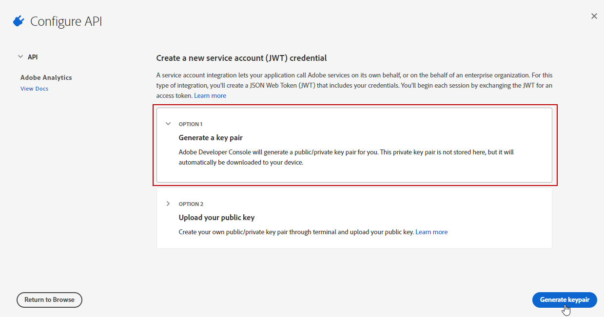

# Provisionamento do Adobe Analytics Connector {#adobe-analytics-connector-provisioning}


>[!IMPORTANT]
>
> Essas etapas só devem ser executadas por implementações híbridas e no local.
>
>Para implementações hospedadas, entre em contato com a equipe de [Atendimento ao cliente da Adobe](https://helpx.adobe.com/br/enterprise/using/support-for-experience-cloud.html).

A integração entre a autenticação do Adobe Campaign Classic e do Adobe Analytics é compatível com o Adobe Identity Management Service (IMS):

* Se estiver gerenciando uma conta externa migrada, você deve implementar o Adobe IMS e se conectar ao Adobe Campaign por meio de uma Adobe ID. O usuário conectado por meio de uma Adobe ID do IMS deve ser o proprietário da conta do **Conector de dados** no Adobe Analytics e ter um conjunto de permissões para o **Perfil de produto** mencionado abaixo.

* Se estiver implementando um novo conector, a implementação do Adobe IMS é opcional. Sem um usuário do Adobe ID, o Adobe Campaign usará um usuário técnico para sincronizar com o Adobe Analytics.

Para que essa integração funcione, é necessário criar um perfil de produto do Adobe Analytics que será usado exclusivamente para o conector do Analytics. Em seguida, será necessário criar um projeto do Adobe I/O.

## Criar um perfil de produto do Adobe Analytics {#analytics-product-profile}

O perfil de produto determina o nível de acesso que um usuário tem nos diferentes componentes do Analytics.

Se você já tiver um Perfil de produto do Analytics, ainda deverá criar um novo perfil de produto do Adobe Analytics para ser usado exclusivamente para o conector do Analytics. Isso garantirá que o perfil de produto seja definido com as permissões corretas para essa integração.

Para obter mais informações sobre perfis de produto, consulte a [documentação do Admin Console](https://helpx.adobe.com/mt/enterprise/admin-guide.html).

1. No [Admin Console](https://adminconsole.adobe.com/), selecione seu Adobe Analytics **[!UICONTROL Product]**.

   

1. Clique em **[!UICONTROL New Profile]**.

   

1. Adicione um **[!UICONTROL Product profile name]**, sugerimos usar a seguinte sintaxe: `reserved_campaign_classic_<Company Name>`. Em seguida, clique em **[!UICONTROL Next]**.

   Esse **[!UICONTROL Product profile]** deve ser usado exclusivamente para o Analytics Connector, a fim de evitar erros de configuração.

1. Abra o **[!UICONTROL Product profile]** recém-criado e selecione a guia **[!UICONTROL Permissions]**.

   

1. Configure os diferentes recursos clicando em **[!UICONTROL Edit]** e selecione as permissões a serem atribuídas a seu **[!UICONTROL Product profile]** clicando no ícone de adição (+).

   Para obter mais informações sobre como gerenciar permissões, consulte a [documentação do Admin Console](https://helpx.adobe.com/mt/enterprise/using/manage-permissions-and-roles.html).

1. Para o recurso **[!UICONTROL Report Suites]**, adicione os **[!UICONTROL Report Suites]** que serão necessários para uso posterior.

   Se você não tiver conjuntos de relatórios, poderá criá-los seguindo [estas etapas](../../platform/using/adobe-analytics-connector.md#report-suite-analytics).

   

1. Para o recurso **[!UICONTROL Metrics]**, adicione as **[!UICONTROL Metrics]** que serão necessárias para configuração posterior.

   Se necessário, você pode ativar a opção Incluir automaticamente, que adicionará todos os itens de permissões na lista incluída e adicionará automaticamente novos itens de permissão.

   

1. Para o recurso **[!UICONTROL Dimensions]**, adicione as **[!UICONTROL Dimensions]** que serão necessárias para configuração posterior.

1. Para o recurso **[!UICONTROL Report Suite Tools]**, adicione as seguintes permissões:

   * **[!UICONTROL Report suite Mgmt]**
   * **[!UICONTROL Conversion variables]**
   * **[!UICONTROL Success events]**
   * **[!UICONTROL Custom data Warehouse report]**
   * **[!UICONTROL Data sources manager]**
   * **[!UICONTROL Classifications]**

1. Para o recurso **[!UICONTROL Analytics Tools]**, adicione as seguintes permissões:

   * **[!UICONTROL Code Manager - Web services]**
   * **[!UICONTROL Logs - Web services]**
   * **[!UICONTROL Web services]**
   * **[!UICONTROL Web service access]**
   * **[!UICONTROL Calculated metric creation]**
   * **[!UICONTROL Segment creation]**

O perfil de produto está agora configurado. Em seguida, é necessário criar o projeto do Adobe I/O.

## Criar projeto do Adobe I/O {#create-adobe-io}

1. Acesse o Adobe I/O e faça logon como **Administrador de sistema** da organização IMS.

   Para obter mais informações sobre papéis de Administrador, consulte esta [página](https://helpx.adobe.com/br/enterprise/using/admin-roles.html).

1. Clique em **[!UICONTROL Create a new project]**.

   

1. Clique em **[!UICONTROL Add to Project]** e selecione **[!UICONTROL API]**.

   

1. Selecione [!DNL Adobe Analytics] e clique em **[!UICONTROL Next]**.

   

1. Escolha **[!UICONTROL Service Account (JWT)]** como tipo de autenticação e clique em **[!UICONTROL Next]**.

   

1. Selecione a opção **[!UICONTROL Option 1: Generate a Key-Pair]** e clique em **[!UICONTROL Generate a Key-Pair]**.

   O arquivo config.zip será baixado automaticamente.

   

1. Clique em **[!UICONTROL Next]**.

   

1. Selecione o **[!UICONTROL Product profile]** criado nas etapas anteriores detalhadas nesta [seção](#analytics-product-profile).

1. Em seguida, clique em **[!UICONTROL Save Configured API]**.

   

1. Em seu projeto, selecione [!DNL Adobe Analytics] e copie as seguintes informações em **[!UICONTROL Service Account (JWT)]**:

   * **[!UICONTROL Client ID]**
   * **[!UICONTROL Client Secret]**
   * **[!UICONTROL Technical account ID]**
   * **[!UICONTROL Organization ID]**

   

1. Use a chave privada gerada na etapa 6.

   Se você já configurou acionadores usando essas credenciais, sua chave privada deve ser a mesma para essa configuração de conector.

1. Codifique a chave privada usando o seguinte comando: `base64 ./private.key > private.key.base64`. Isso salvará o conteúdo base64 em um novo arquivo `private.key.base64`.

   >[!NOTE]
   >
   >Às vezes, uma linha extra pode ser adicionada automaticamente ao copiar/colar a chave privada. Lembre-se de removê-la antes de codificar sua chave privada.

1. Copie o conteúdo do arquivo `private.key.base64`.

1. Faça logon via SSH em cada container em que a instância do Adobe Campaign está instalada e adicione as credenciais do Projeto no Adobe Campaign executando o comando a seguir como usuário`neolane`. Isso inserirá as credenciais **[!UICONTROL Technical Account]** no arquivo de configuração da instância.

   ```
   nlserver config -instance:<instance name> -setimsjwtauth:Organization_Id/Client_Id/Technical_Account_ID/<Client_Secret>/<Base64_encoded_Private_Key>
   ```

Agora é possível começar a usar o conector do Analytics e rastrear os comportamentos do cliente.
