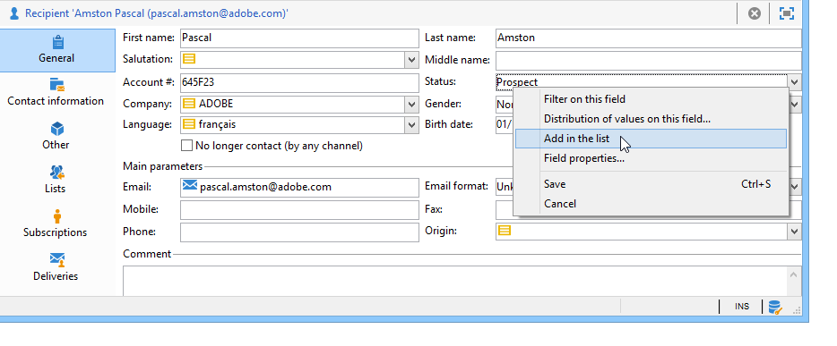
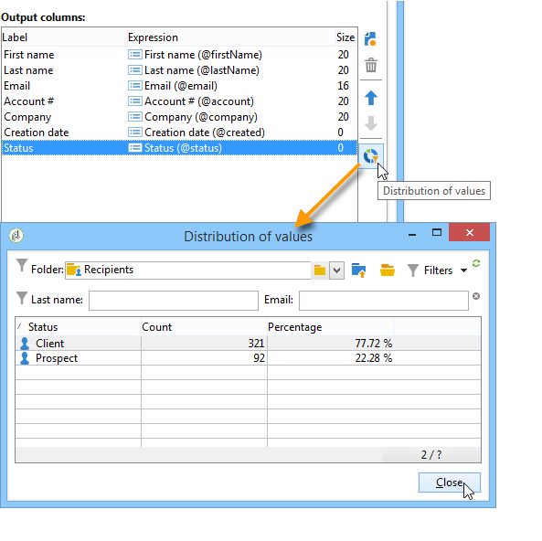

# Gerenciar e personalizar listas{#manage-and-customize-lists}

Você pode acessar as listas de registros no banco de dados do Campaign usando o Explorer. Você pode filtrar essas listas, executar pesquisas, adicionar informações, filtrar e classificar dados.

## Contar registros {#counting-records}

Por padrão, o Adobe Campaign carrega os 200 primeiros registros de uma lista. Isso significa que a exibição não mostra necessariamente todos os registros da tabela que você está visualizando. Você pode executar uma contagem do número de registros na lista e carregar mais registros.

Na parte inferior direita da tela da lista, um **[!UICONTROL counter]** mostra quantos registros foram carregados e o número total de registros no banco de dados (após a aplicação de filtros):

Se um &quot;**?**&quot; aparecer em vez do número à direita, clique no contador para iniciar o cálculo.

### Carregar mais registros {#loading-more-records}

Para carregar (e portanto exibir) registros adicionais (200 linhas por padrão) clique em **[!UICONTROL Continue loading]**.

Para carregar todos os registros, clique com o botão direito do mouse na lista e selecione **[!UICONTROL Load all]**.

>[!CAUTION]
>
>Dependendo do número de registros, o tempo para carregar a lista completa pode ser longo.

### Alterar o número padrão de registros {#change-default-number-of-records}

Para alterar o número padrão de registros carregados, clique em **[!UICONTROL Configure list]** no canto inferior direito da lista.

Na janela de configuração da lista, clique em **[!UICONTROL Advanced parameters]** (canto inferior esquerdo) e altere o número de linhas que serão recuperadas.

## Configurar listas {#configuring-lists}

### Adicionar colunas {#add-columns}

Há duas maneiras de adicionar uma coluna a uma lista.

É possível adicionar rapidamente uma coluna a uma lista dos detalhes de um registro. Para fazer isso:

1. Em uma tela de detalhes, clique com o botão direito do mouse no campo que você deseja exibir em uma coluna.
1. Selecione **[!UICONTROL Add in the list]**.

   A coluna é adicionada à direita das colunas existentes.

Outra maneira de adicionar colunas, por exemplo, se você quiser exibir dados que não são exibidos na tela de detalhes, é usar a janela de configuração de listas. Para fazer isso:

1. Clique em **[!UICONTROL Configure list]** abaixo e à direita da lista.

   

1. Na janela de configuração da lista, clique duas vezes no campo a ser adicionado na lista **[!UICONTROL Available fields]** para adicioná-lo às colunas de saída em **[!UICONTROL Output columns]**.

   

   >[!NOTE]
   >
   >Por padrão, campos avançados não são exibidos. Para exibi-los, clique em **Display advanced fields** abaixo e à direita da lista de campos disponíveis.
   >
   >Os rótulos são exibidos por tabela e em ordem alfabética.
   >
   >Use o campo **Search** para executar uma pesquisa nos campos disponíveis. Para obter mais informações, consulte [esta seção](#sorting-a-list).
   >
   >Os campos são identificados por ícones específicos: campos SQL, tabelas vinculadas, campos calculados etc. Para cada campo selecionado, a descrição é exibida abaixo da lista de campos disponíveis. [Saiba mais](#configuring-lists).
   >
   >Também é possível classificar e filtrar dados. Consulte [esta seção](../../platform/using/filtering-options.md).

1. Repita o processo para cada coluna a ser exibida.
1. Use as setas para modificar a **ordem de exibição**. A coluna mais alta estará à esquerda na lista de registros.

   

1. Se precisar, clique em **[!UICONTROL Distribution of values]** para exibir a repartição de valores para o campo selecionado na pasta atual.

   

1. Clique em **[!UICONTROL OK]** para confirmar a configuração e exibir o resultado.

### Criar uma nova coluna {#create-a-new-column}

É possível criar novas colunas para exibir campos adicionais na lista. Para fazer isso:

1. Clique em **[!UICONTROL Configure the list]** abaixo e à direita da lista.
1. Clique em **[!UICONTROL Add]** para exibir um novo campo na lista.

### Remover uma coluna {#remove-a-column}

É possível mascarar uma ou mais colunas em uma lista de registros usando a opção **[!UICONTROL Configure list]**, localizada abaixo e à direita da lista.

Na janela de configuração da lista, selecione a coluna a ser compactada na zona **[!UICONTROL Output columns]** e clique no botão Delete.

Repita o processo para cada coluna a ser mascarada. Clique em **[!UICONTROL OK]** para confirmar a configuração e exibir o resultado.

### Ajustar a largura da coluna {#adjust-column-width}

Quando uma lista está ativa, ou seja, com pelo menos uma linha selecionada, você pode usar a tecla F9 para ajustar a largura das colunas. Assim, todas as colunas podem ser exibidas na tela.

### Exibir dados em subpastas {#display-sub-folders-records}

As listas podem exibir:

* Os registros contidos somente na pasta selecionada,
* Ou os registros da pasta selecionada e também suas subpastas.

Para alternar de um modo de exibição para outro, clique em **[!UICONTROL Display sub-levels]**, na barra de ferramentas.

## Salvar uma configuração de lista {#saving-a-list-configuration}

As configurações de lista são definidas localmente no nível da estação de trabalho. Quando o cache local é limpo, as configurações locais são desabilitadas.

Por padrão, os parâmetros de exibição definidos se aplicam a todas as listas com o tipo de pasta correspondente. Assim, ao modificar como a lista de destinatários é exibida de uma pasta, essa configuração será aplicada a todas as outras pastas do destinatário.

No entanto, é possível salvar mais de uma configuração a ser aplicada a pastas diferentes do mesmo tipo. A configuração é salva com as propriedades da pasta contendo os dados e pode ser aplicada novamente.

Por exemplo, para uma pasta de delivery, é possível configurar a seguinte exibição:

Para salvar essa configuração de lista de modo que ela possa ser reutilizada, siga as etapas abaixo:

1. Clique com o botão direito na pasta que contém os dados exibidos.
1. Selecione **[!UICONTROL Properties]**.
1. Clique em **[!UICONTROL Advanced settings]** e especifique um nome no campo **[!UICONTROL Configuration]**.

   

1. Clique em **[!UICONTROL OK]** e em **[!UICONTROL Save]**.

Você pode aplicar essa configuração a outra pasta **Delivery**:

Clique em **[!UICONTROL Save]** na janela de propriedades da pasta. A exibição de lista é modificada para corresponder à configuração especificada:

## Exportar uma lista {#exporting-a-list}

Para exportar dados de uma lista, você deve usar um assistente de exportação. Para acessá-lo, selecione os elementos a serem exportados da lista, clique com o botão direito do mouse e selecione **[!UICONTROL Export...]**.

A utilização das funções de importação e exportação é explicada em [Importações e exportações genéricas](../../platform/using/about-generic-imports-exports.md).

>[!CAUTION]
>
>Os elementos de uma lista não devem ser exportados usando a função Copiar/Colar.

## Classificar uma lista {#sorting-a-list}

As listas podem conter uma grande quantidade de dados. Você pode classificar esses dados ou aplicar filtros simples ou avançados. A classificação permite exibir dados em ordem crescente ou decrescente. Os filtros permitem definir e combinar critérios para exibir apenas os dados selecionados.

Clique no cabeçalho da coluna para aplicar uma classificação crescente ou decrescente ou para cancelar a classificação de dados. O status da classificação ativa e a ordem de classificação são indicados por uma seta azul antes do rótulo da coluna. Um traço vermelho antes do rótulo da coluna significa que a classificação é aplicada aos dados indexados do banco de dados. Esse método é usado para otimizar tarefas de classificação.

Você também pode configurar a classificação ou combinar critérios de classificação. Para fazer isso, siga as etapas abaixo:

1. **[!UICONTROL Configure list]** abaixo e à direita da lista.

   

1. Na janela de configuração da lista, clique na guia **[!UICONTROL Sorting]**.
1. Selecione os campos a serem classificados e a direção da classificação (crescente ou decrescente).

   

1. A prioridade é definida pela ordem das colunas de classificação. Para alterar a prioridade, use os ícones apropriados para alterar a ordem das colunas.

   

   A prioridade de classificação não afeta a exibição das colunas na lista.

1. Clique em **[!UICONTROL Ok]** para confirmar essa configuração e exibir o resultado na lista.

### Pesquisar elementos {#running-a-search}

Você pode executar uma pesquisa dos campos disponíveis em um editor utilizando o campo **[!UICONTROL Search]**, localizado acima da lista de campos. Pressione **Enter** no teclado ou navegue pela lista. Os campos que correspondem à pesquisa terão rótulos em negrito.

>[!NOTE]
>
>É possível criar filtros para exibir apenas alguns dos dados em uma lista. [Saiba mais](../../platform/using/creating-filters.md).
