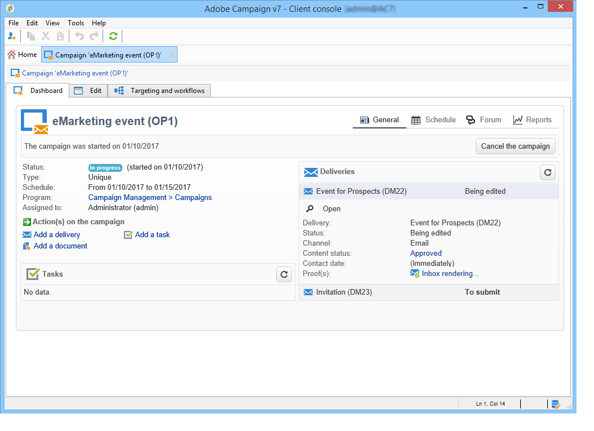
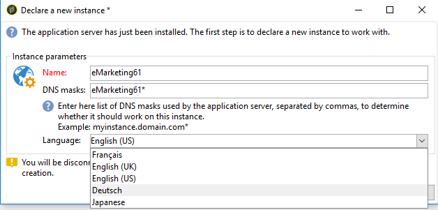
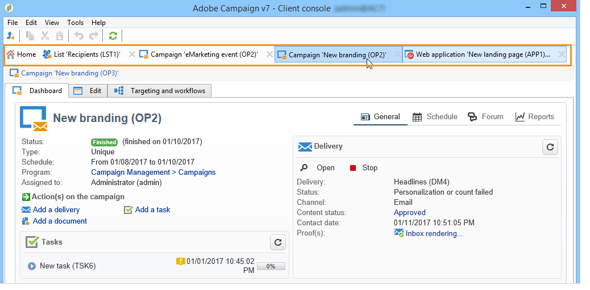

# Workspace do Adobe Campaign{#adobe-campaign-workspace}

## Explorar a interface do Adobe Campaign {#about-adobe-campaign-interface}

Depois de se conectar ao banco de dados, você acessará a home page do Adobe Campaign, um painel de controle formado por links e atalhos que permitem acessar recursos, dependendo da sua instalação, bem como as configurações gerais da plataforma.

Na seção central da home page, você pode usar links para acessar o portal de documentação on-line do Campaign, o fórum e o site de suporte.

 Conheça o espaço de trabalho do Campaign em [vídeo](#video)

>[!NOTE]
>
>Os recursos do Adobe Campaign disponíveis para você dependem dos módulos e complementos instalados. Alguns deles também podem não estar disponíveis, dependendo das suas permissões e de configurações específicas.
>
>Antes de instalar qualquer módulo ou add-on, você precisa verificar o contrato de licença ou entrar em contato com o executivo da conta da Adobe.

### Acesso via web e console {#console-and-web-access}

A plataforma Adobe Campaign pode ser acessada por meio de um console ou por meio de um navegador da Internet.

O acesso via Web fornece uma interface semelhante ao console, mas com um conjunto reduzido de funcionalidades.

Por exemplo, para um determinado operador, uma campanha será exibida com as seguintes opções no console:

Considerando o acesso via Web, as opções permitirão principalmente a visualização dos seguintes elementos:

### Idiomas {#languages}

O idioma é selecionado ao instalar a instância do Adobe Campaign Classic.

Você pode escolher entre cinco idiomas diferentes:

* Inglês (Reino Unido)
* Inglês (EUA)
* Francês
* Alemão
* Japonês

O idioma escolhido para a instância do Adobe Campaign Classic pode afetar os formatos de data e hora. Para obter mais informações, consulte esta [seção](../../platform/using/adobe-campaign-workspace.md#date-and-time).

Para obter mais informações sobre como criar uma instância, consulte esta [página](../../installation/using/creating-an-instance-and-logging-on.md).

>[!CAUTION]
>
>O idioma não pode ser alterado após a criação da instância.

## Elementos básicos de navegação {#navigation-basics}

### Procurar páginas {#browsing-pages}

As várias funcionalidades da plataforma são divididas em recursos principais: use os links exibidos na seção superior da interface para acessá-las.

A lista de recursos principais que você pode acessar depende dos pacotes e dos complementos instalados e dos seus direitos de acesso.

Cada recurso inclui um conjunto de funcionalidades com base nas necessidades relacionadas à tarefa e ao contexto de uso. Por exemplo, o link **[!UICONTROL Profiles and targets]** leva você até listas de recipients, serviços de assinatura, workflows para construção do target existentes e atalhos para criar esses elementos.

As listas estão disponíveis no link **[!UICONTROL Lists]** na seção à esquerda da interface **[!UICONTROL Profiles and Targets]**.

### Usar guias {#using-tabs}

* Quando você clica em um recurso principal ou em um link, a página relevante substitui a página atual. Para voltar à página anterior, clique no botão **[!UICONTROL Back]** na barra de ferramentas. Para retornar à página inicial, clique no botão **[!UICONTROL Home]**.

   

* No caso de um menu ou atalho para uma tela de exibição (como um aplicativo Web, um programa, um delivery ou um relatório), a página correspondente é exibida em outra guia. Isso permite navegar de uma página para outra usando as guias.

   

### Criar um elemento {#creating-an-element}

Cada seção de recurso principal permite procurar entre os elementos disponíveis. Para fazer isso, use os atalhos na seção **[!UICONTROL Browsing]**. O link **[!UICONTROL Other choices]** permite acessar todas as outras páginas, independentemente do ambiente.

Você pode criar um novo elemento (delivery, aplicativo web, workflow etc.) usando os atalhos na seção **[!UICONTROL Create]** à esquerda da tela. Use o botão **[!UICONTROL Create]** acima da lista para adicionar novos elementos a ela.

Por exemplo, na página de delivery, use o botão **[!UICONTROL Create]** para criar um novo delivery.

## Formatos e unidades {#formats-and-units}

### Data e hora {#date-and-time}

O idioma escolhido para o Adobe Campaign Classic afeta os formatos de data e hora.

O idioma é selecionado durante a instalação do Campaign e não pode ser alterado posteriormente. Você pode selecionar: inglês (EUA), inglês (EN), francês, alemão ou japonês. Para obter mais informações, consulte [esta página](../../installation/using/creating-an-instance-and-logging-on.md).

As principais diferenças entre inglês americano e inglês do Reino Unido são:

<table> 
 <thead> 
  <tr> 
   <th> Formatos  </th> 
   <th> Inglês (US)  </th> 
   <th> Inglês (EN)  </th> 
  </tr> 
 </thead> 
 <tbody> 
  <tr> 
   <td> Data  </td> 
   <td> A semana começa no domingo  </td> 
   <td> A semana começa na segunda-feira  </td> 
  </tr> 
  <tr> 
   <td> Data abreviada  </td> 
   <td> 
%2M/%2D/%4Y

<strong>ex: 09/25/2018</strong>
 </td> 
   <td> 
%2D/%2M/%4Y

<strong>ex: 25/09/2018</strong>
 </td> 
  </tr> 
  <tr> 
   <td> Data abreviada com hora  </td> 
   <td> 
%2M/%2D/%4Y %I:%2N:%2S %P

<strong>ex: 25/09/2018 22:47:25</strong>
 </td> 
   <td> 
%2D/%2M/%4Y %2H:%2N:%2S

<strong>ex: 25/09/2018 22:47:25</strong>
 </td> 
  </tr> 
 </tbody> 
</table>

### Adicionar valores em uma lista discriminada {#add-values-in-an-enumeration}

Usando os campos de entrada com uma lista suspensa, você pode inserir um valor de lista discriminada, que pode ser armazenado e oferecido como uma opção na lista suspensa. Por exemplo, no campo **[!UICONTROL City]** da guia **[!UICONTROL General]** de um perfil de destinatário, você pode inserir Londres. Ao pressionar Enter para confirmar esse valor, uma mensagem pergunta se você deseja salvar esse valor para a enumeração associada ao campo.

Se você clicar em **[!UICONTROL Yes]**, esse valor estará disponível na caixa de combinação do campo relevante (neste caso: **[!UICONTROL London]**).

>[!NOTE]
>
>As enumerações (também conhecidas como &quot;listas detalhadas&quot;) são gerenciadas pelo administrador através da seção **[!UICONTROL Administration > Platform > Enumerations]**. Para obter mais informações, consulte [Gerenciamento de listas discriminadas](../../platform/using/managing-enumerations.md).

### Unidades padrão {#default-units}

Nos campos que expressam uma duração (por exemplo, período de validade dos recursos de um delivery, prazo de aprovação para uma tarefa, etc.), o valor pode ser expresso nas seguintes **unidades**:

* **[!UICONTROL s]** para segundos,
* **[!UICONTROL mn]** para minutos,
* **[!UICONTROL h]** para horas,
* **[!UICONTROL d]** para dias.

## Tutorial em vídeo {#video}

Este vídeo apresenta o espaço de trabalho do Campaign Classic.

>[!VIDEO](https://video.tv.adobe.com/v/35130?quality=12)

Vídeos extras sobre procedimentos do Campaign Classic estão disponíveis [aqui](https://experienceleague.adobe.com/docs/campaign-classic-learn/tutorials/overview.html?lang=pt-BR).
