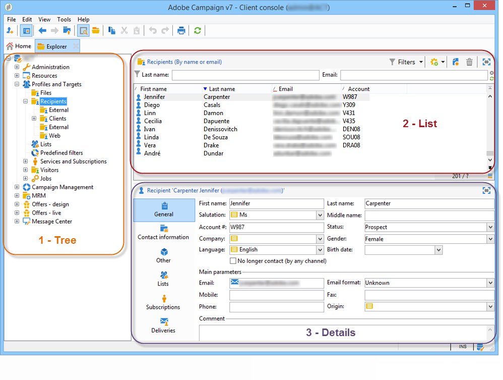
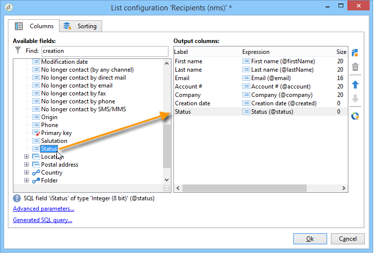

# Área de trabalho do Adobe Campaign{#adobe-campaign-workspace}

## Explorar a interface do Adobe Campaign {#about-adobe-campaign-interface}

Depois de se conectar ao banco de dados, você acessará a home page do Adobe Campaign, um painel de controle formado por links e atalhos que permitem acessar recursos, dependendo da sua instalação, bem como as configurações gerais da plataforma.

Na seção central da home page, você pode usar links para acessar o portal de documentação on-line do Campaign, o fórum e o site de suporte.

 [Espaço de trabalho do Discover Campaign em vídeo](https://docs.adobe.com/content/help/pt-BR/campaign-classic-learn/tutorials/getting-started/exploring-the-adobe-campaign-classic-user-interface.html)

>[!NOTE]
>
>Os recursos do Adobe Campaign disponíveis para você dependem dos módulos e complementos instalados. Alguns deles também podem não estar disponíveis, dependendo das suas permissões e de configurações específicas.
>
>Antes de instalar qualquer módulo ou add-on, você precisa verificar o contrato de licença ou entrar em contato com o executivo da conta da Adobe.

### Acesso via Web e console {#console-and-web-access}

A plataforma Adobe Campaign pode ser acessada por meio de um console ou por meio de um navegador da Internet.

O acesso via Web fornece uma interface semelhante ao console, mas com um conjunto reduzido de funcionalidades.

Por exemplo, para um determinado operador, uma campanha será exibida com as seguintes opções no console:

Considerando o acesso via Web, as opções permitirão principalmente a visualização dos seguintes elementos:

### Languages {#languages}

O idioma é selecionado ao instalar a instância do Adobe Campaign Classic.

Você pode escolher entre cinco idiomas diferentes:

* Inglês (Reino Unido)
* Inglês (EUA)
* Francês
* Alemão
* Japonês

O idioma escolhido para a instância do Adobe Campaign Classic pode afetar os formatos de data e hora. Para obter mais informações, consulte esta [seção](../../platform/using/adobe-campaign-workspace.md#date-and-time).

Para obter mais informações sobre como criar uma instância, consulte esta [página](../../installation/using/creating-an-instance-and-logging-on.md).

>[!CAUTION]
>
>O idioma não pode ser alterado após a criação da instância.

## Elementos básicos de navegação {#navigation-basics}

### Páginas de navegação {#browsing-pages}

As várias funcionalidades da plataforma são divididas em recursos principais: use os links exibidos na seção superior da interface para acessá-las.

A lista de recursos principais que você pode acessar depende dos pacotes e dos complementos instalados e dos seus direitos de acesso.

Cada recurso inclui um conjunto de funcionalidades com base nas necessidades relacionadas à tarefa e ao contexto de uso. Por exemplo, o link **[!UICONTROL Profiles and targets]** leva você até listas de recipients, serviços de assinatura, workflows para construção do target existentes e atalhos para criar esses elementos.

As listas estão disponíveis no link **[!UICONTROL Lists]** na seção à esquerda da interface **[!UICONTROL Profiles and Targets]**.

### Utilização de guias {#using-tabs}

* Quando você clica em um recurso principal ou em um link, a página relevante substitui a página atual. Para voltar à página anterior, clique no botão **[!UICONTROL Back]** na barra de ferramentas. Para retornar à página inicial, clique no botão **[!UICONTROL Home]**.

   

* No caso de um menu ou atalho para uma tela de exibição (como um aplicativo Web, um programa, um delivery ou um relatório), a página correspondente é exibida em outra guia. Isso permite navegar de uma página para outra usando as guias.

   

### Criar um elemento {#creating-an-element}

Cada seção de recurso principal permite navegar entre os elementos disponíveis. Para fazer isso, use os atalhos na seção **[!UICONTROL Browsing]**. O link **[!UICONTROL Other choices]** permite acessar todas as outras páginas, independentemente do ambiente.

Você pode criar um novo elemento (delivery, aplicativo web, workflow etc.) usando os atalhos na seção **[!UICONTROL Create]** à esquerda da tela. Use o botão **[!UICONTROL Create]** acima da lista para adicionar novos elementos a ela.

Por exemplo, na página de delivery, use o botão **[!UICONTROL Create]** para criar um novo delivery.

## Usar o explorador do Adobe Campaign {#using-adobe-campaign-explorer}

### Sobre o explorador do Adobe Campaign {#about-adobe-campaign-explorer}

O explorador do Adobe Campaign é acessível por meio do ícone da barra de ferramentas. Ele permite que você acesse todos os recursos do Adobe Campaign, as telas de configuração e uma visão mais detalhada de alguns dos elementos da plataforma.

O espaço de trabalho **[!UICONTROL Explorer]** é dividido em três zonas:

**1 - Tree**: é possível personalizar o conteúdo da árvore (adicionar, mover ou excluir nós). Esse procedimento destina-se somente a usuários especializados. Para obter mais informações, consulte [esta página](../../configuration/using/about-navigation-hierarchy.md).

**2 - List**: é possível filtrar essa lista, executar pesquisas, adicionar informações ou classificar dados.

**3 - Details**: é possível exibir os detalhes do elemento selecionado. O ícone na seção superior direita permite exibir essas informações no formato de tela inteira.

### Resolução da tela {#screen-resolution}

Para navegação e usabilidade ideais, a Adobe recomenda usar uma resolução mínima de tela de 1600 x 900 pixels.

>[!CAUTION]
>
>Resoluções abaixo de 1600 x 900 pixels podem não ser compatíveis com o Adobe Campaign.

Na área de trabalho do **[!UICONTROL Explorer]**, se alguma parte da zona **[!UICONTROL Details]** aparecer cortada, amplie-a usando a seta na parte superior da zona ou clique no botão **[!UICONTROL Enlarge]**.

### Listas de navegação {#browsing-lists}

Para navegar em uma lista, você pode usar **as barras de rolagem** (horizontal e vertical) para rolar por ela sem alterar a seleção do registro, **o botão de rolagem do mouse** ou **as setas do teclado**.

>[!NOTE]
>
>A configuração e personalização do conteúdo da lista são apresentadas em [Configuração de listas](#configuring-lists).
>
>Também é possível classificar e filtrar dados. Consulte [Opções de filtro](../../platform/using/filtering-options.md).

### Contagem de registros {#counting-records}

Por padrão, o Adobe Campaign carrega os 200 primeiros registros de uma lista. Isso significa que a exibição não mostra necessariamente todos os registros da tabela que você está visualizando. Você pode executar uma contagem do número de registros na lista e carregar mais registros.

Na parte inferior direita da tela da lista, um **[!UICONTROL counter]** mostra quantos registros foram carregados e o número total de registros no banco de dados (após a aplicação de filtros):

Se um &quot;**?**&quot; aparecer em vez do número à direita, clique no contador para iniciar o cálculo.

### Carregar mais registros {#loading-more-records}

Para carregar (e portanto exibir) registros adicionais (200 linhas por padrão) clique em **[!UICONTROL Continue loading]**.

Para carregar todos os registros, clique com o botão direito do mouse na lista e selecione **[!UICONTROL Load all]**.

>[!CAUTION]
>
>Dependendo do número de registros, o tempo para carregar a lista completa pode ser longo.

### Alterar o número padrão de registros {#change-default-number-of-records}

Para alterar o número padrão de registros carregados, clique em **[!UICONTROL Configure list]** no canto inferior direito da lista.

Na janela de configuração da lista, clique em &quot;Advanced parameters&quot; (no lado inferior esquerdo) e altere o número de linhas a serem recuperadas.

## Configuração de listas {#configuring-lists}

### Adicionar colunas {#add-columns}

Há duas maneiras de adicionar uma coluna a uma lista.

É possível adicionar rapidamente uma coluna a uma lista dos detalhes de um registro. Para fazer isso:

1. Em uma tela de detalhes, clique com o botão direito do mouse no campo que você deseja exibir em uma coluna.
1. Selecione **[!UICONTROL Add in the list]**.

   A coluna é adicionada à direita das colunas existentes.

Outra maneira de adicionar colunas, por exemplo, se você quiser exibir dados que não são exibidos na tela de detalhes, é usar a janela de configuração de listas. Para fazer isso:

1. Clique em **[!UICONTROL Configure list]** abaixo e à direita da lista.

   

1. Na janela de configuração da lista, clique duas vezes no campo a ser adicionado na lista **[!UICONTROL Available fields]** para adicioná-lo às colunas de saída em **[!UICONTROL Output columns]**.

   

   >[!NOTE]
   >
   >Por padrão, campos avançados não são exibidos. Para exibi-los, clique em **Display advanced fields** abaixo e à direita da lista de campos disponíveis.
   >
   >Os rótulos são exibidos por tabela e em ordem alfabética.
   >
   >Use o campo **Search** para executar uma pesquisa nos campos disponíveis. Para obter mais informações, consulte [Classificar uma lista](#sorting-a-list).
   >
   >Os campos são identificados por ícones específicos: SQL fields, linked tables, calculated fields, etc. Para cada campo selecionado, a descrição é exibida abaixo da lista de campos disponíveis. [Configuração de listas](#configuring-lists).
   >
   >Também é possível classificar e filtrar dados. Consulte [Opções de filtro](../../platform/using/filtering-options.md).

1. Repita o processo para cada coluna a ser exibida.
1. Use as setas para modificar a **ordem de exibição**. A coluna mais alta estará à esquerda na lista de registros.

   

1. Se precisar, clique em **[!UICONTROL Distribution of values]** para exibir a repartição de valores para o campo selecionado na pasta atual.

   

1. Clique em **[!UICONTROL OK]** para confirmar a configuração e exibir o resultado.

### Criar uma nova coluna {#create-a-new-column}

É possível criar novas colunas para exibir campos adicionais na lista. Para fazer isso:

1. Clique em **[!UICONTROL Configure the list]** abaixo e à direita da lista.
1. Clique em **[!UICONTROL Add]** para exibir um novo campo na lista.

### Remover uma coluna {#remove-a-column}

É possível mascarar uma ou mais colunas em uma lista de registros usando a opção **[!UICONTROL Configure list]**, localizada abaixo e à direita da lista.

Na janela de configuração da lista, selecione a coluna a ser compactada na zona **[!UICONTROL Output columns]** e clique no botão Delete.

Repita o processo para cada coluna a ser mascarada. Clique em **[!UICONTROL OK]** para confirmar a configuração e exibir o resultado.

### Ajustar a largura da coluna {#adjust-column-width}

Quando uma lista está ativa, ou seja, com pelo menos uma linha selecionada, você pode usar a tecla F9 para ajustar a largura das colunas. Assim, todas as colunas podem ser exibidas na tela.

### Exibir registros de subpastas {#display-sub-folders-records}

As listas podem exibir:

* Os registros contidos somente na pasta selecionada,
* Ou os registros da pasta selecionada e também suas subpastas.

Para alternar de um modo de exibição para outro, clique em **[!UICONTROL Display sub-levels]**, na barra de ferramentas.

### Salvar uma configuração de lista {#saving-a-list-configuration}

As configurações de lista são definidas localmente no nível da estação de trabalho. Quando o cache local é limpo, as configurações locais são desabilitadas.

Por padrão, os parâmetros de exibição definidos se aplicam a todas as listas com o tipo de pasta correspondente. Assim, ao modificar como a lista de destinatários é exibida de uma pasta, essa configuração será aplicada a todas as outras pastas do destinatário.

No entanto, é possível salvar mais de uma configuração a ser aplicada a pastas diferentes do mesmo tipo. A configuração é salva com as propriedades da pasta contendo os dados e pode ser aplicada novamente.

Por exemplo, para uma pasta de delivery, é possível configurar a seguinte exibição:

Para salvar essa configuração de lista de modo que ela possa ser reutilizada, siga as etapas abaixo:

1. Clique com o botão direito na pasta que contém os dados exibidos.
1. Selecione **[!UICONTROL Properties]**.
1. Clique em **[!UICONTROL Advanced settings]** e especifique um nome no campo **[!UICONTROL Configuration]**.

   

1. Clique em **[!UICONTROL OK]** e em **[!UICONTROL Save]**.

Você pode aplicar essa configuração a outra pasta **Delivery**:

Clique em **[!UICONTROL Save]** na janela de propriedades da pasta. A lista de exibição é modificada para corresponder à configuração especificada:

## Exportar uma lista {#exporting-a-list}

Para exportar dados de uma lista, você deve usar um assistente de exportação. Para acessá-lo, selecione os elementos a serem exportados da lista, clique com o botão direito do mouse e selecione **[!UICONTROL Export...]**.

A utilização das funções de importação e exportação é explicada em [Importações e exportações genéricas](../../platform/using/generic-imports-and-exports.md).

>[!CAUTION]
>
>Os elementos de uma lista não devem ser exportados usando a função Copiar/Colar.

## Classificar uma lista {#sorting-a-list}

As listas podem conter uma grande quantidade de dados. Você pode classificar esses dados ou aplicar filtros simples ou avançados. A classificação permite exibir dados em ordem crescente ou decrescente. Os filtros permitem definir e combinar critérios para exibir apenas os dados selecionados.

Clique no cabeçalho da coluna para aplicar uma classificação crescente ou decrescente ou para cancelar a classificação de dados. O status da classificação ativa e a ordem de classificação são indicados por uma seta azul antes do rótulo da coluna. Um traço vermelho antes do rótulo da coluna significa que a classificação é aplicada aos dados indexados do banco de dados. Esse método é usado para otimizar tarefas de classificação.

Você também pode configurar a classificação ou combinar critérios de classificação. Para fazer isso, siga as etapas abaixo:

1. **[!UICONTROL Configure list]** abaixo e à direita da lista.

   

1. Na janela de configuração da lista, clique na guia **[!UICONTROL Sorting]**.
1. Selecione os campos a serem classificados e a direção da classificação (crescente ou decrescente).

   

1. A prioridade é definida pela ordem das colunas de classificação. Para alterar a prioridade, use os ícones apropriados para alterar a ordem das colunas.

   

   A prioridade de classificação não afeta a exibição das colunas na lista.

1. Clique em **[!UICONTROL Ok]** para confirmar essa configuração e exibir o resultado na lista.

### Pesquisar elementos {#running-a-search}

Você pode executar uma pesquisa dos campos disponíveis em um editor utilizando o campo **[!UICONTROL Search]**, localizado acima da lista de campos. Pressione **Enter** no teclado ou navegue pela lista. Os campos que correspondem à pesquisa terão rótulos em negrito.

>[!NOTE]
>
>É possível criar filtros para exibir apenas alguns dos dados em uma lista. Consulte [Criação de filtros](../../platform/using/creating-filters.md).

## Formatos e unidades {#formats-and-units}

### Data e hora {#date-and-time}

O idioma escolhido para o Adobe Campaign Classic afeta os formatos de data e hora.

O idioma é selecionado durante a instalação do Campaign e não pode ser alterado posteriormente. Você pode selecionar: inglês (EUA), inglês (EN), francês, alemão ou japonês. Para obter mais informações, consulte [esta página](../../installation/using/creating-an-instance-and-logging-on.md).

As principais diferenças entre inglês americano e inglês do Reino Unido são:

<table> 
 <thead> 
  <tr> 
   <th> Formatos  </th> 
   <th> Inglês (US)  </th> 
   <th> Inglês (EN)  </th> 
  </tr> 
 </thead> 
 <tbody> 
  <tr> 
   <td> Data  </td> 
   <td> A semana começa no domingo  </td> 
   <td> A semana começa na segunda-feira  </td> 
  </tr> 
  <tr> 
   <td> Data abreviada  </td> 
   <td> 
%2M/%2D/%4Y

<strong>ex: 09/25/2018</strong>
 </td> 
   <td> 
%2D/%2M/%4Y

<strong>ex: 25/09/2018</strong>
 </td> 
  </tr> 
  <tr> 
   <td> Data abreviada com hora  </td> 
   <td> 
%2M/%2D/%4Y %I:%2N:%2S %P

<strong>ex: 09/25/2018 10:47:25 PM</strong>
 </td> 
   <td> 
%2D/%2M/%4Y %2H:%2N:%2S

<strong>ex: 25/09/2018 22:47:25</strong>
 </td> 
  </tr> 
 </tbody> 
</table>

### Adicionar valores em uma enumeração {#add-values-in-an-enumeration}

Usando os campos de entrada com uma lista suspensa, você pode inserir um valor de enumeração, que pode ser armazenado e oferecido como uma opção na lista. Por exemplo, no campo **[!UICONTROL City]** da guia **[!UICONTROL General]** de um perfil de destinatário, você pode inserir Londres. Ao pressionar Enter para confirmar esse valor, uma mensagem pergunta se você deseja salvar esse valor para a enumeração associada ao campo.

Se você clicar em **[!UICONTROL Yes]**, esse valor estará disponível na caixa de combinação do campo relevante (neste caso: **[!UICONTROL London]**).

>[!NOTE]
>
>As enumerações (também conhecidas como &quot;listas detalhadas&quot;) são gerenciadas pelo administrador através da seção **[!UICONTROL Administration > Platform > Enumerations]**. Para obter mais informações, consulte [Gerenciamento de listas discriminadas](../../platform/using/managing-enumerations.md).

### Unidades padrão {#default-units}

Nos campos que expressam uma duração (por exemplo, período de validade dos recursos de uma remessa, prazo de aprovação para uma tarefa, etc.), o valor pode ser expresso nas seguintes **unidades**:

* **[!UICONTROL s]** para segundos,
* **[!UICONTROL mn]** para minutos,
* **[!UICONTROL h]** para horas,
* **[!UICONTROL d]** para dias.

