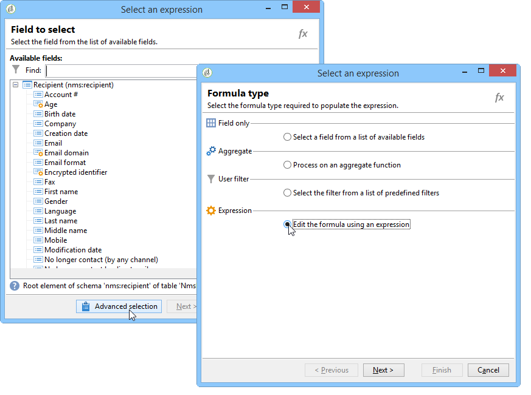
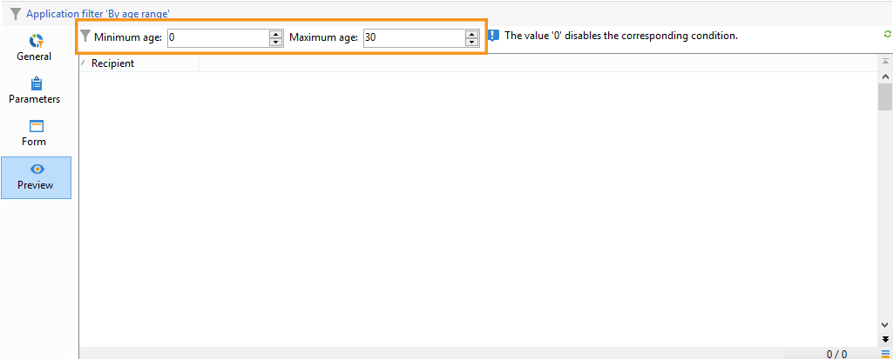

# Criação de filtros{#creating-filters}

## Introdução {#introduction}

When you navigate in the Adobe Campaign tree (from the **[!UICONTROL Explorer]** menu in the home page), the data contained in the database is displayed in lists. Essas listas podem ser configuradas para exibir apenas os dados exigidos pelo operador. As ações podem então ser iniciadas nos dados filtrados. Filter configuration lets you select data from a list **[!UICONTROL dynamically]**. Se os dados forem modificados, os dados filtrados serão atualizados.

>[!NOTE]
>
>As configurações de lista são definidas no local no nível da estação de trabalho. Esses dados são armazenados em arquivos ocultos e pode ser necessário limpá-los, principalmente se surgirem problemas ao atualizar dados. Para fazer isso, use o **[!UICONTROL File > Clear the local cache]** menu.

## Tipologia de filtros disponíveis {#typology-of-available-filters}

O Adobe Campaign permite aplicar filtros a listas de dados.

Esses filtros podem ser usados uma vez ou você pode salvá-los para usar depois. É possível aplicar vários filtros ao mesmo tempo.

Dois tipos de listas estão disponíveis no Adobe Campaign:

* Filtros padrão

   O **filtro padrão** pode ser acessado nos campos acima das listas. Ele permite aplicar filtros em campos predefinidos (para perfis de destinatários, esses são o nome e endereço de email por padrão). Você pode usar os campos para inserir os caracteres para filtrar ou selecionar as condições do filtro de uma lista suspensa.

   
<!--
  >[!NOTE]
  >
  >The **%** character replaces any character string. For example, the string `%@yahoo.com` lets you display all the profiles with an e-mail address in the domain "yahoo.com".
-->
É possível alterar o filtro padrão de uma lista. Para obter mais informações, consulte [Alteração do filtro](#altering-the-default-filter)padrão.

* Filtros simples

   **Filtros simples** são os filtros únicos nas colunas. Eles são definidos com um ou mais critérios de pesquisa simples nas colunas exibidas.

   Você pode combinar vários filtros simples na mesma lista de dados para refinar sua pesquisa. Os campos de filtro são exibidos um abaixo do outro. Eles podem ser excluídos de maneira independente.

   

   Filtros simples são detalhados em [Criar um filtro](#creating-a-simple-filter)simples.

* Filtros avançados

   **Filtros avançados** são criados usando uma consulta ou combinação de consultas sobre os dados.

   Para obter mais informações sobre como criar um filtro avançado, consulte [Criar um filtro](#creating-an-advanced-filter)avançado.

   Você pode usar funções para definir o conteúdo do filtro. Para obter mais informações, consulte [Criação de um filtro avançado com funções](#creating-an-advanced-filter-with-functions).

   >[!NOTE]
   >
   >Para obter mais informações sobre criação de queries no Adobe Campaign, consulte [esta seção](../../platform/using/about-queries-in-campaign.md).

* Filtros de usuário

   Um **filtro de aplicação** é um filtro avançado que foi salvo, para usar e compartilhar sua configuração com outros operadores.

   The **[!UICONTROL Filters]** button located above the lists offers a set of application filters that can be combined to refine the filtering. The method for creating these filters is presented in [Saving a filter](#saving-a-filter).

## Alteração do filtro padrão {#altering-the-default-filter}

To change the default filter for a recipient list, click the **[!UICONTROL Profiles and Targets > Pre-defined filters]** node of the tree.

For all other types of data, configure the default filter via the **[!UICONTROL Administration > Configuration > Predefined filters]** node.

Siga as etapas abaixo:

1. Selecione o filtro que deseja usar como padrão.
1. Clique na **[!UICONTROL Parameters]** guia e selecione **[!UICONTROL Default filter for the associated document type]**.

   

   >[!CAUTION]
   >
   >Se um filtro padrão já estiver aplicado à lista, será necessário desabilitá-lo antes de aplicar um novo filtro. Para fazer isso, clique no xis vermelho à direita dos campos de filtragem.

1. Clique para aplicar **[!UICONTROL Save]** o filtro.

   >[!NOTE]
   >
   >A janela de definição de filtro está detalhada em [Criar um filtro](#creating-an-advanced-filter) avançado e [Salvar um filtro](#saving-a-filter).

## Criar um filtro simples {#creating-a-simple-filter}

Para criar um **filtro simples**, siga as seguintes etapas:

1. Right-click the field you want to filter and select **[!UICONTROL Filter on this field]**.

   

   Os campos de filtro padrão são exibidos acima da lista.

1. Selecione a opção de filtro na lista suspensa ou digite os critérios de filtro para aplicar (o método para selecionar ou inserir critérios depende do tipo de campo: texto, enumerado etc.).

   

1. Para ativar o filtro, pressione Enter ou clique na seta verde à direita dos campos de filtro.

Se o campo no qual você deseja filtrar os dados não for exibido no formulário do perfil, você poderá adicioná-lo nas colunas exibidas e, em seguida, filtrar nessa coluna. Para fazer isso,

1. Clique no **[!UICONTROL Configure the list]** ícone.

   

1. Selecione a coluna a ser exibida, por exemplo, a idade dos destinatários.

   

1. Right-click the **Age** column in the recipient list, and select **[!UICONTROL Filter on this column]**.

   

   Em seguida, é possível selecionar as opções de filtragem por idade.

   

## Criar um filtro avançado {#creating-an-advanced-filter}

Para criar um **filtro avançado**, siga as seguintes etapas:

1. Clique no **[!UICONTROL Filters]** botão e selecione **[!UICONTROL Advanced filter...]**.

   

   You can also right-click the list of data to filter and select **[!UICONTROL Advanced filter...]**.

   A janela de definição de condição de filtragem é exibida.

1. Click the **[!UICONTROL Expression]** column to define the input value.
1. Click **[!UICONTROL Edit expression]** to select the field to which the filter will be applied.

   

1. Na lista, selecione o campo no qual os dados serão filtrados. Click **[!UICONTROL Finish]** to confirm.
1. Click the **[!UICONTROL Operator]** column and select the operator to be applied from the drop-down list.
1. Select an expected value from the **[!UICONTROL Value]** column. Você pode combinar vários filtros para refinar seu query. To add a filter condition, click **[!UICONTROL Add]**.

   

1. É possível atribuir uma hierarquia para as expressões ou alterar a ordem das expressões de query utilizando as setas da barra de ferramentas.
1. O operador padrão entre expressões é **e**, mas você pode alterá-lo clicando no campo. É possível selecionar um operador **ou**.

   

1. Click **[!UICONTROL OK]** to confirm filter creation and apply it to the list.

O filtro aplicado é exibido acima da lista.

Para editar ou modificar esse filtro, clique em seu rótulo.

To cancel this filter, click the **[!UICONTROL Remove this filter]** icon to the right of the filter.

Você pode salvar um filtro avançado para usá-lo depois. For further information about this type of filter, see [Saving a filter](#saving-a-filter).

### Criar um filtro avançado com funções {#creating-an-advanced-filter-with-functions}

Filtros avançados podem usar funções; **filtros com funções** são criados por meio de um editor de expressão que permite criar fórmulas usando os dados do banco de dados e funções avançadas. Para criar um filtro com funções, repita as etapas de criação de filtro avançado 1, 2 e 3 e, em seguida, proceda da seguinte maneira:

1. In the field selection window, click **[!UICONTROL Advanced selection]**.
1. Selecione o tipo de fórmula a ser usado: agregação, filtro de usuário existente ou expressão.

   

   As seguintes opções estão disponíveis:

   * **[!UICONTROL Field only]** para selecionar um campo. Este é o modo padrão.
   * **[!UICONTROL Aggregate]** para selecionar a fórmula agregada a ser usada (contagens, soma, média, máxima, mínima).
   * **[!UICONTROL User filter]** para selecionar um dos filtros de usuário existentes. Os filtros do usuário são detalhados em [Salvar um filtro](#saving-a-filter).
   * **[!UICONTROL Expression]** para acessar o editor de expressões.

      O editor de expressão permite definir um filtro avançado. Ela tem a seguinte aparência:

      

      Ele permite selecionar campos nas tabelas do banco de dados e anexar funções avançadas a eles: Selecione a função a ser usada no **[!UICONTROL List of functions]**. As funções disponíveis são detalhadas em [Lista de funções](../../platform/using/defining-filter-conditions.md#list-of-functions). Next, select the field or fields concerned by the functions and click **[!UICONTROL OK]** to approve the expression.

      >[!NOTE]
      >
      >Para ver um exemplo de criação de filtro com base em uma expressão, consulte [Identificar destinatários cujo aniversário é](../../workflow/using/sending-a-birthday-email.md#identifying-recipients-whose-birthday-it-is).

## Salvar um filtro {#saving-a-filter}

Os filtros são específicos para cada operador e são reiniciados cada vez que o operador limpa o cache do console do cliente.

You can create an **application filter** by saving an advanced filter: it can be re-used by right-clicking in any list or via the **[!UICONTROL Filters]** button located above the lists.

Esses filtros também podem ser acessados diretamente pelo assistente de delivery, no estágio de seleção de target (consulte [esta seção](../../delivery/using/creating-an-email-delivery.md) para obter mais informações sobre como criar deliveries). Para criar o filtro de aplicação, você pode:

* Converter um filtro avançado em um filtro de aplicação. To do this, click **[!UICONTROL Save]** before closing the advanced filter editor.

   

* Crie esse filtro de aplicativo pelo nó **[!UICONTROL Administration > Configuration > Predefined filters]** (ou **[!UICONTROL Profiles and targets > Predefined filters]** para destinatários) da árvore. To do this, right-click the list of filters, and select **[!UICONTROL New...]**. O procedimento é o mesmo para criar filtros avançados.

   The **[!UICONTROL Label]** field enables you to name this filter. This name will appear in the combo box of the **[!UICONTROL Filters...]** button.

   

You can delete all filters on the current list by right-clicking and selecting **[!UICONTROL No filter]** or via the **[!UICONTROL Filters]** icon located above the list.

You can combine filters by clicking the **[!UICONTROL Filters]** button and using the **[!UICONTROL And...]** menu.

## Filtrar destinatários {#filtering-recipients}

Predefined filters (see [Saving a filter](#saving-a-filter)) enable you to filter the profiles of recipients contained in the database. You can edit filters from the **[!UICONTROL Profiles and Targets > Predefined filters]** node of the tree. The filters are listed in the upper section of the workspace, via the **[!UICONTROL Filters]** button.

Selecione um filtro para exibir sua definição e para acessar uma pré-visualização dos dados filtrados.

>[!NOTE]
>
>For a detailed example of predefined filter creation, refer to [Use case](../../platform/using/use-case.md).

Os filtros predefinidos são:

<table> 
 <tbody> 
  <tr> 
   <td> <strong>Rótulo</strong>  </td> 
   <td> <strong>Consulta</strong>  </td> 
  </tr> 
  <tr> 
   <td> Aberto  </td> 
   <td> Seleciona destinatários que abriram um delivery.  </td> 
  </tr> 
  <tr> 
   <td> Aberto, mas não clicado  </td> 
   <td> Seleciona destinatários que abriram um delivery, mas não clicaram em um link.  </td> 
  </tr> 
  <tr> 
   <td> Destinatários inativos  </td> 
   <td> Seleciona destinatários que não abriram um delivery em X meses.  </td> 
  </tr> 
  <tr> 
   <td> Última atividade por tipo de dispositivo  </td> 
   <td> Seleciona destinatários que clicaram em ou abriram delivery Y usando o dispositivo X nos últimos Z dias.  </td> 
  </tr> 
  <tr> 
   <td> Última atividade por tipo de dispositivo (rastreamento)  </td> 
   <td> Seleciona destinatários que clicaram em ou abriram delivery Y usando o dispositivo X nos últimos Z dias.  </td> 
  </tr> 
  <tr> 
   <td> Destinatários não direcionados  </td> 
   <td> Seleciona destinatários que nunca foram direcionados por canal Y em X meses.  </td> 
  </tr> 
  <tr> 
   <td> Destinatários muito ativos  </td> 
   <td> Seleciona destinatários que clicaram em um delivery pelo menos X vezes nos últimos Y meses.  </td> 
  </tr> 
  <tr> 
   <td> Endereço de email incluído na blacklist  </td> 
   <td> Seleciona destinatários cujo endereço de email foi incluído na blacklist.  </td> 
  </tr> 
  <tr> 
   <td> Endereço de email na quarentena  </td> 
   <td> Seleciona destinatários cujo endereço de email está em quarentena.  </td> 
  </tr> 
  <tr> 
   <td> Endereços de email duplicados na pasta  </td> 
   <td> Seleciona destinatários cujo endereço de email está duplicado na pasta.  </td> 
  </tr> 
  <tr> 
   <td> Não aberto nem clicado  </td> 
   <td> Seleciona destinatários que não abriram ou não clicaram em um delivery.  </td> 
  </tr> 
  <tr> 
   <td> Novos destinatários (dias)  </td> 
   <td> Seleciona destinatários que foram criados nos últimos X dias.  </td> 
  </tr> 
  <tr> 
   <td> Novos destinatários (minutos)  </td> 
   <td> Seleciona destinatários que foram criados nos últimos X minutos.  </td> 
  </tr> 
  <tr> 
   <td> Novos destinatários (meses)  </td> 
   <td> Seleciona destinatários que foram criados nos últimos X meses.  </td> 
  </tr> 
  <tr> 
   <td> Por assinatura  </td> 
   <td> Seleciona destinatários por assinatura.  </td> 
  </tr> 
  <tr> 
   <td> Ao clicar em um link específico  </td> 
   <td> Seleciona destinatários que clicaram em um determinado URL em um delivery.  </td> 
  </tr> 
  <tr> 
   <td> Por comportamento pós-delivery  </td> 
   <td> Seleciona destinatários de acordo com seu comportamento após receber um delivery.  </td> 
  </tr> 
  <tr> 
   <td> Por data de criação  </td> 
   <td> Seleciona destinatários por data de criação, por um período variando de X meses (data atual menos n meses) para Y meses (data atual menos n meses).  </td> 
  </tr> 
  <tr> 
   <td> Por lista  </td> 
   <td> Seleciona destinatários por lista.  </td> 
  </tr> 
  <tr> 
   <td> Por número de cliques  </td> 
   <td> Seleciona destinatários que clicaram em um delivery nos últimos X meses.  </td> 
  </tr> 
  <tr> 
   <td> Por número de mensagens recebidas  </td> 
   <td> Seleciona destinatários de acordo com o número de mensagens recebidas.  </td> 
  </tr> 
  <tr> 
   <td> Por número de aberturas  </td> 
   <td> Seleciona destinatários que abriram deliveries entre X e Y ao longo da quantidade Z de tempo.  </td> 
  </tr> 
  <tr> 
   <td> Por nome ou email  </td> 
   <td> Seleciona destinatários de acordo com seu nome ou email.  </td> 
  </tr> 
  <tr> 
   <td> Por faixa etária  </td> 
   <td> Seleciona destinatários de acordo com sua idade.  </td> 
  </tr> 
 </tbody> 
</table>

>[!NOTE]
>
>Todas as comparações referentes à contagem e aos períodos devem ser entendidas no sentido mais amplo (destinatários que correspondem aos limites de query estão incluídos na comparação).

Exemplos de como os dados são calculados:

* Seleciona destinatários com menos de 30 anos de idade:

   

* Seleciona destinatários acima de 18 anos de idade:

   

* Seleciona destinatários entre 18 e 30 anos:

   

## Configurações avançadas para filtros de dados {#advanced-settings-for-data-filters}

Click the **[!UICONTROL Settings]** tab to access the following options:

* **[!UICONTROL Default filter for the associated document type]**: essa opção permite sugerir esse filtro por padrão no editor das listas afetadas pela classificação.

   Por exemplo, o **[!UICONTROL By name or login]** filtro é aplicado aos operadores. Essa opção é selecionada e o filtro sempre é oferecido em todas as listas de operadores.

* **[!UICONTROL Filter shared with other operators]**: essa opção permite que você disponibilize o filtro para todos os outros operadores no banco de dados atual.
* **[!UICONTROL Use parameter entry form]**: essa opção permite que você defina os campos de filtro a serem exibidos acima da lista quando esse filtro for selecionado. Esses campos permitem definir as configurações de filtro. This form must be entered in XML format via the **[!UICONTROL Form]** button. For example, the preconfigured filter **[!UICONTROL Recipients who have opened]**, available from the recipients list, displays a filter field that lets you select the delivery at which the filter is aimed.

   The **[!UICONTROL Preview]** button displays the result of the selected filter.

* The **[!UICONTROL Advanced parameters]** link lets you define additional settings. Especificamente, você pode associar uma tabela SQL ao filtro para torná-la comum a todos os editores que a compartilham.

   Select the **[!UICONTROL Do not restrict the filter]** option if you want to stop the user from overriding this filter.

   Essa opção está habilitada para os filtros &quot;Destinatários de um delivery&quot; e &quot;Destinatários de deliveries pertencentes a uma pasta&quot; oferecidos no assistente de delivery que não pode ser sobrecarregado.

   

