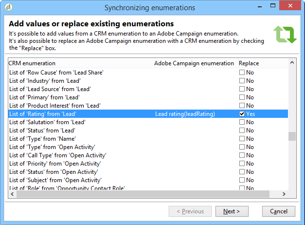
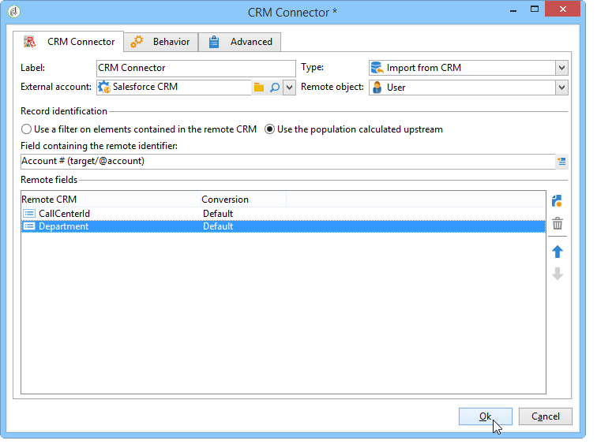

# Conectores CRM{#crm-connectors}

## Sobre conectores CRM {#about-crm-connectors}

O Adobe Campaign fornece vários conectores de CRM para vincular sua plataforma a sistemas de terceiros. Esses conectores de CRM permitem sincronizar contatos, contas, compras, etc. Eles facilitam a integração de seu aplicativo com vários aplicativos de terceiros e corporativos.

Esses conectores permitem uma integração de dados rápida e fácil: O Adobe Campaign fornece um assistente dedicado para coletar e selecionar entre as tabelas disponíveis no CRM. Isso garante a sincronização bidirecional para assegurar que os dados estejam sempre atualizados em todos os sistemas.

>[!NOTE]
>
>Esse recurso está disponível no Adobe Campaign através dos **conectores dedicados do CRM**.

A conexão com o CRM é realizada por meio de atividades dedicadas de workflow. Essas atividades são detalhadas no capítulo apresentado  [nesta seção](../../workflow/using/crm-connector.md).

### Limitações e sistemas compatíveis com o CRM {#compatible-crm-systems-and-limitations}

Os CRMs listados abaixo podem ser integrados ao Adobe Campaign.

As versões compatíveis estão detalhadas na [Matriz de compatibilidade](https://helpx.adobe.com/campaign/kb/compatibility-matrix.html).

* **Salesforce.com**

   Consulte [esta seção](#example-for-salesforce-com) para saber como configurar a conexão com o Salesforce.com.

   >[!CAUTION]
   >
   >Ao conectar o Adobe Campaign com Salesforce.com, as limitações são:
   >
   >    
   >    
   >    * As instâncias de produção de teste são compatíveis.
   >    * As regras de atribuição são compatíveis.
   >    * Várias enumerações de seleção não são compatíveis com o Adobe Campaign.

* **Oracle On Demand**

   Consulte [esta seção](#example-for-oracle-on-demand) para saber como configurar a conexão com o Oracle On Demand.

   >[!CAUTION]
   >
   >Ao conectar o Adobe Campaign com Oracle On Demand, as limitações são:
   >
   >    
   >    
   >    * O Adobe Campaign pode sincronizar qualquer objeto disponível nos templates padrão do Oracle On Demand. Se você tiver adicionado tabelas personalizadas no Oracle On Demand, elas não serão recuperadas no Adobe Campaign.
   >    * A versão da API v1.0 permite classificar ou filtrar dados durante uma query, mas não permite que você faça ambos simultaneamente.
   >    * Os dados enviados pelo Oracle On Demand não contêm informações de fuso horário.
   >    * Várias enumerações de seleção não são compatíveis com o Adobe Campaign.

* **MS Dynamics CRM** e **MS Dynamics Online**

   Consulte [esta seção](#example-for-microsoft-dynamics) para saber como configurar a conexão com o Microsoft Dynamics.

   Saiba mais sobre os casos de uso da integração do Adobe Campaign e do Microsoft Dynamics [neste vídeo](https://helpx.adobe.com/campaign/kt/acc/using/acc-integrate-dynamics365-with-acc-feature-video-set-up.html).

   >[!CAUTION]
   >
   >Ao conectar o Adobe Campaign com o Microsoft Dynamics, as limitações são:
   >
   >    
   >    
   >    * A instalação de plug-ins pode alterar o comportamento do CRM, o que pode levar a problemas de compatibilidade com o Adobe Campaign.
   >    * Várias enumerações de seleção não são compatíveis com o Adobe Campaign.

## Como configurar a conexão {#setting-up-the-connection}

Para usar os conectores CRM no Adobe Campaign, siga as etapas abaixo:

1. Crie a conta externa
1. Colete as tabelas do CRM
1. Sincronize as enumerações
1. Crie o workflow de sincronização

>[!NOTE]
>
>Os conectores CRM funcionam somente com uma URL segura (https).

### Exemplo para Salesforce.com {#example-for-salesforce-com}

Para configurar o conector do **Salesforce.com** com o Adobe Campaign, siga as etapas abaixo:

1. Create a new external account via the **[!UICONTROL Administration > Platform > External accounts]** node of the Adobe Campaign tree.
1. Execute o assistente de configuração para gerar as tabelas de CRM disponíveis.

   

   O assistente de configuração permite coletar tabelas e criar o schema correspondente.

   Click **[!UICONTROL Start]** to run the execution.

   

   >[!NOTE]
   >
   >Para aprovar a configuração, você precisa fazer logoff e voltar ao console do Adobe Campaign.

1. Check the schema generated in Adobe Campaign in the **[!UICONTROL Administration > Configuration > Data schemas]** node.

   

1. Após a criação do schema, você pode sincronizar enumerações automaticamente usando o CRM para o Adobe Campaign.

   To do this, click the **[!UICONTROL Synchronizing enumerations...]** link and select the Adobe Campaign enumeration that matches the CRM enumeration.

   You can replace all values of an Adobe Campaign enumeration with those of the CRM: to do this, select **[!UICONTROL Yes]** in the **[!UICONTROL Replace]** column.

   

   Clique em **[!UICONTROL Next]** e **[!UICONTROL Start]** para começar a importar a lista.

1. Verifique os valores importados no **[!UICONTROL Administration > Platform > Enumerations]** menu.

   

1. To import Salesforce data or to export Adobe Campaign data to Salesforce, you need to create a workflow and use the **[!UICONTROL CRM connector]** activity.

   

### Exemplo para Oracle On Demand {#example-for-oracle-on-demand}

Para configurar o conector **Oracle On Demand** para trabalhar com o Adobe Campaign, siga as etapas abaixo:

1. Create a new external account via the **[!UICONTROL Administration > Platform > External accounts]** node of the Adobe Campaign tree.

   

1. Abra o assistente de configuração: O Adobe Campaign mostra automaticamente as tabelas do modelo de dados Oracle. Selecione as tabelas que deseja coletar.

   

1. Click **[!UICONTROL Next]** to start creating the matching schema.

   O schema de dados correspondente se torna disponível no Adobe Campaign.

   

1. Inicie a sincronização de enumerações entre o Adobe Campaign e o Oracle On Demand.

   

1. Para importar dados do Oracle On Demand para o Adobe Campaign, crie o seguinte tipo de workflow:

   

   Esse workflow importa contatos por meio do Oracle On Demand, sincroniza com os dados existentes do Adobe Campaign, exclui os contatos duplicados e atualiza o banco de dados do Adobe Campaign.

   The **[!UICONTROL CRM Connector]** activity needs to be configured as shown here:

   

1. Para exportar dados do Adobe Campaign para o Oracle On Demand, crie o seguinte workflow:

   

   Esse workflow coleta os dados relevantes usando queries, e depois os exporta para a tabela de contatos do Oracle On Demand.

### Exemplo do Microsoft Dynamics {#example-for-microsoft-dynamics}

Para configurar o conector do Microsoft Dynamics para trabalhar com o Adobe Campaign, siga as etapas abaixo:

1. Create a new external account via the **[!UICONTROL Administration > Platform > External accounts]** node of the Adobe Campaign tree.

   

1. Selecione o tipo **de** Implantação: **[!UICONTROL On-premise]**, **[!UICONTROL Office 365]** ou **[!UICONTROL Web API]**, dependendo do conector que você deseja configurar.

   O Adobe Campaign Classic oferece suporte à interface REST do Dynamics 365 com protocolo OAuth para autenticação.

   If you select a **[!UICONTROL WebAPI]** deployment, you need to register an app on Azure Directory and get the **clientId** from the Azure Directory. Esse registro é detalhado [nesta página](https://msdn.microsoft.com/en-us/library/mt622431.aspx).

   >[!NOTE]
   >
   >O parâmetro redirectURL não é exigido pelo Adobe Campaign Classic.

   O valor **clientId** é usado com o nome de usuário/senha para buscar o token portador usando a senha de tipo concessão. Isso é chamado de **Resource Owner Password Credentials Grant**. Para obter mais informações, consulte [esta página](https://blogs.msdn.microsoft.com/wushuai/2016/09/25/resource-owner-password-credentials-grant-in-azure-ad-oauth/).

   

   Para obter mais informações sobre compatibilidade de versões do CRM, consulte a [Matriz de Compatibilidade](https://helpx.adobe.com/campaign/kb/compatibility-matrix.html).

1. Abra o assistente de configuração. O Adobe Campaign detecta automaticamente as tabelas do template de dados do Microsoft Dynamics.

   

   Selecione as tabelas a serem recuperadas.

   

1. Click **[!UICONTROL Next]** and start creating the corresponding schema.

   

   >[!NOTE]
   >
   >Para aprovar a configuração, você deve se desconectar/reconectar ao console do Adobe Campaign.

   O schema de dados correspondente se torna disponível no Adobe Campaign.

   

1. Inicie a sincronização de enumerações entre o Adobe Campaign e o Microsoft Dynamics.

   

1. Para importar os dados do Microsoft Dynamics para o Adobe Campaign, crie o seguinte tipo de workflow:

   

   Esse workflow importa contatos por meio do Microsoft Dynamics, sincroniza com os dados existentes do Adobe Campaign, exclui os contatos duplicados e atualiza o banco de dados do Adobe Campaign.

   The **[!UICONTROL CRM Connector]** activity needs to be configured as below:

   

## Sincronização de dados {#data-synchronization}

Synchronization between Adobe Campaign and the CRM is carried out via a dedicated workflow activity: [CRM connector](../../workflow/using/crm-connector.md).

Essa atividade permite:

* Importar do CRM (consulte [Importar do CRM](#importing-from-the-crm)),
* Exportar para CRM (consulte [Exportar para CRM](#exporting-to-the-crm)),
* Importar objetos eliminados no CRM (consulte [Importar objetos eliminados no CRM](#importing-objects-deleted-in-the-crm)),
* Excluir objetos no CRM (consulte [Excluir objetos no CRM](#deleting-objects-in-the-crm)).

Selecione a conta externa que corresponde ao CRM que você deseja configurar a sincronização, e depois selecione o objeto a ser sincronizado (contas, oportunidades, clientes potencias, contatos, etc.).

A configuração dessa atividade depende do processo a ser executado. Várias configurações são detalhadas abaixo.

### Importação do CRM {#importing-from-the-crm}

Para importar dados através do CRM no Adobe Campaign, você precisa criar o seguinte tipo de workflow:

Para uma atividade de importação, as etapas de configuração da atividade do **Conector CRM** são:

1. Selecione uma **[!UICONTROL Import from the CRM]** operação.
1. Go to the **[!UICONTROL Remote object]** drop-down list and select the object concerned by the process. Esse objeto coincide com uma das tabelas criadas no Adobe Campaign durante a configuração do conector.
1. Go to the **[!UICONTROL Remote fields]** section and enter the fields to be imported.

   To add a field, click the **[!UICONTROL Add]** button in the toolbar, then click the **[!UICONTROL Edit expression]** icon.

   

   If necessary, alter the data format via the drop-down list of the **[!UICONTROL Conversion]** columns. Possible conversion types are detailed in [Data format](#data-format).

   >[!CAUTION]
   >
   >O identificador do registro no CRM é obrigatório para vincular objetos no CRM e no Adobe Campaign. Ele é adicionado automaticamente quando a caixa é aprovada.
   >
   >A última data de modificação no lado do CRM também é obrigatória para importações de dados incrementais.

1. Você também pode filtrar os dados a serem importados com base nas suas necessidades. To do this, click the **[!UICONTROL Edit the filter...]** link.

   No exemplo a seguir, o Adobe Campaign só importará contatos nos quais algumas atividades foram registradas desde 1º de novembro de 2012.

   

   >[!CAUTION]
   >
   >The limitations linked to data filtering modes are detailed in [Filtering data](#filtering-data).

1. The **[!UICONTROL Use automatic index...]** option enables you to automatically manage incremental object synchronization between the CRM and Adobe Campaign, depending on the date and their last modification.

   For more on this, refer to [Variable management](#variable-management).

#### Gerenciamento de variáveis {#variable-management}

Enabling the **[!UICONTROL Automatic index]** option lets you collect only objects modified since the last import.

The date of the last synchronization is stored in an option specified in the configuration window, by default: **LASTIMPORT_&lt;%=instance.internalName%>_&lt;%=activityName%>**.

>[!NOTE]
>
>This note only applies to the generic **[!UICONTROL CRM Connector]** activity. Para outras atividades do CRM, o processo é automático.
>
>This option has to be manually created and populated under **[!UICONTROL Administration]** > **[!UICONTROL Platform]** > **[!UICONTROL Options]**. Deve ser uma opção de texto e seu valor precisa corresponder ao seguinte formato: **aaaa/MM/dd hh:mm:ss**.
> 
>Você precisa atualizar essa opção manualmente para qualquer outra importação.

É possível especificar o campo do CRM remoto que será levado em consideração para identificar as alterações mais recentes.

Por padrão, os seguintes campos são usados (na ordem especificada):

* Para o Microsoft Dynamics: **modifiedon**,
* Para o Oracle On Demand: **LastUpdates**, **ModifiedDate**, **LastLoggedIn**,
* Para Salesforce.com: **LastModifiedDate**, **SystemModamp**.

Activating the **[!UICONTROL Automatic index]** option generates three variables that can be used in the synchronization workflow via a **[!UICONTROL JavaScript code]** type activity. Essas atividades são:

* **vars.crmOptionName**: representa o nome da opção que contém a data de última importação.
* **vars.crmStartImport**: representa a data de início (incluída) da última recuperação de dados.
* **vars.crmEndDate**: representa a data final (excluída) da última recuperação de dados.

   >[!NOTE]
   >
   >Essas datas são mostradas no seguinte formato: **aaaa/MM/dd hh:mm:ss**.

#### Filtrar dados {#filtering-data}

Para garantir uma operação eficiente com os vários CRMs, os filtros precisam ser criados com as seguintes regras:

* Cada nível de filtragem só pode usar um tipo de operador.
* O operador AND NOT não é suportado.
* Comparações podem dizer respeito somente a valores nulos (tipo &quot;está vazio&quot;/&quot;não está vazio&quot;) ou números. Isso significa que o valor (coluna à direita) é avaliado e o resultado dessa avaliação deve ser um número. Portanto, as comparações do tipo JOIN não são compatíveis.
* O valor contido na coluna à direita é avaliado em JavaScript.
* Não há suporte para comparações JOIN.
* A expressão na coluna à esquerda deve ser um campo. Ele não pode ser uma combinação de várias expressões, um número, etc.

Por exemplo, as condições de filtragem a seguir NÃO serão válidas para uma importação de CRM, pois o operador OR é colocado no mesmo nível que os operadores AND:

* O operador OR é colocado no mesmo nível que os operadores AND
* As comparações são realizadas em cadeias de texto.

#### Ordenar por {#order-by}

No Microsoft Dynamics e no Salesforce.com, você pode classificar os campos remotos a serem importados em ordem crescente ou decrescente.

To do this, click the **[!UICONTROL Order by]** link and add the columns to the list.

A ordem das colunas na lista é a ordem de classificação:

#### Identificação de registro {#record-identification}

Em vez de importar elementos incluídos (e possivelmente filtrados) no CRM, você pode usar uma população calculada anteriormente no workflow.

To do this, select the **[!UICONTROL Use the population calculated upstream]** option and specify the field that contains the remote identifier.

Em seguida, selecione os campos da população de entrada que deseja importar, conforme mostrado abaixo:

### Como exportar para o CRM {#exporting-to-the-crm}

A exportação de dados do Adobe Campaign para o CRM permite copiar todo o conteúdo para um banco de dados do CRM.

Para exportar dados para o CRM, você precisa criar o seguinte tipo de workflow:

Para uma exportação, aplique a seguinte configuração à atividade do **Conector CRM** :

1. Selecione uma **[!UICONTROL Export to CRM]** operação.
1. Go to the **[!UICONTROL Remote object]** drop-down list and select the object concerned by the process. Esse objeto coincide com uma das tabelas criadas no Adobe Campaign durante a configuração do conector.

   >[!CAUTION]
   >
   >A função de exportação da atividade **Conectores CRM** pode inserir ou atualizar campos no lado do CRM. Para habilitar atualizações de campo no CRM, você precisa especificar a chave primária da tabela remota. Se a chave estiver faltando, os dados serão inseridos (ao invés de serem atualizados).

1. In the **[!UICONTROL Mapping]** section, specify the fields to be exported and their mapping in the CRM.

   

   To add a field, click the **[!UICONTROL Add]** button in the toolbar, then click the **[!UICONTROL Edit expression]** icon.

   >[!NOTE]
   >
   >Para determinado campo, se nenhuma correspondência for definida no lado do CRM, os valores não poderão ser atualizados: eles são inseridos diretamente no CRM.

   If necessary, alter the data format via the drop-down list of the **[!UICONTROL Conversion]** columns. Possible conversion types are detailed in [Data format](#data-format).

   >[!NOTE]
   >
   >A lista de registros a serem exportados e o resultado da exportação são salvas em um arquivo temporário que permanece acessível até que o workflow seja concluído ou reiniciado. Isso permite que você inicie o processo novamente em caso de erro, sem correr o risco de exportar o mesmo registro várias vezes ou perder dados.

### Configurações adicionais {#additional-configurations}

#### Formato dos dados {#data-format}

É possível converter o formato dos dados de forma instantânea ao importá-los para o CRM.

Para fazer isso, selecione a conversão a ser aplicada na coluna correspondente.

The **[!UICONTROL Default]** mode applies automatic data conversion, which in most cases equals a copy/paste of the data. No entanto, o gerenciamento de fuso horário é aplicado.

Outras conversões possíveis são:

* **[!UICONTROL Date only]**: esse modo exclui os campos do tipo Data + Hora.
* **[!UICONTROL Without time offset]**: esse modo cancela o gerenciamento de fuso horário aplicado no modo padrão.
* **[!UICONTROL Copy/Paste]**: esse modo usa dados brutos, como strings (sem conversão).

#### Processamento de erros {#error-processing}

Dentro da estrutura de importações ou exportações de dados, é possível aplicar um processo específico a erros e rejeições. Para fazer isso, selecione as opções **[!UICONTROL Process rejects]** e **[!UICONTROL Process errors]** na **[!UICONTROL Behavior]** guia.

Essas opções colocam as transições de saída correspondentes.

Em seguida, coloque as atividades relevantes aos processos que deseja aplicar.

Para processar erros, por exemplo, você pode adicionar uma caixa de espera e agendar novas tentativas.

As rejeições são coletadas com o código de erro e a mensagem relacionada, isso significa que é possível configurar o rastreamento de rejeições para otimizar o processo de sincronização.

>[!NOTE]
>
>Even when the **[!UICONTROL Process rejects]** option isn&#39;t enabled, a warning is generated for each rejected column with an error code and message.

The **[!UICONTROL Reject]** output transition lets you access the output schema that contains the specific columns relevant to error messages and codes. Essas colunas são:

* For Oracle On Demand: **errorLogFilename** (name of the log file on the Oracle side), **errorCode** (error code), **errorSymbol** (error symbol, different from the error code), **errorMessage** (description of the error context).
* For Salesforce.com: **errorSymbol** (error symbol, different from the error code), **errorMessage** (description of the error context).

### Importação de objetos excluídos no CRM {#importing-objects-deleted-in-the-crm}

Para habilitar a configuração de um processo extenso de sincronização de dados, você pode importar objetos excluídos do CRM para o Adobe Campaign.

Para fazer isso, siga as etapas abaixo:

1. Selecione uma **[!UICONTROL Import objects deleted in the CRM]** operação.
1. Go to the **[!UICONTROL Remote object]** drop-down list and select the object concerned by the process. Esse objeto coincide com uma das tabelas criadas no Adobe Campaign durante a configuração do conector.
1. Specify the deletion period to be taken into account in the **[!UICONTROL Start date]** and the **[!UICONTROL End date]** fields. Essas datas serão incluídas no período.

   

   >[!CAUTION]
   >
   >O período de exclusão do elemento deve coincidir com as limitações específicas do CRM. Isso significa que para o Salesforce.com, por exemplo, elementos excluídos há mais de 30 dias não podem ser recuperados.

### Exclusão de objetos no CRM {#deleting-objects-in-the-crm}

Para excluir objetos no lado do CRM, você precisa especificar a chave primária dos elementos remotos a serem excluídos.

The **[!UICONTROL Behavior]** tab lets you enable the processing of rejects. This option generates a second output transition for the **[!UICONTROL CRM connector]** activity. For more on this, refer to [Error processing](#error-processing).

>[!NOTE]
>
>Even when the **[!UICONTROL Process rejects]** option is disabled, a warning is generated for each rejected column.

