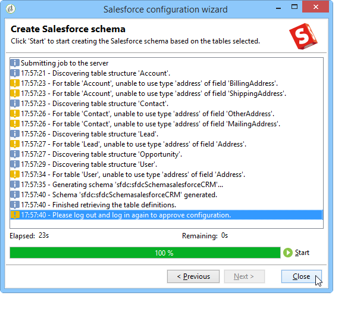

# Conecte o Campaign e o Salesforce.com{#connect-to-sfdc}

Nesta página, você aprenderá a conectar o Campaign Classic ao **Salesforce**.

A sincronização de dados é realizada por meio de uma atividade de fluxo de trabalho dedicada. [Saiba mais](../../platform/using/crm-data-sync.md).

A conta externa do permite importar e exportar dados do Salesforce para o Adobe Campaign.
Para configurar o Conector CRM do Salesforce, siga as etapas abaixo:

1. Crie uma nova conta externa por meio do nó **[!UICONTROL Administration > Platform > External accounts]** da árvore do Adobe Campaign.
1. Selecione **[!UICONTROL Salesforce.com]**.
1. Digite as configurações para habilitar a conexão.

   

   Para configurar a conta externa do Salesforce CRM para funcionar com o Adobe Campaign, você precisa fornecer os seguintes detalhes:

   * **[!UICONTROL Account]**
Conta usada para fazer logon no Salesforce CRM.

   * **[!UICONTROL Password]**
Senha usada para fazer logon no Salesforce CRM.

   * **[!UICONTROL Client identifier]**
Para saber onde encontrar o identificador do cliente, consulte esta [página](https://help.salesforce.com/articleView?id=000205876&type=1).

   * **[!UICONTROL Security token]**
Para saber onde encontrar o token de segurança, consulte esta [página](https://help.salesforce.com/articleView?id=000205876&type=1).

   * **[!UICONTROL API version]**
Selecione a versão da API.
1. Execute o assistente de configuração para gerar a tabela CRM disponível: o assistente de configuração permite que você colete tabelas e crie o esquema correspondente.

   

   >[!NOTE]
   >
   >Para aprovar a configuração, você precisa fazer logoff e voltar ao console do Adobe Campaign.

1. Verifique o esquema gerado no Adobe Campaign no nó **[!UICONTROL Administration > Configuration > Data schemas]**.

   Exemplo do esquema do **Salesforce**:

   

1. Após a criação do esquema, você pode sincronizar enumerações automaticamente do Salesforce para o Adobe Campaign.

   Para fazer isso, clique no link **[!UICONTROL Synchronizing enumerations...]** e selecione a lista discriminada do Adobe Campaign que corresponde à enumeração do Salesforce.

   

   >[!NOTE]
   >
   >É possível substituir todos os valores de uma enumeração do Adobe Campaign pelos valores do CRM: para fazer isso, selecione **[!UICONTROL Yes]** na coluna **[!UICONTROL Replace]**.

   Clique em **[!UICONTROL Next]** e depois em **[!UICONTROL Start]** para começar a importar a lista.

1. Verifique os valores importados no menu **[!UICONTROL Administration > Platform > Enumerations]**.

   

   >[!NOTE]
   >
   > Não há suporte para a seleção de várias enumerações.

O Campaign e o Salesforce.com agora estão conectados. Você pode configurar a sincronização de dados entre os dois sistemas.

Para sincronizar dados entre o Adobe Campaign e o SFDC, é necessário criar um fluxo de trabalho e usar a atividade **[!UICONTROL CRM connector]**.

Saiba mais sobre a sincronização de dados [nesta página](../../platform/using/crm-data-sync.md).
