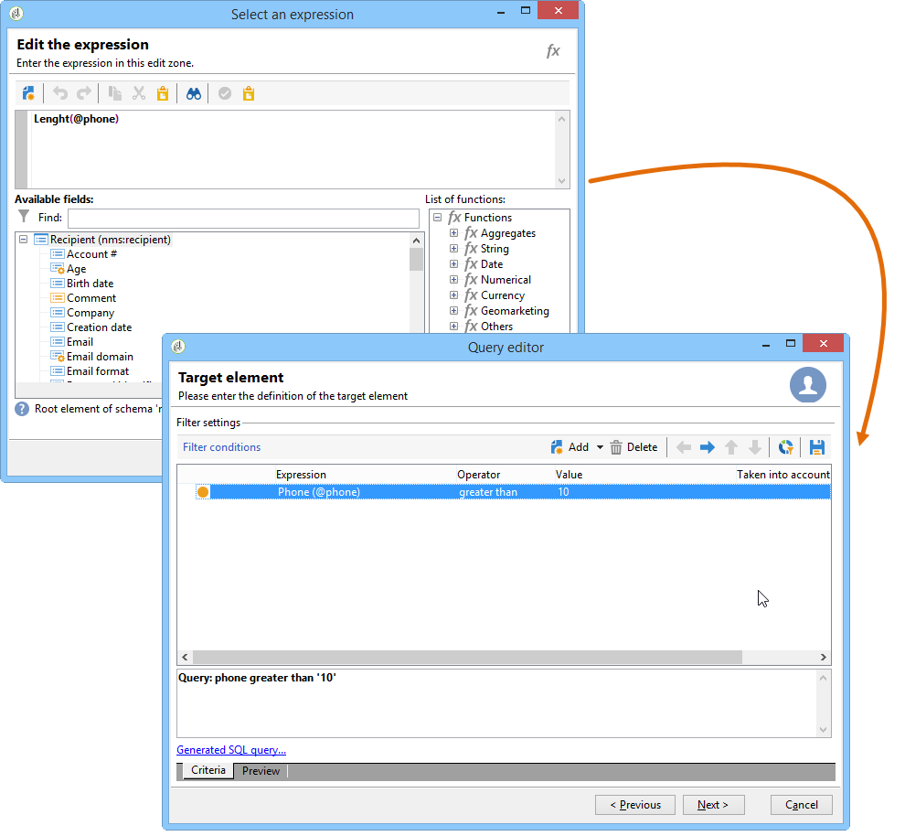

# Definição de condições de filtro{#defining-filter-conditions}

## Escolha do operador {#choosing-the-operator}

Nas condições de filtragem, é necessário vincular dois valores usando um operador.

Abaixo está uma lista dos operadores disponíveis:

<table> 
 <thead> 
  <tr> 
   <th> Operador  </th> 
   <th> Finalidade  </th> 
   <th> Exemplo  </th> 
  </tr> 
 </thead> 
 <tbody> 
  <tr> 
   <td> Igual a   </td> 
   <td> Retorna um resultado idêntico aos dados inseridos na segunda coluna de valor.  </td> 
   <td> <strong>Last name (@lastName) equal to 'Jones',</strong> retornará apenas destinatários cujo sobrenome seja Jones.  </td> 
  </tr> 
  <tr> 
   <td> Maior que  </td> 
   <td> Retorna um valor maior que o valor digitado.  </td> 
   <td> <strong>Age (@age) greater than 50</strong>, retornará todos os valores maiores que '50', ou seja, '51', '52' etc.  </td> 
  </tr> 
  <tr> 
   <td> Menor que  </td> 
   <td> Retorna um valor menor que o valor digitado.  </td> 
   <td> <strong>Creation date (@created) before 'DaysAgo(100)'</strong>, retornará todos os destinatários criados menos de 100 dias atrás.  </td> 
  </tr> 
  <tr> 
   <td> Maior que ou igual a  </td> 
   <td> Retorna todos os valores iguais ou maiores que o valor digitado.  </td> 
   <td> <strong>Age (@age) greater than or equal to '30’</strong>, retornará todos os destinatários maiores de 30 anos ou mais.  </td> 
  </tr> 
  <tr> 
   <td> Menor que ou igual a   </td> 
   <td> Retorna todos os valores iguais ou inferiores ao valor inserido.  </td> 
   <td> <strong>Age (@age) less than or equal to '60'</strong>, retornará todos os destinatários com 60 anos ou menos.  </td> 
  </tr> 
  <tr> 
   <td> Diferente de  </td> 
   <td> Retorna todos os valores não idênticos ao valor inserido.  </td> 
   <td> <strong>Language (@language) to equal to 'English'</strong>.  </td> 
  </tr> 
  <tr> 
   <td> Começa com  </td> 
   <td> Retorna os resultados iniciando com o valor inserido.  </td> 
   <td> <strong>Account # (@account) starts with '32010'.</strong>  </td> 
  </tr> 
  <tr> 
   <td> Não começa com  </td> 
   <td> Retorna os resultados que não começam com o valor inserido  </td> 
   <td> <strong>Account # (@account) does not start with '20'</strong>.  </td> 
  </tr> 
  <tr> 
   <td> Contém  </td> 
   <td> Retorna os resultados contendo pelo menos o valor inserido.  </td> 
   <td> <strong>Email domain (@domain) contains 'mail'</strong> retornará todos os nomes de domínio que contêm 'mail’. Assim, o domínio "gmail.com" também será retornado.  </td> 
  </tr> 
  <tr> 
   <td> Não contém  </td> 
   <td> Retorna resultados não contendo o valor digitado.  </td> 
   <td> <strong>Email domain (@domain) does not contain 'vo'</strong>. Nesse caso, nomes de domínio que contêm 'vo' não serão retornados. O nome de domínio 'voila.fr' não aparecerá nos resultados.  </td> 
  </tr> 
  <tr> 
   <td> Curtir  </td> 
   <td> Like é muito semelhante ao operador Contains . It lets you insert a % wild card character in the value.  </td> 
   <td> <strong>Last name (@lastName) like 'Jon%s'</strong>. Aqui, o caractere curinga é usado como "joker" para localizar o nome "Jones", o operador esqueceu a letra ausente entre o 'n' e o 's'.  </td> 
  </tr> 
  <tr> 
   <td> Não é como  </td> 
   <td> Is similar to Like . Permite que você não recupere o valor inserido. Here too, the entered value must contain the % wild card character.  </td> 
   <td> <strong>Last name (@lastName) not like 'Smi%h'</strong>. Aqui, os destinatários que têm 'Smi%h' como sobrenome não serão retornados.  </td> 
  </tr> 
  <tr> 
   <td> Está vazio  </td> 
   <td> Nesse caso, o resultado que estamos procurando corresponde a um valor vazio na segunda coluna de valor.  </td> 
   <td> <strong>Mobile (@mobilePhone) is empty</strong> retorna todos os destinatários que não têm número de celular.  </td> 
  </tr> 
  <tr> 
   <td> Não está vazio  </td> 
   <td> Works in reverse to the Is empty operator. Não é necessário inserir dados na segunda coluna de valor.  </td> 
   <td> <strong>Email (@email) is not empty</strong>.  </td> 
  </tr> 
  <tr> 
   <td> Está incluído em   </td> 
   <td> Retorna resultados incluídos nos valores indicados. Esses valores devem ser separados por vírgula.  </td> 
   <td> <strong>Birth date (@birthDate) is included in '12/10/1979,12/10/1984'</strong> retornará os destinatários nascidos entre essas datas.   </td> 
  </tr> 
  <tr> 
   <td> Não está incluído em   </td> 
   <td> Works like the Is included in operator. Aqui, queremos excluir destinatários com base nos valores inseridos.  </td> 
   <td> <strong>Birth date (@birthDate) is not included in '12/10/1979,12/10/1984'</strong>. Ao contrário do exemplo anterior, os destinatários nascidos nessas datas não serão retornados.  </td> 
  </tr> 
 </tbody> 
</table>

## Uso de AND, OR, EXCEPT {#using-and--or--except}

Para queries usando várias condições de filtragem, você precisa definir links entre as condições. Há três links possíveis:

* **[!UICONTROL And]** permite combinar duas condições de filtragem.
* **[!UICONTROL Or]** permite oferecer uma alternativa,
* **[!UICONTROL Except]** permite definir uma exceção.

Click **[!UICONTROL And]** (offered by default) and choose from the drop-down list.

* **[!UICONTROL And]**: adiciona uma condição e permite a filtragem excessiva.
* **[!UICONTROL Or]**: adiciona uma condição e permite a filtragem excessiva.

   O exemplo a seguir permite localizar destinatários cujo domínio de email contenha &quot;orange.co.uk&quot; ou cujo código postal começa com &quot;NW&quot;.

   

* **[!UICONTROL Except]**: se você tiver dois filtros e o primeiro não retornar um valor, esse tipo de link criará uma exceção.

   No exemplo a seguir, queremos retornar destinatários cujo domínio de email contenha &quot;orange.co.uk&quot;, exceto se o sobrenome do destinatário for &quot;Smith&quot;.

   

Este exemplo mostra um filtro que permite exibir: destinatários que falam espanhol, ou que são mulheres com números de celular, ou ainda destinatários sem um número de conta e cujo nome da empresa começa com a letra &quot;N&quot;.

## Priorização das condições {#prioritizing-conditions}

Esta seção explica como priorizar condições com ajuda das setas azuis na barra de ferramentas.

* A seta apontando para a direita permite adicionar um nível de parênteses ao filtro.
* A seta apontando para a esquerda permite excluir um nível de parêntese selecionado do filtro.

   

* As setas verticais permitem mover uma condição, alterando assim sua sequência de execução.

Este exemplo mostra como usar a seta para excluir um nível de parênteses. Comece a partir da seguinte condição de filtragem: **[!UICONTROL City equal to London OR gender equal to male and mobile not indicated OR account # starts with "95" and company name starts with "A"]**.

Coloque o cursor na condição de **[!UICONTROL Gender (@gender) equal to Male]** filtragem e clique na **[!UICONTROL Remove a parenthesis level]** seta.

A **[!UICONTROL Gender (@gender) equal to Male]** condição foi retirada de seus parênteses. Ela foi movida para o mesmo nível da condição &quot;Cidade igual a Londres&quot;. These conditions are linked together (**[!UICONTROL And]**).

## Selecionar dados para extrair {#selecting-data-to-extract}

Os campos disponíveis variam de uma tabela para outra. All fields are stored in a main node known as the **[!UICONTROL Main element]**. No exemplo a seguir, os campos disponíveis estão na tabela de destinatários. Os campos são sempre exibidos em ordem alfabética.

O detalhe do campo selecionado é visível na parte inferior da janela. Por exemplo, o **[!UICONTROL Email domain]** campo é um **[!UICONTROL Calculated SQL field]** e sua extensão é **[!UICONTROL (@domain)]**.

>[!NOTE]
>
>Use the **[!UICONTROL Search]** tool to find an available field.

Clique duas vezes em um campo disponível para adicioná-lo às colunas de saída. At the end of the query, each selected field creates a column in the **[!UICONTROL Data preview]** window.

Campos avançados não são exibidos por padrão. Click **[!UICONTROL Display advanced fields]** in the bottom right-hand corner of the available fields to display everything. Clique novamente para retornar ao modo de exibição anterior.

Por exemplo, na tabela do destinatário, os campos avançados são **Boolean 1**, **[!UICONTROL Boolean 2]**, **[!UICONTROL Boolean 3]**, **[!UICONTROL Foreign key of "Folder" link]** etc.

O exemplo a seguir mostra os campos avançados da tabela de destinatários.

As várias categorias de campos:

<table> 
 <thead> 
  <tr> 
   <th> Ícone  </th> 
   <th> Descrição  </th> 
   <th> Exemplos  </th> 
  </tr> 
 </thead> 
 <tbody> 
  <tr> 
   <td>  </td> 
   <td> Campo simples  </td> 
   <td> Email, sexo, etc.  </td> 
  </tr> 
  <tr> 
   <td>  </td> 
   <td> Chave primária. Este campo SQL é uma maneira de identificar um registro em uma tabela.  </td> 
   <td> Os destinatários do identificador são chaves primárias e os identificadores são exclusivos por definição.  </td> 
  </tr> 
  <tr> 
   <td>  </td> 
   <td> Chave externa. Usado como um link para outra tabela.  </td> 
   <td> Chave externa do destinatário, chave externa de serviço etc.  </td> 
  </tr> 
  <tr> 
   <td>  </td> 
   <td> Campo calculado. Esse tipo de campo é calculado mediante solicitação usando os valores no banco de dados.  </td> 
   <td> Idade, domínio de email etc.  </td> 
  </tr> 
  <tr> 
   <td>  </td> 
   <td> Campo contendo textos longos.  </td> 
   <td> Comentário, endereço completo etc.  </td> 
  </tr> 
  <tr> 
   <td>  </td> 
   <td> Campo SQL indexado.   </td> 
   <td> Nome completo, código ISO etc.   </td> 
  </tr> 
 </tbody> 
</table>

Vincular a uma tabela e elemento de coleção:

<table> 
 <thead> 
  <tr> 
   <th> Ícone  </th> 
   <th> Descrição  </th> 
   <th> Exemplo  </th> 
  </tr> 
 </thead> 
 <tbody> 
  <tr> 
   <td>  </td> 
   <td> Vincular a uma tabela em particular. Eles coincidem com as associações de tipo 1-1. Uma ocorrência da tabela de origem pode coincidir com apenas uma ocorrência da tabela de target. Por exemplo, somente um destinatário pode ser vinculado a um país.  </td> 
   <td> Pasta, Estado, País etc.   </td> 
  </tr> 
  <tr> 
   <td>  </td> 
   <td> Elemento de coleção em uma tabela específica. Eles correspondem com associações de tipo 1-N. Uma ocorrência da tabela de origem pode coincidir com várias ocorrências da tabela de destino, mas uma ocorrência da tabela de destino pode coincidir com apenas uma ocorrência da tabela de origem. Por exemplo, um destinatário pode assinar cartas de assinatura 'n'.  </td> 
   <td> Assinaturas, listas, logs de exclusão etc.  </td> 
  </tr> 
 </tbody> 
</table>

>[!NOTE]
>
>* Use the **[!UICONTROL Add]** button (above the side icon bar) to add an output column in which we wish to edit the expression. For more on editing an expression, refer to [Building expressions](#building-expressions).
>* Exclua uma coluna de saída clicando no &#39;x&#39; vermelho (**Excluir**).
>* Altere a ordem das colunas de saída usando as setas.
>* The **[!UICONTROL Distribution of values]** serves as a way to view the distributon of the values of the field selected (for example, the distributions linked to recipient towns, recipient languages, etc.).

## Criação de campos calculados {#creating-calculated-fields}

Se necessário, adicione uma coluna durante a formatação de dados. Um campo calculado adiciona uma coluna à seção de visualização de dados. Clique em **[!UICONTROL Add a calculated field]**.

Existem quatro tipos de campos calculados:

* **[!UICONTROL Fixed string]**: permite adicionar uma string de caracteres.

   

* **[!UICONTROL String with JavaScript tags]**: o valor do campo calculado combina uma sequência de caracteres e diretivas JavaScript.

   

* **[!UICONTROL JavaScript expression]**: o valor do campo calculado é o resultado de uma avaliação da função do JavaScript. O valor retornado pode ser digitado (número, data etc.).

   

* **[!UICONTROL Enumerations]**: Esse tipo de campo permite usar/modificar o conteúdo de uma das colunas de saída em uma nova coluna.

   É possível usar o valor de origem de uma coluna e fornecer um valor de destino. Esse valor de destino será exibido na nova coluna de saída.

   An example of adding calculated field type **[!UICONTROL Enumerations]** is available, refer to [this section](../../workflow/using/adding-enumeration-type-calculated-field.md).

   

   The **[!UICONTROL Enumerations]** type calculated field can include 4 conditions:

   * **[!UICONTROL Keep the source value]** restaura o valor de origem para o destino sem alterá-lo.
   * **[!UICONTROL Use the following value]** permite inserir um valor de destino padrão para valores de origem não definidos.
   * **[!UICONTROL Generate a warning and continue]** avisa ao usuário que o valor de origem não pode ser alterado.
   * **[!UICONTROL Generate an error and reject the line]** impede que a linha seja calculada e importada.

Click the **[!UICONTROL Detail of calculated field]** to view the detail of the inserted field.

Para remover esse campo calculado, clique na **[!UICONTROL Remove the calculated field]** cruz.

## Criação de expressões {#building-expressions}

A ferramenta de edição de expressão permite calcular agregações, gerar funções ou editar uma fórmula usando uma expressão.

O exemplo a seguir mostra como executar uma contagem em uma chave primária.

Siga as etapas abaixo:

1. Clique **[!UICONTROL Add]** na **[!UICONTROL Data to extract]** janela. In the **[!UICONTROL Formula type]** window, select a type of formula to enter the expression.

   Há vários tipos de fórmulas disponíveis: **[!UICONTROL Field only]**, **[!UICONTROL Aggregate]**, **[!UICONTROL Expression]**.

   Select **[!UICONTROL Process on an aggregate function]**, and **[!UICONTROL Count]**. Click **[!UICONTROL Next]**.

   

1. A chave primária é calculada.

   

Here is a detailed view of the choices available in the **[!UICONTROL Formula types]** window:

1. **[!UICONTROL Field only]** permite que você volte à **[!UICONTROL Field to select]** janela.
1. **[!UICONTROL Aggregate (Process on an aggregate function)]**. Veja alguns exemplos de uso agregado:

   * **[!UICONTROL Count]** permite que você execute uma contagem de chave primária.
   * **[!UICONTROL Sum]** permite que você adicione todas as compras feitas por um cliente por mais de um ano.
   * **[!UICONTROL Maximum value]** permite que você encontre os clientes que compraram a maioria dos produtos &quot;n&quot;.
   * **[!UICONTROL Minimum value]** permite que você classifique os clientes e localize os que assinaram uma oferta mais recentemente.
   * **[!UICONTROL Average]**. Essa função permite calcular a idade média dos destinatários.

      The **[!UICONTROL Distinct]** box lets you recover unique and non-zero values of a column. Por exemplo, é possível recuperar todos os logs de rastreamento de um destinatário; eles são alterados para o valor 1, desde que sejam todos referentes ao mesmo destinatário.

1. **[!UICONTROL Expression]** abre a **[!UICONTROL Edit the expression]** janela. Isso permite detectar números de telefone com muitos numerais, provavelmente devido a erros de entrada.

   

   For a list of all available functions, refer to [List of functions](#list-of-functions).

## Lista de funções {#list-of-functions}

If an **[!UICONTROL Expression]** type formula is chosen, you will be taken to the &quot;edit the expression&quot; window. Various categories of functions can be associated to the available fields: **[!UICONTROL Aggregates]**, **[!UICONTROL String]**, **[!UICONTROL Date]**, **[!UICONTROL Numerical]**, **[!UICONTROL Currency]**, **[!UICONTROL Geomarketing]**, **[!UICONTROL Windowing function]** and **[!UICONTROL Others]**.

O editor de expressão tem esta aparência:

Ele permite selecionar campos nas tabelas do banco de dados e adicionar funções avançadas a eles. Os recursos abaixo estão disponíveis.

**Agregados**

<table> 
 <tbody> 
  <tr> 
   <td> <strong>Nome</strong>  </td> 
   <td> <strong>Descrição</strong>  </td> 
   <td> <strong>Sintaxe</strong>  </td> 
  </tr> 
  <tr> 
   <td> <strong>Avg</strong>  </td> 
   <td> Retorna a média de uma coluna do tipo número  </td> 
   <td> Avg(&lt;value&gt;) </td> 
  </tr> 
  <tr> 
   <td> <strong>Contagem</strong>  </td> 
   <td> Conta os valores não nulos de uma coluna  </td> 
   <td> Count(&lt;value&gt;) </td>  
  </tr> 
  <tr> 
   <td> <strong>CountAll</strong>  </td> 
   <td> Conta os valores retornados (todos os campos)  </td> 
   <td> CountAll()  </td> 
  </tr> 
  <tr> 
   <td> <strong>Countdistinct</strong>  </td> 
   <td> Conta os valores não nulos distintos de uma coluna  </td> 
   <td> Countdistinct(&lt;value&gt;) </td> 
  </tr> 
  <tr> 
   <td> <strong>Max</strong>  </td> 
   <td> Retorna o valor máximo de uma coluna, cadeira de caracteres ou coluna de tipo de data  </td> 
   <td> Max(&lt;value&gt;) </td>  
  </tr> 
  <tr> 
   <td> <strong>Min</strong>  </td> 
   <td> Retorna o valor mínimo de uma coluna do tipo número, cadeira de caracteres ou dados  </td> 
   <td> Min(&lt;value&gt;) </td> 
  </tr> 
  <tr> 
   <td> <strong>StdDev</strong>  </td> 
   <td> Retorna o desvio padrão de uma coluna do tipo número, cadeira de caracteres ou dados  </td> 
   <td> StdDev(&lt;value&gt;) </td> 
  </tr> 
  <tr> 
   <td> <strong>Sum</strong>  </td> 
   <td> Retorna a soma dos valores de uma coluna do tipo número, cadeira de caracteres ou dados  </td> 
   <td> Sum(&lt;value&gt;) </td> 
  </tr> 
 </tbody> 
</table>

**Cadeia de caracteres**

<table> 
 <tbody> 
  <tr> 
   <td> <strong>Nome</strong>  </td> 
   <td> <strong>Descrição</strong>  </td> 
   <td> <strong>Sintaxe</strong>  </td> 
  </tr> 
  <tr> 
   <td> <strong>AllNonNull2</strong>  </td> 
   <td> Indica se todos os parâmetros são não nulos e não estão vazios  </td> 
   <td> AllNonNull2(&lt;string&gt;, &lt;string&gt;) </td> 
  </tr> 
  <tr> 
   <td> <strong>AllNonNull3</strong>  </td> 
   <td> Indica se todos os parâmetros são não nulos e não estão vazios  </td> 
   <td> AllNonNull3(&lt;string&gt;, &lt;string&gt;, &lt;string&gt;) </td> 
  </tr> 
  <tr> 
   <td> <strong>Ascii</strong>  </td> 
   <td> Retorna o valor ASCII do primeiro caractere na cadeia de caracteres.  </td> 
   <td> Ascii(&lt;string&gt;) </td> 
  </tr> 
  <tr> 
   <td> <strong>Char</strong>  </td> 
   <td> Retorna o caractere correspondente ao código ASCII 'n'  </td> 
   <td> Char(&lt;number&gt;) </td>  
  </tr> 
  <tr> 
   <td> <strong>Charindex</strong>  </td> 
   <td> Retorna a posição da cadeia de caracteres 2 na cadeia de caracteres 1.  </td> 
   <td> Charindex(&lt;string&gt;, &lt;string&gt;) </td> 
  </tr> 
  <tr> 
   <td> <strong>GetLine</strong>  </td> 
   <td> Retorna a linha enésima (de 1 a n) da cadeia de caracteres  </td> 
   <td> GetLine(&lt;string&gt;) </td> 
  </tr> 
  <tr> 
   <td> <strong>IfEquals</strong>  </td> 
   <td> Retorna o terceiro parâmetro se os dois primeiros parâmetros forem iguais. Caso contrário, retorna o último parâmetro  </td> 
   <td> IfEquals(&lt;string&gt;, &lt;string&gt;, &lt;string&gt;, &lt;string&gt;) </td> 
  </tr> 
  <tr> 
   <td> <strong>IsMemoNull</strong>  </td> 
   <td> Indica se o memorando passado como parâmetro é nulo  </td> 
   <td> IsMemoNull(&lt;memo&gt;) </td> 
  </tr> 
  <tr> 
   <td> <strong>JuxtWords</strong>  </td> 
   <td> Concatena as cadeira de caracteres transmitidas como parâmetros. Adiciona espaços entre as cadeiras de caracteres, se necessário.  </td> 
   <td> JuxtWords(&lt;string&gt;, &lt;string&gt;) </td> 
  </tr> 
  <tr> 
   <td> <strong>JuxtWords3</strong>  </td> 
   <td> Concatena as cadeira de caracteres transmitidas como parâmetros. Adiciona espaços entre as cadeiras de caracteres, se necessário  </td> 
   <td> JuxtWords3(&lt;string&gt;, &lt;string&gt;, &lt;string&gt;) </td>  
  </tr> 
  <tr> 
   <td> <strong>LPad</strong>  </td> 
   <td> Retorna a cadeira de caracteres concluída à esquerda  </td> 
   <td> LPad(&lt;string&gt;, &lt;número&gt;, &lt;caractere&gt;) </td> 
  </tr> 
  <tr> 
   <td> <strong>Left</strong>  </td> 
   <td> Retorna os primeiros n caracteres da cadeira de caracteres  </td> 
   <td> Left(&lt;string&gt;, &lt;number&gt;) </td> 
  </tr> 
  <tr> 
   <td> <strong>Length</strong>  </td> 
   <td> Retorna o comprimento da cadeira de caracteres  </td> 
   <td> Length(&lt;string&gt;) </td> 
  </tr> 
  <tr> 
   <td> <strong>Lower</strong>  </td> 
   <td> Retorna a cadeira de caracteres em minúsculas  </td> 
   <td> Lower(&lt;string&gt;) </td> 
  </tr> 
  <tr> 
   <td> <strong>Ltrim</strong>  </td> 
   <td> Remove espaços à esquerda da cadeira de caracteres  </td> 
   <td> Ltrim(&lt;string&gt;) </td> 
  </tr> 
  <tr> 
   <td> <strong>Md5Digest</strong>  </td> 
   <td> Retorna uma representação hexadecimal da chave MD5 de uma cadeira de caracteres  </td> 
   <td> Md5Digest(&lt;string&gt;) </td> 
  </tr> 
  <tr> 
   <td> <strong>MemoContains</strong>  </td> 
   <td> Especifica se o memorando contém a cadeira de caracteres aprovada como um parâmetro  </td> 
   <td> MemoContains(&lt;memo&gt;, &lt;string&gt;) </td> 
  </tr> 
  <tr> 
   <td> <strong>RPad</strong>  </td> 
   <td> Retorna a cadeira de caracteres concluída à direita  </td> 
   <td> RPad(&lt;string&gt;, &lt;number&gt;, &lt;character&gt;) </td> 
  </tr> 
  <tr> 
   <td> <strong>Right</strong>  </td> 
   <td> Retorna os últimos n caracteres da cadeira de caracteres  </td> 
   <td> Right(&lt;string&gt;)  </td> 
  </tr> 
  <tr> 
   <td> <strong>Rtrim</strong>  </td> 
   <td> Remove espaços à direita da cadeira de caracteres  </td> 
   <td> Rtrim(&lt;string&gt;)  </td> 
  </tr> 
  <tr> 
   <td> <strong>Smart</strong>  </td> 
   <td> Retorna a cadeira de caracteres com a primeira letra de cada palavra em maiúsculas  </td> 
   <td> Smart(&lt;string&gt;)  </td> 
  </tr> 
  <tr> 
   <td> <strong>Substring</strong>  </td> 
   <td> Extrai a subcadeia de caracteres iniciando no caractere n1 da cadeira de caracteres e de comprimento n2  </td> 
   <td> Substring(&lt;string&gt;, &lt;offset&gt;, &lt;length&gt;)  </td>  
  </tr> 
  <tr> 
   <td> <strong>ToString</strong>  </td> 
   <td> Converte o número em uma cadeira de caracteres  </td> 
   <td> ToString(&lt;número&gt;, &lt;número&gt;)  </td>  
  </tr> 
  <tr> 
   <td> <strong>Upper</strong>  </td> 
   <td> Retorna a cadeira de caracteres em maiúsculas  </td> 
   <td> Upper(&lt;string&gt;)  </td>  
  </tr> 
  <tr> 
   <td> <strong>VirtualLink</strong>  </td> 
   <td> Retorna a chave externa de um link passado como um parâmetro se os outros dois parâmetros forem iguais  </td> 
   <td> VirtualLink(&lt;number&gt;, &lt;number&gt;, &lt;number&gt;)  </td>  
  </tr> 
  <tr> 
   <td> <strong>VirtualLinkStr</strong>  </td> 
   <td> Retorna a chave externa (texto) de um link passado como um parâmetro se os outros dois parâmetros forem iguais  </td> 
   <td> VirtualLinkStr(&lt;string&gt;, &lt;number&gt;, &lt;number&gt;)  </td>  
  </tr> 
  <tr> 
   <td> <strong>dataLength</strong>  </td> 
   <td> Retorna o tamanho da cadeia de caracteres  </td> 
   <td> dataLength(&lt;string&gt;)  </td>  
  </tr> 
 </tbody> 
</table>

**Data**

<table> 
 <tbody> 
  <tr> 
   <td> <strong>Nome</strong>  </td> 
   <td> <strong>Descrição</strong>  </td> 
   <td> <strong>Sintaxe</strong>  </td> 
  </tr> 
  <tr> 
   <td> <strong>AddDays</strong>  </td> 
   <td> Adiciona um número de dias a uma data  </td> 
   <td> AddDays(&lt;date&gt;, &lt;number&gt;)  </td>  
  </tr> 
  <tr> 
   <td> <strong>AddHours</strong>  </td> 
   <td> Adiciona um número de horas a uma data  </td> 
   <td> AddHours(&lt;date&gt;, &lt;number&gt;)  </td>  
  </tr> 
  <tr> 
   <td> <strong>AddMinutes</strong>  </td> 
   <td> Adiciona um número de minutos a uma data  </td> 
   <td> AddMinutes(&lt;date&gt;, &lt;number&gt;)  </td>  
  </tr> 
  <tr> 
   <td> <strong>AddMonths</strong>  </td> 
   <td> Adiciona um número de meses a uma data  </td> 
   <td> AddMonths(&lt;date&gt;, &lt;number&gt;)  </td>  
  </tr> 
  <tr> 
   <td> <strong>AddSeconds</strong>  </td> 
   <td> Adiciona um número de segundos a uma data  </td> 
   <td> AddSeconds(&lt;date&gt;, &lt;number&gt;)  </td>  
  </tr> 
  <tr> 
   <td> <strong>AddYears</strong>  </td> 
   <td> Adiciona um número de anos a uma data  </td> 
   <td> AddYears(&lt;date&gt;, &lt;number&gt;)  </td>  
  </tr> 
  <tr> 
   <td> <strong>DateOnly</strong>  </td> 
   <td> Retorna somente a data (com a hora 00:00)*  </td> 
   <td> DateOnly(&lt;date&gt;)  </td>  
  </tr> 
  <tr> 
   <td> <strong>Day</strong>  </td> 
   <td> Retorna o número que representa o dia da data  </td> 
   <td> Day(&lt;date&gt;)  </td>  
  </tr> 
  <tr> 
   <td> <strong>DayOfYear</strong>  </td> 
   <td> Retorna o número do dia no ano da data  </td> 
   <td> DayOfYear(&lt;date&gt;)  </td>  
  </tr> 
  <tr> 
   <td> <strong>DaysAgo</strong>  </td> 
   <td> Retorna a data correspondente à data atual menos n dias  </td> 
   <td> DaysAgo(&lt;number&gt;)  </td>  
  </tr> 
  <tr> 
   <td> <strong>DaysAgoInt</strong>  </td> 
   <td> Retorna a data (inteiro aaaammdd) correspondente à data atual menos n dias  </td> 
   <td> DaysAgoInt(&lt;number&gt;)  </td>  
  </tr> 
  <tr> 
   <td> <strong>DaysDiff</strong>  </td> 
   <td> Número de dias entre duas datas  </td> 
   <td> DaysDiff(&lt;end date&gt;, &lt;start date&gt;)  </td>  
  </tr> 
  <tr> 
   <td> <strong>DaysOld</strong>  </td> 
   <td> Retorna a idade em dias de uma data.  </td> 
   <td> DaysOld(&lt;date&gt;)  </td>  
  </tr> 
  <tr> 
   <td> <strong>GetDate</strong>  </td> 
   <td> Retorna a data atual do sistema do servidor.  </td> 
   <td> GetDate()  </td> 
  </tr> 
  <tr> 
   <td> <strong>Hour</strong>  </td> 
   <td> Retorna a hora da data.  </td> 
   <td> Hour(&lt;date&gt;)  </td>  
  </tr> 
  <tr> 
   <td> <strong>HoursDiff</strong>  </td> 
   <td> Retorna o número de horas entre duas datas  </td> 
   <td> HoursDiff(&lt;end date&gt;, &lt;start date&gt;)  </td>  
  </tr> 
  <tr> 
   <td> <strong>Minute</strong>  </td> 
   <td> Retorna os minutos da data  </td> 
   <td> Minute(&lt;date&gt;)  </td>  
  </tr> 
  <tr> 
   <td> <strong>MinutesDiff</strong>  </td> 
   <td> Retorna o número de minutos entre duas datas  </td> 
   <td> MinutesDiff(&lt;end date&gt;, &lt;start date&gt;)  </td>  
  </tr> 
  <tr> 
   <td> <strong>Month</strong>  </td> 
   <td> Retorna o número que representa o mês da data  </td> 
   <td> Month(&lt;date&gt;)  </td>  
  </tr> 
  <tr> 
   <td> <strong>MonthsAgo</strong>  </td> 
   <td> Retorna a data correspondente à data atual menos n meses  </td> 
   <td> MonthsAgo(&lt;number&gt;)  </td>  
  </tr> 
  <tr> 
   <td> <strong>MonthsDiff</strong>  </td> 
   <td> Retorna o número de meses entre duas datas  </td> 
   <td> MonthsDiff(&lt;end date&gt;, &lt;start date&gt;)  </td>  
  </tr> 
  <tr> 
   <td> <strong>MonthsOld</strong>  </td> 
   <td> Retorna a idade em meses de uma data  </td> 
   <td> MonthsOld(&lt;date&gt;)  </td>  
  </tr> 
  <tr> 
   <td> <strong>Second</strong>  </td> 
   <td> Retorna os segundos da data  </td> 
   <td> Second(&lt;date&gt;)  </td>  
  </tr> 
  <tr> 
   <td> <strong>SecondsDiff</strong>  </td> 
   <td> Retorna o número de segundos entre duas datas  </td> 
   <td> SecondsDiff(&lt;end date&gt;, &lt;start date&gt;)  </td>  
  </tr> 
  <tr> 
   <td> <strong>SubDays</strong>  </td> 
   <td> Subtrai um número de dias a partir de uma data  </td> 
   <td> SubDays(&lt;date&gt;, &lt;number&gt;)  </td>  
  </tr> 
  <tr> 
   <td> <strong>SubHours</strong>  </td> 
   <td> Subtrai um número de horas a partir de uma data  </td> 
   <td> SubHours(&lt;date&gt;, &lt;number&gt;)  </td>  
  </tr> 
  <tr> 
   <td> <strong>SubMinutes</strong>  </td> 
   <td> Subtrai um número de minutos de uma data  </td> 
   <td> SubMinutes(&lt;date&gt;, &lt;number&gt;)  </td>  
  </tr> 
  <tr> 
   <td> <strong>SubMonths</strong>  </td> 
   <td> Subtrai um número de meses a partir de uma data  </td> 
   <td> SubMonths(&lt;date&gt;, &lt;number&gt;)  </td>  
  </tr> 
  <tr> 
   <td> <strong>SubSeconds</strong>  </td> 
   <td> Subtrai um número de segundos a partir de uma data  </td> 
   <td> SubSeconds(&lt;date&gt;, &lt;number&gt;)  </td>  
  </tr> 
  <tr> 
   <td> <strong>SubYears</strong>  </td> 
   <td> Subtrai um número de anos a partir de uma data  </td> 
   <td> SubYears(&lt;date&gt;, &lt;number&gt;)  </td>  
  </tr> 
  <tr> 
   <td> <strong>ToDate</strong>  </td> 
   <td> Converte uma data + hora em uma data  </td> 
   <td> ToDate(&lt;date + time&gt;)  </td>  
  </tr> 
  <tr> 
   <td> <strong>ToDateTime</strong>  </td> 
   <td> Converte uma cadeia de caracteres em uma data + hora  </td> 
   <td> ToDateTime(&lt;string&gt;)  </td>  
  </tr> 
  <tr> 
   <td> <strong>TruncDate</strong>  </td> 
   <td> Arredonda uma data e hora para o segundo mais próximo  </td> 
   <td> TruncDate(@lastModified, &lt;number of seconds&gt;)  </td> 
  </tr> 
  <tr> 
   <td> <strong>TruncDateTZ</strong>  </td> 
   <td> Arredonda uma data e hora para uma determinada precisão expressa em segundos  </td> 
   <td> TruncDateTZ(&lt;date&gt;, &lt;number of seconds&gt;, &lt;time zone&gt;)  </td> 
  </tr> 
  <tr> 
   <td> <strong>TruncQuarter</strong>  </td> 
   <td> Arredonda uma data para o trimestre  </td> 
   <td> TruncQuarter(&lt;date&gt;)  </td>  
  </tr> 
  <tr> 
   <td> <strong>TruncTime</strong>  </td> 
   <td> Arredonda a parte de horário para cima até o próximo segundo  </td> 
   <td> TruncTime(e&lt;data&gt;, &lt;número de segundos&gt;)  </td>  
  </tr> 
  <tr> 
   <td> <strong>TruncWeek</strong>  </td> 
   <td> Arredonda uma data para a semana  </td> 
   <td> TruncWeek(&lt;date&gt;)  </td>  
  </tr> 
  <tr> 
   <td> <strong>TruncYear</strong>  </td> 
   <td> Arredonda uma data + hora para 1º de janeiro do ano  </td> 
   <td> TruncYear(&lt;date&gt;)  </td>  
  </tr> 
  <tr> 
   <td> <strong>TruncWeek</strong>  </td> 
   <td> Retorna o número que representa o dia na semana da data  </td> 
   <td> WeekDay(&lt;date&gt;)  </td>  
  </tr> 
  <tr> 
   <td> <strong>Year</strong>  </td> 
   <td> Retorna o número que representa o ano da data  </td> 
   <td> Year(&lt;date&gt;)  </td>  
  </tr> 
  <tr> 
   <td> <strong>YearAnd Month</strong>  </td> 
   <td> Retorna o número que representa o ano e o mês da data.  </td> 
   <td> YearAndMonth(&lt;date&gt;)  </td>  
  </tr> 
  <tr> 
   <td> <strong>YearsDiff</strong>  </td> 
   <td> Retorna o número de anos entre as duas datas  </td> 
   <td> YearsDiff(&lt;end date&gt;, &lt;start date&gt;)  </td>  
  </tr> 
  <tr> 
   <td> <strong>YearsOld</strong>  </td> 
   <td> Retorna a idade em anos de uma data  </td> 
   <td> YearsOld(&lt;date&gt;)  </td>  
  </tr> 
 </tbody> 
</table>

>[!NOTE]
>
>Observe que a função **Dateonly** considera o fuso horário do servidor e não do operador.

**Numerical**

<table> 
 <tbody> 
  <tr> 
   <td> <strong>Nome</strong>  </td> 
   <td> <strong>Descrição</strong>  </td> 
   <td> <strong>Sintaxe</strong>  </td> 
  </tr> 
  <tr> 
   <td> <strong>Abs</strong>  </td> 
   <td> Retorna o valor absoluto de um número  </td> 
   <td> Abs(&lt;number&gt;)  </td>  
  </tr> 
  <tr> 
   <td> <strong>Ceil</strong>  </td> 
   <td> Retorna o número inteiro mais baixo maior ou igual a um número  </td> 
   <td> Ceil(&lt;number&gt;)  </td>  
  </tr> 
  <tr> 
   <td> <strong>Floor</strong>  </td> 
   <td> Retorna o maior inteiro maior ou igual a um número  </td> 
   <td> Floor(&lt;number&gt;)  </td>  
  </tr> 
  <tr> 
   <td> <strong>Greatest</strong>  </td> 
   <td> Retorna o maior número de dois números  </td> 
   <td> Greatest(&lt;number 1&gt;, &lt;number 2&gt;)  </td>  
  </tr> 
  <tr> 
   <td> <strong>Least</strong>  </td> 
   <td> Retorna o menor de dois números  </td> 
   <td> Least(&lt;number 1&gt;, &lt;number 2&gt;)  </td>  
  </tr> 
  <tr> 
   <td> <strong>Mod</strong>  </td> 
   <td> Retorna o restante da divisão inteira de n1 por n2  </td> 
   <td> Mod(&lt;número 1&gt;, &lt;número 2&gt;)  </td>  
  </tr> 
  <tr> 
   <td> <strong>Percent</strong>  </td> 
   <td> Retorna a proporção de dois números expressos como uma porcentagem  </td> 
   <td> Percent(&lt;number 1&gt;, &lt;number 2&gt;)  </td>  
  </tr> 
  <tr> 
   <td> <strong>Random</strong>  </td> 
   <td> Retorna o valor aleatório  </td> 
   <td> Random()  </td> 
  </tr> 
  <tr> 
   <td> <strong>Round</strong>  </td> 
   <td> Arredonda um número para decimais n  </td> 
   <td> Round(&lt;number&gt;, &lt;number of decimals&gt;)  </td>  
  </tr> 
  <tr> 
   <td> <strong>Sign</strong>  </td> 
   <td> Retorna o sinal do número  </td> 
   <td> Sign(&lt;number&gt;)  </td>  
  </tr> 
  <tr> 
   <td> <strong>ToDouble</strong>  </td> 
   <td> Converte um inteiro em um flutuante  </td> 
   <td> ToDouble(&lt;number&gt;)  </td>  
  </tr> 
  <tr> 
   <td> <strong>ToInt64</strong>  </td> 
   <td> Converte um flutuante em um inteiro de 64 bits  </td> 
   <td> ToInt64(&lt;number&gt;)  </td>  
  </tr> 
  <tr> 
   <td> <strong>ToInteger</strong>  </td> 
   <td> Converte um flutuante em um inteiro  </td> 
   <td> ToInteger(&lt;number&gt;)  </td>  
  </tr> 
  <tr> 
   <td> <strong>Trunc</strong>  </td> 
   <td> Corta o n1 para o decimal n2  </td> 
   <td> Trunc(&lt;n1&gt;, &lt;n2&gt;)  </td>  
  </tr> 
 </tbody> 
</table>

1. Currency

<table> 
 <tbody> 
  <tr> 
   <td> <strong>Nome</strong>  </td> 
   <td> <strong>Descrição</strong>  </td> 
   <td> <strong>Sintaxe</strong>  </td> 
  </tr> 
  <tr> 
   <td> <strong>ConvertCurrency</strong>  </td> 
   <td> Converte uma quantia na moeda de origem em uma quantia na moeda de destino  </td> 
   <td> ConvertCurrency(&lt;amount&gt;, &lt;source currency&gt;, &lt;target currency&gt;, &lt;conversion date&gt;)  </td>  
  </tr> 
  <tr> 
   <td> <strong>FormatCurrency</strong>  </td> 
   <td> Formata a quantidade exibida com base nas configurações de moeda  </td> 
   <td> FormatCurrency(&lt;amount&gt;, &lt;currency&gt;)  </td>  
  </tr> 
 </tbody> 
</table>

**Geomarketing**

<table> 
 <tbody> 
  <tr> 
   <td> <strong>Nome</strong>  </td> 
   <td> <strong>Descrição</strong>  </td> 
   <td> <strong>Sintaxe</strong>  </td> 
  </tr> 
  <tr> 
   <td> <strong>Distance</strong>  </td> 
   <td> Retorna a distância entre dois pontos definidos por sua longitude e latitude, expresso em graus.  </td> 
   <td> Distance(&lt;Longitude A&gt;, &lt;Latitude A&gt;, &lt;Longitude B&gt;, &lt;Latitude B&gt;)  </td>  
  </tr> 
 </tbody> 
</table>

**Outros**

<table> 
 <tbody> 
  <tr> 
   <td> <strong>Nome</strong>  </td> 
   <td> <strong>Descrição</strong>  </td> 
   <td> <strong>Sintaxe</strong>  </td> 
  </tr> 
  <tr> 
   <td> <strong>Case</strong>  </td> 
   <td> Retorna o valor 1 se a condição for verdadeira. Caso contrário, retornará o valor 2.  </td> 
   <td> Case(When(&lt;condition&gt;, &lt;value 1&gt;), Else(&lt;value 2&gt;))  </td> 
  </tr> 
  <tr> 
   <td> <strong>ClearBit</strong>  </td> 
   <td> Exclui o Sinalizador no valor  </td> 
   <td> ClearBit(&lt;identifier&gt;, &lt;flag&gt;)  </td>  
  </tr> 
  <tr> 
   <td> <strong>Coalesce</strong>  </td> 
   <td> Retorna o valor 2 se o valor 1 for zero ou nulo, caso contrário retorna o valor 1  </td> 
   <td> Coalesce(&lt;value 1&gt;, &lt;value 2&gt;)  </td>  
  </tr> 
  <tr> 
   <td> <strong>Decode</strong>  </td> 
   <td> Retorna o valor 3 se o valor 1 for igual ao valor 2. Caso contrário, retorna o valor 4.  </td> 
   <td> Decode(&lt;value 1&gt;, &lt;value 2&gt;, &lt;value 3&gt;, &lt;value 4&gt;)  </td>  
  </tr> 
  <tr> 
   <td> <strong>Else</strong>  </td> 
   <td> Retorna o valor 1 (só pode ser usado como parâmetro da função case)  </td> 
   <td> Else(&lt;valor 1&gt;, &lt;valor 2&gt;)  </td>  
  </tr> 
  <tr> 
   <td> <strong>GetEmailDomain</strong>  </td> 
   <td> Extrai o domínio de um endereço de email  </td> 
   <td> GetEmailDomain(&lt;value&gt;)  </td>  
  </tr> 
  <tr> 
   <td> <strong>GetMirrorURL</strong>  </td> 
   <td> Recupera o URL do servidor da mirror page  </td> 
   <td> GetMirrorURL(&lt;value&gt;)  </td>  
  </tr> 
  <tr> 
   <td> <strong>Iif</strong>  </td> 
   <td> Retorna o valor 1 se a expressão for verdadeira. Caso contrário, retorna o valor 2  </td> 
   <td> Iif(&lt;condition&gt;, &lt;value 1&gt;, &lt;value 2&gt;)  </td>  
  </tr> 
  <tr> 
   <td> <strong>IsBitSet</strong>  </td> 
   <td> Indica se o Sinalizador está no valor  </td> 
   <td> IsBitSet(&lt;identifier&gt;, &lt;flag&gt;)  </td>  
  </tr> 
  <tr> 
   <td> <strong>IsEmptyString</strong>  </td> 
   <td> Retorna o valor 2 se a cadeira de caracteres 1 estiver vazia, caso contrário, retorna o valor 3.  </td> 
   <td> IsEmptyString(&lt;value 1&gt;, &lt;value 2&gt;, &lt;value 3&gt;)  </td>  
  </tr> 
  <tr> 
   <td> <strong>NoNull</strong>  </td> 
   <td> Retorna a cadeira de caracteres vazia se o argumento for NULL.  </td> 
   <td> NoNull(&lt;value&gt;)  </td>   
  </tr> 
  <tr> 
   <td> <strong>RowId</strong>  </td> 
   <td> Retorna o número da linha.  </td> 
   <td> RowId  </td> 
  </tr> 
  <tr> 
   <td> <strong>SetBit</strong>  </td> 
   <td> Força o Sinalizador no valor.  </td> 
   <td> SetBit(&lt;identifier&gt;, &lt;flag&gt;)  </td>  
  </tr> 
  <tr> 
   <td> <strong>ToBoolean</strong>  </td> 
   <td> Converte um número em um booleano  </td> 
   <td> ToBoolean(&lt;number&gt;)  </td>   
  </tr> 
  <tr> 
   <td> <strong>When</strong>  </td> 
   <td> Retorna o valor 1 se a expressão for verdadeira. Se não, ele retorna o valor 2 (só pode ser usado como parâmetro da função case)  </td> 
   <td> When(&lt;condition&gt;, &lt;value 1&gt;)  </td>  
  </tr> 
 </tbody> 
</table>

**Funções janela**

<table> 
 <tbody> 
  <tr> 
   <td> <strong>Nome</strong>  </td> 
   <td> <strong>Descrição</strong>  </td> 
   <td> <strong>Sintaxe</strong>  </td> 
  </tr> 
  <tr> 
   <td> <strong>Desc</strong>  </td> 
   <td> Aplica uma classificação decrescente  </td> 
   <td> Desc(&lt;value 1&gt;)  </td>  
  </tr> 
  <tr> 
   <td> <strong>OrderBy</strong>  </td> 
   <td> Classifica o resultado dentro da partição  </td> 
   <td> OrderBy(&lt;value 1&gt;)  </td>  
  </tr> 
  <tr> 
   <td> <strong>PartitionBy</strong>  </td> 
   <td> Partições do resultado de um query em uma tabela  </td> 
   <td> PartitionBy(&lt;value 1&gt;)  </td>  
  </tr> 
  <tr> 
   <td> <strong>RowNum</strong>  </td> 
   <td> Gera um número de linha com base na partição da tabela e em uma sequência de classificação.  </td> 
   <td> RowNum(PartitionBy(&lt;value 1&gt;), OrderBy(&lt;value 1&gt;))  </td> 
  </tr> 
 </tbody> 
</table>