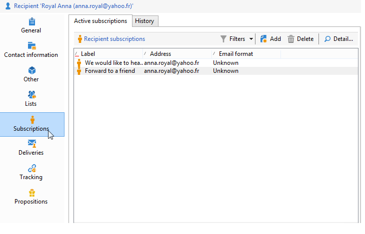

# Editar um perfil{#editing-a-profile}

Para exibir informações relacionadas a um perfil, clique no nome na lista de perfis.

Os detalhes do perfil aparecem em uma nova guia.

Os dados relativos aos perfis são agrupados em guias.

As guias e seu conteúdo dependem da sua configuração e dos pacotes instalados.

>[!CAUTION]
>
>O esquema XML e o formulário que afeta os campos na tabela de perfis são acessados por meio do nó **[!UICONTROL Administration > Configuration > Data schemas]** da árvore do Adobe Campaign. Somente usuários especialistas podem fazer alterações nesses esquemas.
>
>Para obter mais informações, consulte [esta página](../../configuration/using/about-schema-edition.md).

## Guia General {#general-tab}

Esta tela contém todos os dados gerais sobre o perfil selecionado. Em particular, ela contém o sobrenome, o nome, o endereço de e-mail, o formato de recepção de e-mail, etc. Ela tem a seguinte aparência:

>[!NOTE]
>
>Quando a opção **[!UICONTROL No longer contact (by any channel)]** está selecionada, significa que o perfil está incluído na lista de bloqueios, ou seja, o perfil expressou o desejo de não ser contatado (por exemplo, clicando em um link de cancelamento de assinatura em um boletim informativo). Ele não será mais visado por entregas em nenhum canal (e-mail, mala direta, etc.). Para obter mais informações, consulte [esta página](../../delivery/using/understanding-quarantine-management.md).

## Guia Contact information {#contact-information-tab}

Esta tela contém o endereço de mala direta do perfil selecionado. Ela tem a seguinte aparência:

Esta tela mostra o índice de qualidade do endereço, bem como a quantidade de erros do endereço. Estas informações são diretamente utilizadas pelo entregador, baseadas no número de erros encontrados durante entregas anteriores, e não são modificáveis manualmente.

## Guia Other {#other-tab}

Esta tela contém campos definidos pelo usuário que podem ser personalizados com base nos requisitos. Também é possível alterar os nomes dos campos e definir o formato em **[!UICONTROL Field properties...]**, conforme mostrado abaixo:

>[!NOTE]
>
>Para obter mais informações sobre propriedades dos campos e sobre como adicionar campos, consulte [esta página](../../configuration/using/new-field-wizard.md).

## Guia Lists {#lists-tab}

Esta tela exibe os grupos aos quais o perfil selecionado pertence. Clique em **[!UICONTROL Add]** para inserir o perfil a uma lista. Clique em **[!UICONTROL Detail]** para exibir a descrição e a lista de perfis na lista selecionada.

Para obter mais informações, consulte [Criar e gerenciar listas](../../platform/using/creating-and-managing-lists.md).

## Guia Subscriptions {#subscriptions-tab}

Esta tela contém os serviços de informação que o perfil assinou.

O botão **[!UICONTROL Detail]** exibe as propriedades da assinatura selecionada. O botão **[!UICONTROL Add]** é utilizado para adicionar uma assinatura nova manualmente.

Para obter mais informações, consulte [esta página](../../delivery/using/managing-subscriptions.md).

## Guia Deliveries {#deliveries-tab}

Esta tela exibe os logs de entrega do perfil selecionado. Também é possível exibir os rótulos, as datas e os status das ações de entrega endereçadas ao perfil por todos os canais.

## Guia Rastreamento {#tracking-tab}

Essa tela permite exibir os logs de rastreamento do perfil selecionado. Essas informações são usadas para rastrear o comportamento do perfil após as entregas.

Esta guia mostra o total cumulativo de todas as URLs rastreadas nas entregas.

A lista é configurável e normalmente contém: a URL clicada, a data e hora do clique e o documento que continha a URL.

>[!NOTE]
>
>Para obter mais informações sobre a funcionalidade de rastreamento, consulte [esta página](../../delivery/using/delivery-dashboard.md).
