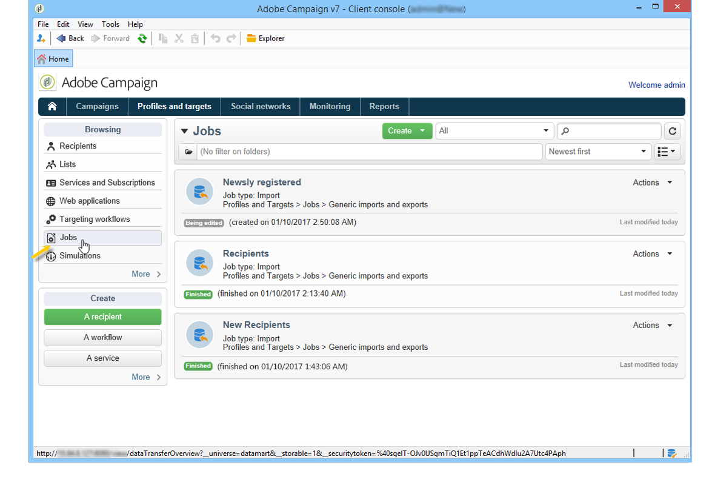

# Importing and exporting profiles{#exporting-and-importing-profiles}

Você pode [usar workflows](#use-workflows) para importar ou exportar perfis de recipient para o banco de dados Adobe Campaign, ou configurar importações [genéricas ou exportar trabalhos](#create-jobs).

 [Descubra este recurso em vídeo](#import-profiles-video)

## Usar workflows{#use-workflows}

Exports and imports are configured in dedicated templates executed through workflows via the **[!UICONTROL Import]** and **[!UICONTROL Export]** activities. Elas podem ser repetidas automaticamente de acordo com um agendamento, por exemplo, para automatizar a troca de dados entre vários sistemas de informações. [Saiba mais](../../workflow/using/importing-data.md#best-practices-when-importing-data)

Se necessário, é possível criar um trabalho ocasional de importação ou exportação por meio do **[!UICONTROL Generic imports and exports]** recurso descrito abaixo.

## Criar trabalhos{#create-jobs}

Para configurar e executar tarefas de importação e exportação de dados, vá para a **[!UICONTROL Profiles and targets]** guia e clique no **[!UICONTROL Jobs]** link. [Saiba mais](../../platform/using/generic-imports-and-exports.md)

## Como importar perfis{#import-profiles-video}

Este vídeo explica como importar perfis no Adobe Campaign, para uma importação ocasional.

>[!VIDEO](https://video.tv.adobe.com/v/25608?quality=12)
