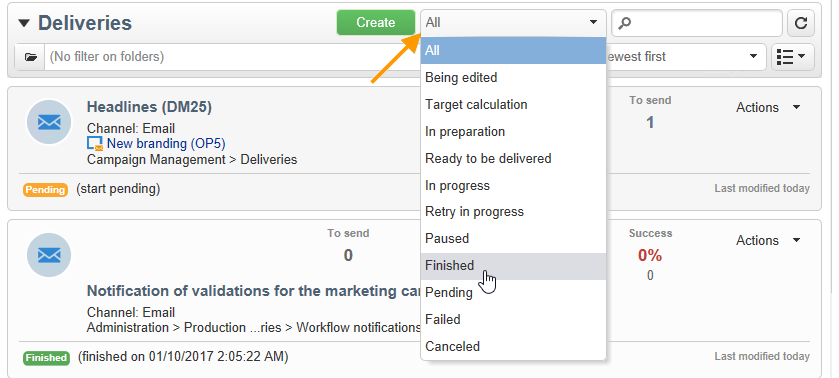

# Opções de filtro{#filtering-options}

## Sobre filtros {#about-filtering}

Por padrão, o Adobe Campaign exibe todos os dados no banco de dados para o qual o operador relacionado tem direitos de leitura.

Esses dados podem ser filtrados por meio das opções localizadas na parte superior da janela do navegador.

Há várias maneiras de filtrar os dados a serem exibidos. Se necessário, os filtros podem ser usados juntos:

* Filtrar em pastas, consulte [Filtrar por pasta](#filter-by-folder),
* Filtrar por estado, consulte [Filtrar por status](#filter-by-status),
* Classificação de dados, consulte [Pedido por](#order-by),
* Pesquisar, consulte [Pesquisa rápida](#quick-search).

## Filtrar por pasta {#filter-by-folder}

Clique no ícone **[!UICONTROL Folder]** para selecionar a pasta com os dados a serem exibidos.

Somente os perfis na pasta serão exibidos:

Utilize o xis à direita do campo de seleção da pasta para retornar ao modo de visualização padrão.

## Filtrar por status {#filter-by-status}

Dependendo do tipo de informação exibida, é possível aplicar um filtro por status ou por estado. Por exemplo, para deliveries, você pode optar por exibir somente deliveries concluídos como mostrado abaixo:

## Ordenar por {#order-by}

É possível selecionar a ordem de classificação dos dados oferecidos nas páginas por meio da lista suspensa à direita do campo de filtragem &#39;por pasta&#39;. O conteúdo desse campo depende do tipo de dados na página.

Por exemplo, você pode classificar tarefas por prioridade, data de criação ou ordem alfabética.

## Pesquisa rápida {#quick-search}

Use o campo de pesquisa para acessar rapidamente o item que procura: insira os caracteres incluídos no rótulo ou nome interno do item que deseja exibir e, em seguida, confirme para aplicar um filtro automático aos dados na página.

Para exibir todos os itens novamente, clique no xis para excluir o conteúdo do campo de pesquisa.
