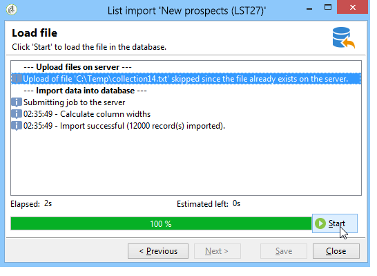
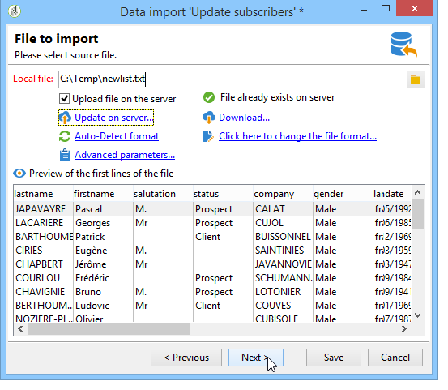
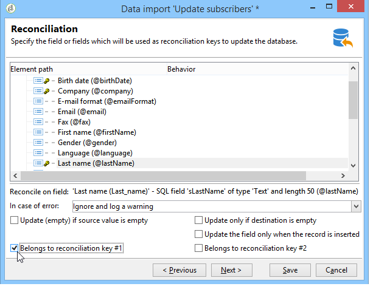

# Modelos de importação genérica {#import-operations-samples}

## Importar de uma lista de destinatários {#example--import-from-a-list-of-recipients}

Para criar e fornecer uma lista de destinatários da visão geral das listas, execute as seguintes etapas:

1. Criação da lista

   * Clique no link **[!UICONTROL Lists]** no menu **[!UICONTROL Profiles and targets]** da página inicial do Adobe Campaign.
   * Clique em **[!UICONTROL Create]** e depois no botão **[!UICONTROL Import a list]**.

1. Selecionar o arquivo a ser importado

   Clique na pasta à direita do campo **[!UICONTROL Local file]** e selecione o arquivo que contém a lista a ser importada.

   

1. Nome e armazenamento da lista

   Insira o nome da lista e selecione o diretório onde ela deve ser salva.

   

1. Iniciar a importação

   Clique em **[!UICONTROL Next]** e depois em **[!UICONTROL Start]** para começar a importar a lista.

   

## Importar novos registros de um arquivo de texto {#example--import-new-records-from-a-text-file-}

Para importar novos perfis de destinatários armazenados em um arquivo de texto para o banco de dados do Adobe Campaign, execute as seguintes etapas:

1. Escolha de um template

   * Na página inicial do Adobe Campaign, clique no link **[!UICONTROL Profiles and targets]** e, em seguida, em **[!UICONTROL Jobs]**. Acima da lista de tarefas, clique em **[!UICONTROL New import]**.
   * Mantenha o modelo **[!UICONTROL New text import]** selecionado como padrão.
   * Altere o rótulo e a descrição.
   * Selecione **[!UICONTROL Simple import]**.
   * Mantenha a pasta de tarefas padrão.
   * Clique em **[!UICONTROL Advanced parameters]** e selecione a opção **[!UICONTROL Tracking mode]** para exibir os detalhes da sua importação durante a execução.

1. Selecionar o arquivo a ser importado

   Clique na pasta à direita do campo **[!UICONTROL Local file]** e selecione o arquivo que deseja importar.

   

1. Associar campos

   Clique no ícone **[!UICONTROL Guess the destination fields]** para mapear os esquemas de origem e de destino automaticamente. Verifique as informações nesta janela antes de clicar em **[!UICONTROL Next]**.

   

1. Reconciliação

   * Vá para a tabela **Destinatários (nms:recipient)**.
   * Selecione a operação **[!UICONTROL Insertion]** e deixe os valores padrão nos outros campos.

      

1. Importação de destinatários

   * Se necessário, especifique uma pasta na qual os registros serão importados.

      

1. Iniciar a importação

   * Clique em **[!UICONTROL Start]**.

      Na área central do editor, é possível verificar se a operação de importação foi bem-sucedida e visualizar o número de registros processados.

      

      O modo **[!UICONTROL Tracking]** permite rastrear os detalhes da importação para cada registro no arquivo de origem. Para fazer isso, na página inicial, clique em **[!UICONTROL Profiles and Targets]** e depois em **[!UICONTROL Processes]**. Selecione a importação relevante e procure as guias **[!UICONTROL General]**, **[!UICONTROL Journal]** e **[!UICONTROL Rejects]**.

      * Verificar o progresso da importação

         

      * Visualização do processo de cada registro

         

## Atualizar e inserir destinatários {#example--update-and-insert-recipients}

Queremos atualizar registros existentes no banco de dados e criar novos arquivos de um arquivo de texto. Veja um exemplo do procedimento:

1. Escolha de um template

   Repita as etapas descritas no exemplo 2 acima.

1. Arquivo a ser importado

   Selecione o arquivo que deseja importar.

   Em nosso exemplo, a visão geral das primeiras linhas do arquivo mostra que o arquivo contém atualizações para três registros e a criação de um registro.

   

1. Associar campos

   Aplique o procedimento no exemplo 2 acima.

1. Reconciliação

   * Mantenha **[!UICONTROL Update or insert]** selecionado como padrão.
   * Mantenha a opção **[!UICONTROL Management of duplicates]** no modo **[!UICONTROL Update]** de forma que registros existentes no banco de dados sejam modificados com dados do arquivo de texto.
   * Selecione os campos **[!UICONTROL Birth date]**, **[!UICONTROL Name]** e **[!UICONTROL Company]** e atribua a eles uma chave de reconciliação.

      

1. Iniciar a importação

   * Clique em **[!UICONTROL Start]**.

      Na janela de rastreamento, é possível verificar se a operação de importação foi bem-sucedida e visualizar o número de registros processados.

      

   * Examine a tabela de destinatários para verificar se os registros foram modificados por esta operação.

      

## Enriquecer os valores com informações de um arquivo externo {#example--enrich-the-values-with-those-of-an-external-file}

Queremos modificar determinados campos em uma tabela de banco de dados a partir de um arquivo de texto, dando prioridade aos valores contidos no banco de dados.

Neste exemplo, você pode ver que determinados campos no arquivo de texto têm um valor, enquanto que os campos correspondentes no banco de dados estão vazios. Outros campos contêm um valor diferente daquele contido no banco de dados.

* Conteúdo do arquivo de texto a ser importado.

   

* Status do banco de dados antes da importação

   

Siga as etapas abaixo:

1. Escolha de um template

   Aplique o procedimento no exemplo 2 acima.

1. Arquivo a ser importado

   Selecione o arquivo que deseja importar.

1. Associar campos

   Aplique o procedimento no exemplo 2 acima.

   Na visualização das primeiras linhas do arquivo, é possível observar que o arquivo contém atualizações para determinados registros.

1. Reconciliação

   * Acesse a tabela e selecione a operação **[!UICONTROL Update]**.
   * Selecione a opção **[!UICONTROL Reject entity]** para o campo **[!UICONTROL Management of doubles]**.
   * Mantenha a opção **[!UICONTROL Management of duplicates]** no modo **[!UICONTROL Update]** de forma que registros existentes no banco de dados sejam modificados com dados do arquivo de texto.
   * Posicione o cursor no nó **[!UICONTROL Last name (@lastName)]** e selecione a opção **[!UICONTROL Update only if destination is empty]**.
   * Repita essa operação para o nó **[!UICONTROL Company (@company)]**.
   * Atribua uma chave de reconciliação aos campos **[!UICONTROL Birth date]**, **[!UICONTROL Email]** e **[!UICONTROL First name]**.

      

1. Iniciar a importação

   Clique em **[!UICONTROL Start]**.

   Examine a tabela de destinatários para verificar se os registros foram modificados pela importação.

   

   Somente os valores que estavam vazios foram substituídos por valores do arquivo de texto. Porém, o valor existente no banco de dados não foi substituído pelo valor do arquivo de importação.

## Atualizar e enriquecer os valores com as informações de um arquivo externo {#example--update-and-enrich-the-values-from-those-in-an-external-file}

Queremos modificar determinados campos em uma tabela de banco de dados a partir de um arquivo de texto, dando prioridade aos valores contidos no arquivo de texto.

Neste exemplo, você verá que determinados campos no arquivo de texto têm um valor vazio, enquanto os campos correspondentes no banco de dados não estão vazios. Outros campos contêm um valor diferente daquele no banco de dados.

* Conteúdo do arquivo de texto a ser importado.

   

* Status do banco de dados antes da importação

   

1. Escolha de um template

   Aplique o procedimento no exemplo 2 acima.

1. Arquivo a ser importado

   Selecione o arquivo que deseja importar.

   Na visualização das primeiras linhas do arquivo, é possível observar que o arquivo contém campos vazios e atualizações para determinados registros.

1. Associar campos

   Aplique o procedimento no exemplo 2 acima.

1. Reconciliação

   * Acesse a tabela e selecione **[!UICONTROL Update]**.
   * Selecione a opção **[!UICONTROL Reject entity]** para o campo **[!UICONTROL Management of doubles]**.
   * Deixe a opção **[!UICONTROL Management of duplicates]** no modo **[!UICONTROL Update]** para os registros existentes no banco de dados a serem modificados com dados do arquivo de texto.
   * Posicione o cursor no nó **[!UICONTROL Account number (@account)]** e selecione a opção **[!UICONTROL Take empty values into account]**.
   * Selecione os campos **[!UICONTROL Birth date]**, **[!UICONTROL Email]** e **[!UICONTROL First name]** e atribua a eles uma chave de reconciliação.

      

1. Iniciar a importação

   * Clique em **[!UICONTROL Start]**.
   * Examine a tabela de destinatários para verificar se os registros foram modificados pela operação.

      

      Os valores do arquivo de texto que estavam vazios substituíram os valores no banco de dados. Os valores existentes no banco de dados foram atualizados com aqueles no arquivo de importação ao manter a opção **[!UICONTROL Update]** selecionada para duplicatas na etapa 4.
