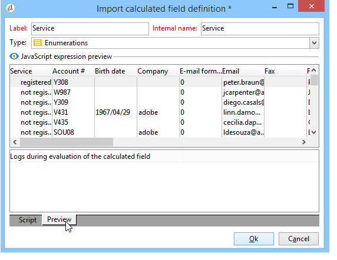
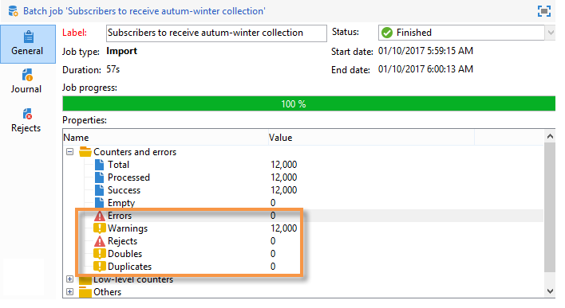
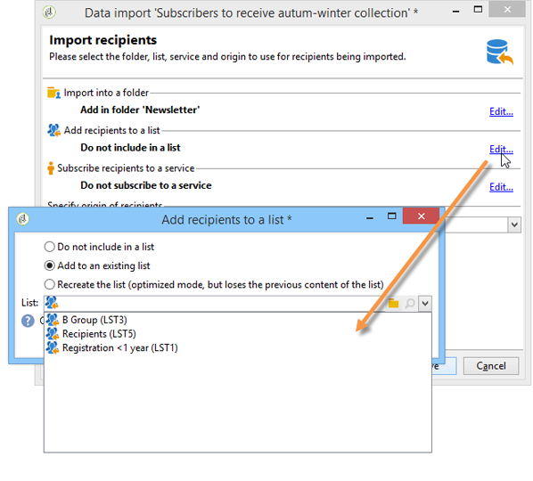
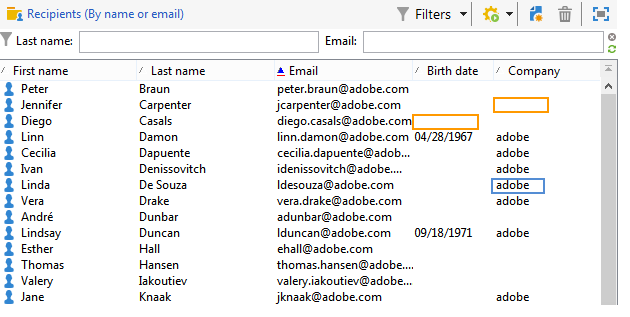

# Importação de dados{#importing-data}

O Adobe Campaign permite importar dados para o banco de dados de um ou mais arquivos no texto, no formato CSV, TAB ou XML. Esses arquivos são associados a uma tabela (principal ou vinculada) e cada campo do arquivo de origem é associado a um campo do banco de dados. A configuração de importação pode ser salva para reutilização de modo que você possa agendar tarefas de importação que automatizam suas operações de replicação.

>[!NOTE]
>
>You can import data without mapping it with the database data using the **[!UICONTROL Import a list]** function.
> 
>The data can then be used exclusively in workflows via the **[!UICONTROL Read list]** object. Para obter mais informações, consulte [esta página](../../workflow/using/read-list.md).
>
>Para saber mais sobre isso, assista ao vídeo [Importing profiles](https://docs.adobe.com/content/help/en/campaign-learn/campaign-classic-tutorials/getting-started/importing-profiles.html).

## Estrutura dos dados a importar {#structure-of-the-data-to-import}

No arquivo de origem, cada linha coincide com um registro. Os dados em registros são separados por delimitadores (espaço, tabulação, caractere etc.). Isso significa que os dados são recuperados no formulário de colunas e cada coluna é associada a um campo do banco de dados.

## Assistente de Importação {#import-wizard}

O assistente de importação permite configurar a importação, definir suas opções (como transformação de dados) e iniciar a execução. É uma série de telas cujo conteúdo depende do tipo de importação (simples ou múltipla) e dos direitos do operador.

>[!NOTE]
>
>Se você utilizar um servidor da Web IIS, uma configuração pode ser necessária para autorizar o upload de arquivos grandes (>28 MB).
>
>Para obter mais informações, consulte [esta seção](../../installation/using/integration-into-a-web-server-for-windows.md#changing-the-upload-file-size-limit).

### Etapa 1 - Escolha do template de importação {#step-1---choosing-the-import-template}

Ao iniciar o assistente de importação, primeiro é necessário selecionar um template. Como exemplo, para configurar a importação de destinatários que receberam um boletim informativo, siga as etapas abaixo:

1. Selecione a **[!UICONTROL Profiles and Targets > Job > Generic imports and exports]** pasta.
1. Clique em **New** e em **Import** para criar o template de importação.

   

1. Click the arrow to the right of the **[!UICONTROL Import template]** field to select your template, or click **[!UICONTROL Select link]** to browse the tree.

   O modelo nativo é **[!UICONTROL New text import]**. Este template não deve ser modificado, mas você pode duplicá-lo para configurar um novo template dependendo de suas necessidades. Por padrão, os modelos de importação são salvos no **[!UICONTROL Profiles and targets > Templates > Job templates]** nó.

1. Enter a name for this import in the **[!UICONTROL Label]** field. Você pode adicionar uma descrição.
1. Selecione o tipo de importação no campo apropriado. Há dois tipos possíveis de importação: **[!UICONTROL Simple import]** para importar apenas um arquivo e **[!UICONTROL Multiple import]** importar vários arquivos em uma única execução.

   For a multiple import, select **[!UICONTROL Multiple import]** from the **[!UICONTROL Import type]** drop-down list in the first screen of the import wizard.

   

1. Specify the fields you want to import by clicking **[!UICONTROL Add]**.

   

   Each time a file is added, the screen of the **[!UICONTROL File to import]** wizard is displayed. See section [Step 2 - Source file selection](#step-2---source-file-selection) and follow the steps in the wizard to define the import options as for a simple import.

   >[!NOTE]
   >
   >Importações múltiplas só devem atender às necessidades específicas e não são recomendadas.

#### Parâmetros avançados {#advanced-parameters}

O **[!UICONTROL Advanced parameters]** link permite acessar as seguintes opções:

* **[!UICONTROL General]** guia

   * **[!UICONTROL Stop execution if there are too many rejects]**

      Essa opção é selecionada por padrão. Você pode desmarcá-la se quiser continuar a executar a importação independentemente do número de rejeições. Por padrão, a execução é interrompida se as primeiras 100 linhas forem rejeitadas.

   * **[!UICONTROL Trace mode]**

      Selecione essa opção para controlar a execução da importação para cada linha.

   * **[!UICONTROL Start the job in a detached process]**

      Essa opção é selecionada por padrão. Permite desanexar a execução da importação para que não afete outras tarefas em andamento no banco de dados.

   * **[!UICONTROL Do not update enumerations]**

      Selecione essa opção para evitar o enriquecimento da lista de valores enumerados no banco de dados. Consulte [Gerenciamento de enumerações](../../platform/using/managing-enumerations.md).

* **[!UICONTROL Variables]** guia

   É possível definir variáveis associadas à tarefa que será acessível nos editores de consulta e campos calculados. To create a variable, click **[!UICONTROL Add]** and use the variable editor.

   >[!CAUTION]
   >
   >The **[!UICONTROL Variables]** tab is for Workflow-type programming use only, and should be configured by expert users only.

### Etapa 2 - Seleção de arquivo de origem {#step-2---source-file-selection}

O arquivo de origem pode estar no formato de texto (txt, csv, guia, colunas fixas) ou xml.

Por padrão, **[!UICONTROL Upload file on the server]** é selecionado. Click the folder to the right of the **[!UICONTROL Local file]** field to browse the local disk and select the file to import. É possível desmarcar essa opção para inserir o caminho de acesso e o nome do arquivo a ser importado se ele estiver no servidor.

When the file has been specified, you can view its data in the lower section of the window by clicking **[!UICONTROL Auto-detect format]**. Essa visualização exibe as 200 primeiras linhas do arquivo de origem.

Use as opções oferecidas acima desta exibição para configurar a importação. Os parâmetros definidos por meio dessas opções são transferidos para a visualização. As seguintes opções estão disponíveis:

* **[!UICONTROL Click here to change the file format...]** permite que você verifique o formato do arquivo e ajuste a configuração.
* **[!UICONTROL Update on server...]** permite transferir o arquivo local para o servidor. Essa opção estará disponível somente se **[!UICONTROL Upload file on the server]** estiver selecionada.
* **[!UICONTROL Download]** está disponível somente se o arquivo tiver sido carregado no servidor.
* **[!UICONTROL Auto-detect format]** é usada para reinicializar o formato da fonte de dados. This option lets you reapply the original formats to data that has been formatted via the **[!UICONTROL Click here to change the file format...]** option.
* The **[!UICONTROL Advanced parameters]** link lets you filter the source data and access advanced options. Nessa tela, é possível importar apenas parte do arquivo. É possível definir um filtro, por exemplo, para importar usuários do tipo ‘Prospecto’ ou &#39;Cliente&#39; de acordo com o valor da linha correspondente. Essas opções devem ser usadas somente por usuários especialistas do JavaScript.

#### Alteração do formato de arquivo {#changing-the-file-format}

The **[!UICONTROL Click here to change the file format...]** option lets you format the data of the source file, and in particular to specify the column separator and the type of data for each field. Essa configuração é executada por meio da seguinte janela:

Esta etapa permite descrever como os valores dos campos de arquivo devem ser lidos. Por exemplo, as informações de uma data, a Data ou Data + Hora podem ser associadas a um formato (dd/mm/aaaa, mm/dd/aa etc.). Se não correspondem ao formato esperado, os dados de entrada são rejeitados durante a importação.

É possível ver o resultado da configuração na zona de visualização na parte inferior da janela.

Click **[!UICONTROL OK]** to save the formatting, then click **[!UICONTROL Next]** to display the next step.

### Etapa 3 - Mapeamento de campo {#step-3---field-mapping}

Em seguida, você deve selecionar o esquema de destino e mapear os dados de cada coluna em campos no banco de dados.

* The **[!UICONTROL Destination schema]** field lets you select the schema in which the data will be imported. Essas informações são obrigatórias. Click the **[!UICONTROL Select link]** icon to select one of the existing schemas. Click **[!UICONTROL Edit link]** to display the content of the selected table.
* A tabela central mostra todos os campos definidos no arquivo de origem. Selecione os campos a serem importados para associar um arquivo de destino a eles. Esses campos podem ser mapeados manual ou automaticamente.

   Para mapear um campo manualmente, clique na caixa de seleção para selecionar o campo de origem e clique na segunda coluna para ativar a célula correspondente ao campo selecionado. Next, click the **[!UICONTROL Edit expression]** icon to display all the fields of the current table. Select the destination field and click **[!UICONTROL OK]** to validate the mapping.

   To associate the source fields and destination fields automatically, click the **[!UICONTROL Guess the destination fields]** icon to the right of the list of fields. Os campos propostos podem ser modificados se necessário.

   >[!CAUTION]
   >
   >O resultado desta operação deve sempre ser validado antes de você prosseguir para a próxima etapa.

* É possível aplicar uma transformação aos campos importados. To do this, click in the cell of the **[!UICONTROL Transformation]** column that relates to the field concerned, and select the transformation to be applied.

   

   >[!CAUTION]
   >
   >A transformação é aplicada no momento da importação. Se as restrições no campo de destino tiverem sido definidas, no entanto (no exemplo acima, no campo @lastname), essas restrições terão prioridade.

* Pode-se adicionar campos calculados usando o ícone apropriado, localizado à direita da tabela central. Os campos calculados permitem executar transformações complexas, adicionar colunas virtuais ou mesclar os dados de várias colunas. Consulte as seções a seguir para obter detalhes sobre as diversas possibilidades.

#### Campos calculados {#calculated-fields}

Os campos calculados são novas colunas adicionadas ao arquivo de origem e calculadas de outras colunas. Os campos calculados podem então ser associados a campos do banco de dados do Adobe Campaign. As operações de reconciliação, no entanto, não são possíveis em campos calculados.

Existem quatro tipos de campos calculados:

* **[!UICONTROL Fixed string]**: o valor do campo calculado é o mesmo para todas as linhas do arquivo de origem. Permite definir o valor de um campo dos registros inseridos ou atualizados. Por exemplo, você pode definir um marcador para &quot;sim&quot; para todos os registros importados.
* **[!UICONTROL String with JavaScript tags]**: o valor do campo calculado é uma string de caracteres que contém comandos JavaScript.
* **[!UICONTROL JavaScript expression]**: o valor do campo calculado é o resultado da avaliação de uma função JavaScript. O valor retornado pode ser um número, uma data etc.
* **[!UICONTROL Enumeration]**: o valor do campo é atribuído de acordo com um valor contido no arquivo de origem. O editor permite especificar a coluna de origem e inserir a lista de valores de enumeração, como no exemplo a seguir:

   

   The **[!UICONTROL Preview]** tab lets you view the result of the defined configuration. Here, the **[!UICONTROL Subscription]** column has been added. O valor é calculado a partir do campo **Status**.

   

### Etapa 4 - Reconciliação {#step-4---reconciliation}

A etapa de reconciliação do assistente de importação permite definir o modo de reconciliação dos dados do arquivo com os dados existentes no banco de dados e definir as regras de prioridade entre os dados do arquivo e os dados do banco de dados. A janela de configuração tem esta aparência:

A seção central da tela contém uma árvore com os campos e as tabelas do banco de dados do Adobe Campaign ao qual os dados serão importados.

As opções especiais estão disponíveis para cada nó (tabela ou campo). Quando você clica no nó relacionado na lista, seus parâmetros e uma breve descrição aparecem abaixo. The behavior defined for each element is displayed in the corresponding **[!UICONTROL Behavior]** column.

#### Tipos de operação {#types-of-operation}

Para cada tabela relacionada à importação, deve-se definir o tipo de operação. As seguintes operações estão disponíveis para o elemento principal do banco de dados:

* **[!UICONTROL Update or insertion]**: atualiza o registro se ele existir no banco de dados e o cria se não existir.
* **[!UICONTROL Insertion]**: insere registros no banco de dados.
* **[!UICONTROL Update]**: atualiza somente registros existentes (ignora outros registros).
* **[!UICONTROL Reconciliation only]**: procura pelo registro no banco de dados, mas não executa uma atualização. Por exemplo, permite associar a pasta de destinatários a ser importada de acordo com uma coluna do arquivo sem atualizar os dados nas pastas.
* **[!UICONTROL Deletion]**: permite que você destrua registros no banco de dados.

As seguintes opções estão disponíveis para cada campo na tabela em relação à importação:

* **[!UICONTROL Update (empty) if source value is empty]**: no caso de uma atualização, o valor no campo removerá o valor do banco de dados se o campo estiver vazio no arquivo de origem. Caso contrário, o campo do banco de dados será mantido.
* **[!UICONTROL Update only if destination is empty]**: o valor do arquivo de origem não substitui o valor no campo do banco de dados, a menos que o campo do banco de dados esteja vazio. Nesse caso, ele recebe o valor do arquivo de origem.
* **[!UICONTROL Update the field only when the record is inserted]**: durante uma operação de atualização ou inserção, somente os registros do arquivo de origem novos serão importados.

>[!NOTE]
>
>A definição de uma chave de reconciliação é sempre **obrigatória**, exceto no caso de inserção sem correção de duplicidade.

#### Chaves de reconciliação {#reconciliation-keys}

Pelo menos uma chave de reconciliação deve ser preenchida para gerenciar a correção de duplicidade.

Uma chave de reconciliação é um conjunto de campos usados para identificar um registro. Por exemplo, para importar destinatários, a chave de conciliação pode ser o número da conta, o campo &quot;email&quot; ou os campos &quot;Last name, First name, Company&quot; etc.

Nesse caso, para descobrir se uma linha de um arquivo corresponde a um destinatário existente no banco de dados, o mecanismo de importação compara os valores do arquivo com aqueles do banco de dados para todos os campos da chave. Quando os campos são específicos de um registro, uma comparação entre os dados de origem e de destino pode ser executada, garantindo a integridade dos dados após a importação. Uma segunda chave de reconciliação pode ser preenchida para a mesma tabela; ela é usada para as linhas cuja primeira chave está vazia.

Evite escolher um campo que possa ser modificado durante a importação; se isso ocorrer, o mecanismo poderá criar registros adicionais.

>[!NOTE]
>
>Para uma importação de destinatário, o identificador da pasta selecionada é adicionado implicitamente à chave.
>
>A reconciliação é executada assim apenas nessa pasta (a menos que nenhuma pasta seja selecionada).

#### Eliminação de duplicação {#deduplication}

>[!NOTE]
>
>O &quot;duplo&quot; é um item que existe duas ou mais vezes no arquivo a ser importado.
>
>O &quot;duplicado&quot; é um item que existe no arquivo a ser importado e também no banco de dados.

The **[!UICONTROL Management of doubles]** field lets you configure the deduplication of data. A desduplicação emite registros que aparecem várias vezes **no arquivo de origem** (ou nos arquivos de origem no caso de uma importação de múltiplos arquivos), ou seja, linhas para as quais os campos da chave de reconciliação são idênticos.

* Duplicate management in **[!UICONTROL Update]** mode (the default mode) does not perform deduplication. Assim, o último registro tem prioridade (porque atualiza os dados dos registros anteriores). A contagem de duplicados não é executada nesse modo.
* Gerenciamento duplicado no **[!UICONTROL Ignore]** modo ou **[!UICONTROL Reject entity]** exclui duplicatas da importação. Nesse caso, nenhum registro é importado.
* In **[!UICONTROL Reject entity]** mode, the element is not imported, and an error is generated in the import logs.
* In **[!UICONTROL Ignore]** mode, the element is not imported, but no trace of the error is kept. Esse modo permite otimizar o desempenho.

>[!CAUTION]
>
>A desduplicação é executada somente na memória. Portanto, o tamanho de uma importação com desduplicação é limitado. O limite depende de vários parâmetros (capacidade do servidor de aplicação, atividade, número de campos na chave etc.). O tamanho máximo de uma desduplicação é da ordem de um milhão de linhas.

A desduplicação emite um registro presente no arquivo de origem e no banco de dados. Diz respeito apenas a operações com atualização (isto é, **[!UICONTROL Update and insertion]** ou **[!UICONTROL Update]**). The **[!UICONTROL Duplicate management]** option lets you update or ignore the record if it is in both the source file and the database. The **[!UICONTROL Update or insert based on origin]** option belongs to the optional module and cannot be used in a standard context.

As opções **[!UICONTROL Reject]** e **[!UICONTROL Ignore]** funcionam conforme apresentado acima.

#### Comportamento no caso de um erro {#behavior-in-the-event-of-an-error}

A maioria das operações de transferência de dados gera vários tipos de erros (formato de linha incoerente, endereço de email inválido etc.). Todos os erros e avisos gerados pelo mecanismo de importação são armazenados e vinculados à instância de importação.

Details of these rejects can be viewed via the **[!UICONTROL Rejects]** tab.

There are two types of rejects (the type is displayed in the **[!UICONTROL Connector]** column):

* Recusas dos erros em relação ao conector de texto que ocorrem enquanto a linha de arquivo está sendo processada (campo calculado, análise de dados etc.). Nessa situação, no caso de um erro, a linha inteira é sempre recusada.
* Rejeições do conector do banco de dados são relacionados a erros ocorridos durante a reconciliação ou escrita dos dados no banco de dados. No caso de uma importação para várias tabelas, a rejeição pode ocorrer apenas em uma parte do registro (por exemplo, para uma importação de destinatários e eventos associados, um erro pode impedir a atualização de um evento sem recusar o destinatário).

Na página de reconciliação de dados, é possível definir o campo do tipo de gerenciamento de erros desejado por campo e tabela por tabela.

* **[!UICONTROL Ignore and log a warning]**: todos os campos são importados para o banco de dados, exceto aquele que gerou um erro.
* **[!UICONTROL Reject parent element]**: toda a linha do registro é rejeitada, não somente o campo que causou um erro.
* **[!UICONTROL Reject all elements]**: as paradas de importação e todos os elementos do registro são rejeitados.

   

A árvore na tela de rejeição de uma instância de importação indica quais campos foram rejeitados e onde ocorreram os erros.

You can generate a file containing these records via the **[!UICONTROL Export rejects]** icon:

### Etapa 5 - Etapa adicional ao importar destinatários {#step-5---additional-step-when-importing-recipients}

A próxima etapa do assistente de importação permite selecionar ou criar a pasta na qual os dados serão importados, mapear automaticamente destinatários importados com uma lista (nova ou existente) e assinar destinatários a um serviço.

>[!NOTE]
>
>Esta etapa aparece ao importar os destinatários somente e ao usar a tabela de destinatários padrão do Adobe Campaign (**nms:recipient**).

* Click the **[!UICONTROL Edit]** links to select the folder, the list, or the service to which you want to associate or subscribe the recipients.

   1. Importação para uma pasta

      The **[!UICONTROL Edit...]** link of the **[!UICONTROL Import into a folder]** section lets you select or create the folder into which the recipients will be imported. Por padrão, se nenhuma partição for definida, os dados serão importados para a pasta padrão do operador.

      >[!NOTE]
      >
      >A pasta padrão de um operador é a primeira pasta que o operador tem acesso de gravação. Consulte Gerenciamento [de acesso de](../../platform/using/access-management.md#folder-access-management)pasta.

      To select the import folder, click the arrow to the right of the **[!UICONTROL Folder]** field and select the folder concerned. You can also use the **[!UICONTROL Select link]** icon to display the tree in a new window or create a new folder.

      

      Para criar uma nova pasta, selecione o nó no qual deseja adicionar uma pasta e clique com o botão direito do mouse. Select **[!UICONTROL Create a new 'Recipients' folder]**.

      

      A pasta é adicionada abaixo do nó atual. Enter the name of the new folder, hit Enter to confirm, and then click **[!UICONTROL OK]**.

      

   1. Associar com uma lista

      The **[!UICONTROL Edit...]** link in the **[!UICONTROL Add recipients to a list]** section lets you select or create a list into which the recipients will be imported.

      

      You can create a new list for these recipients by clicking **[!UICONTROL Select link]**, then **[!UICONTROL Create]**. A criação e o gerenciamento de listas são apresentados em [Criação e gerenciamento de listas](../../platform/using/creating-and-managing-lists.md).

      

      Você pode decidir adicionar os destinatários aos já presentes em uma lista ou para recriar a lista com os novos destinatários. Nesse caso, se a lista já continha destinatários, eles serão excluídos e substituídos pelos destinatários importados.

   1. Como assinar um serviço

      To subscribe all imported recipients to an information service, click the **[!UICONTROL Edit...]** link of the **[!UICONTROL Subscribe recipients to a service]** section in order to select or create the information service which the recipients will be subscribed to. You can select the **[!UICONTROL Send a confirmation message]** option: The content of this message is defined in the delivery template associated with the subscription service.

      

      You can create a new service for these recipients by clicking **[!UICONTROL Select link]** and then the **[!UICONTROL Create]** icon. O gerenciamento dos serviços de informação é apresentado [nesta seção](../../delivery/using/managing-subscriptions.md).

* Use the **[!UICONTROL Origin]** field to add information about the origin of recipients to their profiles. Essas informações são particularmente úteis na estrutura de uma importação múltipla.

Click **[!UICONTROL Next]** to validate this step and display the following step.

### Etapa 6 - Iniciar a importação {#step-6---launching-the-import}

A última etapa do assistente permite iniciar a importação de dados. To do this, click the **[!UICONTROL Start]** button.

### Status da tarefa {#job-statuses}

Status da tarefa indica o status atual de uma tarefa. Cada status é representado por um ícone e rótulo especiais. Essas informações são exibidas na lista de tarefas. Os status e seus ícones estão listados abaixo:

* **Edição em progresso**

   A tarefa está sendo criada.

* **Execução em progresso**

   A tarefa está sendo executada.

* **Cancelar**

   Click the **[!UICONTROL Cancel]** button: the job in progress is cancelled.

* **Cancelamento em progresso**

   O comando de cancelamento foi considerado e a tarefa está sendo cancelada.

* **Pausa em progresso**

   Click **[!UICONTROL Pause]**: the job is being suspended.

* **Em pausa**

   Clique em **[!UICONTROL Pause]**: o trabalho é suspenso. It can be restarted by clicking **[!UICONTROL Start]**.

* **Concluído**

   A execução do trabalho foi concluída.

* **Concluído com erro**

   O trabalho não foi executado devido a um erro técnico.

* **Desligamento do servidor em progresso**

   A tarefa em andamento foi interrompida porque o servidor do Adobe Campaign foi desligado.

## Modelos de importação genérica {#generic-import-samples}

### Example: Import from a list of recipients {#example--import-from-a-list-of-recipients}

Para criar e fornecer uma lista de destinatários da visão geral das listas, execute as seguintes etapas:

1. Criação da lista

   * Clique no **[!UICONTROL Lists]** link no **[!UICONTROL Profiles and targets]** menu da página inicial do Adobe Campaign.
   * Clique no botão **[!UICONTROL Create]** e depois no **[!UICONTROL Import a list]** botão.

1. Selecionar o arquivo a ser importado

   Click the folder to the right of the **[!UICONTROL Local file]** field and select the file containing the list to import.

   

1. Nome e armazenamento da lista

   Insira o nome da lista e selecione o diretório onde ela deve ser salva.

   

1. Iniciar a importação

   Clique em **[!UICONTROL Next]** e **[!UICONTROL Start]** para começar a importar a lista.

   

### Exemplo: importar novos registros de um arquivo de texto {#example--import-new-records-from-a-text-file-}

Para importar novos perfis de destinatários armazenados em um arquivo de texto para o banco de dados do Adobe Campaign, execute as seguintes etapas:

1. Escolha de um template

   * Na página inicial do Adobe Campaign, clique no **[!UICONTROL Profiles and targets]** link e, em seguida, **[!UICONTROL Jobs]**. Above the list of jobs, click **[!UICONTROL New import]**.
   * Mantenha o **[!UICONTROL New text import]** modelo selecionado por padrão.
   * Altere o rótulo e a descrição.
   * Select **[!UICONTROL Simple import]**.
   * Mantenha a pasta de tarefas padrão.
   * Click **[!UICONTROL Advanced parameters]** and select the **[!UICONTROL Tracking mode]** option to view the details of your import during execution.

1. Selecionar o arquivo a ser importado

   Click the folder to the right of the **[!UICONTROL Local file]** field and select the file you want to import.

   

1. Associar campos

   Click the **[!UICONTROL Guess the destination fields]** icon to map the source and destination schemas automatically. Check the information in this window before clicking **[!UICONTROL Next]**.

   

1. Reconciliação

   * Vá para a tabela **Destinatários (nms:recipient)**.
   * Select the **[!UICONTROL Insertion]** operation and leave the default values in the other fields.

      

1. Importação de destinatários

   * Se necessário, especifique uma pasta na qual os registros serão importados.

      

1. Iniciar a importação

   * Clique em **[!UICONTROL Start]**.

      Na área central do editor, é possível verificar se a operação de importação foi bem-sucedida e visualizar o número de registros processados.

      

      The **[!UICONTROL Tracking]** mode lets you track the details of the import for each record in the source file. Para fazer isso, na página inicial, clique em **[!UICONTROL Profiles and Targets]** seguida **[!UICONTROL Processes]**, selecione a importação relevante e procure as guias **[!UICONTROL General]**, **[!UICONTROL Journal]** e **[!UICONTROL Rejects]** .

      * Verificar o progresso da importação

         

      * Visualização do processo de cada registro

         

### Example: Update and insert recipients {#example--update-and-insert-recipients}

Queremos atualizar registros existentes no banco de dados e criar novos arquivos de um arquivo de texto. Veja um exemplo do procedimento:

1. Escolha de um template

   Repita as etapas descritas no exemplo 2 acima.

1. Arquivo a ser importado

   Selecione o arquivo que deseja importar.

   Em nosso exemplo, a visão geral das primeiras linhas do arquivo mostra que o arquivo contém atualizações para três registros e a criação de um registro.

   

1. Associar campos

   Aplique o procedimento no exemplo 2 acima.

1. Reconciliação

   * Manter **[!UICONTROL Update or insert]** selecionado por padrão.
   * Keep the option **[!UICONTROL Management of duplicates]** in **[!UICONTROL Update]** mode so that existing records in the database will be modified with data from the text file.
   * Selecione os campos **[!UICONTROL Birth date]**, **[!UICONTROL Name]** e **[!UICONTROL Company]** atribua uma chave de reconciliação a eles.

      

1. Iniciar a importação

   * Clique em **[!UICONTROL Start]**.

      Na janela de rastreamento, é possível verificar se a operação de importação foi bem-sucedida e visualizar o número de registros processados.

      

   * Examine a tabela de destinatários para verificar se os registros foram modificados por esta operação.

      

### Example: Enrich the values with those of an external file {#example--enrich-the-values-with-those-of-an-external-file}

Queremos modificar determinados campos em uma tabela de banco de dados a partir de um arquivo de texto, dando prioridade aos valores contidos no banco de dados.

Neste exemplo, você pode ver que determinados campos no arquivo de texto têm um valor, enquanto que os campos correspondentes no banco de dados estão vazios. Outros campos contêm um valor diferente daquele contido no banco de dados.

* Conteúdo do arquivo de texto a ser importado.

   

* Status do banco de dados antes da importação

   

Siga as etapas abaixo:

1. Escolha de um template

   Aplique o procedimento no exemplo 2 acima.

1. Arquivo a ser importado

   Selecione o arquivo que deseja importar.

1. Associar campos

   Aplique o procedimento no exemplo 2 acima.

   Na visualização das primeiras linhas do arquivo, é possível observar que o arquivo contém atualizações para determinados registros.

1. Reconciliação

   * Go to the table and select the **[!UICONTROL Update]** operation.
   * Selecione a opção **[!UICONTROL Reject entity]** para o **[!UICONTROL Management of doubles]** campo.
   * Keep the option **[!UICONTROL Management of duplicates]** in **[!UICONTROL Update]** mode so that existing records in the database will be modified with data from the text file.
   * Coloque o cursor no **[!UICONTROL Last name (@lastName)]** nó e selecione a **[!UICONTROL Update only if destination is empty]** opção.
   * Repita essa operação para o **[!UICONTROL Company (@company)]** nó.
   * Atribua uma chave de reconciliação aos campos **[!UICONTROL Birth date]**, **[!UICONTROL E-mail]** e **[!UICONTROL First name]**.

      

1. Iniciar a importação

   Clique em **[!UICONTROL Start]**.

   Examine a tabela de destinatários para verificar se os registros foram modificados pela importação.

   

   Somente os valores que estavam vazios foram substituídos por valores do arquivo de texto. Porém, o valor existente no banco de dados não foi substituído pelo valor do arquivo de importação.

### Example: Update and enrich the values from those in an external file {#example--update-and-enrich-the-values-from-those-in-an-external-file}

Queremos modificar determinados campos em uma tabela de banco de dados a partir de um arquivo de texto, dando prioridade aos valores contidos no arquivo de texto.

Neste exemplo, você verá que determinados campos no arquivo de texto têm um valor vazio, enquanto os campos correspondentes no banco de dados não estão vazios. Outros campos contêm um valor diferente daquele no banco de dados.

* Conteúdo do arquivo de texto a ser importado.

   

* Status do banco de dados antes da importação

   

1. Escolha de um template

   Aplique o procedimento no exemplo 2 acima.

1. Arquivo a ser importado

   Selecione o arquivo que deseja importar.

   Na visualização das primeiras linhas do arquivo, é possível observar que o arquivo contém campos vazios e atualizações para determinados registros.

1. Associar campos

   Aplique o procedimento no exemplo 2 acima.

1. Reconciliação

   * Go to the table and select **[!UICONTROL Update]**.
   * Selecione a opção **[!UICONTROL Reject entity]** para o **[!UICONTROL Management of doubles]** campo.
   * Leave the option **[!UICONTROL Management of duplicates]** in **[!UICONTROL Update]** mode for existing records in the database to be modified with data from the text file.
   * Coloque o cursor no **[!UICONTROL Account number (@account)]** nó e selecione a opção **[!UICONTROL Take empty values into account]**.
   * Selecione os campos **[!UICONTROL Birth date]**, **[!UICONTROL E-mail]** e **[!UICONTROL First name]** atribua uma chave de reconciliação a eles.

      

1. Iniciar a importação

   * Clique em **[!UICONTROL Start]**.
   * Examine a tabela de destinatários para verificar se os registros foram modificados pela operação.

      

      Os valores do arquivo de texto que estavam vazios substituíram os valores no banco de dados. The existing values in the database were updated with those in the import file in keeping with the **[!UICONTROL Update]** option selected for duplicates in step 4.

## Importação de dados de um workflow {#importing-data-from-a-workflow}

Os workflows podem ser uma maneira útil de automatizar alguns dos processos de importação. Se você importa dados de um arquivo local ou de um SFTP, você pode usar workflows para padronizar os procedimentos de gerenciamento de dados.

Para saber mais sobre como importar dados de um workflow, consulte [esta seção](../../workflow/using/importing-data.md).
