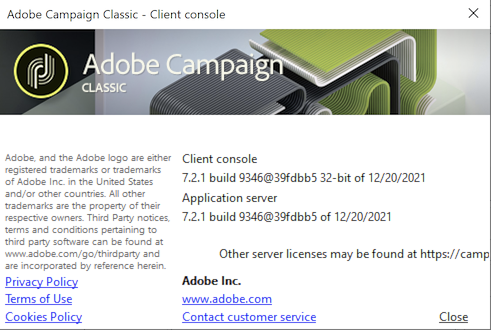

# Iniciar o Adobe Campaign{#launching-adobe-campaign}

O console do Campaign Client é um cliente avançado que permite a conexão com seu(s) servidor(es) de aplicativos do Campaign. Saiba como baixar e configurar o console do cliente [nesta página](../../installation/using/installing-the-client-console.md).

>[!CAUTION]
>
>Verifique a compatibilidade do sistema e das ferramentas com o Console do cliente do Adobe Campaign na [Matriz de compatibilidade](../../rn/using/compatibility-matrix.md#ClientConsoleoperatingsystems)

## Iniciar o Adobe Campaign {#starting-adobe-campaign}

Você pode iniciar o Adobe Campaign selecionando **[!UICONTROL Start / All Programs / Adobe Campaign v.X / Adobe Campaign client console]**.

A janela de conexão do console do cliente permite selecionar ou configurar bancos de dados existentes e conectar-se a eles usando um nome de usuário e uma senha:

## Conexão com o Adobe Campaign {#connecting-to-adobe-campaign}

Você pode se conectar ao Adobe Campaign usando sua Adobe ID. Para obter mais informações, consulte [esta página](../../integrations/using/about-adobe-id.md).

Também é possível conectar-se com uma combinação exclusiva de login e senha:

1. Digite o identificador da conta do operador no campo **[!UICONTROL Login]**.

   Seu identificador é fornecido pelo administrador da plataforma Adobe Campaign.

1. Digite sua senha no campo **[!UICONTROL Password]**.

   Na primeira vez que você acessar o banco de dados, sua senha será fornecida pelo administrador. Depois de conectado, você poderá alterar a senha usando o menu **[!UICONTROL Tools > Change password...]** Os detalhes sobre operadores e conexões estão disponíveis em [Gerenciamento de acesso](../../platform/using/access-management.md).

1. Clique em **[!UICONTROL LOG IN]** para confirmar.<!--You can also press the **Enter** key to launch connection.-->

Agora, você pode acessar o [Workspace do Adobe Campaign](../../platform/using/adobe-campaign-workspace.md).

Alguns atalhos do teclado estão disponíveis em **[!UICONTROL Sign in screen]**:
* Todos os itens acionáveis podem ser selecionados pelas teclas **Tab** (de cima para baixo) ou **Tab** + **Shift** (de baixo para cima).
* Para iniciar a conexão, você também pode pressionar a tecla **Enter**.
* Você pode usar a tecla **Escape** para redefinir os campos **[!UICONTROL Login]** e **[!UICONTROL Password]** para os últimos valores de conexão bem-sucedidos.

## Configurar conexões {#setting-up-connections}

É possível acessar as configurações de conexão do servidor pelo link acima da zona de entrada.

Na janela **[!UICONTROL Connections]**, clique em **[!UICONTROL Add > Connection]**.

Em seguida, defina as configurações de conexão. Para fazer isso:

1. Digite um valor em **[!UICONTROL Label]** para atribuir um nome à conexão de banco de dados.

1. Adicione o endereço do servidor de aplicativos no campo **[!UICONTROL URL]**. Se você não souber o URL de conexão, entre em contato com o administrador.

1. Marque a opção **[!UICONTROL Connect with an Adobe ID]** para que os operadores se conectem ao console usando a Adobe ID. Para obter mais informações, consulte [esta página](../../integrations/using/about-adobe-id.md).

1. Clique em **[!UICONTROL OK]** para validar.

## Operadores e permissões {#operators-and-permissions}

Os identificadores e senhas dos operadores com acesso ao software e suas respectivas permissões são definidos pelo administrador do sistema no caminho **[!UICONTROL Administration > Access management > Operators]** do Adobe Campaign.

Essa funcionalidade é detalhada na seção [Gerenciamento de acesso](../../platform/using/access-management.md).

## Desconectar-se do Adobe Campaign {#disconnecting-from-adobe-campaign}

Para desconectar-se do Adobe Campaign, use o primeiro ícone na barra de ícones.

>[!NOTE]
>
>Você também pode fechar o aplicativo sem fazer logoff.

## Obtenha a sua versão do Adobe Campaign {#getting-your-campaign-version}

O menu **[!UICONTROL Help > About...]** permite acessar as seguintes informações:

* **número de** versão do console do cliente Campaign e o servidor de aplicativos
* **número da** compilação do console do cliente Campaign e o servidor de aplicativos
* um link para entrar em contato com o Atendimento ao cliente da Adobe
* links para Política de privacidade da Adobe, Termos de uso e Política de cookies

Sempre que entrar em contato com a equipe de Atendimento ao cliente da Adobe, você precisará fornecer o número da versão e o número da compilação do seu console de cliente do Adobe Campaign e do servidor de aplicativos.

**Tópicos relacionados**:

* [Opções de ajuda e suporte do Adobe Campaign](../../support.md)
* [Distribuição de Software Adobe Campaign](https://experience.adobe.com/#/downloads/content/software-distribution/br/campaign.html)
* [Suporte e sessões especializadas para o Adobe Experience Cloud](https://helpx.adobe.com/br/enterprise/admin-guide.html/enterprise/using/support-for-experience-cloud.ug.html)
