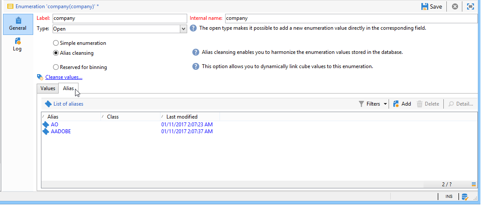

# Gerenciamento de enumerações{#managing-enumerations}

## Sobre enumerações {#about-enumerations}

Uma enumeração (também conhecida como &#39;lista discriminada&#39;) é uma lista de valores sugeridos pelo sistema para preencher certos campos. Enumerações permitem padronizar os valores desses campos e ajuda na entrada de dados ou no uso de queries.

A lista de valores aparece como uma lista suspensa na qual você pode selecionar o valor a ser inserido no campo. A lista suspensa também permite entrada preditiva, onde o operador insere as primeiras letras e o aplicativo preenche o restante.

Alguns dos campos do console foram definidos com esse tipo de enumerações. Enumerações são chamados “open” se você puder adicionar valores por entrada direta no campo correspondente.

## Acesso a valores {#access-to-values}

The values for this type of field are defined and overall administration of these fields (adding/deleting a value) is performed via the **[!UICONTROL Administration > Platform > Enumerations]** node of the tree.

* A seção superior oferece uma lista de campos para os quais uma lista discriminada foi definida.
* A seção inferior lista os valores propostos. Esses valores serão repetidos nos editores que usam este campo.

   

   To create a new enumeration value, click **[!UICONTROL Add]**.

   

   If the **[!UICONTROL Open]** option is selected, the user can add a new itemized list value directly in the corresponding field. Uma mensagem de confirmação permite criar esse valor.

   

* If the **[!UICONTROL Closed]** option is selected, users will not be able to create new values, but merely choose from the values available.

## Padronização de dados {#standardizing-data}

### Sobre a limpeza de alias {#about-alias-cleansing}

Nos campos de lista discriminada, é possível inserir valores diferentes dos valores de enumeração. Eles podem ser armazenados como são ou serem limpos.

>[!CAUTION]
>
>Limpeza de dados é um processo crítico que afeta os dados no banco de dados. O Adobe Campaign realiza atualizações de dados em massa, que podem levar à exclusão de alguns valores. Portanto, essa operação é reservada para usuários especialistas.

O valor inserido é então:

* Added to the itemized list values: in this case the **[!UICONTROL Open]** option must be selected,
* ou automaticamente substituída pelo respectivo alias correspondente: Nesse caso, esse caso deve ser definido na guia **[!UICONTROL Alias]** da lista discriminada,
* ou armazenado na lista de aliases: um alias será atribuído a ele posteriormente.

   >[!NOTE]
   >
   >If you need to use data cleansing capabilities, select the **[!UICONTROL Alias cleansing]** option in the itemized list.

### Uso de aliases {#using-aliases}

The option **[!UICONTROL Alias cleansing]** makes it possible to use aliases for the selected itemized list. When this option is selected, the **[!UICONTROL Alias]** tab is displayed at the bottom of the window.

#### Criação de um alias {#creating-an-alias}

To create an alias, click **[!UICONTROL Add]**.

Enter the alias you want to convert and the value to be applied and click **[!UICONTROL Ok]**.

Verifique os parâmetros antes de confirmar essa operação.

>[!CAUTION]
>
>Após confirmar esse estágio, os valores inseridos anteriormente não poderão ser recuperados: eles foram substituídos.

Assim, quando um usuário insere o valor **NEILSEN** em um campo “company” (no console do Adobe Campaign ou em um formulário), ele é substituído automaticamente pelo valor **NIELSEN Ltd**. O valor é substituído pelo workflow **Alias cleansing.** Consulte [Execução da limpeza](#running-data-cleansing)de dados.

#### Conversão de valores em aliases {#converting-values-into-aliases}

To convert an enumeration value into an alias, right-click in the list of values and choose **[!UICONTROL Convert values into aliases...]**.

Choose the values you want to convert and click **[!UICONTROL Next]**.

Click **[!UICONTROL Start]** to run the conversion.

Quando a execução for concluída, o alias será adicionado à lista de aliases.

#### Recuperação de ocorrências de alias {#retrieving-alias-hits}

Os valores inseridos pelos usuários podem ser convertidos em aliases. In effect, when the user enters a value that is not included in the itemized list, the value is stored in the **[!UICONTROL Alias]** tab.

O workflow técnico **Alias cleansing** recupera esses valores todas as noites para atualizar a lista discriminada. Consulte [Execução da limpeza de dados](#running-data-cleansing)

If necessary, the **[!UICONTROL Hits]** column can display the number of times this value was entered. O cálculo desse valor pode demorar e consumir memória. Para obter mais informações, consulte [Calculando ocorrências](#calculating-entry-occurrences)de entrada.

### Execução de limpeza de dados {#running-data-cleansing}

Data cleansing is performed by the **[!UICONTROL Alias cleansing]** technical workflow. As configurações definidas para enumerações são aplicadas durante a execução. Consulte Fluxo de trabalho de limpeza de [Alias](#alias-cleansing-workflow).

Cleansing can be triggered via the **[!UICONTROL Cleanse values...]** link.

The **[!UICONTROL Advanced parameters...]** link lets you set the date starting from which collected values are taken into account.

Click the **[!UICONTROL Start]** button to run data cleansing.

#### Cálculo das ocorrências de entrada {#calculating-entry-occurrences}

The **[!UICONTROL Alias]** sub-tab of an itemized list can display the number of occurrences of an alias among all the values entered. This information is an estimate and will be displayed in the **[!UICONTROL Hits]** column.

>[!CAUTION]
>
>O cálculo das ocorrências de entrada de alias pode demorar muito. É por isso que o usuário deve ter cuidado ao usar essa função.

You can run hit calculation manually via the **[!UICONTROL Cleanse values...]** link. To do this, click the **[!UICONTROL Advanced parameters...]** link and select the desired option(s).

* **[!UICONTROL Update the number of alias hits]**: isso permite atualizar ocorrências que já foram calculadas, com base na data inserida.
* **[!UICONTROL Recalculate the number of alias hits from the start]**: permite executar o cálculo em toda a plataforma do Adobe Campaign.

Você também pode criar um workflow dedicado para que o cálculo seja executado automaticamente em determinado período, uma vez por semana por exemplo.

To do this, create a copy of the **[!UICONTROL Alias cleansing]** workflow, change the scheduler and use the following settings in the **[!UICONTROL Enumeration value cleansing]** activity:

* **-updateHits** para atualizar o número de ocorrências de alias,
* **-updateHits:full** para recalcular todas as ocorrências de alias.

#### Workflow alias cleansing {#alias-cleansing-workflow}

O workflow **Alias cleansing** executa a limpeza do valor de enumerações. É executado diariamente por padrão.

É acessado pelo **[!UICONTROL Administration > Production > Technical workflows]** nó.

