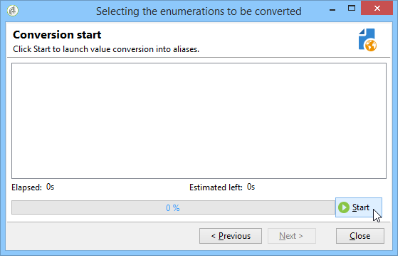

# Gerenciamento de enumerações{#managing-enumerations}

## Sobre enumerações {#about-enumerations}

Uma enumeração (também conhecida como &#39;lista discriminada&#39;) é uma lista de valores sugeridos pelo sistema para preencher certos campos. Enumerações permitem padronizar os valores desses campos e ajuda na entrada de dados ou no uso de queries.

A lista de valores aparece como uma lista suspensa na qual você pode selecionar o valor a ser inserido no campo. A lista suspensa também permite entrada preditiva, onde o operador insere as primeiras letras e o aplicativo preenche o restante.

Alguns dos campos do console foram definidos com esse tipo de enumerações. Enumerações são chamados “open” se você puder adicionar valores por entrada direta no campo correspondente.

## Acesso a valores {#access-to-values}

Os valores desse tipo de campo são definidos e a administração geral desses campos (adição/exclusão de um valor) é realizada por meio do nó **[!UICONTROL Administration > Platform > Enumerations]** da árvore.

* A seção superior oferece uma lista de campos para os quais uma lista discriminada foi definida.
* A seção inferior lista os valores propostos. Esses valores serão repetidos nos editores que usam este campo.

   

   Para criar um novo valor de enumeração, clique em **[!UICONTROL Add]**.

   

   Se a opção **[!UICONTROL Open]** for selecionada, o usuário poderá adicionar um novo valor de lista discriminada diretamente no campo correspondente. Uma mensagem de confirmação permite criar esse valor.

   

* Se a opção **[!UICONTROL Closed]** for selecionada, os usuários não poderão criar novos valores, mas apenas escolher entre os valores disponíveis.

## Padronização de dados {#standardizing-data}

### Sobre a limpeza de alias {#about-alias-cleansing}

Nos campos de lista discriminada, é possível inserir valores diferentes dos valores de enumeração. Eles podem ser armazenados como são ou serem limpos.

>[!CAUTION]
>
>Limpeza de dados é um processo crítico que afeta os dados no banco de dados. O Adobe Campaign realiza atualizações de dados em massa, que podem levar à exclusão de alguns valores. Portanto, essa operação é reservada para usuários especialistas.

O valor inserido é então:

* Adicionado aos valores da lista discriminada: nesse caso, a opção **[!UICONTROL Open]** deve ser selecionada,
* ou automaticamente substituído pelo seu alias correspondente: nesse caso, este caso deve ser definido na guia **[!UICONTROL Alias]** da lista discriminada,
* ou armazenado na lista de aliases: um alias será atribuído a ele posteriormente.

   >[!NOTE]
   >
   >Se precisar usar recursos de limpeza de dados, selecione a opção **[!UICONTROL Alias cleansing]** na lista discriminada.

### Uso de aliases {#using-aliases}

A opção **[!UICONTROL Alias cleansing]** possibilita o uso de aliases para a lista discriminada selecionada. Quando essa opção é selecionada, a guia **[!UICONTROL Alias]** é exibida na parte inferior da janela.

#### Criação de um alias {#creating-an-alias}

Para criar um alias, clique em **[!UICONTROL Add]**.

Insira o alias que você deseja converter e o valor a ser aplicado e clique em **[!UICONTROL Ok]**.

Verifique os parâmetros antes de confirmar essa operação.

>[!CAUTION]
>
>Após confirmar esse estágio, os valores inseridos anteriormente não poderão ser recuperados: eles foram substituídos.

Assim, quando um usuário insere o valor **NEILSEN** em um campo “company” (no console do Adobe Campaign ou em um formulário), ele é substituído automaticamente pelo valor **NIELSEN Ltd**. O valor é substituído pelo workflow **Alias cleansing.** Consulte [Execução de limpeza de dados](#running-data-cleansing).

#### Conversão de valores em aliases {#converting-values-into-aliases}

Para converter um valor de enumeração em um alias, clique com o botão direito do mouse na lista de valores e escolha **[!UICONTROL Convert values into aliases...]**.

Escolha os valores que deseja converter e clique em **[!UICONTROL Next]**.

Clique em **[!UICONTROL Start]** para executar a conversão.

Quando a execução for concluída, o alias será adicionado à lista de aliases.

#### Recuperação de ocorrências de alias {#retrieving-alias-hits}

Os valores inseridos pelos usuários podem ser convertidos em aliases. Efetivamente, quando o usuário insere um valor que não está incluído na lista discriminada, o valor é armazenado na guia **[!UICONTROL Alias]**.

O workflow técnico **Alias cleansing** recupera esses valores todas as noites para atualizar a lista discriminada. Consulte [Execução de limpeza de dados](#running-data-cleansing)

Se necessário, a coluna **[!UICONTROL Hits]** pode exibir o número de vezes que esse valor foi inserido. O cálculo desse valor pode demorar e consumir memória. Para obter mais informações, consulte [Cálculo das ocorrências de entrada](#calculating-entry-occurrences).

### Execução de limpeza de dados {#running-data-cleansing}

A limpeza de dados é realizada pelo workflow técnico **[!UICONTROL Alias cleansing]**. As configurações definidas para enumerações são aplicadas durante a execução. Consulte [Workflow de limpeza de alias](#alias-cleansing-workflow).

A limpeza pode ser acionada por meio do link **[!UICONTROL Cleanse values...]**.

O link **[!UICONTROL Advanced parameters...]** permite que você defina a data a partir da qual os valores coletados são considerados.

Clique no botão **[!UICONTROL Start]** para executar a limpeza de dados.

#### Cálculo das ocorrências de entrada {#calculating-entry-occurrences}

A subguia **[!UICONTROL Alias]** de uma lista discriminada pode exibir o número de ocorrências de um alias entre todos os valores inseridos. Essas informações são uma estimativa e serão exibidas na coluna **[!UICONTROL Hits]**.

>[!CAUTION]
>
>O cálculo das ocorrências de entrada de alias pode demorar muito. É por isso que o usuário deve ter cuidado ao usar essa função.

Você pode executar o cálculo de ocorrências manualmente pelo link **[!UICONTROL Cleanse values...]**. Para isto, clique no link **[!UICONTROL Advanced parameters...]** e selecione as opções desejadas.

* **[!UICONTROL Update the number of alias hits]**: permite atualizar as ocorrências já calculadas, com base na data inserida.
* **[!UICONTROL Recalculate the number of alias hits from the start]**: permite que você execute o cálculo em toda a plataforma do Adobe Campaign.

Você também pode criar um workflow dedicado para que o cálculo seja executado automaticamente em determinado período, uma vez por semana por exemplo.

Para fazer isso, crie uma cópia do workflow **[!UICONTROL Alias cleansing]**, altere o scheduler e use as seguintes configurações na atividade **[!UICONTROL Enumeration value cleansing]**:

* **-updateHits** para atualizar o número de ocorrências de alias,
* **-updateHits:full** para recalcular todas as ocorrências de alias.

#### Workflow alias cleansing {#alias-cleansing-workflow}

O workflow **Alias cleansing** executa a limpeza do valor de enumerações. É executado diariamente por padrão.

É acessado pelo nó **[!UICONTROL Administration > Production > Technical workflows]**.

