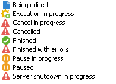

# Monitorar execução de processos {#monitoring-job-execution}

É possível rastrear a execução de processos de importação e exportação diretamente na lista de processos de importação/exportação.

* A guia **[!UICONTROL Journal]** permite visualizar mensagens de log relacionadas à execução.
* A guia **[!UICONTROL Rejects]** contém os registros rejeitados. Consulte [esta seção](../../platform/using/executing-import-jobs.md#behavior-in-the-event-of-an-error).

Na guia **[!UICONTROL General]**, o campo **[!UICONTROL Status]** indica o status atual de um processo.

Cada status é representado por um ícone e rótulo especiais. Os status e seus ícones estão listados abaixo:

* **Edição em progresso**

  O processo está sendo criado.

* **Execução em progresso**

  O processo está sendo executado.

* **Cancelar**

  Clique no botão **[!UICONTROL Cancel]**: o processo em andamento é cancelado.

* **Cancelamento em progresso**

  O comando de cancelamento foi considerado e o processo está sendo cancelado.

* **Pausa em progresso**

  Clique em **[!UICONTROL Pause]**: o processo está sendo suspenso.

* **Em pausa**

  Clique em **[!UICONTROL Pause]**: o processo é suspenso. Ele pode ser reiniciado clicando em **[!UICONTROL Start]**.

* **Concluído**

  A execução do processo foi concluída.

* **Concluído com erro**

  O processo não foi executado devido a um erro técnico.

* **Desligamento do servidor em progresso**

  O processo em andamento foi interrompido porque o servidor do Adobe Campaign foi desligado.
