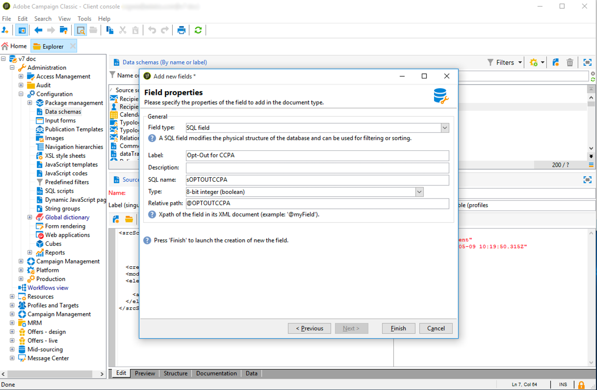
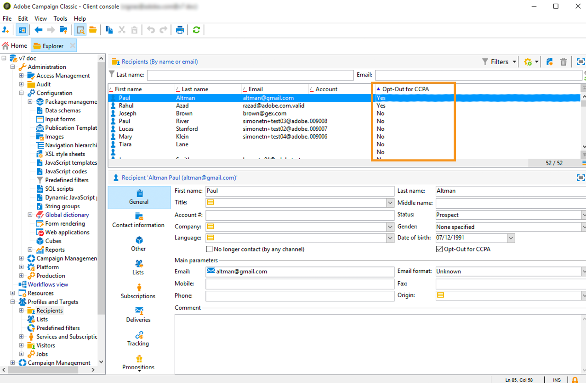

# Recusar a venda de informações pessoais (CCPA) {#sale-of-personal-information-ccpa}


Os **Direitos de privacidade do consumidor da Califórnia** (CCPA) fornecem aos residentes da Califórnia novos direitos no que diz respeito a suas informações pessoais e impõe responsabilidades de proteção de dados a determinadas entidades com negócios na Califórnia.

A configuração e utilização dos pedidos de acesso e exclusão são comuns. a GDPR e CCPA. Esta seção apresenta a opção de recusa da venda de dados pessoais, sendo específica ao CCPA.

Além das ferramentas de [Gestão do consentimento](privacy-management.md#consent-management) oferecidas pelo Adobe Campaign, você tem a possibilidade de monitorar a opção do cliente pela recusa da venda de informações pessoais.

Os contatos podem decidir, por meio de seu sistema, que não permitem que suas informações pessoais sejam vendidas a terceiros. No Adobe Campaign é possível armazenar e rastrear essas informações.

Para isso, é necessário estender a tabela Perfis e adicionar um campo **[!UICONTROL Opt-Out for CCPA]**.

>[!IMPORTANT]
>
>É sua responsabilidade como Controlador de dados receber a solicitação do Titular de dados e rastrear os dados da solicitação para CCPA. Como provedor de tecnologia, oferecemos somente uma maneira de recusar a participação. Para obter mais informações sobre sua função como Controlador de dados, consulte [Dados pessoais e Personalidades](privacy-and-recommendations.md#personal-data).

## Pré-requisito {#ccpa-prerequisite}

Para usufruir dessa informação, é necessário criar esse campo no Adobe Campaign Classic. Para isso, você adicionará um campo booleano à tabela **[!UICONTROL Recipient]**. Quando um campo é criado, ele se torna automaticamente compatível com a API do Campaign.

Se você usar uma tabela de recipient personalizada, também precisará executar essa operação.

Para obter mais informações sobre como criar um novo campo, consulte a [documentação sobre adição de schema](../../configuration/using/about-schema-edition.md).

>[!IMPORTANT]
>
>A modificação de esquemas é uma operação sensível que deve ser executada somente por usuários especialistas.

1. Acesse **[!UICONTROL Tools]** > **[!UICONTROL Advanced]** > **[!UICONTROL Add new fields]**, selecione **[!UICONTROL Recipients]** como **[!UICONTROL Document type]** e clique em **[!UICONTROL Next]**. Para obter mais informações sobre como adicionar campos a uma tabela, consulte [esta seção](../../configuration/using/new-field-wizard.md).

   

1. Para o **[!UICONTROL Field type]**, selecione **[!UICONTROL SQL field]**. Para o Rótulo, use **[!UICONTROL Opt-Out for CCPA]**. Selecione o tipo **[!UICONTROL 8-bit integer (boolean)]** e defina o seguinte único **[!UICONTROL Relative path]**: @OPTOUTCCPA. Clique em **[!UICONTROL Finish]**.

   

   Isso estenderá ou criará o esquema **[!UICONTROL Recipient (cus)]**. Clique para verificar se o campo foi adicionado corretamente.

   

1. Clique no nó **[!UICONTROL Configuration]** > **[!UICONTROL Input forms]** do explorador. Em **[!UICONTROL Recipient (nms)]**, em “Pacote geral”, adicione um elemento `<input>` e use, para o valor xpath, o caminho relativo definido na etapa 2. Para obter mais informações sobre identificação de formulário, consulte [esta seção](../../configuration/using/identifying-a-form.md).

   ```
   <input  colspan="2" type="checkbox" xpath="@OPTOUTCCPA"/>
   ```

   

1. Desconecte e reconecte. Siga as etapas descritas na próxima seção para verificar se o campo está disponível nos detalhes do recipient.

## Uso {#usage}

É de responsabilidade do Controlador de dados preencher os valores do campo e seguir as diretrizes e regras do CCPA que dizem respeito à venda.

Para preencher os valores, vários métodos podem ser utilizados:

* Usar a interface do Campaign ao editar os detalhes do recipient
* Uso da API
* Através de um fluxo de trabalho de importação

Você deve garantir que nunca venderá a terceiros as informações pessoais de perfis que recusaram a adesão.

1. Para alterar o status de recusa, acesse **[!UICONTROL Profiles and Target]** > **[!UICONTROL Recipients]** e selecione um recipient. Na guia **[!UICONTROL General]**, você verá o campo configurado na seção anterior.

   

1. Configure a lista de recipients para exibir a coluna de recusas. Para saber como configurar a lista, consulte a [documentação detalhada](../../platform/using/adobe-campaign-workspace.md#configuring-lists).

   

1. Você pode clicar na coluna para classificar recipients de acordo com as informações de recusa. Você também pode criar um filtro para exibir somente os recipients que tenham optado por não participar. Para obter mais informações sobre a criação de filtros, consulte [esta seção](../../platform/using/creating-filters.md).

   
