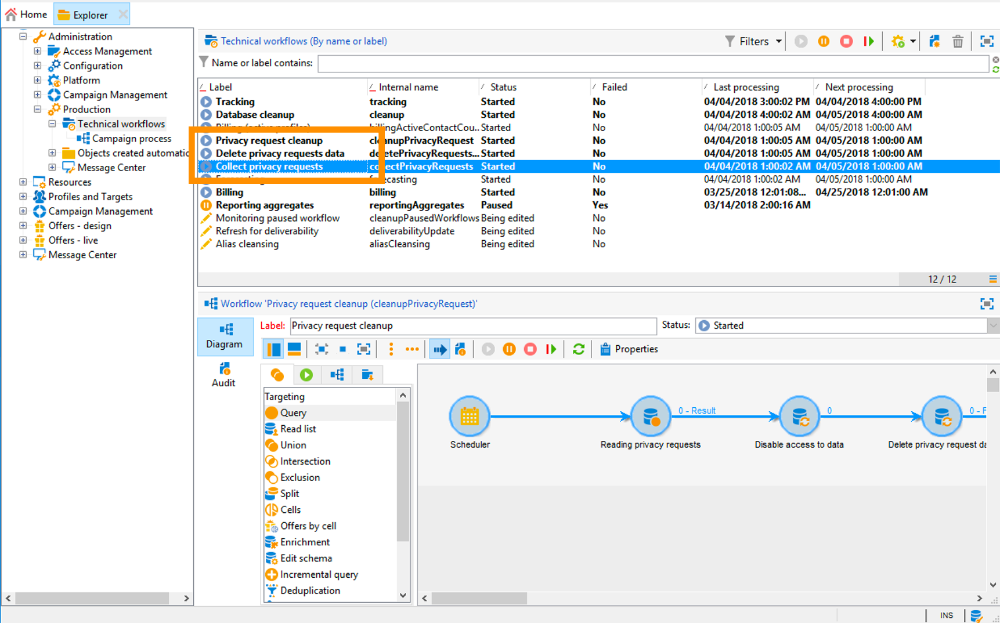

# Gerenciamento de solicitações de privacidade {#privacy-requests}

For a general presentation on Privacy Management, refer to [this section](../../platform/using/privacy-management.md).

Essa informação se aplica a GDPR, CCPA, PDPA e LGPD. Para obter mais informações sobre esses requisitos, consulte [esta seção](../../platform/using/privacy-management.md#privacy-management-regulations).

The opt-out for the Sale of Personal Information, which is specific to CCPA, is explained in [this section](#sale-of-personal-information-ccpa).

>[!IMPORTANT]
>
>Os procedimentos de instalação descritos neste documento são aplicáveis a partir do Campaign Classic 18.4 (build 8931+). If you are running on a previous version, refer to this [technote](https://helpx.adobe.com/br/campaign/kb/how-to-install-gdpr-package-on-legacy-versions.html).

## Sobre as solicitações de privacidade {#about-privacy-requests}

Para ajudá-lo a facilitar sua prontidão para Privacidade, a Adobe Campaign permite que você manipule solicitações de Acesso e Exclusão. O **direito de acesso** e o **direito de ser esquecido** (excluir solicitação) estão descritos [nesta seção](../../platform/using/privacy-management.md#right-access-forgotten).

Vamos ver como você pode criar solicitações de acesso e exclusão, bem como como como a Adobe Campaign as processa.

### Princípios {#principles}

O Adobe Campaign oferece aos controladores de dados duas possibilidades para executar solicitações de acesso e exclusão de privacidade:

* Via the **Adobe Campaign interface**: for each Privacy request, the Data Controller creates a new privacy request in Adobe Campaign. Consulte [esta seção](#create-privacy-request-ui).
* Via the **API**: Adobe Campaign provides an API that allows the automatic process of Privacy requests using SOAP. Consulte [esta seção](#automatic-privacy-request-api).

>[!NOTE]
>
>Para obter mais informações sobre dados pessoais e as diferentes entidades que gerenciam os dados (Controlador de dados, Operador de dados e Titular de dados), consulte [Dados pessoais e Personalidades](../../platform/using/privacy-and-recommendations.md#personal-data).

### Pré-requisitos {#prerequesites}

Adobe Campaign oferta Data Controllers ferramentas para criar e processar solicitações de Privacidade para dados armazenados no Adobe Campaign. No entanto, é responsabilidade do Controlador de dados gerenciar o relacionamento com o Titular de dados (email, atendimento ao cliente ou um portal da web).

É sua responsabilidade como Controlador de dados confirmar a identidade do Titular de dados que faz a solicitação e pede a confirmação de que os dados retornados ao solicitante pertençam ao Titular de dados.

### Installing the Privacy package {#install-privacy-package}

Para usar esse recurso, é necessário instalar o **[!UICONTROL Privacy Data Protection Regulation]** pacote pelo menu **[!UICONTROL Tools]** > **[!UICONTROL Advanced]** > **[!UICONTROL Import package]** > **[!UICONTROL Adobe Campaign Package]** . Para obter mais informações sobre como instalar pacotes, consulte a documentação [](../../installation/using/installing-campaign-standard-packages.md)detalhada.

Duas novas pastas, específicas para Privacidade, são criadas em **[!UICONTROL Administration]** > **[!UICONTROL Platform]**:

* **[!UICONTROL Privacy Requests]**: é aqui que você criará suas solicitações de Privacidade e rastreará sua evolução.
* **[!UICONTROL Namespaces]**: é aqui que você definirá o campo que será usado para identificar a pessoa de dados no banco de dados da Adobe Campaign.


Em **[!UICONTROL Administration]** > **[!UICONTROL Production]** > **[!UICONTROL Technical workflows]**, três workflows técnicos são executados diariamente para processar solicitações de Privacidade.



* **[!UICONTROL Collect privacy requests]**: esse fluxo de trabalho gera os dados do recipient armazenados no Adobe Campaign e os torna disponíveis para download na tela da solicitação de privacidade.
* **[!UICONTROL Delete privacy requests data]**: esse fluxo de trabalho exclui os dados do recipient armazenados no Adobe Campaign.
* **[!UICONTROL Privacy request cleanup]**: esse fluxo de trabalho apaga os arquivos de solicitação de acesso com mais de 90 dias.

Em **[!UICONTROL Administration]** > **[!UICONTROL Access Management]** > **[!UICONTROL Named rights]**, o direito **[!UICONTROL Privacy Data Right]** nomeado foi adicionado. Esse direito nomeado é necessário para que os Controladores de dados possam usar as ferramentas de privacidade. Isso permite que eles criem novas solicitações, rastreiem sua evolução, usem a API etc.


### Namespaces {#namesspaces}

Antes de criar solicitações de Privacidade, é necessário definir a namespace que será usada. Essa é a chave que será usada para identificar o indivíduo de dados no banco de dados da Adobe Campaign.

Três namespaces estão disponíveis para pronta utilização: email, telefone fixo e celular. Se você precisar de uma namespace diferente (um campo personalizado de recipient, por exemplo), poderá criar uma nova  em **[!UICONTROL Administration]** > **[!UICONTROL Platform]** > **[!UICONTROL Namespaces]**.

## Criação de uma solicitação de acesso a dados pessoais {#create-privacy-request-ui}

The **Adobe Campaign interface** allows you to create your Privacy requests and track their evolution. Para criar uma nova solicitação de privacidade, siga estas instruções:

1. Acesse a pasta Solicitação de privacidade em **[!UICONTROL Administration]** > **[!UICONTROL Platform]** > **[!UICONTROL Privacy Requests]**.

   

1. Esta tela permite que você visualização todas as solicitações de Privacidade atuais, seu status e registros. Clique em **[!UICONTROL New]** para criar uma solicitação de privacidade.

   

1. Selecione **[!UICONTROL Regulation]** (RGPD, CCPA, PDPA ou LGPD), **[!UICONTROL Request type]** (Access or Delete), selecione um **[!UICONTROL Namespace]** e insira o **[!UICONTROL Reconciliation value]**. Se estiver usando o email como namespace, digite o email da pessoa de dados.

   

Os workflows técnicos de privacidade são executados uma vez todos os dias e processam cada nova solicitação:

* Solicitação de exclusão: esse fluxo de trabalho exclui os dados do destinatário armazenados no Adobe Campaign.
* Solicitações de acesso: os dados do destinatário armazenados no Adobe Campaign são gerados e disponibilizados como um arquivo XML na parte esquerda da tela de solicitação.


### Lista de tabelas {#list-of-tables}

Ao executar uma solicitação de privacidade de exclusão ou acesso, a Adobe Campaign pesquisa todos os dados da pessoa de dados com base nos dados em todas as tabelas que têm um link para a tabela do recipient (tipo próprio). **[!UICONTROL Reconciliation value]**

Esta é a lista de tabelas prontas que são levadas em conta ao executar solicitações de Privacidade:

* Recipient (recipient)
* Registro de delivery de recipient (wideLogRcp)
* Registro de rastreamento de recipient (trackingLogRcp)
* Registro de delivery de eventos arquivados (wideLogEventHisto)
* Conteúdo da lista do recipient (rcpGrpRel)
* Apresentação da oferta do visitante (propositionVisitor)
* Visitantes (visitante)
* Histórico de subscrições (subHisto)
* Subscrição (subscrição)
* Apresentação da oferta do recipient (propositionRcp)

Se você criou tabelas personalizadas que têm um link para a tabela do recipient (tipo próprio), elas também serão consideradas. Por exemplo, se você tiver uma tabela de transações vinculada à tabela do recipient e uma tabela de detalhes da transação vinculada à tabela de transações, ambas serão levadas em conta.

>[!IMPORTANT]
>
>Se você executar solicitações em lote de privacidade usando workflows de exclusão de perfis, considere as seguintes observações:
>* A exclusão de perfis por meio de workflows não processa tabelas secundárias.
>* Você precisa lidar com a exclusão de todas as tabelas secundárias.
>* O Adobe recomenda que você crie um fluxo de trabalho ETL que adicione as linhas a serem excluídas na tabela Acesso de privacidade e permita que o usuário **[!UICONTROL Delete privacy requests data]** execute a exclusão. Sugerimos limitar a 200 perfis por dia para excluir por motivos de desempenho.


### Status de solicitação de privacidade {#privacy-request-statuses}

Estes são os diferentes status das solicitações de Privacidade:

* **[!UICONTROL New]** / **[!UICONTROL Retry pending]**: em andamento, o fluxo de trabalho ainda não processou a solicitação.
* **[!UICONTROL Processing]** / **[!UICONTROL Retry in progress]**: o fluxo de trabalho está processando a solicitação.
* **[!UICONTROL Delete pending]**: o fluxo de trabalho identificou todos os dados do recipient a serem excluídos.
* **[!UICONTROL Delete in progress]**: o fluxo de trabalho está processando a exclusão.
* **[!UICONTROL Delete Confirmation Pending]** (Excluir solicitação no modo de processo de duas etapas): o fluxo de trabalho processou a solicitação de Acesso. A confirmação manual é solicitada para executar a exclusão. O botão está disponível por 15 dias.
* **[!UICONTROL Complete]**: o processamento da solicitação foi concluído sem um erro.
* **[!UICONTROL Error]**: o fluxo de trabalho encontrou um erro. The reason appears in the list of Privacy requests in the **[!UICONTROL Request status]** column. Por exemplo, **[!UICONTROL Error data not found]** significa que nenhum dado de recipient correspondente aos dados da pessoa de dados **[!UICONTROL Reconciliation value]** foi encontrado no banco de dados.

### Processo de duas etapas {#two-step-process}

By default, the **2-step process** is activated. Quando você cria uma nova solicitação de exclusão usando esse modo, a Adobe Campaign sempre executa uma solicitação de acesso primeiro. Isso permite que você verifique os dados antes de confirmar a exclusão.

Você pode alterar esse modo da tela de edição de solicitação de privacidade. Clique em **[!UICONTROL Advanced settings]**.


With the 2-step mode activated, the status of a new Delete request changes to **[!UICONTROL Confirm Delete Pending]**. Baixe o arquivo XML gerado na tela de solicitação de privacidade e verifique os dados. Para confirmar a apagar os dados, clique no **[!UICONTROL Confirm delete data]** botão.


### URL JSSP {#jspp-url}

Ao processar solicitações do Access, a Adobe Campaign gera um JSSP que recupera os dados do recipient do banco de dados e os exporta para um arquivo XML armazenado no computador local. O URL JSSP é definido como abaixo:

```
"$(serverUrl)+'/nms/gdpr.jssp?id='+@id"
```

onde @id é a ID da solicitação de privacidade.

Esse URL é armazenado no **[!UICONTROL "File location" (@urlFile)]** campo do **[!UICONTROL Privacy Requests (gdprRequest)]** schema.

As informações estão disponíveis no banco de dados por 90 dias. Depois que a solicitação é limpa pelo fluxo de trabalho técnico, as informações são removidas do banco de dados e o URL torna-se obsoleto. Verifique se o URL ainda é válido antes de baixar os dados de uma página da Web.

Este é um exemplo de um arquivo de dados de uma pessoa de dados:


Os controladores de dados podem criar facilmente um aplicativo da Web, incluindo o URL JSSP correspondente, para disponibilizar o arquivo de dados da pessoa de dados de uma página da Web.


Este é um trecho de código que você pode usar como exemplo na **[!UICONTROL Page]** atividade do aplicativo da Web.


```
<!DOCTYPE html PUBLIC "-//W3C//DTD XHTML 1.0 Transitional//EN" "http://www.w3.org/TR/xhtml1/DTD/xhtml1-transitional.dtd"> <html xmlns="http://www.w3.org/1999/xhtml"> <head> <meta http-equiv="Content-Language" content="en"> <meta http-equiv="Content-Type" content="text/html; charset=utf-8" /> <link rel="stylesheet" type="text/css" href="/nl/webForms/landingPage.css"/> <title>Clickthrough</title> <style type="text/css" media="all"> /* override formulary area */ .formulary { top: 200px; position: absolute; left: 0; } </style> </head> <body style="" class="">
<center>
<div id="wrap">
<div id="header">
<div class="header-title center-title">DOWNLOAD GDPR DATA</div>
<div class="formulary center-formulary"><form>
<div class="button large-button"><a href=[SERVER_URL]/nms/gdpr.jssp?id=13000" data-nl-type="externalLink">CLICK TO DOWNLOAD</a></div>
</form></div>
</div>
<div id="content">
<div class="row">
<div class="info">
<div class="desc">
<div class="title">EFFICIENCY</div>
<div class="desc">Our service is guaranteed to improve your efficiency. Increase performance and use our high-technology service to implement even the most ambitious of projects.</div>
</div>
</div>
</div>
</div>
<div id="footer">
<div style="text-align: center;">
<div style="float: left;"><a href="#">Contact us</a></div>
<div style="float: right;">&copy; Copyrights</div>
<div><a href="#"></a> <a href="#"></a> <a href="#"></a> <a href="#"></a></div>
</div>
</div>
</div>
</center>
</body> </html>
```

Como o acesso ao arquivo de dados da pessoa de dados é restrito, o acesso anônimo à página da Web deve ser desativado. Somente o operador com o direito **[!UICONTROL Privacy Data Right]** nomeado pode fazer logon na página e baixar os dados.

## Processo de solicitação de privacidade automática {#automatic-privacy-request-api}

A Adobe Campaign fornece uma **API** que permite configurar um processo automático de solicitação de privacidade.

Com a API, o processo de Privacidade geral é o mesmo que [usar a interface](#create-privacy-request-ui). A única diferença é a criação da solicitação de Privacidade. Em vez de criar a solicitação no Adobe Campaign, um POST contendo as informações da solicitação é enviado para o Campaign. Para cada solicitação, uma nova entrada é adicionada na **[!UICONTROL Privacy Requests]** tela. Os workflows técnicos de privacidade processam a solicitação, da mesma forma que uma solicitação adicionada usando a interface.

If you&#39;re using the API to submit Privacy requests, we recommend that you leave the **2-step process** activated for the first Delete requests, in order to test the returned data. Quando os testes forem concluídos, você poderá desativar o processo de duas etapas para que o processo de solicitação Excluir possa ser executado automaticamente.

The **[!UICONTROL CreateRequestByName]** JS API is defined as follows.

>[!NOTE]
>
>Se você estava usando a API **gdprRequest**, ainda é possível usá-la, mas é recomendável usar a nova API **privacyRequest** .

>[!IMPORTANT]
>
>O direito **[!UICONTROL Privacy Data Right]** nomeado é necessário para usar a API.

```
<method library="nms:gdpr.js" name="CreateRequestByName" static="true">
 <help>Create a new GDPR Request using namespace internal name</help>
 <parameters>
  <param name="namespaceName" type="string" desc="Namespace internal name"/>
  <param name="reconciliationValue" type="string" desc="Reconciliation value"/>
  <param name="type" type="long" desc="Reconciliation value"/>
  <param name="confirmDeletePending" type="boolean" desc="Request confirm before deleting data"/>
  <param name="regulation" type="long" desc="regulation of newly created request"/>
  <param name="id" type="long" inout="out" desc="ID of newly created request"/>
 </parameters>
</method>
```

>[!NOTE]
>
>O campo &quot;Regulation&quot; só estará disponível no Campaign Classic 20.2 (build 9178+).
>
>Se você estiver migrando para a versão 20.2 e já estiver usando a API, precisará adicionar o campo &quot;regulation&quot;, como mostrado acima. Se você estiver usando uma build anterior, poderá continuar a usar a API sem o campo &quot;regulation&quot;.

### Chamada de API externamente {#invoking-api-externally}

Este é um exemplo de como chamar a API externamente (autenticação por meio da API e detalhes específicos sobre a API de privacidade). Para obter mais informações sobre a API de privacidade, consulte a documentação [da](https://docs.adobe.com/content/help/en/campaign-classic/technicalresources/api/s-nms-privacyRequest.html)API. Você também pode consultar a documentação [de chamadas de serviço](../../configuration/using/web-service-calls.md)da Web.

Primeiro, é necessário executar a autenticação por meio da API:

1. Baixe o **xtk:session** WSDL por meio deste url: **`<server url>`/nl/jsp/schemawsdl.jsp?schema=xtk:sessão**.

1. Use o método &quot;Logon&quot; e passe um nome de usuário e senha como parâmetros na solicitação. Você receberá uma resposta contendo um token de sessão. Este é um exemplo de uso do SoapUI.

   

1. Use o token de sessão retornado como autenticação para todas as chamadas de API subsequentes. Ela expira após 24 horas.

Em seguida, chame a API de privacidade:

1. Download the WSDL from this URL: **`<server url>`/nl/jsp/schemawsdl.jsp?schema=nms:privacyRequest**.

1. Use **[!UICONTROL CreateRequestByName]** to create a specific Privacy request.

   Veja um exemplo de uso de **[!UICONTROL CreateRequestByName]**. Observe como usamos o token de sessão fornecido acima como autenticação. A resposta é a ID da solicitação criada.

   

   Para ajudá-lo a executar as etapas acima, considere o seguinte:

   * You can use a **queryDef** on the **nms:gdprRequest** schema to check the status of the Access request.
   * You can use a **queryDef** on the **nms:gdprRequestData** schema to get the result of the Access request.
   * To be able to download the XML file from **&quot;$(serverUrl)&#39;/nms/gdpr.jssp?id=&#39;@id&quot;**, you must be logged in and accessing it from a whitelisted IP. Para fazer isso, crie um aplicativo da Web que permita acessar o arquivo gerado pelo JSSP.

### Invocar a API de um JS {#invoking-api-from-js}

Este é um exemplo de como você pode chamar a API de um JS dentro do Campaign Classic.

>[!NOTE]
>
>O campo “Regulation” só estará disponível no Campaign Classic 20.2 (build 9178+).
>
>Se você estiver migrando para a versão 20.2 e já estiver usando a API, precisará adicionar o campo “regulation”. Se você estiver usando uma build anterior, poderá continuar a usar a API sem o campo “regulation”.

* If you are **using a previous build (with GDPR package)**, you can continue to use the API without the ‘regulation’ field as shown below:

   ```
   loadLibrary("nms:gdpr.js");
   /**************************** 
   This code calls an API to create new Privay request on the DB.
   It requires 4 parameters below.
   Feel free to change parameter values.
   ****************************/
   // 1. Namespace internal name
   var namespaceName = "defaultNamespace1";
   // 2. Reconciliation value for privacy request
   var reconciliationValue = "example@adobe.com";
   // 3. Privacy request type
   // GDPR_REQUEST_TYPE_ACCESS = 1;
   // GDPR_REQUEST_TYPE_DELETE = 2;
   var requestType = GDPR_REQUEST_TYPE_ACCESS;
   // 4. Confirm deleting data required.
   // value : true or false
   var ConfirmDeletePending = true;
   // BEGIN
   var requestId = nms.privacyRequest.CreateRequestByName(namespaceName, reconciliationValue, requestType, ConfirmDeletePending);
   // User can use a simple queryDef with requestID as a parameter to check request status.
   ```

* If you are **migrating to 20.2** and if you were already using the API, you must add the ‘regulation’ field as shown below:

   ```
   loadLibrary("nms:gdpr.js");
   /**************************** 
   This code calls an API to create new Privay request on the DB.
   It requires 5 parameters below.
   Feel free to change parameter values.
   ****************************/
   // 1. Namespace internal name
   var namespaceName = "defaultNamespace1";
   // 2. Reconciliation value for privacy request
   var reconciliationValue = "example@adobe.com";
   // 3. Privacy request type
   // PRIVACY_REQUEST_TYPE_ACCESS = 1;
   // PRIVACY_REQUEST_TYPE_DELETE = 2;
   var requestType = PRIVACY_REQUEST_TYPE_ACCESS;
   // 4. Confirm deleting data required.
   // value : true or false
   var ConfirmDeletePending = true;
   // 5. Specify which regulation applies to newly created request. This is mandatory parameter.
   // GDPR = 1
   // CCPA = 2
   // PDPA = 3
   // LGPD = 4
   var regulation = 1;
   // BEGIN
   var requestId = nms.privacyRequest.CreateRequestByName(namespaceName, reconciliationValue, requestType, ConfirmDeletePending, regulation);
   // User can use a simple queryDef with requestID as a parameter to check request status.
   ```

* If you are **using Campaign Classic 20.2 (build 9178+) or above**, the &#39;regulation&#39; field is optional, as shown below:

   ```
   loadLibrary("nms:gdpr.js");
   /**************************** 
   This code calls an API to create new Privay request on the DB.
   It requires 5 parameters below.
   Feel free to change parameter values 
   ****************************/
   // 1. Namespace internal name
   var namespaceName = "defaultNamespace1";
   // 2. Reconciliation value for privacy request
   var reconciliationValue = "example@adobe.com";
   // 3. Privacy request type
   // PRIVACY_REQUEST_TYPE_ACCESS = 1;
   // PRIVACY_REQUEST_TYPE_DELETE = 2;
   var requestType = PRIVACY_REQUEST_TYPE_ACCESS;
   // 4. Confirm deleting data required.
   // value : true or false
   var ConfirmDeletePending = true;
   // 5. Specify which regulation applies to newly created request. This is optional parameter.
   // GDPR = 1
   // CCPA = 2
   // PDPA = 3
   // LGPD = 4
   var regulation = 1;
   // BEGIN
   var requestId = nms.privacyRequest.CreateRequestByName(namespaceName, reconciliationValue, requestType, ConfirmDeletePending, regulation);
   // User can use a simple queryDef with requestID as a parameter to check request status.
   ```

## Recusar a venda de informações pessoais (CCPA) {#sale-of-personal-information-ccpa}

The **California Consumer Privacy Act** (CCPA) provides California residents new rights in regards to their personal information and imposes data protection responsibilities on certain entities whom conduct business in California.

A configuração e utilização dos pedidos de acesso e exclusão são comuns. a GDPR e CCPA. Esta seção apresenta a opção de não participação na venda de dados pessoais, que é específica da CCPA.

In addition to the [Consent management](../../platform/using/privacy-management.md#consent-management) tools provided by Adobe Campaign, you have the possibility to track whether a consumer has opted-out for the sale of Personal Information.

Um cliente decide, por meio do sistema, que não permite que suas informações pessoais sejam vendidas para terceiros. No Adobe Campaign, você poderá armazenar e rastrear essas informações.

For this to work, you need to extend the Profiles table and add an **[!UICONTROL Opt-Out for CCPA]** field.

>[!IMPORTANT]
>
>É sua responsabilidade como o Controlador de dados receber a solicitação da pessoa de dados e rastrear as datas da solicitação para CCPA. Como provedor de tecnologia, só oferecemos uma maneira de optar por não participar. Para obter mais informações sobre sua função como Controlador de dados, consulte Dados [pessoais e Personas](../../platform/using/privacy-and-recommendations.md#personal-data).

### Pré-requisito {#ccpa-prerequisite}

Para aproveitar essas informações, é necessário criar esse campo no Adobe Campaign Classic. Para isso, você adicionará um campo booleano à **[!UICONTROL Recipient]** tabela. Quando um campo é criado, ele se torna automaticamente compatível com a API do Campaign.

Se você usar uma tabela de recipient personalizada, também precisará executar essa operação.

Para obter mais informações sobre como criar um novo campo, consulte a [documentação sobre adição de schema](../../configuration/using/about-schema-edition.md).

>[!IMPORTANT]
>
>Modificar schemas é uma operação sensível que deve ser executada somente por usuários especialistas.

1. Vá até **[!UICONTROL Tools]** > **[!UICONTROL Advanced]** > **[!UICONTROL Add new fields]**, selecione **[!UICONTROL Recipients]** como o **[!UICONTROL Document type]** e clique em **[!UICONTROL Next]**. For more on adding fields to a table, see [this section](../../configuration/using/new-field-wizard.md).

   

1. For the **[!UICONTROL Field type]**, select **[!UICONTROL SQL field]**. Para o Rótulo, use **[!UICONTROL Opt-Out for CCPA]**. Selecione o **[!UICONTROL 8-bit integer (boolean)]** tipo e defina o seguinte **[!UICONTROL Relative path]**: @OPTOUTCCPA. Clique em **[!UICONTROL Finish]**.

   

   Isso estenderá ou criará o **[!UICONTROL Recipient (cus)]** schema. Clique para verificar se o campo foi adicionado corretamente.

   

1. Clique no nó **[!UICONTROL Configuration]** > **[!UICONTROL Input forms]** do explorador. Em **[!UICONTROL Recipient (nms)]**, em &quot;Pacote geral&quot;, adicione um `<input>` elemento e use, para o valor xpath, o caminho relativo definido na etapa 2. For more on identifying a form, see [this section](../../configuration/using/identifying-a-form.md).

   ```
   <input  colspan="2" type="checkbox" xpath="@OPTOUTCCPA"/>
   ```

   

1. Desconecte e reconecte. Siga as etapas descritas na próxima seção para verificar se o campo está disponível nos detalhes do recipient.

### Uso {#usage}

É responsabilidade do Controlador de dados preencher o valor do campo e seguir as diretrizes e regras da CCPA relativas à venda de dados.

Para preencher os valores, vários métodos podem ser utilizados:

* Usar a interface do Campaign ao editar os detalhes do recipient
* Uso da API
* Através de um fluxo de trabalho de importação

Você deve então garantir que nunca vende a terceiros as informações pessoais de perfis que recusaram a adesão.

Para alterar o status de não participação, vá até **[!UICONTROL Profiles and Target]** > **[!UICONTROL Recipients]** e selecione um recipient. Na **[!UICONTROL General]** guia, você verá o campo configurado na seção anterior.


Configure a lista de recipient para exibir a coluna de saída. Para saber como configurar o lista, consulte a documentação [](../../platform/using/adobe-campaign-workspace.md#configuring-lists)detalhada.


Você pode clicar na coluna para classificar recipient de acordo com as informações de não participação. Você também pode criar um filtro para exibir somente recipient que tenham optado por não participar. For more on creating filters, see [this section](../../platform/using/creating-filters.md).


