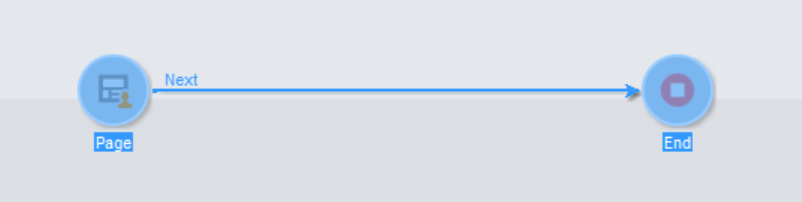
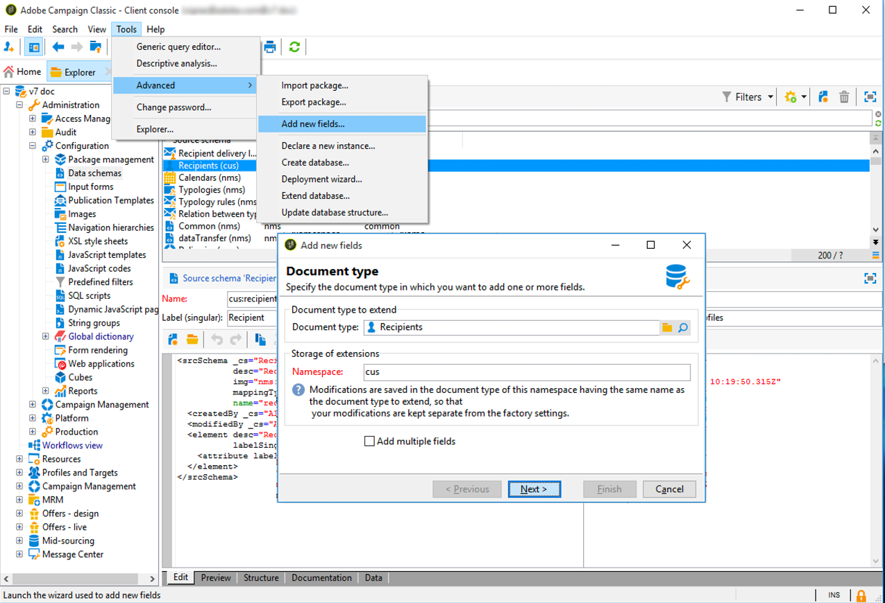

# Gerenciamento de solicitações de privacidade {#privacy-requests}


Para a apresentação geral sobre o Gerenciamento de privacidade, consulte [esta seção](../../platform/using/privacy-management.md).

Essa informação se aplica a GDPR, CCPA, PDPA e LGPD. Para obter mais informações sobre esses requisitos, consulte [esta seção](../../platform/using/privacy-management.md#privacy-management-regulations).

A recusa pela venda de informações pessoais, específica para o CCPA, é explicada nesta [seção](#sale-of-personal-information-ccpa).

<!--Installation procedures described in this document are applicable starting Campaign Classic 18.4 (build 8931+). If you are running on a previous version, refer to this [technote](https://helpx.adobe.com/campaign/kb/how-to-install-gdpr-package-on-legacy-versions.html).-->

## Sobre solicitações de privacidade {#about-privacy-requests}

Para facilitar a conformidade com a privacidade, o Adobe Campaign permite manipular solicitações de Acesso e Exclusão. O **direito de acesso** e o **direito ao esquecimento** (solicitação de exclusão) estão descritos [nesta seção](../../platform/using/privacy-management.md#right-access-forgotten).

Vamos ver como criar solicitações de Acesso e Exclusão e como elas são processadas pelo Adobe Campaign.

### Princípios {#principles}

O Adobe Campaign oferece aos controladores de dados duas possibilidades para executar solicitações de acesso e exclusão de privacidade:

* Na **interface do Adobe Campaign**: a cada solicitação de privacidade, o controlador de dados cria uma nova solicitação de privacidade no Adobe Campaign. Consulte [esta seção](#create-privacy-request-ui).
* Pela **API**: o Adobe Campaign fornece uma API que permite o processo automático de solicitações de privacidade usando SOAP. Consulte [esta seção](#automatic-privacy-request-api).

>[!NOTE]
>
>Para obter mais informações sobre dados pessoais e as diferentes entidades que gerenciam os dados (Controlador de dados, Operador de dados e Titular de dados), consulte [Dados pessoais e Personalidades](../../platform/using/privacy-and-recommendations.md#personal-data).

### Pré-requisitos {#prerequesites}

O Adobe Campaign oferece ferramentas de Controladores de dados para criar e processar solicitações de privacidade de dados armazenados no Adobe Campaign. No entanto, é responsabilidade do Controlador de dados gerenciar o relacionamento com o Titular de dados (email, atendimento ao cliente ou um portal da web).

É sua responsabilidade como Controlador de dados confirmar a identidade do Titular de dados que faz a solicitação e pede a confirmação de que os dados retornados ao solicitante pertençam ao Titular de dados.

### Instalação do pacote de privacidade {#install-privacy-package}

Para usar esse recurso, é necessário instalar o **[!UICONTROL Privacy Data Protection Regulation]** pacote através do menu **[!UICONTROL Tools]** > **[!UICONTROL Advanced]** > **[!UICONTROL Import package]** > **[!UICONTROL Adobe Campaign Package]**. Para obter mais informações sobre instalação de pacotes, consulte a [documentação detalhada](../../installation/using/installing-campaign-standard-packages.md).

Duas novas pastas, específicas para a privacidade, foram criadas em **[!UICONTROL Administration]** > **[!UICONTROL Platform]**:

* **[!UICONTROL Privacy Requests]**: é aqui que você irá criar suas solicitações de privacidade e rastreará sua evolução.
* **[!UICONTROL Namespaces]**: é aqui que você irá definir o campo que será usado para identificar o Titular de dados no banco de dados do Adobe Campaign.


Em **[!UICONTROL Administration]** > **[!UICONTROL Production]** > **[!UICONTROL Technical workflows]**, três workflows técnicos são executados diariamente para processar solicitações de privacidade.


* **[!UICONTROL Collect privacy requests]**: esse workflow gera os dados do recipient armazenados no Adobe Campaign e o disponibiliza para download na tela da solicitação de privacidade.
* **[!UICONTROL Delete privacy requests data]**: esse workflow exclui os dados do recipient armazenados no Adobe Campaign.
* **[!UICONTROL Privacy request cleanup]**: esse workflow apaga os arquivos de solicitação de acesso criados há mais de 90 dias.

Em **[!UICONTROL Administration]** > **[!UICONTROL Access Management]** > **[!UICONTROL Named rights]**, o direito nomeado **[!UICONTROL Privacy Data Right]** foi adicionado. Esse direito nomeado é necessário para que os controladores de dados possam usar as ferramentas de privacidade. Isso permite que eles criem novas solicitações, rastreiem sua evolução, usem a API, etc.


### Namespaces {#namesspaces}

Antes de criar solicitações de privacidade, é necessário definir o namespace que será usado. Este é o campo que será usado para identificar o Titular de dados no banco de dados do Adobe Campaign.

Três namespaces estão disponíveis para pronta utilização: email, telefone fixo e celular. Se você precisar de um namespace diferente (um campo personalizado de recipient, por exemplo), poderá criar um novo em **[!UICONTROL Administration]** > **[!UICONTROL Platform]** > **[!UICONTROL Namespaces]**.

>[!NOTE]
>
>Para um desempenho ideal, é recomendável usar namespaces prontos para uso.

## Criação de uma solicitação de privacidade {#create-privacy-request-ui}

A **interface do Adobe Campaign** permite criar solicitações de privacidade e acompanhar a evolução. Para criar uma nova solicitação de privacidade, siga estas instruções:

1. Acesse a pasta solicitação de privacidade em **[!UICONTROL Administration]** > **[!UICONTROL Platform]** > **[!UICONTROL Privacy Requests]**.

   

1. Essa tela permite a visualização de todas as solicitações de privacidade atuais, bem como os respectivos status e logs. Clique em **[!UICONTROL New]** para criar uma solicitação de privacidade.

   

1. Selecione o **[!UICONTROL Regulation]** (GDPR, CCPA, PDPA ou LGPD), **[!UICONTROL Request type]** (Acessar ou Excluir), selecione um **[!UICONTROL Namespace]** e insira o **[!UICONTROL Reconciliation value]**. Se estiver usando o email como namespace, digite o email do Titular dos dados.

   

Os workflows técnicos de privacidade são executados uma vez por dia e processam cada nova solicitação:

* Solicitação de exclusão: esse fluxo de trabalho exclui os dados do destinatário armazenados no Adobe Campaign.
* Solicitações de acesso: os dados do destinatário armazenados no Adobe Campaign são gerados e disponibilizados como um arquivo XML na parte esquerda da tela de solicitação.


### Lista de tabelas {#list-of-tables}

Ao executar uma solicitação de privacidade de exclusão ou acesso, o Adobe Campaign pesquisa todos os dados do Titular dos dados com base em **[!UICONTROL Reconciliation value]** em todas as tabelas que tenham um link para a tabela do recipient (tipo próprio). 

Esta é a lista de recursos prontos para utilização que são considerados ao executar solicitações de privacidade:

* Recipients (recipient)
* Log de delivery de recipient (broadLogRcp)
* Log de rastreamento de recipient (trackingLogRcp)
* Log de delivery de evento arquivado (broadLogEventHisto)
* Conteúdo da lista de recipient (rcpGrpRel)
* Apresentação da oferta do visitante (propositionVisitor)
* Visitantes (visitante)
* Histórico de inscrições (subHisto)
* Inscrições (inscrição)
* Apresentação da oferta do recipient (propositionRcp)

Se você criou tabelas personalizadas que tenham um link para a tabela do recipient (tipo próprio), elas também serão consideradas. Por exemplo, se você tiver uma tabela de transações vinculada à tabela do recipient e uma tabela de detalhes da transação vinculada à tabela de transações, ambas serão consideradas.

>[!IMPORTANT]
>
>Se você executar solicitações de privacidade em lote usando workflows de exclusão de perfis, considere as seguintes observações:
>* A exclusão de perfis por meio de workflows não processa tabelas secundárias.
>* Você precisa lidar com a exclusão de todas as tabelas secundárias.
>* A Adobe recomenda a criação de um workflow ETL que adicione as linhas que serão excluídas na tabela Acesso de privacidade e permita que o workflow **[!UICONTROL Delete privacy requests data]** execute a exclusão. Por motivos de desempenho, sugerimos que sejam limitadas a 200 perfis por dia.


### Status de solicitação de privacidade {#privacy-request-statuses}

Estes são os diferentes status de solicitações de acesso a dados pessoais:

* **[!UICONTROL New]** / **[!UICONTROL Retry pending]**: em andamento, o workflow ainda não processou a solicitação.
* **[!UICONTROL Processing]** / **[!UICONTROL Retry in progress]**: o workflow está processando a solicitação.
* **[!UICONTROL Delete pending]**: o workflow identificou todos os dados do recipient que serão excluídos.
* **[!UICONTROL Delete in progress]**: o workflow está processando a exclusão.
* **[!UICONTROL Delete Confirmation Pending]** (Solicitação de exclusão no modo de processo de duas etapas): o workflow processou a solicitação de acesso. A confirmação manual é solicitada para executar a exclusão. O botão está disponível por 15 dias.
* **[!UICONTROL Complete]**: o processamento da solicitação foi concluído sem erros.
* **[!UICONTROL Error]**: o workflow encontrou um erro. O motivo aparece na lista de solicitações de privacidade na coluna **[!UICONTROL Request status]**. Por exemplo, **[!UICONTROL Error data not found]** significa que nenhum dado de recipient correspondente a **[!UICONTROL Reconciliation value]** do Titular dos dados foi encontrado no banco de dados.

### Processo em duas etapas {#two-step-process}

O **processo de duas etapas** é ativado por padrão. Ao criar uma nova solicitação de exclusão usando esse modo, o Adobe Campaign sempre executa uma solicitação de acesso primeiro. Isso permite que você verifique os dados antes de confirmar a exclusão.

Você pode alterar esse modo da tela de edição de solicitação de privacidade. Clique em **[!UICONTROL Advanced settings]**.


Com o modo de 2 etapas ativado, o status de uma nova solicitação de exclusão muda para **[!UICONTROL Confirm Delete Pending]**. Baixe o arquivo XML gerado na tela de solicitação de privacidade e verifique os dados. Para confirmar o cancelamento dos dados, clique no botão **[!UICONTROL Confirm delete data]**.


### URL JSSP {#jspp-url}

Ao processar solicitações do Access, o Adobe Campaign gera um JSSP que recupera os dados do recipient do banco de dados e os exporta para um arquivo XML armazenado no computador local. O URL JSSP é definido conforme indicação abaixo:

```
"$(serverUrl)+'/nms/gdpr.jssp?id='+@id"
```

onde @id é a ID da solicitação de privacidade.

Esse URL é armazenado no campo **[!UICONTROL "File location" (@urlFile)]** do esquema **[!UICONTROL Privacy Requests (gdprRequest)]**.

As informações ficam disponíveis no banco de dados por 90 dias. Depois que a solicitação é limpa pelo workflow técnico, as informações são removidas do banco de dados e o URL torna-se obsoleto. Verifique se o URL ainda é válido antes de baixar os dados de uma página da web.

Exemplo de um arquivo de dados de um titular de dados:


Os controladores de dados podem criar facilmente um aplicativo da web, incluindo o URL JSSP correspondente, para disponibilizar o arquivo de dados do titular dos dados de uma página da web.


Este é um trecho de código que você pode usar como exemplo na atividade **[!UICONTROL Page]** do aplicativo da web.



```
<!DOCTYPE html PUBLIC "-//W3C//DTD XHTML 1.0 Transitional//EN" "http://www.w3.org/TR/xhtml1/DTD/xhtml1-transitional.dtd"> <html xmlns="http://www.w3.org/1999/xhtml"> <head> <meta http-equiv="Content-Language" content="en"> <meta http-equiv="Content-Type" content="text/html; charset=utf-8" /> <link rel="stylesheet" type="text/css" href="/nl/webForms/landingPage.css"/> <title>Clickthrough</title> <style type="text/css" media="all"> /* override formulary area */ .formulary { top: 200px; position: absolute; left: 0; } </style> </head> <body style="" class="">
<center>
<div id="wrap">
<div id="header">
<div class="header-title center-title">DOWNLOAD GDPR DATA</div>
<div class="formulary center-formulary"><form>
<div class="button large-button"><a href=[SERVER_URL]/nms/gdpr.jssp?id=13000" data-nl-type="externalLink">CLICK TO DOWNLOAD</a></div>
</form></div>
</div>
<div id="content">
<div class="row">
<div class="info">
<div class="desc">
<div class="title">EFFICIENCY</div>
<div class="desc">Our service is guaranteed to improve your efficiency. Increase performance and use our high-technology service to implement even the most ambitious of projects.</div>
</div>
</div>
</div>
</div>
<div id="footer">
<div style="text-align: center;">
<div style="float: left;"><a href="#">Contact us</a></div>
<div style="float: right;">&copy; Copyrights</div>
<div><a href="#"></a> <a href="#"></a> <a href="#"></a> <a href="#"></a></div>
</div>
</div>
</div>
</center>
</body> </html>
```

Como o acesso ao arquivo de dados do titular de dados é restrito, o acesso anônimo à página da web deve ser desativado. Somente o operador com o direito nomeado **[!UICONTROL Privacy Data Right]** pode fazer logon na página e baixar os dados.

## Processo automático de solicitação de privacidade {#automatic-privacy-request-api}

O Adobe Campaign fornece uma **API** que permite configurar um processo automático de solicitação de acesso a dados pessoais.

Com a API, o processo de privacidade geral é o mesmo que o [utilizado com a interface](#create-privacy-request-ui). A única diferença é a criação da solicitação de acesso a dados pessoais. Em vez de criar a solicitação no Adobe Campaign, um POST contendo as informações da solicitação é enviado para o Campaign. Para cada solicitação, uma nova entrada é adicionada na tela **[!UICONTROL Privacy Requests]**. Os workflows técnicos de privacidade processam a solicitação, da mesma forma que uma solicitação adicionada usando a interface.

Se você estiver usando a API para enviar solicitação de acesso a dados pessoais, recomendamos que ative o **processo de duas etapas** durante as primeiras solicitações de exclusão para testar os dados retornados. Após a conclusão dos testes, o processo de duas etapas pode ser desativado para que o processo de solicitação de exclusão possa ser executado automaticamente.

A API JS **[!UICONTROL CreateRequestByName]** é definida da seguinte maneira.

>[!NOTE]
>
>Se você estava usando a API **gdprRequest**, ainda é possível usá-la, mas é recomendável usar a nova API **privacyRequest** .

>[!IMPORTANT]
>
>O direito nomeado **[!UICONTROL Privacy Data Right]** é necessário para usar a API.

```
<method library="nms:gdpr.js" name="CreateRequestByName" static="true">
 <help>Create a new GDPR Request using namespace internal name</help>
 <parameters>
  <param name="namespaceName" type="string" desc="Namespace internal name"/>
  <param name="reconciliationValue" type="string" desc="Reconciliation value"/>
  <param name="type" type="long" desc="Reconciliation value"/>
  <param name="confirmDeletePending" type="boolean" desc="Request confirm before deleting data"/>
  <param name="regulation" type="long" desc="regulation of newly created request"/>
  <param name="id" type="long" inout="out" desc="ID of newly created request"/>
 </parameters>
</method>
```

>[!NOTE]
>
>O campo &quot;Regulation&quot; só estará disponível no Campaign Classic 20.2 (build 9178+).
>
>Se você estiver migrando para a versão 20.2 e já estiver usando a API, precisará adicionar o campo &quot;regulation&quot;, como mostrado acima. Se você estiver usando uma build anterior, poderá continuar a usar a API sem o campo &quot;regulation&quot;.

### Chamada de API externamente   {#invoking-api-externally}

Este é um exemplo de como chamar a API externamente (autenticação por meio da API e detalhes específicos sobre a API de privacidade). Para obter mais informações sobre a API de privacidade, consulte a [documentação da API](https://experienceleague.adobe.com/developer/campaign-api/api/s-nms-privacyRequest.html?lang=pt-BR). Você também pode consultar a [documentação de chamadas de serviço da web](../../configuration/using/web-service-calls.md).

Primeiro, é necessário executar a autenticação por meio da API:

1. Baixe o **xtk:session** WSDL por meio deste url: **`<server url>`/nl/jsp/schemawsdl.jsp?schema=xtk:sessão**.

1. Use o método &quot;Logon&quot; e forneça um nome de usuário e senha como parâmetros na solicitação. Você receberá uma resposta contendo um token de sessão. Veja um exemplo de utilização de SoapUI.

   

1. Use o token de sessão retornado como autenticação para todas as chamadas de API subsequentes. Ela expira após 24 horas.

Em seguida, chame a API de privacidade:

1. Baixe o WSDL com este URL: **`<server url>`/nl/jsp/schemawsdl.jsp?schema=nms:privacyRequest**.

1. Use **[!UICONTROL CreateRequestByName]** para criar uma solicitação específica de acesso a dados pessoais.

   Veja um exemplo de uso de **[!UICONTROL CreateRequestByName]**. Observe como usamos o token de sessão fornecido acima como autenticação. A resposta é a ID da solicitação criada.

   

   Para ajudar você a executar as etapas acima, considere o seguinte:

   * Você pode usar uma **queryDef** no esquema **nms:gdprRequest** para verificar o status da solicitação de acesso.
   * Você pode usar uma **queryDef** no esquema **nms:gdprRequestData** para obter o resultado da solicitação de acesso.
   * Para baixar o arquivo XML a partir de **&quot;$(serverUrl)&#39;/nms/gdpr.jssp?id=&#39;@id&quot;**, é preciso estar conectado e acessá-lo a partir de um IP incluso na lista de permissões. Para fazer isso, crie um aplicativo web que permita acessar o arquivo gerado pelo JSSP.

### Chamar a API a partir de um JS {#invoking-api-from-js}

Este é um exemplo de como você pode chamar a API a partir de um JS dentro do Campaign Classic.

>[!NOTE]
>
>O campo “Regulation” só estará disponível no Campaign Classic 20.2 (build 9178+).
>
>Se você estiver migrando para a versão 20.2 e já estiver usando a API, precisará adicionar o campo “regulation”. Se você estiver usando uma build anterior, poderá continuar a usar a API sem o campo “regulation”.

* Se você estiver **usando uma build anterior (com o pacote GDPR)** é possível continuar a usar a API sem o campo “regulation”, como mostrado abaixo:

   ```
   loadLibrary("nms:gdpr.js");
   /**************************** 
   This code calls an API to create new Privacy request on the DB.
   It requires 4 parameters below.
   Feel free to change parameter values.
   ****************************/
   // 1. Namespace internal name
   var namespaceName = "defaultNamespace1";
   // 2. Reconciliation value for privacy request
   var reconciliationValue = "example@adobe.com";
   // 3. Privacy request type
   // GDPR_REQUEST_TYPE_ACCESS = 1;
   // GDPR_REQUEST_TYPE_DELETE = 2;
   var requestType = GDPR_REQUEST_TYPE_ACCESS;
   // 4. Confirm deleting data required.
   // value : true or false
   var ConfirmDeletePending = true;
   // BEGIN
   var requestId = nms.privacyRequest.CreateRequestByName(namespaceName, reconciliationValue, requestType, ConfirmDeletePending);
   // User can use a simple queryDef with requestID as a parameter to check request status.
   ```

* Se você estiver **migrando para a versão 20.2** e já estiver usando a API, será preciso adicionar o campo “regulation”, como mostrado abaixo:

   ```
   loadLibrary("nms:gdpr.js");
   /**************************** 
   This code calls an API to create new Privacy request on the DB.
   It requires 5 parameters below.
   Feel free to change parameter values.
   ****************************/
   // 1. Namespace internal name
   var namespaceName = "defaultNamespace1";
   // 2. Reconciliation value for privacy request
   var reconciliationValue = "example@adobe.com";
   // 3. Privacy request type
   // PRIVACY_REQUEST_TYPE_ACCESS = 1;
   // PRIVACY_REQUEST_TYPE_DELETE = 2;
   var requestType = PRIVACY_REQUEST_TYPE_ACCESS;
   // 4. Confirm deleting data required.
   // value : true or false
   var ConfirmDeletePending = true;
   // 5. Specify which regulation applies to newly created request. This is mandatory parameter.
   // GDPR = 1
   // CCPA = 2
   // PDPA = 3
   // LGPD = 4
   var regulation = 1;
   // BEGIN
   var requestId = nms.privacyRequest.CreateRequestByName(namespaceName, reconciliationValue, requestType, ConfirmDeletePending, regulation);
   // User can use a simple queryDef with requestID as a parameter to check request status.
   ```

* Se você estiver **usando o Campaign Classic 20.2 (build 9178+) ou superior**, o campo “regulation” é opcional, como mostrado abaixo:

   ```
   loadLibrary("nms:gdpr.js");
   /**************************** 
   This code calls an API to create new Privacy request on the DB.
   It requires 5 parameters below.
   Feel free to change parameter values 
   ****************************/
   // 1. Namespace internal name
   var namespaceName = "defaultNamespace1";
   // 2. Reconciliation value for privacy request
   var reconciliationValue = "example@adobe.com";
   // 3. Privacy request type
   // PRIVACY_REQUEST_TYPE_ACCESS = 1;
   // PRIVACY_REQUEST_TYPE_DELETE = 2;
   var requestType = PRIVACY_REQUEST_TYPE_ACCESS;
   // 4. Confirm deleting data required.
   // value : true or false
   var ConfirmDeletePending = true;
   // 5. Specify which regulation applies to newly created request. This is optional parameter.
   // GDPR = 1
   // CCPA = 2
   // PDPA = 3
   // LGPD = 4
   var regulation = 1;
   // BEGIN
   var requestId = nms.privacyRequest.CreateRequestByName(namespaceName, reconciliationValue, requestType, ConfirmDeletePending, regulation);
   // User can use a simple queryDef with requestID as a parameter to check request status.
   ```

## Recusar a venda de informações pessoais (CCPA) {#sale-of-personal-information-ccpa}

Os **Direitos de privacidade do consumidor da Califórnia** (CCPA) fornecem aos residentes da Califórnia novos direitos no que diz respeito a suas informações pessoais e impõe responsabilidades de proteção de dados a determinadas entidades com negócios na Califórnia.

A configuração e utilização dos pedidos de acesso e exclusão são comuns. a GDPR e CCPA. Esta seção apresenta a opção de recusa da venda de dados pessoais, sendo específica ao CCPA.

Além das ferramentas de [Gestão do consentimento](../../platform/using/privacy-management.md#consent-management) oferecidas pelo Adobe Campaign, você tem a possibilidade de monitorar a opção do cliente pela recusa da venda de informações pessoais.

Os contatos podem decidir, por meio de seu sistema, que não permitem que suas informações pessoais sejam vendidas a terceiros. No Adobe Campaign é possível armazenar e rastrear essas informações.

Para isso, é necessário estender a tabela Perfis e adicionar um campo **[!UICONTROL Opt-Out for CCPA]**.

>[!IMPORTANT]
>
>É sua responsabilidade como Controlador de dados receber a solicitação do Titular de dados e rastrear os dados da solicitação para CCPA. Como provedor de tecnologia, oferecemos somente uma maneira de recusar a participação. Para obter mais informações sobre sua função como Controlador de dados, consulte [Dados pessoais e Personalidades](../../platform/using/privacy-and-recommendations.md#personal-data).

### Pré-requisito {#ccpa-prerequisite}

Para usufruir dessa informação, é necessário criar esse campo no Adobe Campaign Classic. Para isso, você adicionará um campo booleano à tabela **[!UICONTROL Recipient]**. Quando um campo é criado, ele se torna automaticamente compatível com a API do Campaign.

Se você usar uma tabela de recipient personalizada, também precisará executar essa operação.

Para obter mais informações sobre como criar um novo campo, consulte a [documentação sobre adição de schema](../../configuration/using/about-schema-edition.md).

>[!IMPORTANT]
>
>A modificação de esquemas é uma operação sensível que deve ser executada somente por usuários especialistas.

1. Acesse **[!UICONTROL Tools]** > **[!UICONTROL Advanced]** > **[!UICONTROL Add new fields]**, selecione **[!UICONTROL Recipients]** como **[!UICONTROL Document type]** e clique em **[!UICONTROL Next]**. Para obter mais informações sobre como adicionar campos a uma tabela, consulte [esta seção](../../configuration/using/new-field-wizard.md).

   

1. Para o **[!UICONTROL Field type]**, selecione **[!UICONTROL SQL field]**. Para o Rótulo, use **[!UICONTROL Opt-Out for CCPA]**. Selecione o tipo **[!UICONTROL 8-bit integer (boolean)]** e defina o seguinte único **[!UICONTROL Relative path]**: @OPTOUTCCPA. Clique em **[!UICONTROL Finish]**.

   

   Isso estenderá ou criará o esquema **[!UICONTROL Recipient (cus)]**. Clique para verificar se o campo foi adicionado corretamente.

   

1. Clique no nó **[!UICONTROL Configuration]** > **[!UICONTROL Input forms]** do explorador. Em **[!UICONTROL Recipient (nms)]**, em “Pacote geral”, adicione um elemento `<input>` e use, para o valor xpath, o caminho relativo definido na etapa 2. Para obter mais informações sobre identificação de formulário, consulte [esta seção](../../configuration/using/identifying-a-form.md).

   ```
   <input  colspan="2" type="checkbox" xpath="@OPTOUTCCPA"/>
   ```

   

1. Desconecte e reconecte. Siga as etapas descritas na próxima seção para verificar se o campo está disponível nos detalhes do recipient.

### Uso {#usage}

É de responsabilidade do Controlador de dados preencher os valores do campo e seguir as diretrizes e regras do CCPA que dizem respeito à venda.

Para preencher os valores, vários métodos podem ser utilizados:

* Usar a interface do Campaign ao editar os detalhes do recipient
* Uso da API
* Através de um fluxo de trabalho de importação

Você deve garantir que nunca venderá a terceiros as informações pessoais de perfis que recusaram a adesão.

1. Para alterar o status de recusa, acesse **[!UICONTROL Profiles and Target]** > **[!UICONTROL Recipients]** e selecione um recipient. Na guia **[!UICONTROL General]**, você verá o campo configurado na seção anterior.

   

1. Configure a lista de recipients para exibir a coluna de recusas. Para saber como configurar a lista, consulte a [documentação detalhada](../../platform/using/adobe-campaign-workspace.md#configuring-lists).

   

1. Você pode clicar na coluna para classificar recipients de acordo com as informações de recusa. Você também pode criar um filtro para exibir somente os recipients que tenham optado por não participar. Para obter mais informações sobre a criação de filtros, consulte [esta seção](../../platform/using/creating-filters.md).

   
