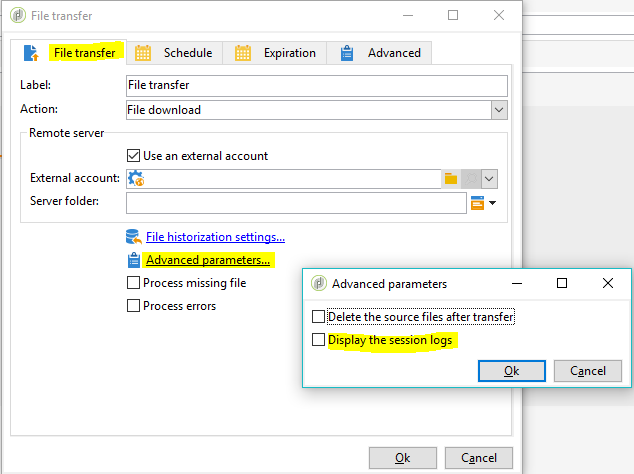

# Práticas recomendadas e solução de problemas do servidor SFTP {#sftp-server-usage}

## Recomendações globais do servidor SFTP {#global-recommendations}

Ao gerenciar arquivos e dados para fins de ETL, esses arquivos são armazenados em um servidor SFTP hospedado fornecido pela Adobe. Siga as recomendações abaixo ao usar servidores SFTP.

* Para evitar a expiração de senhas, use a autenticação baseada em chave (as senhas têm um período de validade de 90 dias). Além disso, a autenticação baseada nessa opção permite gerar várias chaves para gerenciar diversas entidades, por exemplo. Ao contrário, essa opção de autenticação exige que a senha seja compartilhada com todas as entidades gerenciadas.

   O formato de chave compatível é SSH-2 RSA 2048. As chaves podem ser geradas com ferramentas como PuTTY (Windows) ou ssh-keygen (Unix). Será necessário fornecer a chave pública à equipe de suporte da Adobe por meio do [Atendimento ao cliente da Adobe](https://helpx.adobe.com/br/enterprise/admin-guide.html/enterprise/using/support-for-experience-cloud.ug.html) para carregá-lo no servidor do Campaign.

* Use em lotes em uploads de SFTP e em workflows.

* Manipule erros/exceções.

* Por padrão, todas as pastas criadas estão em modo de leitura/gravação somente para o seu identificador. Ao criar pastas que precisam ser acessadas pelo Campaign, certifique-se de configurá-las com direitos de leitura/gravação para todo o grupo. Caso contrário, os workflows podem não ser capazes de criar/excluir arquivos como são executados em um identificador diferente no mesmo grupo por motivos de segurança.

* Os IPs públicos a partir dos quais você está tentando iniciar a conexão SFTP devem ser adicionados à lista de permissões na instância do Campaign. A adição de endereços IP na lista de permissões pode ser solicitada por meio do [Atendimento ao cliente da Adobe](https://helpx.adobe.com/enterprise/admin-guide.html/enterprise/using/support-for-experience-cloud.ug.html).

## Práticas recomendadas de uso do banco de dados {#sftp-server-best-practices}

Os servidores SFTP foram projetados para ser um espaço de armazenamento temporário onde você pode controlar a retenção e a exclusão de arquivos.

Quando não são usados ou monitorados corretamente, esses espaços podem preencher rapidamente o espaço físico disponível no servidor e provocar arquivos truncados nos envios subsequentes. Quando o espaço está saturado, a limpeza automática pode ativar e apagar os arquivos mais antigos do armazenamento SFTP.

Para evitar esses problemas, a Adobe recomenda seguir as práticas recomendadas abaixo.

>[!NOTE]
>
>Se sua instância estiver hospedada no AWS, será possível monitorar o armazenamento do servidor SFTP com o [Painel de Controle](https://experienceleague.adobe.com/docs/control-panel/using/sftp-management/sftp-storage-management.html?lang=pt-BR) do Campaign Classic. Para verificar se sua instância está hospedada no AWS, siga as etapas detalhadas [nesta página](https://experienceleague.adobe.com/docs/control-panel/using/faq.html?lang=pt-BR).
>
>O Painel de controle do Campaign é acessível a todos os usuários administradores. As etapas para conceder acesso de Administrador a um usuário estão detalhadas [nesta página](https://experienceleague.adobe.com/docs/control-panel/using/discover-control-panel/managing-permissions.html?lang=pt-BR#discover-control-panel).
>
>Observe que sua instância deve ser atualizada com a compilação mais recente do [Gold Standard](../../rn/using/gs-overview.md) ou a compilação mais recente do GA (21.1.3)[. ](../../rn/using/latest-release.md) Saiba como verificar sua versão [nesta seção](../../platform/using/launching-adobe-campaign.md#getting-your-campaign-version).

* As capacidades do tamanho do servidor variam de acordo com sua licença. Em qualquer caso, mantenha o mínimo de dados possíveis e somente pelo tempo necessário (o limite máximo de tempo é 15 dias).

* Use workflows para excluir corretamente os dados (gerencie a retenção de workflows consumindo os dados).

* Ocasionalmente, conecte-se no SFTP para verificar diretamente o que encontra-se lá.

* Lembre-se de que o gerenciamento de disco SFTP é predominantemente sua responsabilidade.

## Uso do servidor SFTP externo {#external-SFTP-server}

Se você usar o seu próprio servidor SFTP, siga as recomendações mencionadas acima o máximo possível.

Além disso, ao especificar no Campaign Classic um caminho para um servidor SFTP externo, a sintaxe do caminho difere de acordo com o sistema operacional do servidor SFTP:

* Se o servidor SFTP estiver no **Windows**, sempre use um caminho relativo.
* Se seu servidor STP estiver no **Linux**, sempre use um caminho relativo à página inicial (começando com &quot;~/&quot;) ou um caminho absoluto (começando com &quot;/&quot;).

## Problemas de conexão com o servidor SFTP hospedado pela Adobe {#sftp-server-troubleshooting}

A seção abaixo lista as informações a serem verificadas e fornecidas à equipe de suporte da Adobe por meio do [Serviço de Atendimento ao cliente da Adobe](https://helpx.adobe.com/enterprise/admin-guide.html/enterprise/using/support-for-experience-cloud.ug.html) ao encontrar problemas de conexão com os servidores SFTP hospedados pela Adobe.

1. Verifique se a sua instância está em execução. Para fazer isso, abra o navegador e faça uma chamada **[!UICONTROL GET]** no ponto de extremidade da instância **[!UICONTROL /r/test]**:

   ```
   https://instanceUrl/r/test
   ```

   Se a instância estiver em execução, você deverá obter este tipo de resposta:

   ```
   <redir status='OK' date='YYYY-MM-DD HH:MM:SS' build='XXXX' instance='instanceName'
   sourceIP='AAA.BB.CCC.DD' host='instanceUrl' localHost='instanceName'/>
   ```

   Em qualquer caso, forneça a resposta do comando no tíquete de suporte.

1. Verifique se a porta de saída 22 está aberta no site do qual você está tentando iniciar a conexão SFTP. Para fazer isso, use o seguinte comando:

   ```
   bash-3.2$ nc -vz <SFTP_URL> 22
   # Replace the SFTP_URL with actual SFTP instance URL
   # If the port 22 is opened you will see output similar to the below one
   # for e.g. the  output for the command on myCompany-stage-sftp.neolane.net after ssh-out, will give
   bash-3.2$ nc -vz myCompagny-stage-sftp.neolane.net 22
   myCompany-stage-sftp.neolane.net [AAA.BBB.CCC.D] 22 (ssh) open
   ```

   >[!NOTE]
   >
   >A ferramenta Netcat permite gerenciar facilmente as conexões de rede em vários sistemas operacionais (consulte [https://eternallybored.org/misc/netcat/](https://eternallybored.org/misc/netcat/)).

   Se a porta não for aberta, certifique-se de abrir as conexões de saída em seu lado e tente novamente. Se ainda houver problemas de conexão, compartilhe o output do comando com a equipe de [Atendimento ao cliente da Adobe](https://helpx.adobe.com/enterprise/admin-guide.html/enterprise/using/support-for-experience-cloud.ug.html)

1. Verifique se o IP público a partir do qual você está tentando iniciar a conexão do SFTP foi o informado ao suporte da Adobe para ser incluído na lista de permissões.
1. Se você usa uma autenticação baseada em senha, a senha pode ter expirado (as senhas têm um período de validade de 90 dias). Portanto, recomendamos usar uma autenticação baseada em chave (consulte [Práticas recomendadas para o servidor SFTP](#sftp-server-best-practices)).
1. Se você estiver usando uma autenticação baseada em chave, verifique se a chave usada é a mesma fornecida à equipe de [Atendimento ao cliente da Adobe](https://helpx.adobe.com/enterprise/admin-guide.html/enterprise/using/support-for-experience-cloud.ug.html) para a configuração da instância.
1. Se você estiver usando FileZilla ou uma ferramenta de FTP equivalente, forneça os detalhes dos logs de conexão no tíquete de suporte.

## Erro “Não foi possível resolver o nome do host”

Esta seção fornece informações sobre as verificações e ações a serem executadas ao obter o erro “Não foi possível resolver o nome do host” após a conexão com o servidor FTP pelo Campaign Classic.

O journal de workflow mostra os seguintes logs:

```
16/05/2016 12:49:03    fileTransfer    Upload error in cURL
16/05/2016 12:49:03    fileTransfer    Couldn't resolve host name
16/05/2016 12:49:03    fileTransfer    Couldn't resolve host name
16/05/2016 12:49:03    fileTransfer    Starting transfer of '/usr/local/neolane/nl6/var/williamreed/export/Recipients' to 'ftp://213.253.61.250/Recipients'
16/05/2016 12:49:03    fileTransfer    1 file(s) to transfer
```

Este erro ocorre ao tentar conectar o servidor FTP a partir de um workflow e baixar os arquivos do servidor enquanto você ainda pode se conectar via FTP usando o FileZilla ou WinSCP.

Esse erro indica que o nome de domínio do servidor FTP não pôde ser resolvido corretamente. Para solucionar problemas, faça o seguinte:

1. Solução de problemas de **configuração do servidor DNS**:

   1. Verifique se o nome do servidor foi adicionado ao servidor DNS local.
   1. Em caso positivo, execute o seguinte comando no servidor do Adobe Campaign para obter o endereço IP:

      `nslookup <server domain name>`

      Essa ação confirma se o servidor FTP funciona e está acessível no servidor de aplicativos do Adobe Campaign.

1. Solução de problemas de **logs de seção**:

   1. No workflow, dê um duplo clique na atividade de [transferência de arquivos](../../workflow/using/file-transfer.md).
   1. Acesse a guia **[!UICONTROL File Transfer]** e clique em **[!UICONTROL Advanced Parameters]**.
   1. Marque a opção **[!UICONTROL Display the session logs]**.

      

   1. Acesse a auditoria de workflow e verifique se os logs mostram o erro “Não foi possível resolver o nome do host”.

1. Se o servidor SFTP for hospedado pela Adobe, verifique através do Atendimento ao cliente se o IP foi adicionado à lista de permissões.

   Caso contrário, verifique se:

   * A senha não contém “@”. A conexão falhará se houver “@” na senha.
   * Não há problemas de firewall que possam impedir a comunicação entre o servidor de aplicativos do Adobe Campaign e o servidor SFTP.
   * Execute comandos tracert e telnet no servidor da campanha para o sftp a fim de verificar problemas de conexão.
   * Não há problemas de protocolo de comunicação.
   * A porta está aberta.
