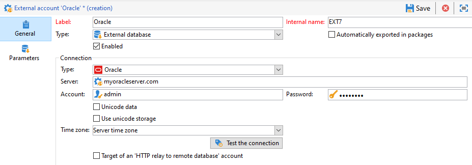

# Configurar conectores FDA {#specific-configurations-by-database-type}

Dependendo dos bancos de dados externos que você deseja acessar do Adobe Campaign, você precisará realizar algumas configurações específicas. Essas configurações envolvem basicamente a instalação de drivers e a declaração de variáveis de ambiente pertencentes a cada RDBMS no servidor do Adobe Campaign.

Para obter mais informações sobre conectores herdados, como Teradata, Hadoop 2.1 ou Netezza, consulte esta [página](../../platform/using/legacy-connectors.md).

Como regra geral, você precisa instalar a camada de cliente correspondente no banco de dados externo no servidor do Adobe Campaign.

>[!NOTE]
>
>Versões compatíveis são listadas na [Matriz de Compatibilidade do Campaign](https://helpx.adobe.com/br/campaign/kb/compatibility-matrix.html#FederatedDataAccessFDA).

## Configurar o acesso ao Azure Synapse {#configure-access-to-azure-synapse}

### Conta externa do Azure Synapse {#azure-external}

A conta externa do [!DNL Azure] permite conectar a instância do Campaign ao banco de dados externo do Azure Synapse.
Para criar sua conta externa do [!DNL Azure Synapse]:

1. No Campaign Classic, configure a conta externa do [!DNL Azure Synapse]. No **[!UICONTROL Explorer]**, clique em **[!UICONTROL Administration]** / **[!UICONTROL Platform]** / **[!UICONTROL External accounts]**.

1. Clique em **[!UICONTROL New]**.

1. Selecione **[!UICONTROL External database]** como sua conta externa **[!UICONTROL Type]**.

1. Para configurar a conta externa do [!DNL Azure Synapse], você deve especificar:

   * **[!UICONTROL Type]**: Azure Synapse Analytics

   * **[!UICONTROL Server]**: o URL do servidor Azure Synapse

   * **[!UICONTROL Account]**: Nome do usuário

   * **[!UICONTROL Password]**: Senha da conta do usuário

   * **[!UICONTROL Database]**: Nome do banco de dados

   

### Azure Synapse no CentOS {#azure-centos}

**Pré-requisitos:**

* Você precisará de privilégios raiz para instalar um driver ODBC.
* Os drivers Red Hat Enterprise ODBC fornecidos pela Microsoft também podem ser usados com o CentOS para conexão com o SQL Server.
* A versão 13.0 funcionará com o Red Hat 6 e 7.

Para configurar o Azure Synapse no CentOS:

1. Primeiro, instale o driver ODBC. Você pode encontrá-lo nesta [página](https://www.microsoft.com/pt-BR/download/details.aspx?id=50420).

   >[!NOTE]
   >
   >É uma exclusividade da versão 13 do driver ODBC.

   ```
   sudo su
   curl https://packages.microsoft.com/config/rhel/6/prod.repo > /etc/yum.repos.d/mssql-release.repo
   exit
   # Uninstall if already installed Unix ODBC driver
   sudo yum remove unixODBC-utf16 unixODBC-utf16-devel #to avoid conflicts
   
   sudo ACCEPT_EULA=Y yum install msodbcsql
   
   sudo ACCEPT_EULA=Y yum install mssql-tools
   echo 'export PATH="$PATH:/opt/mssql-tools/bin"' >> ~/.bash_profile
   echo 'export PATH="$PATH:/opt/mssql-tools/bin"' >> ~/.bashrc
   source ~/.bashrc
   
   # the Microsoft driver expects unixODBC to be here /usr/lib64/libodbc.so.1, so add soft links to the '.so.2' files
   cd /usr/lib64
   sudo ln -s libodbccr.so.2   libodbccr.so.1
   sudo ln -s libodbcinst.so.2 libodbcinst.so.1
   sudo ln -s libodbc.so.2     libodbc.so.1
   
   # Set the path for unixODBC
   export ODBCINI=/usr/local/etc/odbc.ini
   export ODBCSYSINI=/usr/local/etc
   source ~/.bashrc
   
   #Add a DSN information to /etc/odbc.ini
   sudo vi /etc/odbc.ini
   
   #Add the following:
   [Azure Synapse Analytics]
   Driver      = ODBC Driver 13 for SQL Server
   Description = Azure Synapse Analytics DSN
   Trace       = No
   Server      = [insert your server here]
   ```

1. Se necessário, você pode instalar cabeçalhos de desenvolvimento unixODBC executando o seguinte comando:

   ```
   sudo yum install unixODBC-devel
   ```

1. Depois de instalar os drivers, você pode testar e verificar o driver ODBC e consultar o banco de dados, se necessário. Execute o seguinte comando:

   ```
   /opt/mssql-tools/bin/sqlcmd -S yourServer -U yourUserName -P yourPassword -q "your query" # for example -q "select 1"
   ```

1. No Campaign Classic, você pode configurar a conta externa do [!DNL Azure Synapse]. Para obter mais informações sobre como configurar a conta externa, consulte esta [seção](../../platform/using/specific-configuration-database.md#azure-external).

1. Como o Azure Synapse Analytics se comunica por meio da porta TCP 1433, é necessário abrir essa porta no firewall. Use o seguinte comando:

   ```
   firewall-cmd --permanent --add-rich-rule='rule family="ipv4" source address="[server_ip_here]/32" port port="1433" protocol="tcp" accept'
   # you can ping your hostname and the ping command will translate the hostname to IP address which you can use here
   ```

   >[!NOTE]
   >
   >Para permitir a comunicação do lado do Azure Synapse Analytics, talvez seja necessário adicionar seu IP público à lista de permissões. Para fazer isso, consulte a [documentação do Azure](https://docs.microsoft.com/pt-BR/azure/sql-database/sql-database-firewall-configure#use-the-azure-portal-to-manage-server-level-ip-firewall-rules).

1. No caso de iptables, execute o seguinte comando:

   ```
   iptables -A OUTPUT -p tcp -d [server_hostname_here] --dport 1433 -j ACCEPT
   ```

### Azure Synapse no Windows {#azure-windows}

>[!NOTE]
>
>É uma exclusividade da versão 13 do driver ODBC, mas o Adobe Campaign Classic também pode usar os drivers do SQL Server Native Client 11.0 e 10.0.

Para configurar o Azure Synapse no Windows:

1. Primeiro, instale o driver ODBC da Microsoft. Você pode encontrá-lo nesta [página](https://www.microsoft.com/pt-BR/download/details.aspx?id=50420).

1. Escolha os seguintes arquivos para instalar:

   ```
   your_language\your_architecture\msodbcsql.msi (i.e: English\X64\msodbcsql.msi)
   ```

1. Depois que o driver ODBC estiver instalado, você poderá testá-lo se necessário. Para obter mais informações, consulte esta [página](https://docs.microsoft.com/pt-BR/sql/connect/odbc/windows/system-requirements-installation-and-driver-files?view=sql-server-ver15#installing-microsoft-odbc-driver-for-sql-server).

1. No Campaign Classic, você pode configurar a conta externa do [!DNL Azure Synapse]. Para obter mais informações sobre como configurar a conta externa, consulte esta [seção](../../platform/using/specific-configuration-database.md#azure-external).

1. Como o Azure Synapse Analytics se comunica por meio da porta TCP 1433, é necessário abrir essa porta no Windows Defender Firewall. Para saber mais, consulte a [documentação do Windows](https://docs.microsoft.com/pt-BR/windows/security/threat-protection/windows-firewall/create-an-outbound-program-or-service-rule).

### Azure Synapse no Debian {#azure-debian}

**Pré-requisitos:**

* Você precisará de privilégios raiz para instalar um driver ODBC.
* O Curl é necessário para instalar o pacote msodbcsql. Se ele não estiver instalado, execute o seguinte comando:

   ```
   sudo apt-get install curl
   ```

Para configurar o Azure Synapse no Debian:

1. Primeiro, instale o driver ODBC da Microsoft para o SQL Server. Use os seguintes comandos para instalar o driver ODBC 13.1 para o SQL Server:

   ```
   sudo su
   curl https://packages.microsoft.com/keys/microsoft.asc | apt-key add -
   curl https://packages.microsoft.com/config/debian/8/prod.list > /etc/apt/sources.list.d/mssql-release.list
   exit
   sudo apt-get update
   sudo ACCEPT_EULA=Y apt-get install msodbcsql
   ```

1. Se você receber um erro **&quot;O driver do método /usr/lib/apt/methods/https não foi encontrado&quot;** ao chamar a **atualização sudo apt-get**, execute o comando:

   ```
   sudo apt-get install apt-transport-https ca-certificates
   ```

1. Agora é necessário instalar as ferramentas do mssql com os seguintes comandos. As ferramentas do mssq são necessárias para usar o utilitário programa de cópia em massa (ou BCP) e para executar queries.

   ```
   sudo ACCEPT_EULA=Y apt-get install mssql-tools
   echo 'export PATH="$PATH:/opt/mssql-tools/bin"' >> ~/.bash_profile
   echo 'export PATH="$PATH:/opt/mssql-tools/bin"' >> ~/.bashrc
   source ~/.bashrc
   ```

1. Se necessário, você pode instalar cabeçalhos de desenvolvimento unixODBC executando o seguinte comando:

   ```
   sudo yum install unixODBC-devel
   ```

1. Depois de instalar os drivers, você pode testar e verificar o driver ODBC e consultar o banco de dados, se necessário. Execute o seguinte comando:

   ```
   /opt/mssql-tools/bin/sqlcmd -S yourServer -U yourUserName -P yourPassword -q "your query" # for example -q "select 1"
   ```

1. No Campaign Classic, você pode configurar a conta externa do [!DNL Azure Synapse]. Para obter mais informações sobre como configurar a conta externa, consulte esta [seção](../../platform/using/specific-configuration-database.md#azure-external).

1. Para configurar iptables no Debian para garantir a conexão com o Azure Synapse Analytics, habilite a porta TCP 1433 de saída para seu nome de host com o seguinte comando:

   ```
   iptables -A OUTPUT -p tcp -d [server_hostname_here] --dport 1433 -j ACCEPT
   ```

   >[!NOTE]
   >
   >Para permitir a comunicação do lado do Azure Synapse Analytics, talvez seja necessário adicionar seu IP público à lista de permissões. Para fazer isso, consulte a [documentação do Azure](https://docs.microsoft.com/pt-BR/azure/sql-database/sql-database-firewall-configure#use-the-azure-portal-to-manage-server-level-ip-firewall-rules).

## Configuração do acesso ao Snowflake {#configure-access-to-snowflake}

>[!NOTE]
>
>[!DNL Snowflake]O conector de está disponível para implantações locais e hospedadas. Para obter mais informações, consulte [este artigo](https://helpx.adobe.com/br/campaign/kb/acc-on-prem-vs-hosted.html).


### Conta externa do Snowflake {#snowflake-external}

A conta externa do [!DNL Snowflake] permite conectar a instância do Campaign ao banco de dados externo do Snowflake.

1. No Campaign Classic, configure a conta externa do [!DNL Snowflake]. No **[!UICONTROL Explorer]**, clique em **[!UICONTROL Administration]** / **[!UICONTROL Platform]** / **[!UICONTROL External accounts]**.

1. Clique em **[!UICONTROL New]**.

1. Selecione **[!UICONTROL External database]** como sua conta externa **[!UICONTROL Type]**.

1. Para configurar a conta externa do **[!UICONTROL Snowflake]**, você deve especificar:

   * **[!UICONTROL Type]**: [!DNL Snowflake]

   * **[!UICONTROL Server]**: URL do servidor [!DNL Snowflake]

   * **[!UICONTROL Account]**: Nome do usuário

   * **[!UICONTROL Password]**: Senha da conta do usuário

   * **[!UICONTROL Database]**: Nome do banco de dados

   

1. Clique na guia **[!UICONTROL Parameters]** e depois no botão **[!UICONTROL Deploy functions]** para criar as funções.

   

O conector é compatível com as seguintes opções:

| Opção | Descrição |
|---|---|
| schema de trabalho | schema de banco de dados que deve ser usado para tabelas de trabalho |
| depósito | Nome do depósito padrão que deve ser usado. Ele substituirá o padrão do usuário. |
| TimeZoneName | É vazio por padrão, o que significa que o fuso horário do sistema do servidor de aplicativos Campaign Classic é usado. A opção pode ser usada para forçar o parâmetro da sessão TIMEZONE. <br>[Para obter mais informações, consulte esta página](https://docs.snowflake.net/manuals/sql-reference/parameters.html#timezone). |
| WeekStart | Parâmetro de sessão WEEK_START. Por padrão, defina como 0. <br>[Para obter mais informações, consulte esta página](https://docs.snowflake.com/br/sql-reference/parameters.html#week-start). |
| UseCachedResult | Parâmetro de sessão USE_CACHED_RESULTS. Por padrão, defina como TRUE. Esta opção pode ser usada para desativar os resultados em cache do Snowflake. <br>Para obter mais informações, consulte esta [página](https://docs.snowflake.net/manuals/user-guide/querying-persisted-results.html). |

### Snowflake no CentOS {#snowflake-centos}

1. Baixe os drivers ODBC para o [!DNL Snowflake]. [Clique aqui](https://sfc-repo.snowflakecomputing.com/br/odbc/linux/latest/snowflake-odbc-2.20.2.x86_64.rpm) para iniciar o download.
1. Em seguida, é necessário instalar os drivers ODBC no CentOs com o seguinte comando:

   ```
   rpm -Uvh unixodbc
   rpm -Uvh snowflake-odbc-2.20.2.x86_64.rpm
   ```

1. Após baixar e instalar os drivers ODBC, é necessário reiniciar o Campaign Classic. Para fazer isso, execute o seguinte comando:

   ```
   /etc/init.d/nlserver6 stop
   /etc/init.d/nlserver6 start
   ```

1. No Campaign Classic, você pode configurar a conta externa do [!DNL Snowflake]. Para obter mais informações sobre como configurar a conta externa, consulte esta [seção](../../platform/using/specific-configuration-database.md#snowflake-external).

### Snowflake no Debian {#snowflake-debian}

1. Baixe os drivers ODBC para o [!DNL Snowflake]. [Clique aqui](https://sfc-repo.snowflakecomputing.com/odbc/linux/latest/index.html) para iniciar o download.

1. Em seguida, é necessário instalar os drivers ODBC no Debian com o seguinte comando:

   ```
   apt-get install unixodbc
   apt-get install snowflake-odbc-x.xx.x.x86_64.deb
   ```

1. Após baixar e instalar os drivers ODBC, é necessário reiniciar o Campaign Classic. Para fazer isso, execute o seguinte comando:

   ```
   systemctl stop nlserver.service
   systemctl start nlserver.service
   ```

1. No Campaign Classic, você pode configurar a conta externa do [!DNL Snowflake]. Para obter mais informações sobre como configurar a conta externa, consulte esta [seção](../../platform/using/specific-configuration-database.md#snowflake-external).

### Snowflake no Windows {#snowflake-windows}

1. Instale o [driver ODBC para Windows](https://docs.snowflake.net/manuals/user-guide/odbc-download.html). Observe que é necessário ter os privilégios de nível de administrador para instalar o driver. Para obter mais informações, consulte [esta página](https://docs.snowflake.net/manuals/user-guide/admin-user-management.html)

1. Configure o driver ODBC. Para obter mais informações, consulte [esta página](https://docs.snowflake.net/manuals/user-guide/odbc-windows.html#step-2-configure-the-odbc-driver)

1. No Campaign Classic, você pode configurar a conta externa do [!DNL Snowflake]. Para obter mais informações sobre como configurar a conta externa, consulte esta [seção](../../platform/using/specific-configuration-database.md#snowflake-external).

## Configuração do acesso ao Hadoop 3.0 {#configure-access-to-hadoop-3}

### Conta externa do Hadoop {#hadoop-external}

A conta externa do [!DNL Hadoop] permite conectar a instância do Campaign ao banco de dados externo do Hadoop.

1. No Campaign Classic, configure a conta externa do [!DNL Hadoop]. No **[!UICONTROL Explorer]**, clique em **[!UICONTROL Administration]** / **[!UICONTROL Platform]** / **[!UICONTROL External accounts]**.

1. Clique em **[!UICONTROL New]**.

1. Selecione **[!UICONTROL External database]** como sua conta externa **[!UICONTROL Type]**.

1. Para configurar a conta externa do **[!UICONTROL Hadoop]**, você deve especificar:

   * **[!UICONTROL Type]**: ODBC (Sybase ASE, Sybase IQ)

   * **[!UICONTROL Server]**: Nome do DNS

   * **[!UICONTROL Account]**: Nome do usuário

   * **[!UICONTROL Password]**: Senha da conta do usuário

   * **[!UICONTROL Database]**: nome do banco de dados, se não estiver especificado no DSN. Pode ficar em branco, se estiver especificado no DSN

   * **[!UICONTROL Time zone]**: Fuso horário do servidor

   

O conector é compatível com as seguintes opções ODBC:

| Nome | Valor |
|---|---|
| ODBCMgr | iODBC |
| depósito | 1/2/4 |

O conector também é compatível com as seguintes opções de Hive:

| Nome | Valor | Descrição |
|---|---|---|
| bulkKey | Azure blob ou chave de acesso do DataLake | Para wasb:// ou wasbs:// carregadores em massa (isto é, se a ferramenta de carregamento em massa inicia com wasb:// ou wasbs://).. <br>É a chave de acesso para blob ou bucket DataLake para carregamento em massa. |
| hdfsPort | número da porta <br>definido por padrão como 8020 | Para carregamento em massa de HDFS (isto é, se a ferramenta de carregamento em massa inicia com webhdfs:// ou webhdfss://). |
| bucketsNumber | 20 | Número de buckets ao criar uma tabela agregada. |
| fileFormat | PARQUET | Formato de arquivo padrão para tabelas de trabalho. |

### Configuração do Hadoop 3.0 {#configuring-hadoop}

A conexão com um banco de dados externo do Hadoop no FDA exige as seguintes configurações no servidor do Adobe Campaign. Observe que essa configuração está disponível para Windows e Linux.

1. Baixe os drivers ODBC para Hadoop de acordo com a versão do sistema operacional. Os drivers podem ser encontrados [nesta página](https://www.cloudera.com/br/downloads.html).

1. Em seguida, é necessário instalar os drivers ODBC e criar um DSN para a conexão Hive. As instruções podem ser encontradas [nesta página](https://docs.cloudera.com/br/documentation/other/connectors/hive-odbc/2-6-5/Cloudera-ODBC-Driver-for-Apache-Hive-Install-Guide.pdf)

1. Após baixar e instalar os drivers ODBC, é necessário reiniciar o Campaign Classic. Para fazer isso, execute o seguinte comando:

   ```
   systemctl stop nlserver.service
   systemctl start nlserver.service
   ```

1. No Campaign Classic, você pode configurar a conta externa do [!DNL Hadoop]. Para obter mais informações sobre como configurar a conta externa, consulte esta [seção](../../platform/using/specific-configuration-database.md#hadoop-external).

## Configuração do acesso ao Oracle {#configure-access-to-oracle}

### Conta externa do Oracle {#oracle-external}

A conta externa do [!DNL Oracle] permite conectar a instância do Campaign ao banco de dados externo do Hadoop.

1. No Campaign Classic, configure a conta externa do [!DNL oracle]. No **[!UICONTROL Explorer]**, clique em **[!UICONTROL Administration]** / **[!UICONTROL Platform]** / **[!UICONTROL External accounts]**.

1. Clique em **[!UICONTROL New]**.

1. Selecione **[!UICONTROL External database]** como sua conta externa **[!UICONTROL Type]**.

1. Para configurar a conta externa do **[!UICONTROL Oracle]**, você deve especificar:

   * **[!UICONTROL Type]**: Oracle

   * **[!UICONTROL Server]**: Nome do DNS

   * **[!UICONTROL Account]**: Nome do usuário

   * **[!UICONTROL Password]**: Senha da conta do usuário

   * **[!UICONTROL Time zone]**: Fuso horário do servidor

   

### Oracle no Linux {#for-linux-1}

A conexão com um banco de dados externo Oracle no FDA exige as seguintes configurações adicionais no servidor do Adobe Campaign:

1. Instale o cliente completo do Oracle correspondente à sua versão do Oracle.
1. Adicione suas definições de TNS à instalação. Para fazer isso, especifique em um arquivo **tnsnames.ora** no repositório /etc/oracle. Crie o repositório, caso ele não exista.

   Em seguida, crie uma nova variável de ambiente TNS_ADMIN: exporte TNS_ADMIN=/etc/oracle e reinicie a máquina.

1. Integre o Oracle ao seu servidor do Adobe Campaign (nlserver). Para fazer isso, verifique se o arquivo **customer.sh** está na pasta &quot;nl6&quot; da estrutura da árvore do servidor do Adobe Campaign e se inclui os links para as bibliotecas Oracle.

   Por exemplo, para um cliente em 11.2:

   ```
   export ORACLE_HOME=/usr/lib/oracle/11.2
   export TNS_ADMIN=/etc/oracle
   export LD_LIBRARY_PATH=$ORACLE_HOME/client64/lib:$LD_LIBRARY_PATH
   ```

   >[!NOTE]
   >
   >Esses valores (particularmente ORACLE_HOME) dependem dos repositórios de instalação. Verifique sua estrutura de árvore antes de fazer referência a esses valores.

1. Instale as bibliotecas necessárias para Oracle:

   * **libclntsh.so**

      ```
      cd /usr/lib/oracle/<version>/client<architecture>/lib
      ln -s libclntsh.so.<version> libclntsh.so
      ```

   * **libaio1**

      ```
      aptitude install libaio1
      or
      yum install libaio1
      ```

1. No Campaign Classic, você pode configurar a conta externa do [!DNL Oracle]. Para obter mais informações sobre como configurar a conta externa, consulte esta [seção](../../platform/using/specific-configuration-database.md#oracle-external).

### Oracle no Windows {#for-windows-1}

A conexão com um banco de dados externo Oracle no FDA exige as seguintes configurações adicionais no servidor do Adobe Campaign:

1. Instale o software cliente Oracle.

1. Na pasta C:\Oracle, crie um arquivo **tnsnames.ora** contendo sua definição TNS.

1. Adicione uma variável de ambiente TNS_ADMIN com C:\Oracle como valor e reinicie o computador.

1. No Campaign Classic, você pode configurar a conta externa do [!DNL Oracle]. Para obter mais informações sobre como configurar a conta externa, consulte esta [seção](../../platform/using/specific-configuration-database.md#oracle-external).