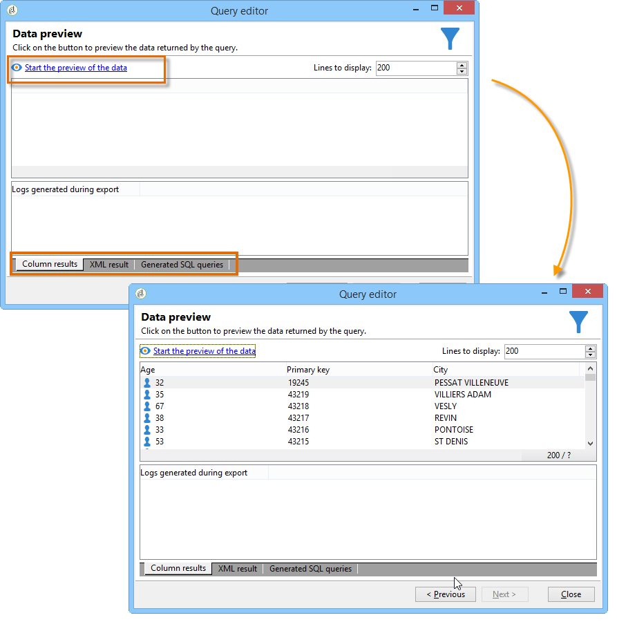

# Etapas para criar um query{#steps-to-create-a-query}

As etapas para criar um query no Adobe Campaign são as seguintes:

1. Selecione a tabela de trabalho. Consulte a [Etapa 1 - Escolher uma tabela](#step-1---choose-a-table).
1. Em seguida, selecione os dados a serem extraídos. Consulte a [Etapa 2 - Escolher dados para extrair](#step-2---choose-data-to-extract).
1. Defina a sequência de classificação de dados. Consulte a [Etapa 3 - Classificar dados](#step-3---sort-data).
1. Filtre os dados. Consulte a [Etapa 4 - Filtrar dados](#step-4---filter-data).
1. Formate os dados. Consulte a [Etapa 5 - Formatar dados](#step-5---format-data).
1. Exiba o resultado. Consulte a [Etapa 6 - Visualizar dados](#step-6---preview-data).

>[!NOTE]
>
>Todas essas etapas estão disponíveis no editor de query genérico. Quando um query é criado em outro contexto, algumas etapas podem ser deixadas de fora.\
>Apresentamos a atividade de query [nesta seção](../../workflow/using/query.md).

## Etapa 1 - Escolher uma tabela {#step-1---choose-a-table}

Selecione a tabela que contém os dados que você deseja consultar na janela **[!UICONTROL Document type]**. Se necessário, filtre os dados usando o campo de filtragem ou o botão **[!UICONTROL Filters]**.

## Etapa 2 - Escolher dados para extrair {#step-2---choose-data-to-extract}

Na janela **[!UICONTROL Data to extract]**, selecione os dados a serem exibidos: esses campos produzirão as colunas de saída.

Por exemplo, selecione **[!UICONTROL Age]**, **[!UICONTROL Primary key]** e **[!UICONTROL Email domain]** e **[!UICONTROL City]**. Os resultados serão organizados com base nessa seleção. Use as setas azuis à direita da janela para alterar a ordem da coluna.

Você pode editar uma expressão inserindo uma fórmula nela ou executando um processo em uma função agregada. To do this, click the **[!UICONTROL Expression]** column field, then select **[!UICONTROL Edit expression]**.

It is possible to group output column data: to do this, check **[!UICONTROL Yes]** in the **[!UICONTROL Group]** column of the **[!UICONTROL Data to extract]** window. Essa função gera um resultado ao redor do eixo de agrupamento marcado. Um exemplo de query com agrupamento está disponível [nesta seção](../../workflow/using/querying-delivery-information.md).

* The **[!UICONTROL Handle groupings (GROUP BY + HAVING)]** function lets you &quot;group by&quot; and select what has been grouped (&quot;having&quot;). Essa função se aplica a todos os campos na coluna de saída. Por exemplo, essa opção permite agrupar todas as escolhas de uma coluna de saída e recuperar um tipo específico de informações, como destinatários de idade entre 35 e 50.

   Para obter mais informações, consulte [esta seção](../../workflow/using/querying-using-grouping-management.md).

* The **[!UICONTROL Remove duplicate rows (DISTINCT)]** function lets you deduplicate identical results obtained in the output column. Por exemplo, se você realizar um censo selecionando os campos de sobrenome, nome e email na coluna de saída, os que tiverem dados idênticos serão eliminados, pois isso significa que o mesmo contato foi inserido várias vezes no banco de dados. Sendo assim, somente um resultado será levado em conta.

## Etapa 3 - Classificar dados {#step-3---sort-data}

A janela **[!UICONTROL Sorting]** possibilita classificar o conteúdo da coluna. Use as setas para modificar a ordem de exibição:

* A coluna **[!UICONTROL Sorting]** oferece uma classificação simples, além de organizar o conteúdo da coluna de A a Z ou em ordem crescente.
* A opção **[!UICONTROL Descending sort]** organiza o conteúdo de Z a A e em ordem decrescente. Isso é útil para demonstrar os maiores resultados de venda: as figuras maiores são mostradas na parte superior da lista.

Neste exemplo, os dados são classificados em ordem crescente com base na idade do destinatário.

## Etapa 4 - Filtrar dados {#step-4---filter-data}

O editor de query permite que você filtre os dados para refinar sua pesquisa.

Os filtros oferecidos dependem da tabela à qual o query se refere.

Após selecionar a opção **[!UICONTROL Filtering conditions]**, você acessará a seção **[!UICONTROL Target elements]**, que permite definir como filtrar os dados a coletar.

* Para criar um novo filtro, selecione os campos, operadores e valores necessários para a criação da fórmula a ser verificada para que os dados sejam selecionados. É possível combinar várias condições (para saber mais sobre isso, consulte [Definição de condições de filtragem](../../platform/using/defining-filter-conditions.md)).
* Para usar os filtros salvos anteriormente, abra a lista suspensa clicando no botão **[!UICONTROL Add]**, clique em **[!UICONTROL Predefined filter]** e selecione o filtro desejado.

   

* Os filtros criados no **[!UICONTROL Generic query editor]** estão disponíveis em outros aplicativos de query e vice-versa. Para salvar um filtro, clique no ícone **[!UICONTROL Save]**.

   >[!NOTE]
   >
   >Para saber mais sobre como criar e usar filtros, consulte [Opções de filtragem](../../platform/using/filtering-options.md).

Como mostrado no exemplo a seguir, para recuperar todos os destinatários falantes de inglês, selecione: &quot;recipient language **equal to** EN&quot;.

>[!NOTE]
>
>Você pode acessar diretamente uma opção digitando a seguinte fórmula no campo **Value**: **$(options:OPTION_NAME)**.

Clique na guia **[!UICONTROL Preview]** para exibir o resultado da condição de filtragem. Nesse caso, todos os destinatários que falam inglês são exibidos com sobrenome, nome e endereço de email.

Os usuários familiarizados com a linguagem SQL podem clicar em **[!UICONTROL Generate SQL query]** para exibir a query no SQL.

## Etapa 5 - Formatar dados {#step-5---format-data}

Após configurar os filtros de restrição, você acessará a janela **[!UICONTROL Data formatting]**. Essa janela permite que você reorganize as colunas de saída, transforme dados e altere letras maiúsculas e minúsculas dos rótulos de coluna. Ela também permite aplicar uma fórmula ao resultado final usando um campo calculado.

>[!NOTE]
>
>Para saber mais sobre os tipos de campos calculados, consulte [Criação de campos calculados](../../platform/using/defining-filter-conditions.md#creating-calculated-fields).

Colunas não verificadas não serão mostradas na janela de visualização de dados.

A coluna **[!UICONTROL Transformation]** possibilita alterar um rótulo de coluna para letras maiúsculas ou minúsculas. Selecione a coluna e clique na coluna **[!UICONTROL Transformation]**. Você pode escolher:

* **[!UICONTROL Switch to lower case]**,
* **[!UICONTROL Switch to upper case]**,
* **[!UICONTROL First letter in upper case]**.

## Etapa 6 - Visualizar dados {#step-6---preview-data}

The **[!UICONTROL Data preview]** window is the last stage. Click **[!UICONTROL Start the preview of the data]** to get your query result. Ele está disponível em colunas ou no formato XML. Click the **[!UICONTROL Generated SQL queries]** tab to view the query in SQL format.

Neste exemplo, dados são classificados em ordem crescente com base na idade do destinatário.

>[!NOTE]
>
>Por padrão, apenas as primeiras 200 linhas são exibidas na janela **[!UICONTROL Data preview]**. To change this, enter a number in the **[!UICONTROL Lines to display]** box and click **[!UICONTROL Start the preview of the data]**.

