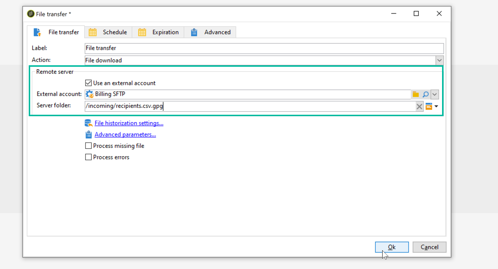

# Descompactar ou descriptografar um arquivo {#unzipping-or-decrypting-a-file-before-processing}

O Adobe Campaign permite importar arquivos compactados ou criptografados. Antes de serem lidos em uma atividade [Data loading (file)](../../workflow/using/data-loading--file-.md), é possível definir um pré-processamento para descompactar ou descriptografar o arquivo.

Para fazer isso:

1. Use o [Painel de controle do Campaign](https://experienceleague.adobe.com/docs/control-panel/using/instances-settings/gpg-keys-management.html?lang=pt-BR#decrypting-data) para gerar um par de chave pública/privada.

   >[!NOTE]
   >
   >O Painel de controle do Campaign é acessível a todos os usuários administradores. As etapas para conceder acesso de Administrador a um usuário estão detalhadas [nesta página](https://experienceleague.adobe.com/docs/control-panel/using/discover-control-panel/managing-permissions.html?lang=pt-BR#discover-control-panel).
   >
   >Observe que sua instância deve ser hospedada no AWS e atualizada com a compilação mais recente do [Gold Standard](../../rn/using/gs-overview.md) ou a [compilação mais recente do GA (21.1.3)](../../rn/using/latest-release.md). Saiba como verificar a versão [nesta seção](../../platform/using/launching-adobe-campaign.md#getting-your-campaign-version). Para verificar se sua instância está hospedada no AWS, siga as etapas detalhadas [nesta página](https://experienceleague.adobe.com/docs/control-panel/using/faq.html?lang=pt-BR).

1. Caso sua instalação do Adobe Campaign seja hospedada pela Adobe, entre em contato com o [Atendimento ao cliente da Adobe](https://helpx.adobe.com/br/enterprise/admin-guide.html/enterprise/using/support-for-experience-cloud.ug.html) para ter os utilitários necessários instalados no servidor.
1. Caso a instalação do Adobe Campaign seja no local, instale o utilitário que deseja usar (por exemplo: GPG, GZIP) e as chaves necessárias (chave de criptografia) no servidor de aplicativos.

Em seguida, você pode usar os comandos de pré-processamento desejados em seus workflows:

1. Adicione e configure uma atividade **[!UICONTROL File transfer]** no workflow.
1. Adicione uma atividade **[!UICONTROL Data loading (file)]** e defina o formato do arquivo.
1. Marque a opção **[!UICONTROL Pre-process the file]**.
1. Especifique o comando do pré-processamento que deseja aplicar.
1. Adicione outras atividades para gerenciar dados provenientes do arquivo.
1. Salve e execute seu workflow.

Um exemplo é apresentado no caso de uso abaixo.

**Tópicos relacionados:**

* [Atividade de carregamento de dados (arquivo)](../../workflow/using/data-loading--file-.md).
* [Compactar ou criptografar um arquivo](../../workflow/using/how-to-use-workflow-data.md#zipping-or-encrypting-a-file).

## Caso de uso: importação de dados criptografados usando uma chave gerada pelo Painel de controle {#use-case-gpg-decrypt}

Nesse caso de uso, criaremos um fluxo de trabalho para importar dados que foram criptografados em um sistema externo usando uma chave gerada no Painel de controle do Campaign.

 [Descubra este recurso no vídeo](#video)

As etapas para executar esse caso de uso são as seguintes:

1. Use o Painel de controle do Campaign para gerar um par de chaves (público/privado). As etapas detalhadas estão disponíveis na [documentação do Painel de controle do Campaign](https://experienceleague.adobe.com/docs/control-panel/using/instances-settings/gpg-keys-management.html#decrypting-data).

   * A chave pública será compartilhada com o sistema externo, que a usará para criptografar os dados que serão enviados para o Campaign.
   * A chave privada será usada pelo Campaign Classic para descriptografar os dados criptografados recebidos.

   

1. No sistema externo, use a chave pública baixada a partir do Painel de controle do Campaign para criptografar os dados que serão importados para o Campaign Classic.

1. No Campaign Classic, crie um workflow para importar os dados criptografados e descriptografá-los usando a chave privada instalada por meio do Painel de controle do Campaign. Para fazer isso, criaremos um workflow da seguinte maneira:

   

   * Atividade **[!UICONTROL File transfer]**: transfere o arquivo de uma fonte externa para o Campaign Classic. Neste exemplo, queremos transferir o arquivo de um servidor SFTP.
   * Atividade **[!UICONTROL Data loading (file)]**: carrega os dados do arquivo no banco de dados e os decodifica usando a chave privada gerada no Painel de controle do Campaign.

1. Abra a atividade **[!UICONTROL File transfer]** e especifique a conta externa da qual deseja importar o arquivo .gpg criptografado.

   

   Os conceitos globais sobre como configurar a atividade estão disponíveis [nesta seção](../../workflow/using/file-transfer.md).

1. Abra a atividade **[!UICONTROL Data loading (file)]** e configure-a de acordo com suas necessidades. Os conceitos globais sobre como configurar a atividade estão disponíveis [nesta seção](../../workflow/using/data-loading--file-.md).

   Adicione um estágio de pré-processamento à atividade para descriptografar os dados recebidos. Para isso, selecione a opção **[!UICONTROL Pre-process the file]** e, em seguida, copie e cole este comando de descriptografia no campo **[!UICONTROL Command]**:

   `gpg --batch --passphrase passphrase --decrypt <%=vars.filename%>`

   

   >[!CAUTION]
   >
   >Neste exemplo, estamos usando a senha padrão do Painel de controle do Campaign, que é &quot;passphrase&quot;.
   >
   >Caso já tenha tido chaves GPG instaladas em sua instância por meio de uma solicitação do Atendimento ao cliente no passado, a senha pode ter sido alterada e ser diferente da padrão.

1. Clique em **[!UICONTROL OK]** para confirmar a configuração da atividade.

1. Agora você pode executar o workflow. Depois de executado, você pode verificar nos logs do workflow se a descriptografia foi executada e se os dados do arquivo foram importados.

   

## Tutorial em vídeo {#video}

Este vídeo mostra como usar uma chave GPG para descriptografar dados.

>[!VIDEO](https://video.tv.adobe.com/v/36482?quality=12)

Vídeos extras sobre procedimentos do Campaign Classic estão disponíveis [aqui](https://experienceleague.adobe.com/docs/campaign-classic-learn/tutorials/overview.html?lang=pt-BR).
