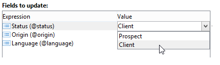
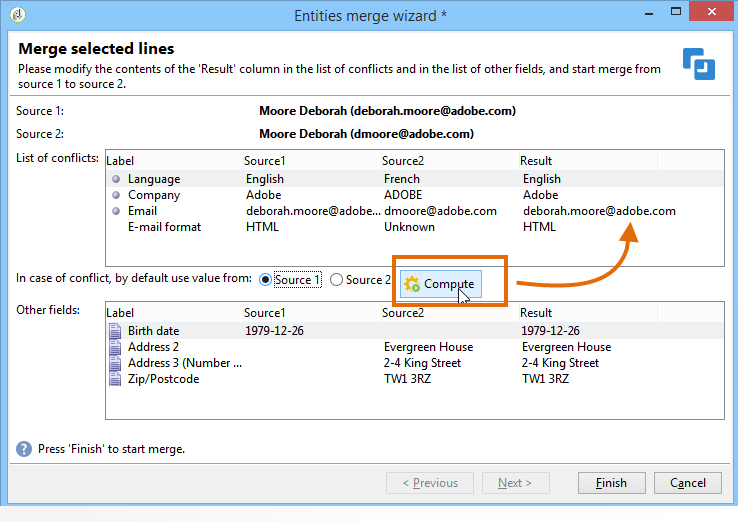

# Atualizar dados{#updating-data}

Os dados vinculados ao perfil de um recipient podem ser atualizados manualmente ou automaticamente.

## Configurar uma atualização automática {#setting-up-an-automatic-update}

Uma atualização automática pode ser configurada por meio de um fluxo de trabalho. Para obter mais informações, consulte [esta seção](../../workflow/using/update-data.md).

## Executar uma atualização em massa {#performing-a-mass-update}

Para executar atualizações manuais, clique com o botão direito do mouse nos recipients selecionados para usar o menu de atalho **[!UICONTROL Actions]** ou use o ícone **[!UICONTROL Actions]**.

Há dois tipos de atualizações: atualização em massa para um conjunto de destinatários e mesclagem de dados entre dois perfis. Para cada ação, um assistente permite configurar a atualização.

### Atualização em massa {#mass-update}

Para atualização em massa, utilize **[!UICONTROL Action > Mass update of selected lines...]**. O assistente ajuda a configurar e executar a atualização.

A primeira etapa do assistente é especificar os campos que serão atualizados.

A seção à esquerda do assistente exibe a lista de campos disponíveis. Utilize o campo **[!UICONTROL Find]** para executar uma pesquisa nesses campos. Pressione a tecla **Enter** para navegar na lista. Os nomes de campos correspondentes à sua entrada aparecem em negrito, conforme mostrado abaixo.

Clique duas vezes nos campos a serem atualizados para exibi-los na seção à direita do assistente.

Caso ocorra um erro, use o botão **[!UICONTROL Delete]** para excluir um campo da lista de campos que devem ser atualizados.

Selecione ou insira os valores para aplicar aos perfis que serão atualizados.

Clique em **[!UICONTROL Distribution of values]** para exibir a distribuição de valores do campo selecionado para os recipients presentes na pasta atual (não apenas os recipients afetados pela atualização).

É possível definir filtros para exibir a distribuição de valores nessa janela ou modificar a pasta atual para exibir a distribuição de valores em outra pasta. Estas são ações somente leitura. Elas não afetam a configuração da atualização que está sendo definida.

Feche esta janela e clique em **[!UICONTROL Next]** para exibir a segunda etapa do assistente de atualização. Nesta etapa, clique em **[!UICONTROL Start]** para iniciar a atualização.

As informações relativas à execução da atualização são exibidas na seção superior do assistente.

**[!UICONTROL Stop]** permite cancelar a atualização, mas alguns registros podem ter sido atualizados, por isso, parar o processo não cancela essas atualizações. A barra de progresso mostra o quanto a operação avançou.

### Mesclar dados {#merge-data}

Selecione **[!UICONTROL Merge selected lines...]** para iniciar a mesclagem de dois perfis de recipient. Os perfis a serem mesclados devem ser selecionados antes de escolher esta opção. A mesclagem é configurada e iniciada usando um assistente.

O assistente exibe os valores a serem recuperados para cada campo preenchido em um ou outro perfil de origem. Se um ou mais campos nos perfis que serão mesclados tiverem valores diferentes, eles serão exibidos na seção **[!UICONTROL List of conflicts]** É possível então selecionar o perfil padrão usando os botões de opção abaixo da lista, como no exemplo a seguir:

Clique em **[!UICONTROL Compute]** para exibir o resultado da sua escolha.

Verifique as colunas **[!UICONTROL Result]** das duas seções da janela e clique em **[!UICONTROL Finish]** para executar a mesclagem.

## Exportar dados {#exporting-data}

O conteúdo de uma lista pode ser exportado. Para configurar e executar a exportação:

1. Selecione os registros para exportar.
1. Clique com o botão direito do mouse e selecione **[!UICONTROL Export...]**.

   

1. Em seguida, selecione os dados a serem extraídos. Por padrão, todas as colunas exibidas são adicionadas às colunas de saída.

   

   Para obter mais informações sobre como configurar o assistente de exportação, consulte [esta seção](../../platform/using/executing-export-jobs.md).

## Assinar um serviço {#subscribing-to-a-service}

Na maioria dos casos, os destinatários assinam um boletim informativo por meio de uma página dedicada, conforme explicado [nesta seção](../../delivery/using/managing-subscriptions.md). No entanto, os perfis dos destinatários filtrados podem assinar manualmente um serviço (boletim informativo ou Serviço Viral). Para fazer isso:

1. Selecione os destinatários que deseja assinar e clique com o botão direito do mouse.
1. Selecione **[!UICONTROL Actions > Subscribe selection to a service]**.

   

1. Selecione o serviço desejado e clique em **[!UICONTROL Next]**:

   

   >[!NOTE]
   >
   >Este editor permite criar um novo serviço: clique no botão **[!UICONTROL Create]**.

1. Você pode **[!UICONTROL Send a confirmation message]** para recipients. O conteúdo desta mensagem pode ser configurado no cenário de assinatura vinculado ao serviço selecionado.
1. Clique no botão **[!UICONTROL Start]** para executar o processo de assinatura.

   

A seção superior da janela permite monitorar o processo de execução. O botão **[!UICONTROL Stop]** permite interromper o processo. No entanto, os recipients já processados serão inscritos.

Se você desmarcar a opção **[!UICONTROL Do not keep a trace of this job in the database]**, poderá selecionar (ou criar) a pasta de execução onde as informações desse processo serão armazenadas.

Para verificar o processo, acesse a guia **[!UICONTROL Subscriptions]** nos perfis dos recipients relacionados a esta operação, ou à guia **[!UICONTROL Subscriptions]** acessada por meio do nó **[!UICONTROL Profiles and Targets > Services and Subscriptions]**.

>[!NOTE]
>
>Para obter mais informações sobre como criar e configurar serviços de informações, consulte [esta página](../../delivery/using/managing-subscriptions.md).
