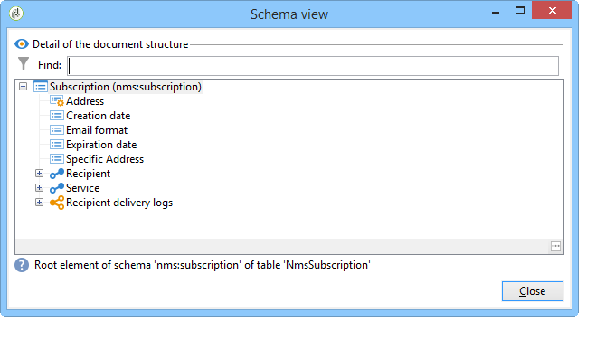

# Caso de uso{#use-case}

## Criação de um filtro no formato de email dos assinantes {#creating-a-filter-on-the-email-format-of-subscribers}

Este caso de uso irá demonstrar como criar um filtro para classificar assinaturas de boletim informativo com base no formato do email do destinatário.

Para fazer isso, precisamos usar um filtro predefinido: esses filtros estão vinculados a um tipo de documento e são acessados por meio do nó **[!UICONTROL Administration > Configuration > Predefined filters]**. Esses filtros de dados podem ser usados para cada tipo de editor (ou documento) no aplicativo.

Os filtros de dados são criados da mesma maneira que os filtros predefinidos, mas há um campo adicional para selecionar o tipo de documento no qual o filtro será aplicado.

Siga as etapas abaixo:

1. Crie um novo filtro através do nó **[!UICONTROL Administration > Configuration > Predefined filters]**.
1. Clique no ícone **[!UICONTROL Select link]** para selecionar o documento relacionado:

   

1. Selecione o esquema de subscrição (nms:subscription) e clique em **[!UICONTROL OK]**.

   

1. Clique em **[!UICONTROL Edit link]** para exibir os campos do documento selecionado.

   

   É possível visualizar o conteúdo do documento selecionado:

   

   Você pode acessar esses campos para definir condições de filtro no corpo do editor de filtro. Um filtro de aplicativo é definido exatamente da mesma maneira como um filtro avançado. Consulte [Criar um filtro avançado](../../platform/using/creating-filters.md#creating-an-advanced-filter).

1. Crie um novo filtro em assinaturas para exibir somente assinaturas com um formato de email indefinido:

   

1. Clique em **[!UICONTROL Save]** para adicionar um filtro aos filtros predefinidos desse tipo de lista.
1. Agora você pode usar esse filtro na guia **[!UICONTROL Subscriptions]** do perfil do recipient e também acessar o filtro &quot;Unknown e-mail format&quot; clicando no botão **[!UICONTROL Filters]**.

   

   O nome do filtro atual é exibido acima da lista. Para cancelar o filtro, clique no ícone **[!UICONTROL Delete this filter]**.

   

