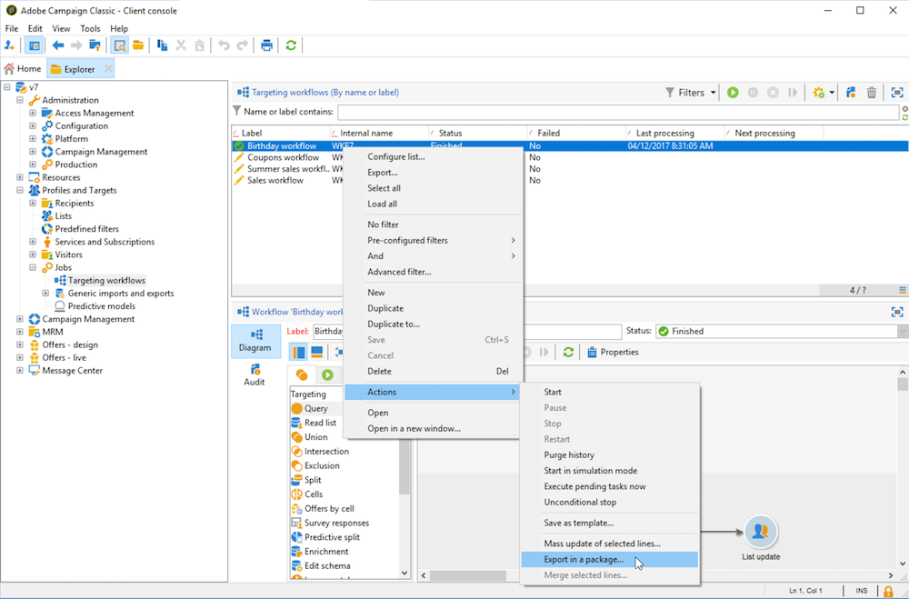
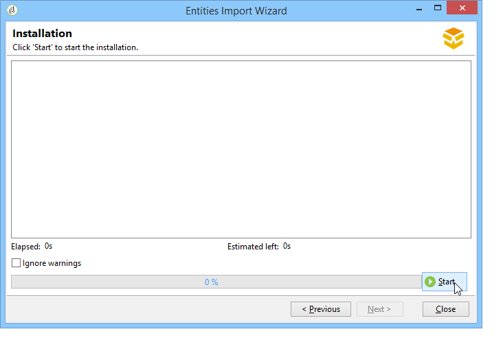

# Trabalho com pacotes de dados{#working-with-data-packages}

## Sobre pacotes de dados {#about-data-packages}

O Adobe Campaign permite exportar ou importar a configuração e os dados da plataforma por meio de um sistema de pacotes. Os pacotes podem conter diferentes tipos de configurações, elementos, filtrados ou não.

Os pacotes de dados permitem que entidades do banco de dados do Adobe Campaign sejam exibidas por meio de arquivos no formato XML. Cada entidade contida em um pacote é representada com todos os seus dados.

O princípio de **pacotes de dados** é exportar uma configuração de dados e integrá-la a outro sistema do Adobe Campaign. Saiba como manter um conjunto consistente de pacotes de dados nesta [seção](#data-package-best-practices).

### Tipos de pacotes {#types-of-packages}

Há três tipos de pacotes exportáveis: pacotes de usuário, pacotes de plataforma e pacotes de administrador.

* **Pacote do usuário**: permite que você selecione a lista de entidades a serem exportadas. Esse tipo de pacote gerencia dependências e verifica erros.
* **Pacote** Platform: inclui todos os recursos técnicos adicionados (não padrão): schemas, código JavaScript etc.

   

* **Pacote** de administração: inclui todos os modelos e objetos de negócios adicionados (não padrão): modelos, bibliotecas etc.

   

>[!CAUTION]
>
>Os tipos **plataforma** e **administrador** contêm uma lista predefinida de entidades a serem exportadas. Cada entidade está vinculada às condições de filtragem que permitem remover os recursos prontos para uso do pacote criado.

## Estrutura de dados {#data-structure}

A descrição de um pacote de dados é um documento XML estruturado que está de acordo com a gramática do schema de dados **xrk:navtree**.

Exemplo de pacote de dados:

```
<package>
  <entities schema="nms:recipient">
    <recipient email="john.smith@adobe.com" lastName="Smith" firstName="John">      
      <folder _operation="none" name="nmsRootFolder"/>      
      <company _operation="none" name="Adobe"/>
    </recipient>
  </entities>
  <entities schema="sfa:company">
    <company name="Adobe">
      location city="London" zipCode="W11 2BQ"/>
    </company>
  </entities>
</package>
```

O documento XML deve começar e terminar com o elemento **`<package>`**. Quaisquer elementos **`<entities>`** seguintes distribuem os dados por tipo de documento.

Um elemento **`<entities>`** contém os dados do pacote no formato do schema de dados inserido no atributo **schema**.

Os dados em um pacote não devem conter chaves internas incompatíveis entre as bases, como chaves geradas automaticamente (opção **autopk**).

No nosso exemplo, as associações nos links &quot;pasta&quot; e &quot;empresa&quot; foram substituídas por teclas de &quot;alto nível&quot; nas tabelas de destino:

```
<recipient>
  <folder _operation="none" name="nmsRootFolder"/>
  <company _operation="none" name="Adobe"/>
</recipient>
```

O atributo **`operation`** com o valor &quot;none&quot; define um link de reconciliação.

Um pacote de dados pode ser construído manualmente a partir de qualquer editor de texto. Basta garantir que a estrutura do documento XML esteja em conformidade com o schema de dados &quot;xtk:navtree&quot;. O console do Adobe Campaign tem um módulo de importação e exportação de pacotes de dados.

## Exportação de pacotes {#exporting-packages}

### Sobre a exportação de pacotes {#about-package-export}

Os pacotes podem ser exportados de três formas diferentes:

* O **[!UICONTROL Package Export Wizard]** permite exportar um conjunto de objetos em um único pacote. Para obter mais informações, consulte [Exportação de um conjunto de objetos em um pacote](#exporting-a-set-of-objects-in-a-package)
* Um **único objeto** pode ser exportado diretamente em um pacote ao clicar com o botão direito do mouse e depois selecionar **[!UICONTROL Actions > Export in a package]**.
* As **definições de pacote** permitem criar uma estrutura de pacote na qual você adiciona objetos que serão exportados posteriormente em um pacote. Para obter mais informações, consulte [Gerenciamento de definições de pacote](#managing-package-definitions).

Após a exportação, é possível importar o pacote e todas as entidades adicionadas para outra instância do Campaign.

### Exportação de um conjunto de objetos em um pacote {#exporting-a-set-of-objects-in-a-package}

O assistente de exportação de pacotes pode ser acessado no menu **[!UICONTROL Tools > Advanced > Export package...]** do console do cliente do Adobe Campaign.


Para os três tipos de pacotes, o assistente oferece as seguintes etapas:

1. Listar as entidades a serem exportadas por tipo de documento:

   

   >[!CAUTION]
   >
   >Se exportar um tipo de pasta **[!UICONTROL Offer category]**, **[!UICONTROL Offer environment]**, **[!UICONTROL Program]** ou **[!UICONTROL Plan]**, nunca selecione a **xtk:folder**, já que alguns dados podem ser perdidos. Selecione a entidade que corresponde à pasta: **nms:offerCategory** para categorias de ofertas, **nms:offerEnv** para ambientes de ofertas, **nms:program** para programas e **nms:plan** para planos.

   O gerenciamento de listas permite adicionar ou excluir entidades para exportação da configuração. Clique em **[!UICONTROL Add]** para selecionar uma nova entidade.

   O botão **[!UICONTROL Detail]** edita a configuração selecionada.

   >[!NOTE]
   >
   >O mecanismo de dependência controla a sequência de exportação da entidade. Para obter mais informações, consulte [Gerenciamento de dependências](#managing-dependencies).

1. A tela de configuração da entidade define o query de filtro no tipo de documento a ser extraído.

   Você deve configurar a cláusula de filtragem para extração de dados.

   

   >[!NOTE]
   >
   >O editor de query é apresentado [nesta seção](../../platform/using/about-queries-in-campaign.md).

1. Clique em **[!UICONTROL Next]** e selecione as colunas de classificação para ordenar os dados durante a extração:

   

1. Pré-visualize os dados a serem extraídos antes de executar a exportação.

   

1. A última página do assistente de exportação de pacotes permite iniciar a exportação. Os dados serão armazenados no arquivo indicado no campo **[!UICONTROL File]**.

   

### Gerenciamento de dependências {#managing-dependencies}

O mecanismo de exportação permite que o Adobe Campaign rastreie os links entre os vários elementos exportados.

Esse mecanismo é definido por duas regras:

* objetos vinculados a um link com uma integridade do tipo **own** ou **owncopy** são exportados no mesmo pacote que o objeto exportado.
* objetos vinculados a um link com um tipo de integridade **neutral** ou **define** (link definido) devem ser exportados separadamente.

>[!NOTE]
>
>Os tipos de integridade vinculados a elementos do schema são definidos nesta [seção](../../configuration/using/database-mapping.md#links--relation-between-tables).

#### Exportação de uma campanha {#exporting-a-campaign}

Veja aqui um exemplo de como exportar uma campanha. A campanha de marketing a ser exportada contém uma tarefa (rótulo: &quot;MyTask&quot;) e um workflow (rótulo: &quot;CampaignWorkflow&quot;) em uma pasta &quot;MyWorkflow&quot; (nó: Administration / Production / Technical workflows / Campaign processes / MyWorkflow).

A tarefa e o workflow são exportados no mesmo pacote que a campanha desde que os schemas correspondentes sejam conectados por links com uma integridade do tipo &quot;own&quot;.

Conteúdo do pacote:

```
<?xml version='1.0'?>
<package author="Administrator (admin)" buildNumber="7974" buildVersion="6.1" img=""
label="" name="" namespace="" vendor="">
 <desc></desc>
 <version buildDate="2013-01-09 10:30:18.954Z"/>
 <entities schema="nms:operation">
  <operation duration="432000" end="2013-01-14" internalName="OP1" label="MyCampaign"
  modelName="opEmpty" start="2013-01-09">
   <controlGroup>
    <where filteringSchema=""/>
   </controlGroup>
   <seedList>
    <where filteringSchema="nms:seedMember"></where>
    <seedMember internalName="SDM1"></seedMember>
   </seedList>
   <parameter useAsset="1" useBudget="1" useControlGroup="1" useDeliveryOutline="1"
   useDocument="1" useFCPValidation="0" useSeedMember="1" useTask="1"
   useValidation="1" useWorkflow="1"></parameter>
   <fcpSeed>
    <where filteringSchema="nms:seedMember"></where>
   </fcpSeed>
   <owner _operation="none" name="admin" type="0"/>
   <program _operation="none" name="nmsOperations"/>
   <task end="2013-01-17 10:07:51.000Z" label="MyTask" name="TSK2" start="2013-01-16 10:07:51.000Z"
   status="1">
    <owner _operation="none" name="admin" type="0"/>
    <operation _operation="none" internalName="OP1"/>
    <folder _operation="none" name="nmsTask"/>
   </task>
   <workflow internalName="WKF12" label="CampaignWorkflow" modelName="newOpEmpty"
   order="8982" scenario-cs="Notification of the workflow supervisor (notifySupervisor)"
   schema="nms:recipient">
    <scenario internalName="notifySupervisor"/>
    <desc></desc>
    <folder _operation="none" name="Folder4"/>
    <operation _operation="none" internalName="OP1"/>
   </workflow>
  </operation>
 </entities>
</package>   
```

A afiliação a um tipo de pacote é definida em um schema com o atributo **@pkgAdmin e @pkgPlatform.** Esses atributos recebem uma expressão XTK que define as condições de afiliação ao pacote.

```
<element name="offerEnv" img="nms:offerEnv.png" 
template="xtk:folder" pkgAdmin="@id != 0">
```

Finalmente, o atributo **@pkgStatus** permite definir as regras de exportação para esses elementos ou atributos. Dependendo do valor do atributo, o elemento ou atributo será encontrado no pacote exportado. Os três valores possíveis para este atributo são:

* **never**: não exporta o campo ou link
* **always**: força a exportação deste campo
* **preCreate**: autoriza a criação da entidade vinculada

>[!NOTE]
>
>O valor **preCreate** é apenas admitido para eventos do tipo link. Ele autoriza criar ou apontar para uma entidade ainda não carregada no pacote exportado.

## Gerenciamento de definições de pacote {#managing-package-definitions}

### Sobre definições de pacote {#about-package-definitions}

As definições de pacote permitem criar uma estrutura de pacote na qual você adiciona entidades que serão exportadas posteriormente em um único pacote. É possível importar esse pacote e todas as entidades adicionadas para outra instância do Campaign.

**Tópicos relacionados:**

* [Criação de uma definição de pacote](#creating-a-package-definition)
* [Adição de entidades a uma definição de pacote](#adding-entities-to-a-package-definition)
* [Configuração da geração de definições de pacote](#configuring-package-definitions-generation)
* [Exportação de pacotes de uma definição de pacote](#exporting-packages-from-a-package-definition)

### Criação de uma definição de pacote {#creating-a-package-definition}

As definições de pacote podem ser acessadas no menu **[!UICONTROL Administration > Configuration > Package management > Package definitions]**.

Para criar uma definição de pacote, clique em **[!UICONTROL New]** e preencha as informações gerais sobre a definição de pacote.


Você pode então adicionar entidades à definição do pacote e exportá-lo para um pacote de arquivos XML.

**Tópicos relacionados:**

* [Adição de entidades a uma definição de pacote](#adding-entities-to-a-package-definition)
* [Configuração da geração de definições de pacote](#configuring-package-definitions-generation)
* [Exportação de pacotes de uma definição de pacote](#exporting-packages-from-a-package-definition)

### Adição de entidades a uma definição de pacote {#adding-entities-to-a-package-definition}

Na guia **[!UICONTROL Content]**, clique em **[!UICONTROL Add]** para selecionar as entidades a serem exportadas com o pacote. Práticas recomendadas ao selecionar entidades são apresentadas na seção [Exportação de um conjunto de objetos em um pacote](#exporting-a-set-of-objects-in-a-package).


As entidades podem ser adicionadas a uma definição de pacote diretamente da sua localização na instância. Para fazer isso, siga as etapas abaixo:

1. Clique com o botão direito do mouse na entidade desejada e depois selecione **[!UICONTROL Actions > Export in a package]**.

   

1. Selecione **[!UICONTROL Add to a package definition]** e depois selecione a definição de pacote à qual deseja adicionar à entidade.

   

1. A entidade é adicionada à definição do pacote e será exportada com o pacote (consulte [Exportação de pacotes de uma definição de pacote](#exporting-packages-from-a-package-definition)).

   

### Configuração da geração de definições de pacote {#configuring-package-definitions-generation}

A criação de pacote pode ser configurada na guia **[!UICONTROL Content]** de definição de pacote. Para fazer isso, clique em **[!UICONTROL Generation parameters]**.


* **[!UICONTROL Include the definition]**: inclui a definição usada atualmente na definição de pacote.
* **[!UICONTROL Include an installation script]**: permite adicionar um script javascript a ser executado na importação de pacotes. Quando selecionada, uma guia **[!UICONTROL Script]** é adicionada na tela de definição de pacote.
* **[!UICONTROL Include default values]**: adiciona os valores de todos os atributos da entidade ao pacote.

   Essa opção não está selecionada por padrão para evitar exportações demoradas. Isso significa que os atributos das entidades com valores padrão (&#39;string vazia&#39;, &#39;0&#39; e &#39;falso&#39; se não definido de outra forma no schema) não serão adicionados ao pacote e, portanto, não serão exportados.

   >[!CAUTION]
   >
   >Desmarcar essa opção pode mesclar as versões local e importada.
   >
   >Se a instância onde o pacote for importado contiver entidades idênticas ao próprio pacote (por exemplo, com a mesma ID externa), então seus atributos não serão atualizados. Isso pode ocorrer se os atributos da instância anterior possuírem valores padrão, pois não estão incluídos no pacote.
   >
   >Nesse caso, selecionar a opção **[!UICONTROL Include default values]** impediria mesclar as versões, pois todos os atributos da instância anterior seriam exportados com o pacote.

### Exportação de pacotes de uma definição de pacote {#exporting-packages-from-a-package-definition}

Siga as etapas abaixo para exportar um pacote de uma definição de pacote:

1. Escolha a definição de pacote que será exportada, clique no botão **[!UICONTROL Actions]** e selecione **[!UICONTROL Export the package]**.
1. Um arquivo XML correspondente ao pacote exportado é selecionado por padrão. Ele é nomeado de acordo com o nome e o namespace da definição de pacote.
1. Após definir o nome e o local do pacote, clique no botão **[!UICONTROL Start]** para iniciar a exportação.

   

## Importação de pacotes {#importing-packages}

### Sobre importação de pacotes {#about-package-import}

O assistente de importação de pacotes pode ser acessado pelo menu principal **[!UICONTROL Tools > Advanced > Package import...]** do console do cliente do Adobe Campaign.

You can import a package from an export performed earlier, e.g. from another Adobe Campaign instance, or a [built-in package](../../installation/using/installing-campaign-standard-packages.md), depending on the terms of your license.


### Instalação de um pacote de um arquivo {#installing-a-package-from-a-file}

Para importar um pacote de dados existente, selecione o arquivo XML e clique em **[!UICONTROL Open]**.


O conteúdo do pacote a ser importado é exibido na seção intermediária do editor.

Clique em **[!UICONTROL Next]** e em **[!UICONTROL Start]** para iniciar a importação.



### Installing a built-in package {#installing-a-standard-package}

Os pacotes padrão são pacotes incorporados, instalados quando o Adobe Campaign é configurado. Dependendo das suas permissões e do modelo de implantação, é possível importar novos pacotes padrão se adquirir novas opções ou add-ons ou se atualizar para uma nova oferta.

Consulte o contrato de licença para verificar quais pacotes você pode instalar.

For more information on built-in packages, refer to [this page](../../installation/using/installing-campaign-standard-packages.md).

## Práticas recomendadas para o Pacote de dados {#data-package-best-practices}

Esta seção descreve como organizar pacotes de dados de forma consistente durante a vida útil do projeto.

Os pacotes podem conter diferentes tipos de configurações e elementos, filtrados ou não. Se você perder alguns elementos ou não importar elementos/pacotes na ordem correta, a configuração da plataforma poderá ser interrompida.

Além disso, com várias pessoas trabalhando na mesma plataforma com vários recursos diferentes, a pasta de especificações do pacote pode se tornar complexa rapidamente.

Embora isso não seja obrigatório, esta seção oferece uma solução para ajudar a organizar e usar pacotes no Adobe Campaign para projetos de grande escala.

As principais restrições são as seguintes:
* Organize os pacotes e acompanhe quando e o que foi alterado
* Se uma configuração for atualizada, minimize o risco de dividir algo que não esteja diretamente vinculado à atualização

>[!NOTE]
>
>Para obter mais informações sobre como configurar um workflow para exportar pacotes automaticamente, consulte [esta página](https://helpx.adobe.com/br/campaign/kb/export-packages-automatically.html).

### Recomendações {#data-package-recommendations}

Sempre importe dentro da mesma versão da plataforma. Você deve verificar se implantou seus pacotes entre duas instâncias que têm a mesma build. Nunca force a importação e sempre atualize a plataforma primeiro (se a build for diferente).

>[!IMPORTANT]
>
>A Adobe não oferece suporte à importação entre diferentes versões.
<!--This is not allowed. Importing from 6.02 to 6.1, for example, is prohibited. If you do so, R&D won’t be able to help you resolve any issues you encounter.-->

Preste atenção ao schema e à estrutura do banco de dados. A importação do pacote com o schema deve ser seguida pela geração do schema.

### Solução {#data-package-solution}

#### Tipos de pacotes {#package-types}

Comece definindo diferentes tipos de pacotes. Serão usados apenas quatro tipos:

**Entidades**
* Todos os elementos específicos &quot;xtk&quot; e &quot;nms&quot; no Adobe Campaign como schemas, formulários, pastas, templates do delivery etc.
* Você pode considerar uma entidade como um elemento &quot;admin&quot; e &quot;platform&quot;.
* Você não deve incluir mais de uma entidade em um pacote ao carregá-lo em uma instância do Campaign.

<!--Nothing “works” alone. An entity package does not have a specific role or objective.-->

Se precisar implantar sua configuração em uma nova instância, você poderá importar todos os pacotes de entidade.

**Recursos**

Este tipo de pacote:
* Responde a um requisito/especificação do cliente.
* Contém uma ou várias funcionalidades.
* Deve conter todas as dependências para poder executar a funcionalidade sem qualquer outro pacote.

**Campanhas**

Este pacote não é obrigatório. Às vezes, é útil criar um tipo específico para todas as campanhas, mesmo se uma campanha puder ser vista como um recurso.

**Atualizações**

Depois de configurado, um recurso pode ser exportado para outro ambiente. Por exemplo, o pacote pode ser exportado de um ambiente dev para um ambiente de teste. Neste teste, um defeito é revelado. Primeiro, ele precisa ser corrigido no ambiente dev. Em seguida, o patch deve ser aplicado na plataforma de teste.

A primeira solução seria exportar todo o recurso novamente. Mas, para evitar qualquer risco (atualizar elementos indesejados), é mais seguro dispor de um pacote que contenha apenas a correção.

É por isso que recomendamos criar um pacote de &quot;atualização&quot;, contendo apenas um tipo de entidade do recurso.

Uma atualização não pode ser apenas uma correção, mas também um novo elemento do seu pacote de entidade/recurso/campanha. Para evitar a implantação de todo o pacote, é possível exportar um pacote de atualização.

### Como nomear convenções {#data-package-naming}

Agora que os tipos estão definidos, devemos especificar uma convenção de nomenclatura. O Adobe Campaign não permite criar subpastas para especificações de pacotes, o que significa que os números são a melhor solução para se manter organizado. Nomes de pacote de prefixos de números. Você pode usar a seguinte convenção:

* Entidade: de 1 a 99
* Recurso: de 100 a 199
* Campanha: de 200 a 299
* Atualização: de 5000 a 5999

### Pacotes {#data-packages}

>[!NOTE]
>
>É melhor configurar regras para definir o número correto de pacotes.

#### Ordem dos pacotes de entidade {#entity-packages-order}

Para ajudar na importação, os pacotes de entidade devem ser ordenados, pois serão importados. Por exemplo:
* 001 - Schema
* 002 - Formulário
* 003 - Imagens
* etc.

>[!NOTE]
>
>Os formulários devem ser importados somente após as atualizações do schema.

#### Pacote 200 {#package-200}

O número do pacote &quot;200&quot; não deve ser utilizado para uma campanha específica: este número será usado para atualizar algo que diz respeito a todas as campanhas.

#### Atualizar pacote {#update-package}

O último ponto diz respeito à numeração do pacote de atualização. É o número do seu pacote (entidade, recurso ou campanha) com um prefixo &quot;5&quot;. Por exemplo:
* 5001 para atualizar um schema
* 5200 para atualizar todas as campanhas
* 5101 para atualizar o recurso 101

O pacote de atualização deve conter apenas uma entidade específica para ser facilmente reutilizável. Para dividi-los, adicione um novo número (comece por 1). Não há regras de pedido específicas para esses pacotes. Para entender melhor, imagine que temos um recurso 101, um aplicativo social:
* Ele contém um webApp e uma conta externa.
   * O rótulo do pacote é: 101 - Aplicativo social (socialApplication).
* Há um defeito no webApp.
   * O wepApp está corrigido.
   * É necessário criar um pacote de correção com o seguinte nome: 5101 - 1 - Aplicativo social webApp (socialApplication_webApp).
* É necessário adicionar uma nova conta externa para o recurso social.
   * A conta externa é criada.
   * O novo pacote é: 5101 - 2 - Conta externa do aplicativo social (socialApplication_extAccount).
   * Paralelamente, o pacote 101 é atualizado para ser adicionado à conta externa, mas não é implantado.
      

#### Documentação do pacote {#package-documentation}

Ao atualizar um pacote, você deve sempre colocar um comentário no campo de descrição para detalhar quaisquer modificações e motivos (por exemplo, &quot;adicionar um novo schema&quot; ou &quot;corrigir um defeito&quot;).


Você também deve datar o comentário. Relate sempre seu comentário em um pacote de atualização ao &quot;principal&quot; (pacote sem o prefixo 5).

>[!IMPORTANT]
>
>O campo de descrição só pode conter até 2.000 caracteres.