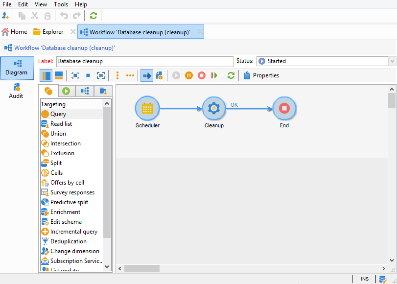

# Fluxo de trabalho de limpeza do banco de dados{#database-cleanup-workflow}


## Introdução {#introduction}

O workflow **[!UICONTROL Database cleanup]** acessível por meio do nó **[!UICONTROL Administration > Production > Technical workflows]** permite excluir dados obsoletos para evitar o crescimento exponencial do banco de dados. O workflow é acionado automaticamente sem a intervenção do usuário.



## Configuração {#configuration}

A limpeza do banco de dados é configurada em dois níveis: no scheduler de workflow e no assistente de implantação.

### Scheduler do workflow {#the-scheduler}

>[!NOTE]
>
>Para saber mais sobre o scheduler, consulte [esta seção](../../workflow/using/scheduler.md).

Por padrão, o workflow **[!UICONTROL Database cleanup]** é configurado para iniciar diariamente às 4h. O scheduler permite alterar a frequência de acionamento do workflow. As seguintes frequências estão disponíveis:

* **[!UICONTROL Several times a day]**
* **[!UICONTROL Daily]**
* **[!UICONTROL Weekly]**
* **[!UICONTROL Once]**


>[!IMPORTANT]
>
>Para que o workflow **[!UICONTROL Database cleanup]** inicie na data e hora definidas no scheduler, o mecanismo de workflow (wfserver) deve ser iniciado. Se esse não for o caso, a limpeza do banco de dados não ocorrerá até a próxima vez que o mecanismo de workflow for iniciado.

### Assistente de implantação {#deployment-wizard}

O **[!UICONTROL Deployment wizard]**, acessado pelo menu **[!UICONTROL Tools > Advanced]**, permite configurar por quanto tempo os dados são salvos. Os valores são expressos em dias. Se esses valores não forem alterados, o workflow usará os valores padrão.


Os campos da janela **[!UICONTROL Purge of data]** coincidem com as seguintes opções. Eles são usados por algumas das tarefas executadas pelo workflow **[!UICONTROL Database cleanup]**:

* Rastreamento consolidado: **NmsCleanup_TrackingStatPurgeDelay** (consulte [Limpeza de logs de rastreamento](#cleanup-of-tracking-logs))
* Logs do delivery: **NmsCleanup_BroadLogPurgeDelay** (consulte [Limpeza de logs de delivery](#cleanup-of-delivery-logs))
* Logs de rastreamento: **NmsCleanup_TrackingLogPurgeDelay** (consulte [Limpeza de logs de rastreamento](#cleanup-of-tracking-logs))
* Deliveries excluídos: **NmsCleanup_RecycledDeliveryPurgeDelay** (consulte [Limpeza de deliveries a serem excluídos ou reciclados](#cleanup-of-deliveries-to-be-deleted-or-recycled))
* Importar rejeições: **NmsCleanup_RejectsPurgeDelay** (consulte [Limpeza de rejeições geradas por importações](#cleanup-of-rejects-generated-by-imports-))
* Perfis do visitante: **NmsCleanup_VisitorPurgeDelay** (consulte [Limpeza de visitantes](#cleanup-of-visitors))
* Apresentações da oferta: **NmsCleanup_PropositionPurgeDelay** (consulte [Limpeza de propostas](#cleanup-of-propositions))

   >[!NOTE]
   >
   >O campo **[!UICONTROL Offer propositions]** só está disponível quando o módulo **Interaction** está instalado.

* Eventos: **NmsCleanup_EventPurgeDelay** (consulte [Limpar eventos expirados](#cleansing-expired-events))
* Eventos arquivados: **NmsCleanup_EventHistoPurgeDelay** (consulte [Limpar eventos expirados](#cleansing-expired-events))

   >[!NOTE]
   >
   >Os campos **[!UICONTROL Events]** e **[!UICONTROL Archived events]** só estarão disponíveis se o módulo **Centro de Mensagens** estiver instalado.

* Trilha de auditoria: **XtkCleanup_AuditTrailPurgeDelay** (consulte [Limpeza da trilha de auditoria](#cleanup-of-audit-trail))

Todas as tarefas executadas pelo workflow **[!UICONTROL Database cleanup]** são descritas na seção a seguir.

## Tarefas realizadas pelo workflow de limpeza do banco de dados {#tasks-carried-out-by-the-database-cleanup-workflow}

Na data e hora definidas no agendador do workflow (consulte [O agendador](#the-scheduler)), o mecanismo de workflow inicia o processo de limpeza do banco de dados. A limpeza do banco de dados se conecta ao banco de dados e executa as tarefas na sequência mostrada abaixo.

>[!IMPORTANT]
>
>Se uma dessas tarefas falhar, as seguintes não serão executadas.\
>As consultas SQL com um atributo **LIMIT** serão executadas repetidamente até que todas as informações sejam processadas.

>[!NOTE]
>
>As seções abaixo que descrevem as tarefas realizadas pelo workflow de limpeza do banco de dados são reservadas para administradores de banco de dados ou usuários familiarizados com a linguagem SQL.

### Listas para excluir limpeza {#lists-to-delete-cleanup}

A primeira tarefa executada pelo workflow **[!UICONTROL Database cleanup]** exclui todos os grupos com o **deleteStatus != 0** do atributo **NmsGroup**. Os registros vinculados a esses grupos e que existem em outras tabelas também são excluídos.

1. As listas a serem excluídas são recuperadas usando a seguinte consulta SQL:

   ```
   SELECT iGroupId, sLabel, iType FROM NmsGroup WHERE iDeleteStatus <> 0 OR tsExpirationDate <= GetDate() 
   ```

1. Cada lista tem vários links para outras tabelas. Todos esses links são excluídos em massa usando a seguinte query:

   ```
   DELETE FROM $(relatedTable) WHERE iGroupId=$(l) IN (SELECT iGroupId FROM $(relatedTable) WHERE iGroupId=$(l) LIMIT 5000) 
   ```

   onde **$(relatedTable)** é uma tabela relacionada a **NmsGroup** e **$(l)** é o identificador da lista.

1. Quando a lista é do tipo &quot;Lista&quot;, a tabela associada é excluída usando a seguinte query:

   ```
   DROP TABLE grp$(l)
   ```

1. Cada lista de tipo **Select** recuperada pela operação é excluída usando a seguinte consulta:

   ```
   DELETE FROM NmsGroup WHERE iGroupId=$(l) 
   ```

   onde **$(l)** é o identificador da lista

### Limpeza de entregas a eliminar ou reciclar {#cleanup-of-deliveries-to-be-deleted-or-recycled}

Essa tarefa limpa todos os deliveries a serem excluídos ou reciclados.

1. O workflow **[!UICONTROL Database cleanup]** seleciona todos os deliveries para os quais o campo **deleteStatus** tem o valor **[!UICONTROL Yes]** ou **[!UICONTROL Recycled]** e cuja data de exclusão é anterior ao período definido no campo **[!UICONTROL Deleted deliveries]** (**NmsCleanup_RecycledDeliveryPurge**) do assistente de implantação. Para obter mais informações, consulte [Assistente de implantação](#deployment-wizard). Esse período é calculado em relação à data atual do servidor.
1. Para cada servidor mid-sourcing, a tarefa seleciona a lista de deliveries a serem excluídos.
1. O workflow **[!UICONTROL Database cleanup]** exclui logs do delivery, anexos, informações de mirror page e todos os outros dados relacionados.
1. Antes de excluir o delivery para sempre, o workflow limpa as informações vinculadas das seguintes tabelas:

   * Na tabela de exclusão de delivery (**NmsDlvExclusion**), a seguinte query é usada:

      ```
      DELETE FROM NmsDlvExclusion WHERE iDeliveryId=$(l)
      ```

      onde **$(l)** é o identificador do delivery.

   * Na tabela de cupom (**NmsCouponValue**), a seguinte consulta é usada (com exclusões em massa):

      ```
      DELETE FROM NmsCouponValue WHERE iMessageId IN (SELECT iMessageId FROM NmsCouponValue WHERE EXISTS (SELECT B.iBroadLogId FROM $(BroadLogTableName) B WHERE B.iDeliveryId = $(l) AND B.iBroadLogId = iMessageId ) LIMIT 5000)
      ```

      onde **$(l)** é o identificador do delivery.

   * Nas tabelas de log de delivery (**NmsBroadlogXxx**), as exclusões em massa são executadas em lotes de 20.000 registros.
   * Nas tabelas de apresentação de oferta (**NmsPropositionXxx**), as exclusões em massa são executadas em lotes de 20.000 registros.
   * Nas tabelas de log de rastreamento (**NmsTrackinglogXxx**), as exclusões em massa são executadas em lotes de 20.000 registros.
   * Na tabela do fragmento de delivery (**NmsDeliveryPart**), as exclusões em massa são executadas em lotes de 500.000 registros. Esta tabela contém informações de personalização das mensagens restantes a serem entregues.
   * Na tabela de fragmento de dados da mirror page (**NmsMirrorPageInfo**), as exclusões em massa são executadas em lotes de 20.000 registros para partes de delivery expiradas e para partes concluídas ou canceladas. Esta tabela contém informações de personalização de todas as mensagens usadas para gerar mirror pages.
   * Na tabela de pesquisa da mirror page (**NmsMirrorPageSearch**), as exclusões em massa são executadas em lotes de 20.000 registros. Esta tabela é um índice de pesquisa que fornece acesso às informações de personalização armazenadas na tabela **NmsMirrorPageInfo**.
   * Na tabela de log do processo em lote (**XtkJobLog**), as exclusões em massa são executadas em lotes de 20.000 registros. Esta tabela contém o log de deliveries a serem excluídos.
   * Na tabela de rastreamento de URL de delivery (**NmsTrackingUrl**), a seguinte query é usada:

      ```
      DELETE FROM NmsTrackingUrl WHERE iDeliveryId=$(l)
      ```

      onde **$(l)** é o identificador do delivery.

      Esta tabela contém os URLs encontrados nos deliveries a serem excluídos para permitir o rastreamento.

1. O delivery é excluído da tabela de delivery (**NmsDelivery**):

   ```
   DELETE FROM NmsDelivery WHERE iDeliveryId = $(l)
   ```

   onde **$(l)** é o identificador do delivery.

#### Deliveries usando mid-sourcing {#deliveries-using-mid-sourcing}

O workflow **[!UICONTROL Database cleanup]** também exclui os deliveries no(s) servidor(es) de mid-sourcing.

1. Para fazer isso, o workflow verifica se cada delivery está inativo (com base em seu status). Se um delivery estiver ativo, ele será interrompido antes de ser excluído. A verificação é realizada executando a seguinte consulta:

   ```
   SELECT iState FROM NmsDelivery WHERE iDeliveryId = $(l) AND iState <> 100;
   ```

   onde **$(l)** é o identificador do delivery.

1. Se o valor do status for **[!UICONTROL Start pending]** , **[!UICONTROL In progress]** , **[!UICONTROL Recovery pending]** , **[!UICONTROL Recovery in progress]** , **[!UICONTROL Pause requested]** , **[!UICONTROL Pause in progress]** ou **[!UICONTROL Paused]** (valores 51, 55, 61, 62, 71, 72, 75), o delivery será interrompido e a tarefa limpará as informações vinculadas.

### Limpeza de deliveries expirados {#cleanup-of-expired-deliveries}

Esta tarefa interrompe os deliveries cujo período de validade expirou.

1. O workflow **[!UICONTROL Database cleanup]** cria a lista de deliveries que expiraram. Esta lista inclui todos os deliveries expirados com um status diferente de **[!UICONTROL Finished]** , bem como deliveries interrompidos recentemente com mais de 10.000 mensagens não processadas. A seguinte query é usada:

   ```
   SELECT iDeliveryId, iState FROM NmsDelivery WHERE iDeleteStatus=0 AND iIsModel=0 AND iDeliveryMode=1 AND ( (iState >= 51 AND iState < 85 AND tsValidity IS NOT NULL AND tsValidity < $(currentDate) ) OR (iState = 85 AND DateMinusDays(15) < tsLastModified AND iToDeliver - iProcessed >= 10000 ))
   ```

   em que **modo de delivery 1** corresponde ao modo **[!UICONTROL Mass delivery]**, **state 51** corresponde ao estado **[!UICONTROL Start pending]**, **state 85** corresponde ao estado **[!UICONTROL Stopped]** e o maior número de logs de delivery atualizado em massa no servidor de delivery é igual a 10.000.

1. O workflow então inclui a lista de deliveries expirados recentemente que usam mid-sourcing. Os deliveries para os quais nenhum log de delivery foi recuperado por meio do servidor mid-sourcing são excluídos.

   A seguinte query é usada:

   ```
   SELECT iDeliveryId, tsValidity, iMidRemoteId, mData FROM NmsDelivery WHERE (iDeliveryMode = 4 AND (iState = 85 OR iState = 95) AND tsValidity IS NOT NULL AND (tsValidity < SubDays(GetDate() , 15) OR tsValidity < $(DateOfLastLogPullUp)) AND tsLastModified > SubDays(GetDate() , 15))
   ```

1. A query a seguir é usada para detectar se a conta externa ainda está ativa ou não, para filtrar os deliveries por data:

   ```
   SELECT iExtAccountId FROM NmsExtAccount WHERE iActive<>0 AND sName=$(providerName)
   ```

1. Na lista de deliveries expirados, os logs do delivery cujo status é **[!UICONTROL Pending]** , alternam para **[!UICONTROL Delivery cancelled]** e todos os deliveries nessa lista alternam para **[!UICONTROL Finished]** .

   As seguintes consultas são usadas:

   ```
   UPDATE $(BroadLogTableName) SET tsLastModified=$(curdate), iStatus=7, iMsgId=$(bl) WHERE iDeliveryId=$(dl) AND iStatus=6
   ```

   onde **$(curdate)** é a data atual do servidor de banco de dados, **$(bl)** é o identificador da mensagem de logs do delivery, **$(dl)** é o identificador do delivery, **o status do delivery 6** corresponde ao status **[!UICONTROL Pending]** e **do delivery 7 a10/> corresponde ao status **[!UICONTROL Delivery cancelled]**.**

   ```
   UPDATE NmsDelivery SET iState = 95, tsLastModified = $(curdate), tsBroadEnd = tsValidity WHERE iDeliveryId = $(dl)
   ```

   onde **estado de delivery 95** corresponde ao status **[!UICONTROL Finished]** e **$(dl)** é o identificador do delivery.

1. Todos os fragmentos (**deliveryParts**) de deliveries obsoletos são excluídos e todos os fragmentos obsoletos de deliveries de notificação em andamento são excluídos. A exclusão em massa é usada para ambas as tarefas.

   As seguintes consultas são usadas:

   ```
   DELETE FROM NmsDeliveryPart WHERE iDeliveryPartId IN (SELECT iDeliveryPartId FROM NmsDeliveryPart WHERE iDeliveryId IN (SELECT iDeliveryId FROM NmsDelivery WHERE iState=95 OR iState=85) LIMIT 5000)
   ```

   ```
   DELETE FROM NmsDeliveryPart WHERE iDeliveryPartId IN (SELECT iDeliveryPartId FROM NmsDeliveryPart WHERE tsValidity < $(curDate) LIMIT 500000)
   ```

   onde **estado de delivery 95** corresponde ao status **[!UICONTROL Finished]**, **estado de delivery 85** corresponde ao status **[!UICONTROL Stopped]**, e **$(curDate)** é a data atual do servidor.

### Limpeza de mirror pages {#cleanup-of-mirror-pages}

Essa tarefa exclui os recursos da Web (mirror pages) usados pelos deliveries.

1. Primeiro, a lista de deliveries a serem removidos é recuperada usando a seguinte query:

   ```
   SELECT iDeliveryId, iNeedMirrorPage FROM NmsDelivery WHERE iWebResPurged = 0 AND tsWebValidity IS NOT NULL AND tsWebValidity < $(curdate)"
   ```

   onde **$(curDate)** é a data atual do servidor.

1. A tabela **NmsMirrorPageInfo** é então removida, se necessário usando o identificador do delivery recuperado anteriormente. A exclusão em massa é usada para gerar as seguintes consultas:

   ```
   DELETE FROM NmsMirrorPageInfo WHERE iMirrorPageInfoId IN (SELECT iMirrorPageInfoId FROM NmsMirrorPageInfo WHERE iDeliveryId = $(dl)) LIMIT 5000)
   ```

   ```
   DELETE FROM NmsMirrorPageSearch WHERE iMessageId IN (SELECT iMessageId FROM NmsMirrorPageSearch WHERE iDeliveryId = $(dl)) LIMIT 5000)
   ```

   onde **$(dl)** é o identificador do delivery.

1. Uma entrada é então adicionada ao log de delivery.
1. Os deliveries removidos são identificados, para evitar a necessidade de reprocessá-los posteriormente. A seguinte query é executada:

   ```
   UPDATE NmsDelivery SET iWebResPurged = 1 WHERE iDeliveryId IN ($(strIn))
   ```

   onde **$(strIn)** é a lista de identificadores de delivery.

### Limpeza de tabelas de trabalho {#cleanup-of-work-tables}

Essa tarefa é excluída do banco de dados, todas as tabelas de trabalho que correspondem aos deliveries cujo status é **[!UICONTROL Being edited]** , **[!UICONTROL Stopped]** ou **[!UICONTROL Deleted]** .

1. A lista de tabelas com nomes começando com **wkDlv_** é recuperada primeiro com a seguinte query (postgresql):

   ```
   SELECT relname FROM pg_class WHERE relname LIKE Lower('wkDlv_') ESCAPE E'\\' AND relkind IN ('r','v') AND pg_get_userbyid(relowner)<>'postgres'
   ```

1. As tabelas usadas pelos workflows em andamento são excluídas. Para fazer isso, a lista de deliveries em andamento é recuperada usando a seguinte query:

   ```
   SELECT iDeliveryId FROM NmsDelivery WHERE iDeliveryId<>0 AND iDeleteStatus=0 AND iState NOT IN (0,85,100);
   ```

   onde 0 é o valor que corresponde ao status **[!UICONTROL Being edited]** do delivery, 85 corresponde ao status **[!UICONTROL Stopped]** e 100 corresponde ao status **[!UICONTROL Deleted]**.

1. As tabelas que não forem mais usadas serão excluídas usando a seguinte query:

   ```
   DROP TABLE wkDlv_15487_1;
   ```

### Limpeza de rejeições geradas por importações {#cleanup-of-rejects-generated-by-imports-}

Esta etapa permite excluir registros para os quais todos os dados não foram processados durante a importação.

1. A exclusão em massa é realizada na tabela **XtkReject** com a seguinte query:

   ```
   DELETE FROM XtkReject WHERE iRejectId IN (SELECT iRejectId FROM XtkReject WHERE tsLog < $(curDate)) LIMIT $(l))
   ```

   em que **$(curDate)** é a data do servidor atual a partir da qual subtraímos o período definido para a opção **NmsCleanup_RejectsPurgeDelay** (consulte [Assistente de implantação](#deployment-wizard)) e **$(l)** é o número máximo de registros a serem excluídos em massa .

1. Todas as rejeições órfãs são excluídas usando a seguinte query:

   ```
   DELETE FROM XtkReject WHERE iJobId NOT IN (SELECT iJobId FROM XtkJob)
   ```

### Limpeza de instâncias de fluxo de trabalho {#cleanup-of-workflow-instances}

Essa tarefa limpa cada instância de workflow usando seu identificador (**lWorkflowId**) e histórico (**lHistory**). Ele exclui tabelas inativas executando a tarefa de limpeza da tabela de trabalho novamente. A limpeza também exclui todas as tabelas de trabalho órfãs (wkf% e wkfhisto%) dos fluxos de trabalho excluídos.

>[!NOTE]
>
>A frequência de limpeza do histórico é especificada para cada workflow no campo **History in days** (valor padrão 30 dias). Esse campo pode ser encontrado na guia **Execution** das propriedades do workflow. Para obter mais informações, consulte [esta seção](../../workflow/using/workflow-properties.md#execution).

1. Para recuperar a lista de workflows a serem excluídos, a seguinte query é usada:

   ```
   SELECT iWorkflowId, iHistory FROM XtkWorkflow WHERE iWorkflowId<>0
   ```

1. Esta query gera a lista de workflows que será usada para excluir todos os logs vinculados, tarefas concluídas e eventos concluídos, usando as seguintes queries:

   ```
   DELETE FROM XtkWorkflowLog WHERE iWorkflowId=$(lworkflow) AND tsLog < DateMinusDays($(lhistory))
   ```

   ```
   DELETE FROM XtkWorkflowTask WHERE iWorkflowId=$(lworkflow) AND iStatus<>0 AND tsCompletion < DateMinusDays($(lhistory)) 
   ```

   ```
   DELETE FROM XtkWorkflowEvent WHERE iWorkflowId=$(l) AND iStatus>2 AND tsProcessing < DateMinusDays($(lHistory))
   ```

   onde **$(workflow)** é o identificador do workflow e **$(lhistory)** é o identificador do histórico.

1. Todas as tabelas não utilizadas são excluídas. Para essa finalidade, todas as tabelas são coletadas graças a uma máscara do tipo **wkf%** usando a seguinte query (postgresql):

   ```
   SELECT relname FROM pg_class WHERE relname LIKE Lower('wkf%') ESCAPE E'\\' AND relkind IN ('r','v') AND pg_get_userbyid(relowner)<>'postgres'
   ```

1. Em seguida, todas as tabelas usadas por uma instância de workflow pendente são excluídas. A lista de workflows ativos é recuperada usando a seguinte query:

   ```
   SELECT iWorkflowId FROM XtkWorkflow WHERE iWorkflowId<>0 AND iState<>20
   ```

1. Cada identificador de workflow é então recuperado para localizar o nome das tabelas usadas pelos workflows em andamento. Esses nomes são excluídos da lista de tabelas recuperadas anteriormente.
1. As tabelas do histórico de atividades do tipo &quot;query incremental&quot; são excluídas usando os seguintes queries:

   ```
   SELECT relname FROM pg_class WHERE relname LIKE Lower('wkfhisto%') ESCAPE E'\\' AND relkind IN ('r','v') AND pg_get_userbyid(relowner)<>'postgres'
   ```

   ```
   SELECT iWorkflowId FROM XtkWorkflow WHERE iWorkflowId IN ($(strCondition))
   ```

   onde **$(strcondition)** é a lista de tabelas que correspondem à máscara **wkfhisto%**.

1. As tabelas restantes são excluídas usando a seguinte query:

   ```
   DROP TABLE wkf15487_12;
   ```

### Limpeza de logons de workflow {#cleanup-of-workflow-logins}

Essa tarefa exclui os logons do workflow usando a seguinte query:

```
DELETE FROM XtkWorkflowLogin WHERE iWorkflowId NOT IN (SELECT iWorkflowId FROM XtkWorkflow)
```

### Limpeza de tabelas de trabalho órfãs {#cleanup-of-orphan-work-tables}

Esta tarefa exclui tabelas de trabalho órfãs vinculadas a grupos. A tabela **NmsGroup** armazena os grupos a serem limpos (com um tipo diferente de 0). O prefixo dos nomes da tabela é **grp**. Para identificar os grupos a serem limpos, a seguinte query é usada:

```
SELECT iGroupId FROM NmsGroup WHERE iType>0"
```

### Limpeza de visitantes {#cleanup-of-visitors}

Essa tarefa exclui registros obsoletos da tabela do visitante usando exclusão em massa. Registros obsoletos são aqueles para os quais a última modificação é anterior ao período de conservação definido no assistente de implantação (consulte [Assistente de implantação](#deployment-wizard)). A seguinte query é usada:

```
DELETE FROM NmsVisitor WHERE iVisitorId IN (SELECT iVisitorId FROM NmsVisitor WHERE iRecipientId = 0 AND tsLastModified < AddDays(GetDate(), -30) AND iOrigin = 0 LIMIT 20000)
```

onde **$(tsDate)** é a data atual do servidor, a partir da qual subtraímos o período definido para a opção **NmsCleanup_VisitorPurgeDelay**.

### Limpeza da NPAI {#cleanup-of-npai}

Essa tarefa permite excluir registros que correspondem a endereços válidos da tabela **NmsAddress**. A consulta a seguir é usada para executar a exclusão em massa:

```
DELETE FROM NmsAddress WHERE iAddressId IN (SELECT iAddressId FROM NmsAddress WHERE iStatus=2 AND tsLastModified < $(tsDate1) AND tsLastModified >= $(tsDate2) LIMIT 5000)
```

onde **status 2** corresponde ao status **[!UICONTROL Valid]**, **$(tsDate1)** é a data atual do servidor e **$(tsDate2)** corresponde à opção **NmsCleanup_LastCleanup**.

### Limpeza de assinaturas {#cleanup-of-subscriptions-}

Esta tarefa limpa todas as subscrições excluídas pelo usuário da tabela **NmsSubscription**, usando exclusão em massa. A seguinte query é usada:

```
DELETE FROM NmsSubscription WHERE iDeleteStatus <>0
```

### Limpeza de logs de rastreamento {#cleanup-of-tracking-logs}

Essa tarefa exclui registros obsoletos das tabelas de log de rastreamento e rastreamento Web. Registros obsoletos são aqueles que são anteriores ao período de conservação definido no assistente de implantação (consulte [Assistente de implantação](#deployment-wizard)).

1. Primeiro, a lista de tabelas de log de rastreamento é recuperada usando a seguinte query:

   ```
   SELECT distinct(sTrackingLogSchema) FROM NmsDeliveryMapping WHERE sTrackingLogSchema IS NOT NULL;
   ```

1. A exclusão em massa é usada para limpar todas as tabelas na lista de tabelas recuperadas anteriormente. A seguinte query é usada:

   ```
   DELETE FROM NmsTrackingLogRcp WHERE iTrackingLogId IN (SELECT iTrackingLogId FROM NmsTrackingLogRcp WHERE tsLog < $(tsDate) LIMIT 5000) 
   ```

   em que **$(tsDate)** é a data do servidor atual a partir da qual subtrai o período definido para a opção **NmsCleanup_TrackingLogPurgeDelay**.

1. A tabela de estatísticas de rastreamento é removida com a exclusão em massa. A seguinte query é usada:

   ```
   DELETE FROM NmsTrackingStats WHERE iTrackingStatsId IN (SELECT iTrackingStatsId FROM NmsTrackingStats WHERE tsStart < $(tsDate) LIMIT 5000) 
   ```

   em que **$(tsDate)** é a data do servidor atual a partir da qual subtrairmos o período definido para a opção **NmsCleanup_TrackingStatPurgeDelay**.

### Limpeza de logs do delivery {#cleanup-of-delivery-logs}

Essa tarefa permite limpar os logs de delivery armazenados em várias tabelas.

1. Para essa finalidade, a lista de schemas de log de delivery é recuperada usando a seguinte query:

   ```
   SELECT distinct(sBroadLogSchema) FROM NmsDeliveryMapping WHERE sBroadLogSchema IS NOT NULL UNION SELECT distinct(sBroadLogExclSchema) FROM NmsDeliveryMapping WHERE sBroadLogExclSchema IS NOT NULL
   ```

1. Ao usar mid-sourcing, a tabela **NmsBroadLogMid** não é referenciada nos mapeamentos de delivery. O schema **nms:broadLogMid** é adicionado à lista recuperada pela query anterior.
1. O workflow **Database cleanup** limpa os dados obsoletos das tabelas anteriormente recuperadas. A seguinte query é usada:

   ```
   DELETE FROM $(tableName) WHERE iBroadLogId IN (SELECT iBroadLogId FROM $(tableName) WHERE tsLastModified < $(option) LIMIT 5000) 
   ```

   onde **$(tableName)** é o nome de cada tabela na lista de schemas e **$(option)** é a data definida para a opção **NmsCleanup_BroadLogPurgeDelay** (consulte [Assistente de implantação](#deployment-wizard)).

1. Finalmente, o workflow verifica se a tabela **NmsProviderMsgId** existe. Em caso afirmativo, todos os dados obsoletos serão excluídos usando a seguinte consulta:

   ```
   DELETE FROM NmsProviderMsgId WHERE iBroadLogId IN (SELECT iBroadLogId FROM NmsProviderMsgId WHERE tsCreated < $(option) LIMIT 5000)
   ```

   em que **$(option)** corresponde à data definida para a opção **NmsCleanup_BroadLogPurgeDelay** (consulte [Assistente de implantação](#deployment-wizard)).

### Limpeza da tabela NmsEmailErrorStat {#cleanup-of-the-nmsemailerrorstat-table-}

Esta tarefa limpa a tabela **NmsEmailErrorStat**. O programa principal (**coalesceErrors**) define duas datas:

* **Data** de início: data do próximo processo que corresponde à opção  **** NmsLastErrorStatCoalesceceou a data mais recente na tabela.
* **Data** final: data atual do servidor.

Se a data de início for maior ou igual à data de término, nenhum processo ocorrerá. Nesse caso, a mensagem **coalesceUpToDate** é exibida.

Se a data de início for anterior à data de término, a tabela **NmsEmailErrorStat** será limpa.

O número total de erros na tabela **NmsEmailErrorStat**, entre as datas inicial e final, é recuperado usando a seguinte query:

```
"SELECT COUNT(*) FROM NmsEmailErrorStat WHERE tsDate>= $(start) AND tsDate< $(end)"
```

onde **$end** e **$start** são as datas de início e término definidas anteriormente.

Se o total for maior que 0:

1. O query a seguir é executado para manter somente erros além de um determinado limite (que é igual a 20):

   ```
   "SELECT iMXIP, iPublicId, SUM(iTotalConnections), SUM(iTotalErrors), SUM(iMessageErrors), SUM(iAbortedConnections), SUM(iFailedConnections), SUM(iRefusedConnections), SUM(iTimeoutConnections) FROM NmsEmailErrorStat WHERE tsDate>=$(start ) AND tsDate<$(end ) GROUP BY iMXIP, iPublicId HAVING SUM(iTotalErrors) >= 20"
   ```

1. A mensagem **coalescingErrors** é exibida.
1. Uma nova conexão é criada para excluir todos os erros que ocorreram entre as datas de início e término. A seguinte query é usada:

   ```
   "DELETE FROM NmsEmailErrorStat WHERE tsDate>=$(start) AND tsDate<$(end)"
   ```

1. Cada erro é salvo na tabela **NmsEmailErrorStat** usando a seguinte consulta:

   ```
   "INSERT INTO NmsEmailErrorStat(iMXIP, iPublicId, tsDate, iTotalConnections, iTotalErrors, iTimeoutConnections, iRefusedConnections, iAbortedConnections, iFailedConnections, iMessageErrors) VALUES($(lmxip ), $(lpublicId ), $(tsstart ), $(lconnections ), $(lconnectionErrors ),$(ltimeoutConnections ), $(lrefusedConnections ), $(labortedConnections ), $(lfailedConnections ), $(lmessageErrors))"
   ```

   em que cada variável corresponde a um valor recuperado pela query anterior.

1. A variável **start** é atualizada com os valores do processo anterior para concluir o loop.

O loop e a tarefa param.

As limpezas são executadas nas tabelas **NmsEmailError** e **cleanupNmsMxDomain**.

### Limpeza da tabela NmsEmailError {#cleanup-of-the-nmsemailerror-table-}

A seguinte query é usada:

```
DELETE FROM NmsEmailError WHERE iMXIP NOT IN (SELECT DISTINCT iMXIP FROM NmsEmailErrorStat)
```

Esta consulta exclui todas as linhas sem registros vinculados no **NmsEmailErrorStat** da tabela **NmsEmailError**.

### Limpeza da tabela NmsMxDomain {#cleanup-of-the-nmsmxdomain-table-}

A seguinte query é usada:

```
DELETE FROM NmsMxDomain WHERE iMXIP NOT IN (SELECT DISTINCT iMXIP FROM NmsEmailErrorStat)
```

Esta consulta exclui todas as linhas sem um registro vinculado na tabela **NmsEmailErrorStat** da tabela **NmsMxDomain**.

### Limpeza de propostas {#cleanup-of-propositions}

Se o módulo **Interaction** estiver instalado, essa tarefa será executada para limpar as tabelas **NmsPropositionXxx**.

A lista de tabelas de propostas é recuperada e a exclusão em massa é realizada em cada uma, usando a seguinte query:

```
DELETE FROM NmsPropositionXxx WHERE iPropositionId IN (SELECT iPropositionId FROM NmsPropositionXxx WHERE tsLastModified < $(option) LIMIT 5000) 
```

onde **$(option)** é a data definida para a opção **NmsCleanup_PropositionPurgeDelay** (consulte [Assistente de implantação](#deployment-wizard)).

### Limpeza de tabelas de simulação {#cleanup-of-simulation-tables}

Essa tarefa limpa tabelas de simulação órfãs (que não estão mais vinculadas a uma simulação de oferta ou a uma simulação de delivery).

1. Para recuperar a lista de simulações que exigem limpeza, a seguinte query é usada:

   ```
   SELECT iSimulationId FROM NmsSimulation WHERE iSimulationId<>0
   ```

1. O nome das tabelas a serem excluídas é composto pelo prefixo **wkSimu_** seguido pelo identificador da simulação (por exemplo: **wkSimu_456831_aggr**):

   ```
   DROP TABLE wkSimu_456831_aggr
   ```

### Limpeza da trilha de auditoria {#cleanup-of-audit-trail}

A seguinte query é usada:

```
DELETE FROM XtkAudit WHERE tsChanged < $(tsDate)
```

em que **$(tsDate)** é a data do servidor atual a partir da qual o período definido para a opção **XtkCleanup_AuditTrailPurgeDelay** é substracto.

### Limpeza de Nmsaddress {#cleanup-of-nmsaddress}

A seguinte query é usada:

```
DELETE FROM NmsAddress WHERE iAddressId IN (SELECT iAddressId FROM NmsAddress WHERE iStatus=STATUS_QUARANTINE AND tsLastModified < $(NmsCleanup_AppSubscriptionRcpPurgeDelay + 5d) AND iType IN (MESSAGETYPE_IOS, MESSAGETYPE_ANDROID ) LIMIT 5000)
```

Esse query exclui todas as entradas relacionadas ao iOS e Android.

### Atualização de estatísticas e otimização de armazenamento {#statistics-update}

A opção **XtkCleanup_NoStats** permite controlar o comportamento da etapa de otimização de armazenamento do workflow de limpeza.

Se a opção **XtkCleanup_NoStats** não existir ou se seu valor for 0, ela executará a otimização de armazenamento no modo detalhado (VACUUM VERBOSE ANALYZE) no PostgreSQL e atualizará as estatísticas em todos os outros bancos de dados. Para garantir que esse comando seja executado, verifique os logs PostgreSQL. O VACUUM emitirá linhas no formato : `INFO: vacuuming "public.nmsactivecontact"` e ANALYZE gerarão linhas no formato: `INFO: analyzing "public.nmsactivecontact"`.

Se o valor da opção for 1, a atualização de estatísticas não será executada em nenhum banco de dados. A seguinte linha de log será exibida nos logs do workflow: `Option 'XtkCleanup_NoStats' is set to '1'`.

Se o valor da opção for 2, isso executará a análise de armazenamento no modo detalhado (ANALYZE VERBOSE) no PostgreSQL e atualizará as estatísticas em todos os outros bancos de dados. Para garantir que esse comando seja executado, verifique os logs PostgreSQL. O ANALYZE emitirá linhas no formato : `INFO: analyzing "public.nmsactivecontact"`.

### Limpeza de subscrição (NMAC) {#subscription-cleanup--nmac-}

Essa tarefa exclui qualquer assinatura relacionada a serviços ou aplicativos móveis excluídos.

Para recuperar a lista de schemas broadlog, a seguinte query é usada:

```
SELECT distinct(sBroadLogSchema) FROM NmsDeliveryMapping WHERE sBroadLogSchema IS NOT NULL
```

A tarefa recupera os nomes das tabelas vinculadas ao link **appSubscription** e exclui essas tabelas.

Esse workflow de limpeza também exclui todas as entradas em que idisabled = 1 que não foram atualizadas desde o tempo definido na opção **NmsCleanup_AppSubscriptionRcpPurgeDelay**.

### Limpando informações da sessão {#cleansing-session-information}

Essa tarefa limpa as informações da tabela **sessionInfo**, a seguinte query é usada:

```
 DELETE FROM XtkSessionInfo WHERE tsexpiration < $(curdate) 
```

### Limpar eventos expirados {#cleansing-expired-events}

Essa tarefa limpa os eventos recebidos e armazenados nas instâncias de execução e os eventos arquivados em uma instância de controle.

### Reações de limpeza {#cleansing-reactions}

Essa tarefa limpa as reações (tabela **NmsRemaMatchRcp**) na qual as hipóteses foram excluídas.
