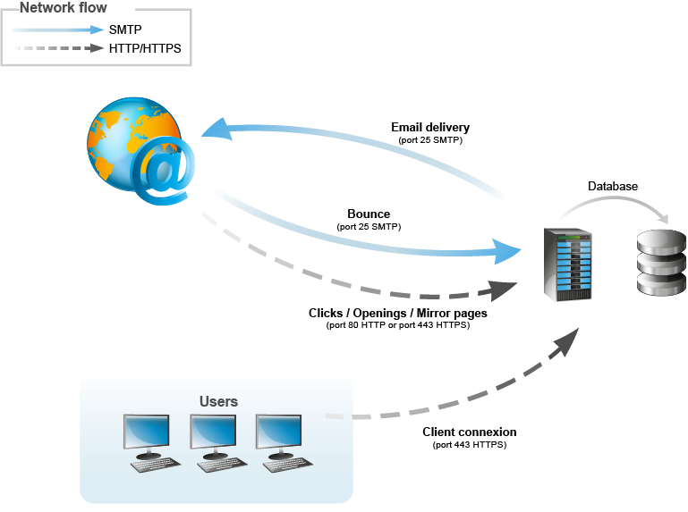

# Arquitetura geral{#general-architecture}

## Arquitetura mínima {#minimum-architecture}

Em uma configuração mínima, o Adobe Campaign opera com:

* o servidor de aplicativos do Adobe Campaign,
* banco de dados.

  

Este diagrama mostra que o único tráfego envolvido no contexto de uma arquitetura mínima é:

1. Tráfego de protocolo HTTP para o servidor do Adobe Campaign pela Internet,
1. Tráfego do protocolo SMTP de e para o servidor do Adobe Campaign pela Internet.

## Arquitetura distribuída {#distributed-architecture}

O Adobe Campaign é composto de vários módulos que podem ser divididos em várias máquinas. Esse modo operacional tem várias vantagens:

* balanceamento de carga
* configuração de redundância de módulo,
* construção de uma arquitetura dividida em vários provedores de serviços (segmentação dos serviços fornecidos).

A distribuição de módulos por várias máquinas proporciona grande flexibilidade de uso e melhor adaptabilidade.

>[!NOTE]
>
>Para obter mais informações sobre as várias arquiteturas, consulte [esta seção](../../installation/using/general-architecture.md).

## Lista de portas abertas {#list-of-open-ports}

| Número da porta | Módulo ou aplicativo Adobe Campaign relacionado | Configurável |
|---|---|---|
| 443/tcp ou 80/tcp | Servidores da Web (Apache/IIS) | SIM |
| 6666/udp (local) | Adobe Campaign: Syslogd | SIM |
| 8005/tcp (local) | Adobe Campaign: módulo Web | SIM |
| 8080/tcp | Adobe Campaign: módulo web (tomcat) | SIM |
| 7777 | Servidor de estatísticas (servidor stat) | SIM |
