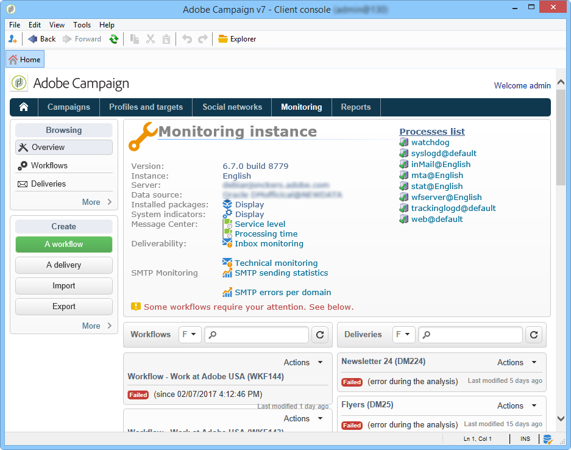

# Orientações de monitoramento {#monitoring-guidelines}

## Painel de monitoramento de instância {#instance-monitoring-dashboard}

A **[!UICONTROL Monitoring]** guia, que pode ser acessada a partir da página inicial do Campaign Classic, é o ponto de entrada principal que ajuda a monitorar sua instância.

Ele fornece uma painel do que está ocorrendo em sua instância: seu status (versão de compilação, pacotes instalados etc.), indicadores do sistema, registros, workflows que estão em execução no momento, estado dos últimos delivery enviados etc.

Informações detalhadas estão disponíveis [aqui](../../production/using/monitoring-processes.md).

## Monitoring Campaign Classic processes {#monitoring-campaign-classic-processes}

<table>
<tr><td>
<a href="#monitoring-instance">Monitore sua instância</a>
</td>
<td>
<a href="#moniroting-workflows">Workflows de monitor</a>
</td>
<td>
<a href="#monitoring-deliveries">Delivery de monitor</a>
</td>
<td>
<a href="#monitoring-database">Monitorar o banco de dados</a>
</td></tr>
</table>

Existem outras formas de monitorar os diferentes processos de Campanha. Eles fornecem várias maneiras de monitorar suas instâncias para garantir que seu sistema esteja saudável e, eventualmente, solucionar problemas que podem ocorrer ao configurar workflows, enviar delivery etc.

### Monitorando sua instância {#monitoring-instance}

**Ferramentas de monitoramento automático**

Vários métodos automáticos estão disponíveis. para ajudá-lo a monitorar sua instância. Você pode, por exemplo, configurar relatórios de email com anomalias detectadas, recuperar uma lista de indicadores no formato XML etc. [Clique aqui](../../production/using/monitoring-processes.md#automatic-monitoring) para obter mais informações.

**Trilha de auditoria**

A trilha de auditoria permite visualizar o histórico completo de alterações relacionadas a opções, workflows e schemas dentro da sua instância. [Clique aqui](../../production/using/audit-trail.md) para obter mais informações.

**Painel de controle**

O Painel de controle do Campaign permite gerenciar várias configurações da sua instância: gerencie permissões de URL, verifique os detalhes da instância, como as versões de compilação dos servidores etc. Também permite monitorar o espaço disponível nos servidores SFTP conectados à sua instância. [Clique aqui](https://docs.adobe.com/content/help/pt-BR/control-panel/using/control-panel-home.translate.html) para obter mais informações.

>[!NOTE]
>
>Observe que o Painel de controle do Campaign é acessível somente para usuários administradores e está disponível para todos os clientes que usam os Serviços gerenciados da Adobe.

### Monitoramento de workflows {#monitoring-workflows}

**Workflow HeatMap**

O Workflow HeatMap forneceu uma representação visual de todos os workflows que estão sendo executados em sua instância. Permite monitorar facilmente a carga na instância e planejar workflows de acordo. [Clique aqui](../../workflow/using/heatmap.md) para obter mais informações.

**Trilha de auditoria**

A trilha de auditoria permite visualizar todas as modificações que foram feitas em workflows, bem como seus estados atuais. [Clique aqui](../../production/using/audit-trail.md).

**Solução de problemas de workflows**

Ações específicas podem ser executadas ao encontrar problemas com uma execução de fluxo de trabalho. [Clique aqui](../../production/using/workflow-execution.md) para obter mais informações

**Monitoramento do status do fluxo de trabalho**

Além do mapa de calor, você pode criar um fluxo de trabalho que permitirá monitorar o status de um conjunto de workflows e enviar mensagens recorrentes aos supervisores. [Clique aqui](../../workflow/using/supervising-workflows.md) para obter mais informações.

**Orientações gerais**

Seguir as diretrizes e as práticas recomendadas ao usar workflows pode ajudar a melhorar o desempenho. Para obter mais informações, consulte esta seção.
* [Práticas recomendadas ao usar workflows](../../workflow/using/workflow-best-practices.md)
* [Monitoramento da execução do workflow](../../workflow/using/monitoring-workflow-execution.md)

### Monitorar deliveries {#monitoring-deliveries}

**Relatórios SMTP**

Os relatórios SMTP exibem estatísticas de delivery e erros SMTP por domínio. [Saiba mais](../../production/using/monitoring-processes.md)

**Práticas recomendadas**

[As práticas recomendadas para envio e criação](../../delivery/using/delivery-best-practices.md) de delivery podem ajudá-lo a melhorar seu desempenho.

**Solução de problemas** de deliveryAções específicas podem ser executadas ao encontrar problemas com delivery:
* [Problemas com delivery](../../production/using/performance-and-throughput-issues.md#deliverability_issues)
* [Problemas de exibição de imagem](../../production/using/image-display-issues.md)
* [Problemas de desempenho do delivery](../../delivery/using/monitoring-a-delivery.md#performance_issues)
* [Problemas](../../production/using/temporary-files.md) de arquivos temporários - somente *em modelos de hospedagem local*

### Monitoramento do banco de dados {#monitoring-database}

**Workflow de limpeza do banco de dados**

O fluxo de trabalho de limpeza do banco de dados permite que você exclua dados obsoletos do banco de dados. É recomendável evitar o crescimento exponencial do banco de dados. [Clique aqui](../../production/using/database-cleanup-workflow.md) para obter mais informações.

**Solução de problemas de desempenho do banco de dados**

Ações específicas podem ser executadas ao encontrar problemas com o desempenho do banco de dados. [Clique aqui](../../production/using/database-performances.md) para obter mais informações.

**Manutenção do banco de dados**

*apenas modelos de hospedagem local e híbrido*

Recomendamos que você execute a manutenção do banco de dados regularmente para evitar o consumo excessivo de espaço em disco, afetando assim o acesso ao banco de dados. [Clique aqui](../../production/using/recommendations.md) para obter mais informações.

**Backup e restauração**

*apenas modelos de hospedagem local e híbrido*

O backup é essencial para evitar a perda de dados no evento de um problema (físico ou relacionado ao sistema) em uma máquina. [Clique aqui](../../production/using/backup.md) para obter mais informações. O procedimento de restauração está descrito na [presente seção](../../production/using/restoration.md).

## Princípios técnicos Campaign Classic {#campaign-classic-technical-principles}

Os recursos técnicos estão disponíveis na documentação do Campaign Classic. Recomendamos que você se familiarize com esses tópicos antes de executar qualquer operação técnica em sua instância.

**Hospedagem de modelos e recursos**

* [modelos de hospedagem de Campaign Classic](../../installation/using/hosting-models.md)
* [Recursos do modelo de hospedagem](https://helpx.adobe.com/br/campaign/kb/acc-on-prem-vs-hosted.html)

**Configuração do servidor**

*Somente modelos de hospedagem local e híbrido*

* [Configurações obrigatórias do servidor](../../installation/using/campaign-server-configuration.md)
* [Configuração do arquivo Serverconf.xml](../../installation/using/the-server-configuration-file.md)
* [Configuração do servidor para entrega](../../installation/using/email-deliverability.md)
* [Linhas de comando para criar uma instância e declarar um banco de dados](../../installation/using/command-lines.md)

**Princípios gerais**

* [arquitetura Campaign Classic](../../production/using/general-architecture.md)
* [módulos Campaign Classic](../../production/using/operating-principle.md)
* [Opções de Campaign Classic](../../installation/using/configuring-campaign-options.md)
* [Como configurar a inicialização automática dos módulos](../../production/using/administration.md)
* [Princípio de configuração de campanha](../../production/using/configuration-principle.md)
* [Procedimentos de solução de problemas](../../production/using/performance-and-throughput-issues.md)
