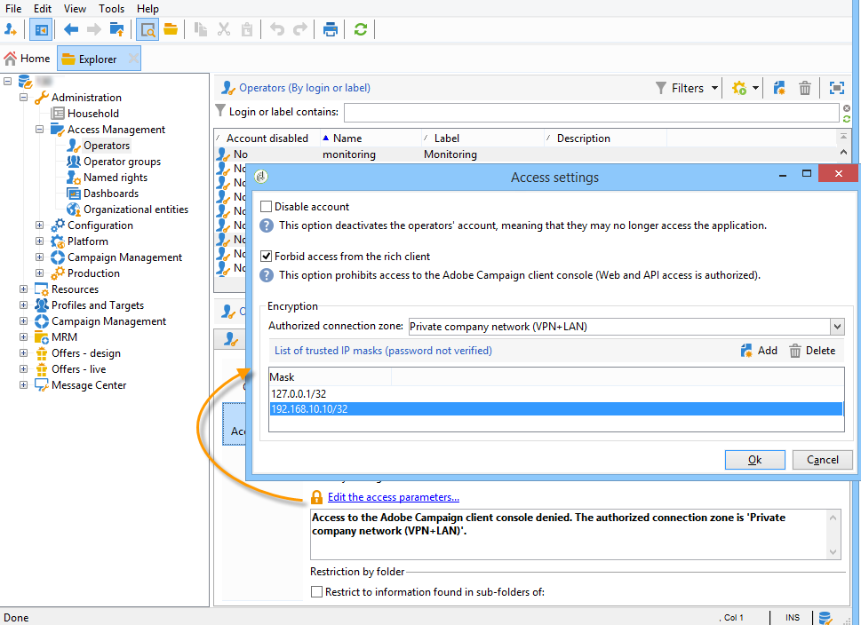

# Processos de monitoramento{#monitoring-processes}

O servidor de aplicativos e o servidor de redirecionamento (**rastreamento**) podem ser monitorados manual ou automaticamente.

## Monitoramento manual {#manual-monitoring}

Vá para **[!UICONTROL Monitoring]** e clique no **[!UICONTROL Overview]** link para exibir a página de monitoramento do processo de Adobe Campaign.


A página exibida permite que você visualização o estado da instância conectada, ou seja:

* informações sobre a instância: versão, nome, mecanismo de banco de dados, pacotes instalados, indicadores de sistema do servidor,
* a lista dos processos em falta e das informações de execução (data do start, PID, etc.),
* uma visualização de workflows e delivery.

Outras maneiras de monitorar os diferentes processos do Campaign são apresentadas [nesta página](../../production/using/monitoring-guidelines.md).

### journal de registro {#log-journal}

É possível exibir o journal de log relacionado a um processo. Para fazer isso, clique no processo, **talvez** , por exemplo, e clique em **[!UICONTROL Open the log journal]** .


### Indicadores do sistema {#system-indicators}

A lista dos indicadores do sistema permite exibir informações sobre a máquina, como sua memória física e virtual, processos ativos e espaço em disco disponível. Os indicadores são diferentes para os sistemas operacionais Linux e Windows. Go to the **[!UICONTROL Instance Monitoring]** page and click the **[!UICONTROL Display]** link to open the list of indicators

#### No Windows {#in-windows}

* **[!UICONTROL Pending events queued]** : indicador específico do Centro de **mensagens**. Consulte [esta seção](../../message-center/using/monitoring-thresholds.md) para obter mais informações.
* **[!UICONTROL Memory]** : informações relativas à memória física (RAM).

   **[!UICONTROL Current value]** : consumo real de memória.

   **[!UICONTROL Max Value]** : quantidade total de memória instalada.

   **[!UICONTROL Available]** : quantidade de memória disponível.

   **[!UICONTROL Warning]** : esse indicador é exibido quando o consumo de memória atinge 80% da quantidade total.

   **[!UICONTROL Alert]** : esse indicador é exibido quando o consumo de memória atinge 90% da quantidade total.

   Quando os indicadores **[!UICONTROL Warning]** e **[!UICONTROL Alert]** forem exibidos, você poderá resolver o problema adicionando RAM à máquina na qual o servidor Adobe Campaign está instalado. Você também pode decidir instalar o servidor Adobe Campaign em uma máquina dedicada.

* **[!UICONTROL Swap Memory]** : informações relacionadas à memória virtual que corresponde a um arquivo de paginação: uma área no disco rígido que o Windows usa como se fosse RAM.

   **[!UICONTROL Current value]** : consumo real de memória.

   **[!UICONTROL Max Value]** : quantidade total de memória.

   **[!UICONTROL Available]** : quantidade de memória disponível.

   **[!UICONTROL Warning]** : esse indicador é exibido quando o consumo de memória atinge 80% da quantidade total.

   **[!UICONTROL Alert]** : esse indicador é exibido quando o consumo de memória atinge 90% da quantidade total.

   Quando os indicadores **[!UICONTROL Warning]** e **[!UICONTROL Alert]** são exibidos, é possível resolver o problema aumentando o tamanho do arquivo de troca nas configurações avançadas do Windows.

* **[!UICONTROL Disk XXX]** : informações relativas aos leitores de máquinas.

   **[!UICONTROL Current value]** : espaço em disco realmente usado.

   **[!UICONTROL Max Value]** : capacidade total do disco.

   **[!UICONTROL Available]** : espaço em disco disponível

   **[!UICONTROL Used]** : porcentagem do disco usado.

   **[!UICONTROL Warning]** : esse indicador é exibido quando o espaço em disco disponível atinge 80% da capacidade total.

   **[!UICONTROL Alert]** : esse indicador é exibido quando o espaço em disco disponível atinge 90% da capacidade total.

* **[!UICONTROL Number of processes too old]** : informações sobre processos de Adobe Campaign que estão ativos há mais de um dia.

   **[!UICONTROL Current value]** : número de processos atualmente ativos.

   **[!UICONTROL Max Value]** : número máximo de processos autorizados (1).

   **[!UICONTROL Alert]** : este indicador é exibido se o número de processos for igual a 1.

   Quando o **[!UICONTROL Alert]** indicador é exibido, pode ser que o processo em questão esteja bloqueado pelo mecanismo de banco de dados SQL ou que esteja preso em um loop infinito. O processo de **vigia** fornecido pelo Adobe Campaign automaticamente start todos os processos todos os dias e permite que você resolva esse problema. No entanto, você também pode parar o processo em questão para forçar o start novamente.

#### No Linux {#in-linux}


* **[!UICONTROL Pending events queued]** : indicador específico do Centro de **mensagens**. Consulte [esta seção](../../message-center/using/monitoring-thresholds.md) para obter mais informações.
* **[!UICONTROL Load average (1/5/15 minutes)]** : informações relativas à carga, ou seja, a taxa de utilização do processador pelos processos em execução na máquina durante o último minuto, cinco minutos ou quinze minutos

   **[!UICONTROL Current value]** : carga real da máquina.

   **[!UICONTROL Max value]** : carga máxima de utilização do(s) processo(s) na máquina

   **[!UICONTROL Warning]** : este indicador é apresentado quando a carga atinge 80% do valor máximo autorizado durante o último minuto, cinco minutos ou quinze minutos.

   **[!UICONTROL Alert]** : esse indicador é exibido quando a carga atinge 90% do valor máximo autorizado do último minuto, cinco minutos ou quinze minutos.

* **[!UICONTROL Memory]** : informações relativas à memória física (RAM).

   **[!UICONTROL Current value]** : consumo real de memória.

   **[!UICONTROL Max Value]** : quantidade total de memória instalada.

   **[!UICONTROL Available]** : quantidade de memória disponível.

   **[!UICONTROL Warning]** : esse indicador é exibido quando o consumo de memória atinge 80% da quantidade total.

   **[!UICONTROL Alert]** : esse indicador é exibido quando o consumo de memória atinge 90% da quantidade total.

   Quando os indicadores **[!UICONTROL Warning]** e **[!UICONTROL Alert]** forem exibidos, você poderá resolver o problema adicionando RAM à máquina na qual o servidor Adobe Campaign está instalado. Você também pode decidir instalar o servidor Adobe Campaign em uma máquina dedicada.

* **[!UICONTROL Swap Memory]** : informações relacionadas à memória virtual que corresponde a um arquivo de paginação: uma área no disco rígido que o Windows usa como se fosse RAM.

   **[!UICONTROL Current value]** : consumo real de memória.

   **[!UICONTROL Max Value]** : quantidade total de memória.

   **[!UICONTROL Available]** : quantidade de memória disponível.

   **[!UICONTROL Warning]** : esse indicador é exibido quando o consumo de memória atinge 80% da quantidade total.

   **[!UICONTROL Alert]** : esse indicador é exibido quando o consumo de memória atinge 90% da quantidade total.

   Quando os indicadores **[!UICONTROL Warning]** e **[!UICONTROL Alert]** são exibidos, é possível resolver o problema aumentando o tamanho do arquivo de troca.

* **[!UICONTROL Core Files]** : informações sobre os arquivos gerados após a falha de um processo de Adobe Campaign. Esses arquivos permitem diagnosticar as razões da falha.

   **[!UICONTROL Current Value]** : número de arquivos existentes.

   **[!UICONTROL Max Value]** : número máximo de ficheiros autorizados (1).

   **[!UICONTROL Warning]** : esse indicador é exibido quando o número de arquivos se aproxima de 1.

   **[!UICONTROL Alert]** : esse indicador é exibido quando o número de arquivos é igual a 1.

   Quando um processo está faltando devido a uma falha, ele é mostrado em vermelho na lista de processos e é reiniciado automaticamente pelo processo de **vigia** fornecido pelo Adobe Campaign.

* **[!UICONTROL Number of shared memory segments]** : informações sobre os segmentos de memória compartilhados por todos os processos de Adobe Campaign.

   **[!UICONTROL Current value]** : número de segmentos de memória atualmente em uso.

   **[!UICONTROL Max Value]** : número máximo de segmentos de memória autorizados (2).

   **[!UICONTROL Warning]** : esse indicador é exibido quando o número de segmentos de memória atinge 1.

   **[!UICONTROL Alert]** : esse indicador é exibido quando o número de segmentos de memória atinge 2.

* **[!UICONTROL Number of processes too old]** : Informações relativas a processos que estão ativos há mais de um dia.

   **[!UICONTROL Current value]** : número de processos atualmente ativos.

   **[!UICONTROL Max Value]** : número máximo de processos autorizados.

   **[!UICONTROL Warning]** : esse indicador é exibido quando o número de processos atinge 80% do limite autorizado.

   **[!UICONTROL Alert]** : esse indicador é exibido quando o número de processos atinge 90% do limite autorizado.

* **[!UICONTROL File Handles]** : informações relativas aos descritores dos ficheiros, ou seja, o número de ficheiros abertos por processo.

   **[!UICONTROL Current value]** : número atual de descritores de arquivo.

   **[!UICONTROL Max Value]** : número máximo de descritores de arquivo autorizados pelo sistema operacional.

   **[!UICONTROL Warning]** : esse indicador é exibido quando o número de descritores de arquivo autorizados atinge o limite de 80%.

   **[!UICONTROL Alert]** : esse indicador é exibido quando o número de descritores de arquivo autorizados atinge o limite de 90%.

* **[!UICONTROL Processes]** : informações relativas aos processos da máquina.

   **[!UICONTROL Current value]** : número de processos atualmente ativos.

   **[!UICONTROL Max Value]** : número máximo de processos autorizados.

   **[!UICONTROL Active Processes]** : número de processos ativos.

   **[!UICONTROL Inactive Processes]** : número de processos inativos.

   **[!UICONTROL Warning]** : esse indicador é exibido quando o número de processos autorizados atinge o limite de 80%.

   **[!UICONTROL Alert]** : esse indicador é exibido quando o número de processos autorizados atinge o limite de 90%.

* **[!UICONTROL Zombie Processes]** : informações sobre os processos que foram interrompidos, mas ainda têm um identificador de processo (PID) e permanecem visíveis na tabela de processos.

   **[!UICONTROL Current value]** : número de processos zombie que estão ativos no momento.

   **[!UICONTROL Max Value]** : número máximo de processos zombie autorizados (2).

   **[!UICONTROL Warning]** : esse indicador é exibido quando o número de zumbis processa próximo a 2.

   **[!UICONTROL Alert]** esse indicador é exibido quando o número de processos zombie atinge 2.

#### Indicadores personalizados {#customized-indicators}

O Adobe Campaign permite personalizar indicadores. Para fazer isso:

1. Crie um arquivo **.sh** e nomeie-o **[!UICONTROL cust_indicators.sh]** .
1. Adicione seus indicadores personalizados a este arquivo. Por exemplo:

   ```
   #!/bin/bash 
   echo "<indicator name='Zombie Processes'>  
   <current label='Current Value' value='0' display=''/>  
   <warning value='2'/>  <alert value='2'/>  
   <max label='Max Value' value='2'/>
   </indicator>"
   ```

   ou

   ```
   #!/bin/bash 
   echo "<indicator name='Availability'>  
   <current label='Last update of data' display='2012-09-03 10:00'/>  
   <current label='Availability last month' display='100.00%'/>  
   <current label='Availability this month' display='100.00%'/> 
   <current label='Recent downtime periods' display='2012-07-04 11:10:00 - 11:19:59'/>
   </indicator>"
   ```

1. Coloque o arquivo na **[!UICONTROL usr/local/neolane/nl6]** pasta.

Este arquivo será chamado pelo Adobe Campaign.

## Relatórios SMTP {#smtp-reports}

Os relatórios de monitoramento de delivery SMTP são integrados à plataforma Adobe Campaign. Eles podem ser acessados pelo console ou usando o acesso à Web.

Esses relatórios exibem estatísticas de delivery SMTP e erros SMTP por domínio.

Para acessá-los, o operador deve ter direitos administrativos.

Eles são agrupados em **Monitoramento** > &quot;Monitoramento SMTP&quot;.


>[!CAUTION]
>
>* As informações relacionadas ao Monitoramento SMTP só estarão disponíveis se o canal de email tiver sido ativado.
>* Os **[!UICONTROL SMTP sending statistics]** são oferecidos somente se o servidor de estatísticas for iniciado na instância.
>


### Estatísticas de envio de SMTP {#smtp-sending-statistics}

O **[!UICONTROL SMTP sending statistics]** relatório permite controlar a atividade do servidor. Ele exibe uma síntese de cada uma das mtachilds.


A lista de indicadores para este relatório é mostrada abaixo do gráfico.

1. Número total de mensagens enviadas.
1. 
   * Linha azul: mensagens prontas para enviar que chegaram ao Shaper, ou seja, última etapa antes de enviar o SMTP (coincide com os dados recebidos).

   * Linha verde: mensagens enviadas com êxito (coincide com os dados de saída).

   * Linha vermelha: mensagens abandonadas pelo Shaper, retornadas ao **mta** (coincide com os dados rejeitados nessa recuperação).
   Esses valores são expressos em número de mensagens por hora.

1. Representa duas filas do Shaper:

   * Curva azul: fila de mensagens ativas. Estas mensagens serão enviadas o mais rapidamente possível.

   * Curva de Kaki: a fila &#39;adiada&#39;. Essas mensagens não podem ser retornadas por enquanto devido à limitação ou porque não há conexão disponível com o público alvo. As Tentativas acontecerão a cada 5s, 10s, 20s, 40s, 2 min, etc. para o tempo **MaxAgeSec** definido antes de ser abandonado.

1. Este gráfico mostra um detalhe das mensagens abandonadas (curva vermelha no segundo gráfico): mostra a proporção de mensagens abandonadas sem tentativas (mauve) em comparação com mensagens cujo envio falhou (vermelho). Isso permite que você visualização a proporção de mensagens não processadas dentro do período concedido devido a limitações do servidor de estatísticas (limitação) ou devido à indisponibilidade do servidor remoto.
1. Conexões SMTP abertas ou sendo abertas.
1. Estimativa do número de **mtachild**.

>[!NOTE]
>
>Este relatório está relacionado ao status do componente de Forma de tráfego de email.

### Erros de SMTP por domínio {#smtp-errors-per-domain}

Este relatório permite que você visualização os erros de delivery, durante um período definido, detalhados por domínio.

>[!NOTE]
>
>As opções **minConnectionsToLog**, **minErrorsToLog** e **minMessagesToLog** do arquivo **serverConf.xml** definem os limites acima dos quais as estatísticas de conexão são levadas em conta.


A lista de indicadores para este relatório é mostrada abaixo da tabela.

* A coluna **Domínio** contém o nome do domínio para o qual as mensagens são enviadas (ou o nome do domínio real, yahoo.com para yahoo.fr, por exemplo),
* A coluna **Cnx** exibe o número de conexões SMTP abertas para este domínio,
* A coluna **Enviados** corresponde ao número de mensagens enviadas para este domínio,
* A coluna **Volume** exibe o volume de mensagens que foram tentadas para serem enviadas para este domínio (valor aproximado),
* A coluna **Erros** exibe um indicador de volume de erros neste domínio durante o período,
* A coluna **Última resposta** exibe a última mensagem de resposta SMTP recebida para este domínio,
* A coluna **Data** exibe a data da última resposta SMTP recebida para este domínio.

>[!NOTE]
>
>Os valores exibidos nas colunas **Cnx**, **Enviado** e **Volume** são calculados em relação ao período selecionado no **[!UICONTROL Period]** campo.

Clique em um nome de domínio para visualização de seus erros.

Eles são classificados por PublicId: esse identificador corresponde a um endereço IP compartilhado por várias Adobe Campaign mtas atrás de um roteador. O servidor de estatísticas usa esse identificador para decorar as estatísticas de conexão e delivery entre esse ponto de partida e o servidor do público alvo.


O **[!UICONTROL Owner of domain]** campo permite agrupar vários nomes de domínio sob o mesmo rótulo. Na visualização inicial do relatório, todos os nomes de domínio MX serão associados a esse proprietário.

Clique em um identificador PublicId para visualização de mais detalhes.


>[!NOTE]
>
>A porcentagem de erros é representada por dois gráficos. A primeira é uma barra de progresso horizontal em um plano de fundo preto. O segundo gráfico é cronológico. O período selecionado é dividido em doze intervalos de tempo, cada um representado por uma barra de progresso vertical. Em ambas as representações, se nenhum erro tiver sido detectado, a barra ficará preta. A cor da barra depende da porcentagem de erros encontrados (amarelo, laranja e, por último, vermelho). A cor cinza significa que não foi encontrado nenhum volume de dados significativo. É possível exibir a porcentagem exata de erros colocando o cursor no gráfico.

>[!NOTE]
>
>Para obter mais informações sobre erros de SMTP e como gerenciá-los no Adobe Campaign, consulte [esta seção](../../installation/using/email-deliverability.md).

## Relatório de cobrança {#billing-report}

The **[!UICONTROL Billing]** technical workflow sends the system activity report to the &#39;billing&#39; operator by email. Ela é acionada por padrão no dia 25 de cada mês.

O fluxo de trabalho técnico pode ser encontrado em uma subpasta do seguinte nó: **Administração** > **Produção** > **Workflows técnicos**.


Quando o fluxo de trabalho for iniciado a cada 25 dias do mês, seu operador de faturamento receberá o seguinte relatório em sua caixa de entrada.


As seguintes métricas estão disponíveis para rastrear seus delivery:

* **[!UICONTROL Start date]** : Data de Start do delivery. Observe que pode ser anterior à data &quot;de&quot; do relatório.
* **[!UICONTROL Label]** : Etiqueta do delivery. Os Delivery que têm menos de 100 mensagens para enviar são considerados pequenos demais e, portanto, agregados por data de start, caso em que o rótulo exibe o número de agregações, por exemplo, [Agregação de 3 pequenos delivery].
* **[!UICONTROL Total volume]** : Volume total de bytes transferidos para o delivery.
* **[!UICONTROL Avg volume]** : Volume médio de bytes transferidos. Este é o resultado da seguinte fórmula **(volume total / mensagens)**, que é a base de cálculo da **[!UICONTROL Multiplier]** métrica.
* **[!UICONTROL Messages]** : Número de mensagens enviadas. Isso inclui ambas as mensagens que foram enviadas com êxito e o tentativas (após a recepção de uma mensagem de rejeição do servidor contatado).
* **[!UICONTROL Multiplier (x)]** : O valor do multiplicador é deduzido do volume médio das mensagens.
* **[!UICONTROL Count]** : Resultado da multiplicação das mensagens e do multiplicador.

## Monitoramento automático {#automatic-monitoring}

O Adobe Campaign oferta vários métodos de monitoramento automático, que são apresentados abaixo.

### Linha de comando {#command-line}

Comando

**monitor nlserver**

Permite que você lista um conjunto de indicadores nos módulos de Adobe Campaign e no sistema.

Ele gera saída em um formato XML facilmente processado.

Esse comando também pode ser executado com o parâmetro **-missing** , que lista os processos que estão ausentes dessa instância quando os arquivos de configuração dizem que devem estar sendo executados.

```
nlserver monitor -missing
HH:MM:SS > Application server for Adobe Campaign Classic (7.X YY.R build XXX@SHA1) of DD/MM/YYYY
mta@prod
stat@prod
wfserver@prod
```

### Informações publicadas pelo servidor {#information-published-by-the-server}

#### /r/test {#r-test}

A página **http(s)://`<application>`/r/test** é usada para testar o servidor de redirecionamento. Recomendamos usar esse mesmo método para testar os servidores frontais usados para rastreamento. Esta página também pode ser usada para testar um despachante de carga.

Ele exibe uma linha como esta no formato XML:

```
<redir status='OK' date='YYYY-MM-DD HH:MM:SS.112Z' build='XXXX' host='<hostname>' localHost='<servername>'/>
```

**Frequência**: este teste não usa nenhuma carga e, portanto, pode ser executado com muita frequência (por exemplo, uma vez a cada segundo).

#### /nl/jsp/ping.jsp {#nl-jsp-ping-jsp}

Esta página **http(s)://`<Application server url>`/nl/jsp/ping.jsp** funciona da mesma forma que sua contrapartida de rede: ele testa um query completo passando pelo apache/tomcat/web module/banco de dados e fazendo upload para o cliente. Se tudo estiver funcionando corretamente, ele retorna um &quot;OK&quot;. Recomendamos executar esse teste em máquinas com acesso aos bancos de dados (mtas e pesquisas, por exemplo).

**Uso**: um token de sessão associado a um logon de operador deve ser transmitido como um argumento para fazer logon remotamente (consulte a dica em Monitoramento [automático por scripts](#automatic-monitoring-via-adobe-campaign-scripts)de Adobe Campaign).

Por exemplo:


O nome do operador e o logon precisam ser previamente configurados no console do cliente Adobe Campaign com direitos de banco de dados.


**Frequência**: este é um teste que usa pouca largura de banda. Por conseguinte, pode ser executado com bastante frequência, mas não mais do que uma vez por minuto.

#### /nl/jsp/monitor.jsp {#nl-jsp-monitor-jsp}

Este é um teste para verificar se um operador pode acessar o servidor de Adobe Campaign através de uma página da Web; a mesma página da Web acessada pelos menus do console do cliente. Você pode chamar essa página de suas ferramentas de vigilância (Tivoli, Nagios etc.).


**Uso**: um token de sessão associado a um logon de operador que permite que você se conecte à instância precisa ser usado como argumento (consulte a dica em Monitoramento [automático por scripts](#automatic-monitoring-via-adobe-campaign-scripts)de Adobe Campaign).

O operador e seu logon precisam ser configurados anteriormente no console do cliente Adobe Campaign com os direitos e restrições apropriados do banco de dados.

**Frequência**: este é um teste completo do servidor e não precisa ser executado com frequência (pode ser executado uma vez a cada dez minutos, por exemplo).

#### /nl/jsp/soaprouter.jsp {#nl-jsp-soaprouter-jsp}

Este **jsp** representa o ponto de entrada das APIs de aplicativos Adobe Campaign. Pode, por conseguinte, fornecer um acompanhamento pormenorizado do pedido. Ele também pode ser usado para monitorar os serviços da Web do Adobe Campaign. É usado em nossos scripts de monitoramento, mas observe que é apenas para usuários avançados.

### Monitoramento com base em tipos de implantação {#monitoring-based-on-deployment-types}

O Adobe Campaign habilita várias configurações de implantação (para obter mais informações, consulte [esta seção](../../installation/using/hosting-models.md)). Esta seção descreve as várias técnicas de monitoramento automático a serem aplicadas, dependendo do tipo de instalação.

<table> 
 <thead> 
  <tr> 
   <th> Tipo de implantação </th> 
   <th> Monitoramento de </th> 
  </tr> 
 </thead> 
 <tbody> 
  <tr> 
   <td> Autônomo </td> 
   <td> 
    <ul> 
     <li><p> <span class="uicontrol">/r/test</span> e <span class="uicontrol">/nl/jsp/monitor.jsp</span> no servidor Adobe Campaign</p> </li> 
    </ul> </td> 
  </tr> 
  <tr> 
   <td> Padrão </td> 
   <td> 
    <ul> 
     <li><p> <span class="uicontrol">/r/test</span> e <span class="uicontrol">/nl/jsp/ping.jsp</span> nos servidores frontais</p> </li> 
     <li><p> <span class="uicontrol">/nl/jsp/monitor.jsp</span> no servidor de aplicativos</p> </li> 
    </ul> </td> 
  </tr> 
  <tr> 
   <td> Empresa </td> 
   <td> 
    <ul> 
     <li><p> <span class="uicontrol">/r/test</span> e <span class="uicontrol">/nl/jsp/ping.jsp</span> nos servidores frontais</p> </li> 
     <li><p> <span class="uicontrol">/r/test</span> e <span class="uicontrol">/nl/jsp/monitor.jsp</span> no servidor de aplicativos</p> </li> 
    </ul> </td> 
  </tr> 
  <tr> 
   <td> Mid-sourcing </td> 
   <td> 
    <ul> 
     <li><p> <span class="uicontrol">/nl/jsp/monitor.jsp</span> no servidor de aplicativos</p> </li> 
    </ul> </td> 
  </tr> 
 </tbody> 
</table>

## Monitoramento automático por scripts Adobe Campaign {#automatic-monitoring-via-adobe-campaign-scripts}

O Adobe Campaign pode fornecer uma ferramenta de monitoramento de instância (netreport) que permite que você envie um relatório por email sobre as anomalias detectadas.


>[!CAUTION]
>
>Essa ferramenta pode ser usada para monitorar suas instâncias, mas não é suportada pelo Adobe Campaign. Entre em contato com o administrador da Campanha para obter mais informações.

### Elementos obrigatórios {#required-elements}

As seguintes precauções de pré-instalação são necessárias para a monitorização automática:

* Você deve ter os arquivos **netreport.tgz **(instalação do Linux) ou **netreport.zip** (instalação do Windows),
* Recomendamos que você não instale o monitoramento na máquina a ser monitorada.
* deve ser instalado em uma máquina com um JRE ou um JDK,
* no Linux, a máquina a ser monitorada deve ter o pacote **bc** . Para obter mais informações, consulte [esta seção](../../installation/using/installing-packages-with-linux.md#distribution-based-on-rpm--packages).

### Procedimento de instalação {#installation-procedure}

O procedimento de instalação é o seguinte:

1. No console, crie um novo operador, se necessário (o usuário &quot;monitoramento&quot; já existe), mas não atribua nenhum direito.
1. Execute a extração de arquivamento.
1. Leia o arquivo **readme** .
1. Atualize o arquivo de configuração **netconf.xml** .
1. Atualize o arquivo **netreport.bat** (Windows) ou **netreport.sh **(Linux).

### Configuração do arquivo netconf.xml {#configuring-the-netconf-xml-file}

O arquivo de configuração XML contém os seguintes elementos:

* [Elemento &#39;Propriedades&#39;](#properties--element)
* [elemento &#39;Instance&#39;](#instance--element)
* [Elemento &#39;Host&#39;](#host--element)
* [Subelementos](#sub-elements)

Este é um exemplo de configuração:

```
<?xml version="1.0" encoding="ISO-8859-1"?>
<netconf>
  <properties mailServer="mail.adobe.net" mailFrom="mail@adobe.com" recipientList="recipient@adobe.com">
    <nightMode start="00:00 am" end="07:00 am"/>
    <buildRange minimum="7829" maximum="8180"/>
    <buildRange minimum="8300" maximum="8400"/>
    <sla/>
  </properties>

  <instance name="dev" recipientList="mail@mail.com,mail2@mail.com">
                <host name="devrd.domain.com" alias="devrd" sessiontoken="monitoring" criticalLevel="1" filter="wkf;new">
                                <ncs instance="devrd" url="/nl/jsp/soaprouter.jsp" includeDead="false" isSecure="false"/>
                                <redir url="/r/test"/>
                                <http url="/nl/jsp/ping.jsp"/>
                </host>
                <host name="devtrk.domain.com" alias="devtrk" sessiontoken="monitoring" criticalLevel="0" filter="wkf;new">
                                <ncs instance="devrd" url="/nl/jsp/soaprouter.jsp" includeDead="true" isSecure="false"/>
                </host>
  </instance>
  <host name="dev-test" alias="dev-test" sessiontoken="monitoring" criticalLevel="2">
                <ncs instance="dev" url="/nl/jsp/soaprouter.jsp" includeDead="false"/>
  </host>
</netconf>
```

>[!NOTE]
>
>Você pode especificar várias configurações adicionando um sufixo ao arquivo **netconf.xml** , por exemplo, **netconf-dev.xml**, **netconf-prod.xml** etc. Em seguida, especifique a configuração a ser usada para executar o netreport nos arquivos **netreport.bat** ou **netreport.sh** adicionando **$JAVA_HOME/bin/java netreport dev** ou **@%JAVA_HOME%binjava netreport prod** por exemplo.

>[!CAUTION]
>
>Para que o operador de **monitoramento** funcione, a máquina na qual o netreport é executado deve estar em uma zona de segurança que esteja no modo **sessionTokenOnly** . Se nenhuma máscara IP confiável tiver sido especificada para esse operador, a zona de segurança também deverá estar no modo **allowEmptyPassword** e **allowUserPassword** .

#### Elemento &#39;Propriedades&#39; {#properties--element}

Esse elemento é usado para preencher a configuração de e-mails, ou seja,

* **mailServer**: Servidor SMTP usado para enviar emails (por exemplo: smtp.domain.net).
* **mailFrom**: endereço de email do remetente do relatório (por exemplo: monitoring@domain.net).
* **customerList**: a lista de endereços de email dos recipient de monitoramento. Os endereços devem ser separados por vírgulas (sem espaços).
* O modo &#39;**noite**&#39; (opcional) é usado para evitar o envio de emails entre o período de tempo especificado. Em vez disso, os dados são consolidados, e um email sobre a atividade da noite é enviado após a hora de término (7:00 por padrão).
* O subelemento **buildRange** (opcional) permite especificar um número de compilação mínimo e máximo. Um erro será gerado para todos os computadores cujo número de compilação não se encaixe nesse intervalo

   ```
   <buildRange minimum="0000" maximum="9999"/>
   ```

* Você pode adicionar um subelemento **`<sla>`** (opcional) no elemento **Propriedades** . Um arquivo de log será gerado toda vez que o netreport for executado. O nome do arquivo contém o nome da configuração e a data e hora, por exemplo, **dev_06_12_13_16_47_05.tmp**. O arquivo contém as seguintes informações: nome da instância, nome da máquina, nível de gravidade, (0 a 3, do menos crítico ao mais crítico), data (formato de carimbo de data e hora), tempo decorrido (em milissegundos) entre o query e a resposta, serviço usado (http, ncs, ncsex, redir). Essas informações são separadas por marcas de tabulação e quebras de linha no final de cada serviço.

>[!NOTE]
>
>O atributo **persistHtmlFile** com o valor &quot;true&quot; no **`<property>`** elemento é usado para registrar o status de monitoramento mais recente no arquivo **netreport.md**. Esse arquivo é salvo no diretório de instalação.

#### elemento &#39;Instance&#39; {#instance--element}

Esse elemento permite agrupar várias máquinas (hosts) na mesma instância. Os nomes das instâncias são exibidos na primeira parte do email de monitoramento. Você pode clicar no nome de uma instância para acessar os detalhes de cada máquina.

```
instance name="instanceName" recipientList="mail@mail.com,mail2@mail.com">
                <host name="devcamp.domain.com" ...>
                       ...
                </host>
                <host name="devtrack.domain.com" ...>
                       ...
                </host>
</instance
```

* **name**: nome da instância que aparecerá na primeira parte do email.
* **customerList** (opcional): permite que você envie um relatório de monitoramento referente a uma instância específica por email.

#### Elemento &#39;Host&#39; {#host--element}

Esse elemento configura o monitoramento de um determinado servidor no host, ou seja,

* **name**: nome da máquina a ser monitorada.
* **alias** (opcional): nome da máquina monitorada, como será exibido no relatório.
* **sessionToken**: fornece autenticação de logon por meio de um token de sessão autorizado.

   Para configurar o token de sessão, selecione o operador de **monitoramento** no console Adobe Campaign. Na guia Direitos **de** acesso, especifique os endereços IP das máquinas autorizadas a monitorar essa instância. Você poderá se conectar à página de monitoramento desses computadores usando o identificador de **monitoramento** e sem precisar especificar uma senha.

   

* **críticaLevel** (opcional): permite que você classifique os erros para serem exibidos pelo nível de gravidade. Os valores possíveis são &quot;0&quot; (todos os níveis exibidos), &quot;1&quot; (somente erros altos e críticos exibidos) e &quot;2&quot; (somente erros críticos exibidos). Se esse atributo não for fornecido, todos os níveis de erro serão exibidos.
* **filtro** (opcional): permite que você exclua determinados erros de fluxo de trabalho, por exemplo, **filter=&quot;wkf;wkf1&quot;**. Os rótulos do fluxo de trabalho devem ser separados por ponto-e-vírgula.

#### Subelementos {#sub-elements}

* **tcp**: verifica se o servidor está ativo ou inativo. Você deve inserir um número de porta.
* **http**: verifica se o servidor Web existe (o servidor de aplicativos está operacional).
* **ncs**: verifica os processos na instância inserida no atributo &quot;instância&quot; (erros de fluxo de trabalho, uso de memória etc.). O atributo **include** (obrigatório) oferece a opção de exibir processos mortos (valores &#39;true&#39; ou &#39;false&#39;).
* **retro**: verifica o rastreamento.

Na maioria dos casos, somente os **ncs** e os **subelementos redir** podem ser mantidos.

Em qualquer caso, certos nós podem ser sobrecarregados nos subelementos (por exemplo, a **porta=75** do nó para sobrecarregar a porta usada para a conexão http, ncs ou redir):

```
<ncs instance="clap40" url="/nl/jsp/soaprouter.jsp" includeDead="false" port="80"/>
```

Nos subelementos **ncs**, **redir** e **http** , você pode adicionar o atributo **isSecure** (opcional) para escolher se deseja usar o protocolo https (valores &#39;true&#39; ou &#39;false&#39;). Se esse atributo não for fornecido, o protocolo http será usado.

### Configuração do arquivo netreport.bat ou netreport.sh {#configuring-the-netreport-bat-or-netreport-sh--file}

Para configurá-lo, edite esse arquivo e indique em qual diretório o JRE ou o JDK está instalado.

### Iniciar monitoramento {#launching-monitoring}

Para iniciar o monitoramento, execute o arquivo **netreport.bat** ou **netreport.sh** em intervalos regulares por meio de um script. Um relatório é enviado após a primeira execução e somente no evento de uma alteração de status.

### Monitoramento de testes {#testing-monitoring}

Para testar o monitoramento, execute o arquivo **netreport.bat** ou **netreport.sh** .

Um email é enviado para os recipient especificados em **receiptList** do arquivo **netconf.xml** .
