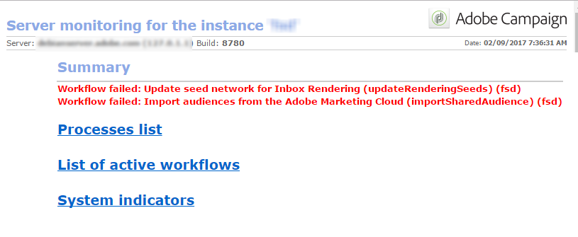

# Processos de monitoramento{#monitoring-processes}


O servidor de aplicativos e o servidor de redirecionamento (**tracking**) pode ser monitorada manual ou automaticamente.

## Monitoramento manual {#manual-monitoring}

Para acessar a página de monitoramento do processo do Adobe Campaign, navegue até o **[!UICONTROL Monitoring]** e clique na guia **[!UICONTROL Overview]** link .


A página exibida permite visualizar o estado da instância conectada, ou seja:

* informações sobre a instância: versão, nome, mecanismo de banco de dados, pacotes instalados, indicadores de sistema do servidor,
* a lista de processos e informações de execução ausentes (data de início, PID, etc.),
* uma visualização de workflows e deliveries.

Outras maneiras de monitorar os processos do Campaign são apresentadas em [esta página](../../production/using/monitoring-guidelines.md).

### Diário de log {#log-journal}

Para exibir o diário de log relacionado a um processo, clique no processo, **mta** por exemplo, em seguida selecione **[!UICONTROL Open the log journal]** .


### Indicadores do sistema {#system-indicators}

Navegue até a lista de indicadores do sistema para exibir informações sobre a máquina, como sua memória física e virtual, processos ativos e espaço disponível em disco. Os indicadores são diferentes para os sistemas operacionais Linux e Windows. Vá para o **[!UICONTROL Instance Monitoring]** e clique no botão **[!UICONTROL Display]** para abrir a lista de indicadores.

#### Windows {#in-windows}

* **[!UICONTROL Pending events queued]**: indicador específico do **Centro de mensagens**. [Saiba mais](../../message-center/using/additional-configurations.md#monitoring-thresholds)

* **[!UICONTROL Memory]**: informações relativas à memória física (RAM).

   **[!UICONTROL Current value]**: consumo de memória atual.

   **[!UICONTROL Max Value]**: quantidade total de memória instalada.

   **[!UICONTROL Available]**: quantidade de memória disponível.

   **[!UICONTROL Warning]**: esse indicador é exibido quando o consumo de memória atinge 80% da quantidade total.

   **[!UICONTROL Alert]**: esse indicador é exibido quando o consumo de memória atinge 90% da quantidade total.

   Quando a variável **[!UICONTROL Warning]** e **[!UICONTROL Alert]** forem exibidos, você poderá resolver o problema adicionando RAM à máquina na qual o servidor Adobe Campaign está instalado. Você também pode decidir instalar o servidor do Adobe Campaign em uma máquina dedicada.

* **[!UICONTROL Swap Memory]**: informações relacionadas à memória virtual que corresponde a um arquivo de paginação: uma área no disco rígido que o Windows usa como se fosse RAM.

   **[!UICONTROL Current value]**: consumo real de memória.

   **[!UICONTROL Max Value]**: quantidade total de memória.

   **[!UICONTROL Available]**: quantidade de memória disponível.

   **[!UICONTROL Warning]**: esse indicador é exibido quando o consumo de memória atinge 80% da quantidade total.

   **[!UICONTROL Alert]**: esse indicador é exibido quando o consumo de memória atinge 90% da quantidade total.

   Quando a variável **[!UICONTROL Warning]** e **[!UICONTROL Alert]** forem exibidos, você poderá resolver o problema aumentando o tamanho do arquivo de troca nas configurações avançadas do Windows.

* **[!UICONTROL Disk XXX]**: informação relativa aos leitores de máquinas.

   **[!UICONTROL Current value]**: espaço em disco realmente usado.

   **[!UICONTROL Max Value]**: capacidade total do disco.

   **[!UICONTROL Available]**: espaço em disco disponível.

   **[!UICONTROL Used]**: porcentagem do disco usado.

   **[!UICONTROL Warning]**: esse indicador é exibido quando o espaço em disco disponível atinge 80% da capacidade total.

   **[!UICONTROL Alert]**: esse indicador é exibido quando o espaço em disco disponível atinge 90% da capacidade total.

* **[!UICONTROL Number of processes too old]**: informações sobre processos do Adobe Campaign que estiveram ativos por mais de um dia.

   **[!UICONTROL Current value]**: número de processos atualmente ativos.

   **[!UICONTROL Max Value]**: número máximo de processos autorizados (1).

   **[!UICONTROL Alert]**: esse indicador é exibido se o número de processos for igual a 1.

   Quando a variável **[!UICONTROL Alert]** for exibido, pode ser que o processo relacionado esteja bloqueado pelo mecanismo de banco de dados SQL ou que esteja preso em um loop infinito. O **vigia** O processo fornecido pela Adobe Campaign reinicia automaticamente todos os processos todos os dias e permite que você resolva esse problema. No entanto, você também pode interromper o processo relacionado sozinho para forçar o reinício.

#### Linux {#in-linux}


* **[!UICONTROL Pending events queued]**: indicador específico do **Centro de mensagens**. Consulte [esta seção](../../message-center/using/additional-configurations.md#monitoring-thresholds) para obter mais informações.

* **[!UICONTROL Load average (1/5/15 minutes)]**: informações relativas à carga, ou seja, a taxa de utilização do processador pelos processos em execução na máquina durante o último minuto, cinco minutos ou quinze minutos

   **[!UICONTROL Current value]**: carga real da máquina.

   **[!UICONTROL Max value]**: carga máxima de utilização do(s) processo(s) na máquina

   **[!UICONTROL Warning]**: esse indicador é exibido quando a carga atinge 80% do valor máximo autorizado no último minuto, cinco minutos ou quinze minutos.

   **[!UICONTROL Alert]**: esse indicador é exibido quando a carga atinge 90% do valor máximo autorizado do último minuto, cinco minutos ou quinze minutos.

* **[!UICONTROL Memory]**  informações relativas à memória física (RAM).

   **[!UICONTROL Current value]**: consumo real de memória.

   **[!UICONTROL Max Value]**: quantidade total de memória instalada.

   **[!UICONTROL Available]**: quantidade de memória disponível.

   **[!UICONTROL Warning]**: esse indicador é exibido quando o consumo de memória atinge 80% da quantidade total.

   **[!UICONTROL Alert]**: esse indicador é exibido quando o consumo de memória atinge 90% da quantidade total.

   Quando a variável **[!UICONTROL Warning]** e **[!UICONTROL Alert]** forem exibidos, você poderá resolver o problema adicionando RAM à máquina na qual o servidor Adobe Campaign está instalado. Você também pode decidir instalar o servidor do Adobe Campaign em uma máquina dedicada.

* **[!UICONTROL Swap Memory]**: informações relacionadas à memória virtual que corresponde a um arquivo de paginação: uma área no disco rígido que o Windows usa como se fosse RAM.

   **[!UICONTROL Current value]**: consumo real de memória.

   **[!UICONTROL Max Value]**: quantidade total de memória.

   **[!UICONTROL Available]**: quantidade de memória disponível.

   **[!UICONTROL Warning]**: esse indicador é exibido quando o consumo de memória atinge 80% da quantidade total.

   **[!UICONTROL Alert]**: esse indicador é exibido quando o consumo de memória atinge 90% da quantidade total.

   Quando a variável **[!UICONTROL Warning]** e **[!UICONTROL Alert]** forem exibidos, é possível resolver o problema aumentando o tamanho do arquivo de troca.

* **[!UICONTROL Core Files]**: informações sobre os arquivos gerados após a falha de um processo Adobe Campaign. Esses arquivos permitem diagnosticar as razões da falha.

   **[!UICONTROL Current Value]**: número de arquivos existentes.

   **[!UICONTROL Max Value]**: número máximo de ficheiros autorizados (1).

   **[!UICONTROL Warning]**: esse indicador é exibido quando o número de arquivos se aproxima de 1.

   **[!UICONTROL Alert]**: esse indicador é exibido quando o número de arquivos é igual a 1.

   Quando um processo está ausente devido a uma falha, ele é mostrado em vermelho na lista de processos e é reiniciado automaticamente pelo **vigia** processo fornecido pela Adobe Campaign.

* **[!UICONTROL Number of shared memory segments]**: informações sobre os segmentos de memória compartilhados por todos os processos do Adobe Campaign.

   **[!UICONTROL Current value]**: número de segmentos de memória em uso no momento.

   **[!UICONTROL Max Value]**: número máximo de segmentos de memória autorizados (2).

   **[!UICONTROL Warning]**: esse indicador é exibido quando o número de segmentos de memória chega a 1.

   **[!UICONTROL Alert]**: esse indicador é exibido quando o número de segmentos de memória atinge 2.

* **[!UICONTROL Number of processes too old]**: Informações relativas aos processos que estão ativos há mais de um dia.

   **[!UICONTROL Current value]**: número de processos atualmente ativos.

   **[!UICONTROL Max Value]**: número máximo de processos autorizados.

   **[!UICONTROL Warning]**: esse indicador é exibido quando o número de processos atinge 80% do limite autorizado.

   **[!UICONTROL Alert]**: esse indicador é exibido quando o número de processos atinge 90% do limite autorizado.

* **[!UICONTROL File Handles]**: informações relativas aos descritores de ficheiro, ou seja, o número de ficheiros abertos por processo.

   **[!UICONTROL Current value]**: número atual de descritores de arquivo.

   **[!UICONTROL Max Value]**: número máximo de descritores de arquivo autorizados pelo sistema operacional.

   **[!UICONTROL Warning]**: esse indicador é exibido quando o número de descritores de arquivo autorizados atinge o limite de 80%.

   **[!UICONTROL Alert]**: esse indicador é exibido quando o número de descritores de arquivo autorizados atinge o limite de 90%.

* **[!UICONTROL Processes]**: informações relativas aos processos da máquina.

   **[!UICONTROL Current value]**: número de processos atualmente ativos.

   **[!UICONTROL Max Value]**: número máximo de processos autorizados.

   **[!UICONTROL Active Processes]**: número de processos ativos.

   **[!UICONTROL Inactive Processes]**: número de processos inativos.

   **[!UICONTROL Warning]**: esse indicador é exibido quando o número de processos autorizados atinge o limite de 80%.

   **[!UICONTROL Alert]**: esse indicador é exibido quando o número de processos autorizados atinge o limite de 90%.

* **[!UICONTROL Zombie Processes]**: informações relativas aos processos que foram interrompidos, mas que ainda têm um identificador de processo (PID) e permanecem visíveis na tabela de processos.

   **[!UICONTROL Current value]**: número de processos zombie que estão ativos no momento.

   **[!UICONTROL Max Value]**: número máximo de processos zombie autorizados (2).

   **[!UICONTROL Warning]**: esse indicador é exibido quando o número de processos zombie se aproxima de 2.

   **[!UICONTROL Alert]**: esse indicador é exibido quando o número de processos zombie atinge 2.

#### Personalizar indicadores {#customized-indicators}

O Adobe Campaign permite personalizar indicadores, conforme detalhado abaixo:

1. Crie um **.sh** arquivo e nomeie-o **[!UICONTROL cust_indicators.sh]** .
1. Adicione seus indicadores personalizados a este arquivo. Por exemplo:

   ```
   #!/bin/bash 
   echo "<indicator name='Zombie Processes'>  
   <current label='Current Value' value='0' display=''/>  
   <warning value='2'/>  <alert value='2'/>  
   <max label='Max Value' value='2'/>
   </indicator>"
   ```

   ou

   ```
   #!/bin/bash 
   echo "<indicator name='Availability'>  
   <current label='Last update of data' display='2012-09-03 10:00'/>  
   <current label='Availability last month' display='100.00%'/>  
   <current label='Availability this month' display='100.00%'/> 
   <current label='Recent downtime periods' display='2012-07-04 11:10:00 - 11:19:59'/>
   </indicator>"
   ```

1. Salve o arquivo no **[!UICONTROL usr/local/neolane/nl6]** pasta.

Esse arquivo é chamado pela Adobe Campaign.

## Relatórios SMTP {#smtp-reports}

Os relatórios de monitoramento de delivery SMTP são integrados à plataforma Adobe Campaign. Elas podem ser acessadas através do console ou usando o acesso à Web.

Esses relatórios exibem estatísticas de delivery SMTP e erros SMTP por domínio. Para acessá-los, o operador deve ter **Administração** direitos.

Eles estão agrupados em **Monitoramento** > &#39;Monitoramento SMTP&#39;.


>[!IMPORTANT]
>
>* As informações relacionadas ao monitoramento SMTP só estarão disponíveis se o canal de email tiver sido ativado.
>* O **[!UICONTROL SMTP sending statistics]** são oferecidas somente se o servidor de estatísticas for iniciado na instância.
>


### Estatísticas de envio SMTP {#smtp-sending-statistics}

O **[!UICONTROL SMTP sending statistics]** permite controlar a atividade do servidor. Ele exibe uma síntese de cada mtachilds.


A lista de indicadores para esse relatório é mostrada abaixo do gráfico.

1. Número total de mensagens enviadas.
1. Representa mensagens de entrada/saída:

   * Linha azul: mensagens prontas para envio que chegaram ao Shaper, ou seja, último estágio antes de enviar SMTP (coincide com os dados recebidos).

   * Linha verde: mensagens enviadas com êxito (coincide com os dados de saída).

   * Linha vermelha: mensagens abandonadas pelo Shaper, retornadas ao **mta** (coincide com os dados rejeitados nesta recuperação).

   Esses valores são expressos em número de mensagens por hora.

1. Representa duas filas do Shaper:

   * Curva azul: fila de mensagens ativas. Essas mensagens serão enviadas o mais rápido possível.

   * Curva de Kaki: a fila &quot;adiada&quot;. Essas mensagens não podem ser retornadas por enquanto devido à limitação ou porque nenhuma conexão com o público-alvo está disponível. As tentativas serão realizadas a cada 5s, 10s, 20s, 40s, 2 min, etc. para o **MaxAgeSec** tempo antes de ser abandonado.

1. Estes gráficos mostram um detalhe de mensagens abandonadas (curva vermelha no segundo gráfico): ele mostra a proporção de mensagens abandonadas sem tentativas (mauve) em comparação com mensagens cujo envio falhou (vermelho). Isso permite visualizar a proporção de mensagens não processadas dentro do período concedido devido a limitações do servidor de estatísticas (controle) ou devido à indisponibilidade do servidor remoto.
1. Conexões SMTP abertas ou sendo abertas.
1. Estimativa do número de **mtachild**.

>[!NOTE]
>
>Este relatório está relacionado ao status do componente Forma de tráfego de email .

### Erros SMTP por domínio {#smtp-errors-per-domain}

Este relatório permite visualizar os erros de delivery, por um período definido, detalhados por domínio.

>[!NOTE]
>
>O **minConnectionsToLog**, **minErrorsToLog** e **minMessagesToLog** das opções do **serverConf.xml** defina os limites acima dos quais as estatísticas de conexão são consideradas.


A lista de indicadores para esse relatório é mostrada abaixo da tabela.

* O **Domínio** contém o nome do domínio para o qual as mensagens são enviadas (ou o nome do domínio real, yahoo.com para yahoo.fr, por exemplo),
* O **Cnx** exibe o número de conexões SMTP abertas para este domínio,
* O **Enviado** corresponde ao número de mensagens enviadas para este domínio,
* O **Volume** exibe o volume de mensagens que foram tentadas para este domínio (valor aproximado),
* O **Erros** exibe um indicador de volume de erros neste domínio durante o período,
* O **Última resposta** exibe a última mensagem de resposta SMTP recebida para este domínio,
* O **Data** exibe a data da última resposta SMTP recebida para este domínio.

>[!NOTE]
>
>Os valores exibidos na **Cnx**, **Enviado** e **Volume** são calculadas com relação ao período selecionado no **[!UICONTROL Period]** campo.

Clique em um nome de domínio para exibir seus erros.

Eles são categorizados por PublicId: esse identificador corresponde a um endereço IP compartilhado por várias mtas Adobe Campaign atrás de um roteador. O servidor de estatísticas usa esse identificador para memorizar a conexão e as estatísticas de delivery entre esse ponto de partida e o servidor de destino.


O **[!UICONTROL Owner of domain]** permite agrupar vários nomes de domínio no mesmo rótulo. Na visualização inicial do relatório, todos os nomes de domínio MX serão associados a este proprietário.

Clique em um identificador PublicId para exibir mais detalhes.


>[!NOTE]
>
>A porcentagem de erros é representada por dois gráficos. A primeira é uma barra de progresso horizontal em um plano de fundo preto. O segundo gráfico é cronológico. O período selecionado é dividido em doze intervalos de tempo, cada um representado por uma barra de progresso vertical. Em ambas as representações, se nenhum erro tiver sido detectado, a barra ficará preta. A cor da barra depende da porcentagem de erros encontrados (amarelo, laranja e, por último, vermelho). A cor cinza significa que não foi encontrado nenhum volume de dados significativo. É possível exibir a porcentagem exata de erros colocando o cursor no gráfico.

>[!NOTE]
>
>Para obter mais informações sobre erros SMTP e gerenciá-los no Adobe Campaign, consulte [esta seção](../../installation/using/email-deliverability.md).

## Relatório de faturamento {#billing-report}

O **[!UICONTROL Billing]** o workflow técnico envia o relatório de atividades do sistema para o operador &quot;faturamento&quot; por email. É acionado por padrão no dia 25 de cada mês na instância de Marketing.

O workflow técnico pode ser encontrado em uma subpasta do seguinte nó: **Administração** > **Produção** > **Fluxos de trabalho técnicos**.


Quando o fluxo de trabalho for iniciado a cada 25 dias do mês, o operador de faturamento receberá o seguinte relatório em sua caixa de entrada.


As métricas a seguir estão disponíveis para rastrear seus deliveries:

* **[!UICONTROL Start date]** : Data de início do delivery. Observe que pode ser anterior à data &quot;de&quot; do relatório.
* **[!UICONTROL Label]** : Rótulo do delivery. Os deliveries que têm menos de 100 mensagens para enviar são considerados muito pequenos e, portanto, agregados por data de início, nesse caso, o rótulo exibe o número de agregações, por exemplo [Agregação de 3 deliveries pequenos].
* **[!UICONTROL Total volume]** : Volume total de bytes transferidos para o delivery.
* **[!UICONTROL Avg volume]** : Volume médio de bytes transferidos. Este é o resultado da seguinte fórmula **(volume total/mensagens)**, que é a base de cálculo da variável **[!UICONTROL Multiplier]** métrica.
* **[!UICONTROL Messages]** : Número de mensagens enviadas. Isso inclui ambas as mensagens que foram enviadas com êxito e tentativas (após o recebimento de uma mensagem de rejeição do servidor contatado).
* **[!UICONTROL Multiplier (x)]** : O valor do multiplicador é deduzido do volume médio das mensagens.
* **[!UICONTROL Count]** : Resultado da multiplicação das mensagens e do multiplicador.

## Monitoramento automático {#automatic-monitoring}

A Adobe Campaign oferece vários métodos de monitoramento automático, que são apresentados abaixo.

### Linha de comando {#command-line}

Comando

**monitor nlserver**

Permite listar um conjunto de indicadores nos módulos Adobe Campaign e no sistema.

Ele gera saída em um formato XML facilmente processado.

Esse comando também pode ser executado com a variável **-missing** , que lista os processos que estão faltando nessa instância quando os arquivos de configuração dizem que devem ser executados.

```
nlserver monitor -missing
HH:MM:SS > Application server for Adobe Campaign Classic (7.X YY.R build XXX@SHA1) of DD/MM/YYYY
mta@prod
stat@prod
wfserver@prod
```

### Informações publicadas pelo servidor {#information-published-by-the-server}

#### /r/test {#r-test}

O **http(s)://`<application>`/r/test** é usada para testar o servidor de redirecionamento. Recomendamos usar esse mesmo método para testar os servidores frontais usados para rastreamento. Essa página também pode ser usada para testar um dispatcher de carga.

Ele exibe uma linha como esta no formato XML:

```
<redir status='OK' date='YYYY-MM-DD HH:MM:SS.112Z' build='XXXX' host='<hostname>' localHost='<servername>'/>
```

**Frequência**: esse teste não utiliza carga e, portanto, pode ser executado com muita frequência (por exemplo, uma vez a cada segundo).

#### /nl/jsp/ping.jsp {#nl-jsp-ping-jsp}

Essa **http(s)://`<Application server url>`/nl/jsp/ping.jsp**  A página funciona da mesma forma que sua contrapartida de rede: ele testa uma consulta completa passando por apache/tomcat/web module/database e fazendo upload para o cliente. Se tudo estiver funcionando corretamente, retornará um &quot;OK&quot;. Recomendamos executar esse teste em máquinas com acesso aos bancos de dados (mtas e pesquisas, por exemplo).

**Uso**: um token de sessão associado a um logon de operador deve ser passado como um argumento para fazer logon remotamente (consulte a dica em [Monitoramento automático por meio de scripts Adobe Campaign](#automatic-monitoring-via-adobe-campaign-scripts)).

Por exemplo:


O nome do operador e o logon precisam ser configurados anteriormente no console do cliente Adobe Campaign com direitos de banco de dados.


**Frequência**: este é um teste que usa pouca largura de banda. Por conseguinte, pode ser executado com bastante frequência, embora não mais do que uma vez por minuto.

#### /nl/jsp/monitor.jsp {#nl-jsp-monitor-jsp}

Este é um teste para verificar se um operador pode acessar o servidor do Adobe Campaign por meio de uma página da Web; a mesma página da Web que a acessada pelos menus do console do cliente. Você pode chamar essa página de suas ferramentas de vigilância (Tivoli, Nagios etc.).



**Uso**: um token de sessão associado a um logon de operador que permite se conectar à instância precisa ser usado como um argumento (consulte a dica em [Monitoramento automático por meio de scripts Adobe Campaign](#automatic-monitoring-via-adobe-campaign-scripts)).

O operador e seu logon precisam ser configurados anteriormente no console do cliente Adobe Campaign com os direitos e restrições apropriados do banco de dados.

**Frequência**: esse é um teste completo do servidor e não precisa ser executado com frequência (ele pode ser executado uma vez a cada dez minutos, por exemplo).

#### /nl/jsp/soaprouter.jsp {#nl-jsp-soaprouter-jsp}

Essa **jsp** representa o ponto de entrada das APIs de aplicativos do Adobe Campaign. Pode, por conseguinte, fornecer um acompanhamento detalhado do pedido. Também pode ser usada para monitorar os serviços da Web da Adobe Campaign. Ele é usado em nossos scripts de monitoramento, mas observe que é somente para usuários avançados.

### Monitoramento com base em tipos de implantação {#monitoring-based-on-deployment-types}

O Adobe Campaign habilita várias configurações de implantação (para obter mais informações, consulte [esta seção](../../installation/using/hosting-models.md)). Esta seção detalha as várias técnicas de monitoramento automático a serem aplicadas dependendo do tipo de instalação.

<table> 
 <thead> 
  <tr> 
   <th> Tipo de implantação </th> 
   <th> Monitoramento </th> 
  </tr> 
 </thead> 
 <tbody> 
  <tr> 
   <td> Independente </td> 
   <td> 
    <ul> 
     <li><p> <span class="uicontrol">/r/test</span> e <span class="uicontrol">/nl/jsp/monitor.jsp</span> no servidor do Adobe Campaign</p> </li> 
    </ul> </td> 
  </tr> 
  <tr> 
   <td> Padrão </td> 
   <td> 
    <ul> 
     <li><p> <span class="uicontrol">/r/test</span> e <span class="uicontrol">/nl/jsp/ping.jsp</span> nos servidores frontais</p> </li> 
     <li><p> <span class="uicontrol">/nl/jsp/monitor.jsp</span> no servidor de aplicativos</p> </li> 
    </ul> </td> 
  </tr> 
  <tr> 
   <td> Empresa </td> 
   <td> 
    <ul> 
     <li><p> <span class="uicontrol">/r/test</span> e <span class="uicontrol">/nl/jsp/ping.jsp</span> nos servidores frontais</p> </li> 
     <li><p> <span class="uicontrol">/r/test</span> e <span class="uicontrol">/nl/jsp/monitor.jsp</span> no servidor de aplicativos</p> </li> 
    </ul> </td> 
  </tr> 
  <tr> 
   <td> Mid-sourcing </td> 
   <td> 
    <ul> 
     <li><p> <span class="uicontrol">/nl/jsp/monitor.jsp</span> no servidor de aplicativos</p> </li> 
    </ul> </td> 
  </tr> 
 </tbody> 
</table>

## Monitoramento automático por meio de scripts Adobe Campaign {#automatic-monitoring-via-adobe-campaign-scripts}

O Adobe Campaign pode fornecer uma ferramenta de monitoramento de instância (netreport) que permite enviar um relatório por email sobre as anomalias detectadas.


>[!IMPORTANT]
>
>Essa ferramenta pode ser usada para monitorar suas instâncias, mas não é compatível com o Adobe Campaign. Entre em contato com o administrador do Campaign para obter mais informações.

### Elementos obrigatórios {#required-elements}

São necessárias as seguintes precauções de pré-instalação para a monitorização automática:

* Você deve ter o **netreport.tgz** (Instalação do Linux) ou **netreport.zip** arquivos (instalação do Windows),
* Recomendamos que você não instale o monitoramento no computador a ser monitorado,
* deve ser instalado em uma máquina com um JRE ou um JDK,
* no Linux, a máquina a ser monitorada deve ter o **bc** pacote. Para obter mais informações, consulte [esta seção](../../installation/using/installing-packages-with-linux.md#distribution-based-on-rpm--packages).

### Procedimento de instalação {#installation-procedure}

O procedimento de instalação é o seguinte:

1. No console, crie um novo operador se necessário (o usuário &quot;monitoramento&quot; já existe), mas não atribua nenhum direito.
1. Execute a extração de arquivo.
1. Leia o **readme** arquivo.
1. Atualize o **netconf.xml** arquivo de configuração.
1. Atualize o **netreport.bat** (Windows) ou **netreport.sh** (Linux).

### Configuração do arquivo netconf.xml {#configuring-the-netconf-xml-file}

O arquivo de configuração XML contém os seguintes elementos:

* [Elemento &quot;Propriedades&quot;](#properties--element)
* [Elemento &#39;Instance&#39;](#instance--element)
* [Elemento &#39;Host&#39;](#host--element)
* [Subelementos](#sub-elements)

Este é um exemplo de configuração:

```
<?xml version="1.0" encoding="ISO-8859-1"?>
<netconf>
  <properties mailServer="mail.adobe.net" mailFrom="mail@adobe.com" recipientList="recipient@adobe.com">
    <nightMode start="00:00 am" end="07:00 am"/>
    <buildRange minimum="7829" maximum="8180"/>
    <buildRange minimum="8300" maximum="8400"/>
    <sla/>
  </properties>

  <instance name="dev" recipientList="mail@mail.com,mail2@mail.com">
                <host name="devrd.domain.com" alias="devrd" sessiontoken="monitoring" criticalLevel="1" filter="wkf;new">
                                <ncs instance="devrd" url="/nl/jsp/soaprouter.jsp" includeDead="false" isSecure="false"/>
                                <redir url="/r/test"/>
                                <http url="/nl/jsp/ping.jsp"/>
                </host>
                <host name="devtrk.domain.com" alias="devtrk" sessiontoken="monitoring" criticalLevel="0" filter="wkf;new">
                                <ncs instance="devrd" url="/nl/jsp/soaprouter.jsp" includeDead="true" isSecure="false"/>
                </host>
  </instance>
  <host name="dev-test" alias="dev-test" sessiontoken="monitoring" criticalLevel="2">
                <ncs instance="dev" url="/nl/jsp/soaprouter.jsp" includeDead="false"/>
  </host>
</netconf>
```

>[!NOTE]
>
>Você pode especificar várias configurações adicionando um sufixo à variável **netconf.xml** por exemplo, **netconf-dev.xml**, **netconf-prod.xml**, etc. Em seguida, especifique a configuração a ser usada para executar o relatório de rede no **netreport.bat** ou **netreport.sh** arquivos adicionando **$JAVA_HOME/bin/java netreport dev** ou **@%JAVA_HOME%binjava netreport prod** por exemplo.

>[!IMPORTANT]
>
>Para o **monitoramento** para funcionar, a máquina na qual o netreport é executado deve estar em uma zona de segurança que esteja **sessionTokenOnly** modo. Se nenhuma máscara IP confiável tiver sido especificada para esse operador, a zona de segurança também deverá estar em **allowEmptyPassword** e **allowUserPassword** modo.

#### Elemento &quot;Propriedades&quot; {#properties--element}

Esse elemento é usado para preencher a configuração de emails, ou seja,

* **mailServer**: Servidor SMTP usado para enviar emails (por exemplo: smtp.domain.net).
* **mailFrom**: endereço de email do remetente do relatório (por exemplo: monitoring@domain.net).
* **recipientList**: a lista de endereços de email dos recipients do monitoramento. Os endereços devem ser separados por vírgulas (sem espaços).
* &#39;**noite** O modo &#39; (opcional) é usado para evitar o envio de emails entre o período de tempo especificado. Em vez disso, os dados são consolidados e um email relativo à atividade da noite é enviado após a hora de término (7:00 por padrão).
* O **buildRange** subelemento (opcional) permite especificar um número de compilação mínimo e máximo. Um erro será gerado para todas as máquinas cujo número de compilação não se encaixe nesse intervalo

   ```
   <buildRange minimum="0000" maximum="9999"/>
   ```

* Você pode adicionar um **`<sla>`** (opcional) subelemento no **propriedades** elemento. Um arquivo de log será gerado sempre que o netreport for executado. O nome do arquivo contém o nome da configuração e a data e hora, por exemplo **dev_06_12_13_16_47_05.tmp**. O arquivo contém as seguintes informações: nome da instância, nome da máquina, nível de gravidade, (0 a 3, do menos crítico ao mais crítico), data (formato de carimbo de data e hora), tempo decorrido (em milissegundos) entre a query e a resposta, serviço usado (http, ncs, ncsex, redirecionamento). Essas informações são separadas por marcas de tabulação e quebras de linha no final de cada serviço.

>[!NOTE]
>
>O **persistHtmlFile** com o valor &quot;true&quot; no **`<property>`** é usado para registrar o status de monitoramento mais recente no arquivo **netreport.md**. Esse arquivo é salvo no diretório de instalação.

#### Elemento &#39;Instance&#39; {#instance--element}

Esse elemento permite agrupar várias máquinas (hosts) na mesma instância. Os nomes da instância são exibidos na primeira parte do email de monitoramento. Você pode clicar no nome de uma instância para acessar os detalhes referentes a cada máquina.

```
instance name="instance-name" recipientList="mail@mail.com,mail2@mail.com">
                <host name="devcamp.domain.com" ...>
                       ...
                </host>
                <host name="devtrack.domain.com" ...>
                       ...
                </host>
</instance
```

* **name**: nome da instância que aparecerá na primeira parte do email.
* **recipientList** (opcional): permite enviar por email um relatório de monitoramento referente a uma instância específica.

#### Elemento &#39;Host&#39; {#host--element}

Esse elemento configura o monitoramento de um determinado servidor no host, ou seja,

* **name**: nome da máquina a ser monitorada.
* **alias** (opcional): nome da máquina monitorada como ela aparecerá no relatório.
* **sessionToken**: O fornece autenticação de logon por meio de um token de sessão autorizado.

   Para configurar o token de sessão, selecione o **monitoramento** no console do Adobe Campaign. No **Direitos de acesso** , especifique os endereços IP das máquinas autorizadas a monitorar essa instância. Você poderá se conectar à página de monitoramento desses computadores usando o **monitoramento** e sem precisar especificar uma senha.

   

* **primaryLevel** (opcional): permite classificar erros para serem exibidos por nível de gravidade. Os valores possíveis são &quot;0&quot; (todos os níveis exibidos), &quot;1&quot; (somente erros altos e críticos exibidos) e &quot;2&quot; (somente erros críticos exibidos). Se esse atributo não for fornecido, todos os níveis de erro serão exibidos.
* **filter** (opcional): permite excluir determinados erros do workflow, por exemplo **filter=&quot;wkf;wkf1&quot;**. Os rótulos de workflow devem ser separados por ponto e vírgula.

#### Subelementos {#sub-elements}

* **tcp**: verifica se o servidor está ativo ou inativo. Você deve inserir um número de porta.
* **http**: verifica se o servidor Web existe (o servidor de aplicativos é operacional).
* **ncs**: verifica os processos na instância inserida no atributo &#39;instance&#39; (erros de workflow, uso de memória, etc.). O **included** (obrigatório) fornece a opção para exibir processos inativos (valores &#39;true&#39; ou &#39;false&#39;).
* **retro**: verifica o rastreamento.

Na maioria dos casos, somente o **ncs** e **retro** os subelementos podem ser mantidos.

Em qualquer caso, determinados nós podem ser sobrecarregados nos subelementos (por exemplo, o nó **porta=75** para sobrecarregar a porta usada para a conexão http, ncs ou redirecionamento):

```
<ncs instance="clap40" url="/nl/jsp/soaprouter.jsp" includeDead="false" port="80"/>
```

No **ncs**, **retro** e **http** subelementos, é possível adicionar a variável **isSecure** (opcional) para escolher se deseja usar ou não o protocolo https (valores &#39;true&#39; ou &#39;false&#39;). Se esse atributo não for fornecido, o protocolo http será usado.

### Configuração do arquivo netreport.bat ou netreport.sh {#configuring-the-netreport-bat-or-netreport-sh--file}

Para configurá-lo, edite esse arquivo e indique em qual diretório o JRE ou o JDK está instalado.

### Iniciar o monitoramento {#launching-monitoring}

Para iniciar o monitoramento, execute o **netreport.bat** ou **netreport.sh** em intervalos regulares por meio de um script. Um relatório é enviado após a primeira execução e, em seguida, somente no caso de uma alteração de status.

### Teste de monitoramento {#testing-monitoring}

Para testar o monitoramento, execute o **netreport.bat** ou **netreport.sh** arquivo.

Um email é enviado para os recipients especificados na variável **recipientList** do **netconf.xml** arquivo.
