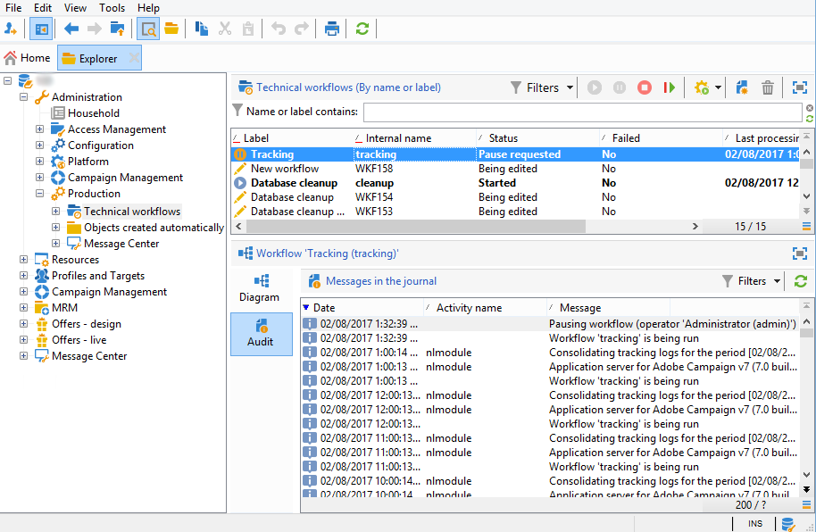

# Problemas de logs de rastreamento{#tracking-logs-issues}

Pode haver vários motivos para os logs de rastreamento não serem encaminhados. Recomendamos que você verifique as seguintes informações:

* **O fluxo de trabalho** Rastreamento **contém erros?**

Consulte a [documentação do Campaign v8](https://experienceleague.adobe.com/docs/campaign/automation/workflows/monitoring-workflows/monitor-technical-workflows.html?lang=pt-BR){target="_blank"}.

* **O módulo** trackinglogd **está em execução no servidor?**

  Consulte [Arquivos de log](../../production/using/log-files.md).

* **Foram feitas alterações?**

  Eles podem acionar uma perda de conexão com os servidores usando o alias de rastreamento.
