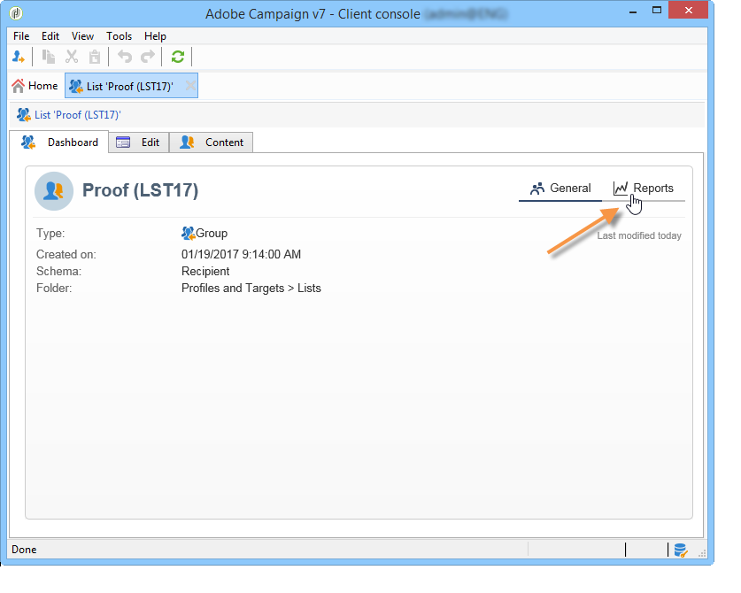

# Sobre relatórios internos do Campaign{#about-campaign-built-in-reports}

Este capítulo fornece a lista de relatórios internos do Adobe Campaign, seu conteúdo e seu contexto. As informações abaixo permitirão evitar a criação de relatórios já disponíveis na plataforma.

>[!NOTE]
>
>Você também pode aprender a adicionar seus próprios relatórios à guia **[!UICONTROL Reports]**. Para obter mais informações, consulte esta [página](../../reporting/using/configuring-access-to-the-report.md#defining-the-filtering-options).

Esses relatórios e seu conteúdo são detalhados nos documentos relacionados às funcionalidades relacionadas a eles.

O Adobe Campaign oferece vários tipos de relatórios, acessíveis através do console do cliente ou de um navegador da Internet.

Os seguintes tipos de relatório estão disponíveis:

* Relatórios sobre toda a plataforma, consulte [Relatórios globais](../../reporting/using/global-reports.md).
* Relatórios do delivery, consulte [Relatórios do delivery](../../reporting/using/delivery-reports.md).
* Relatórios acumulados, consulte [Relatórios cumulativos](../../reporting/using/cumulative-reports.md).

Você pode acessar relatórios na home page do console do cliente, do painel de relatórios ou da lista de delivery. O modo de exibição de um relatório depende de seu contexto. A lista de relatórios principais está disponível na home page e permite acessar os dados de delivery rapidamente. Essa lista pode ser alterada para atender às suas necessidades. Consulte [esta seção](../../reporting/using/about-reports-creation-in-campaign.md) para obter mais informações.

Para acessar os relatórios internos do Campaign:

1. Selecione a guia **[!UICONTROL Reports]** da interface do Adobe Campaign.

   

1. Use os campos de pesquisa para filtrar os relatórios exibidos.

1. Em seguida, clique no relatório que deseja exibir.

   

1. O link **[!UICONTROL Back]** na parte superior da tela o redirecionará para a lista de relatórios.

   

Outras ações possíveis em um relatório que está sendo editado são detalhadas [nesta página](../../reporting/using/actions-on-reports.md).

Os relatórios específicos a uma campanha ou um delivery são acessíveis por meio de seus respectivos painéis.

O princípio é o mesmo para listas, serviços, ofertas, etc., conforme mostrado abaixo:

