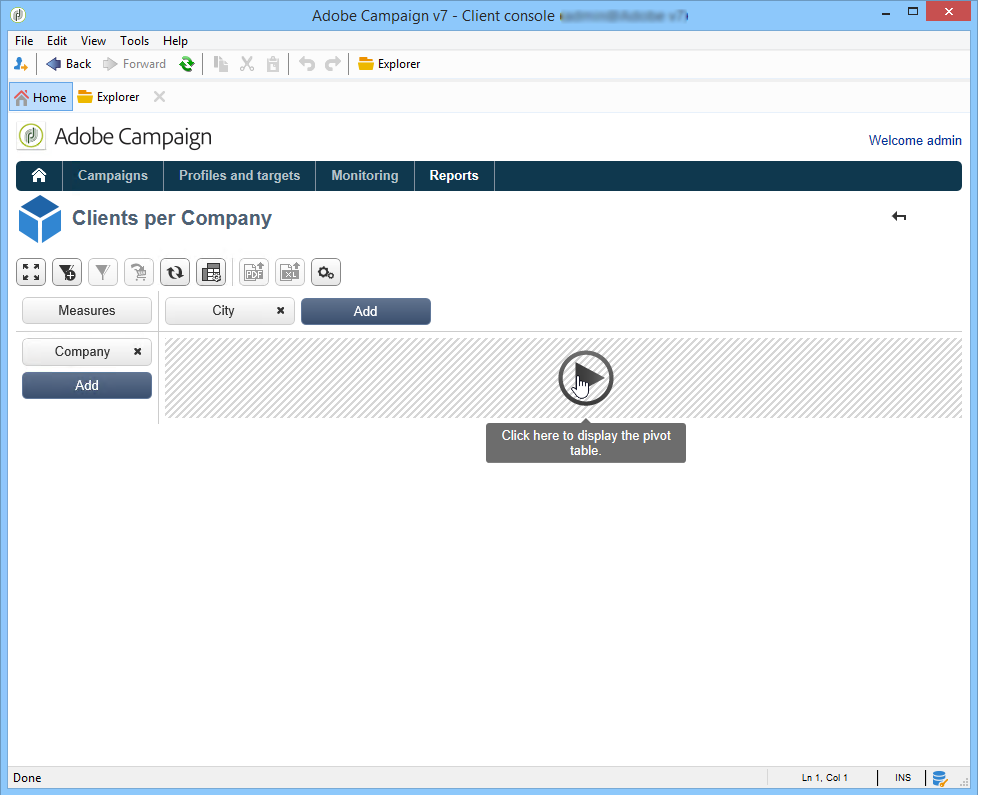

# Introdução aos cubos{#about-cubes}

A exploração de dados no banco de dados é oferecida pelo módulo **Marketing Analytics.** Ele permite analisar e medir dados, calcular estatísticas, simplificar e otimizar a criação e o cálculo do relatório. Além disso, o Marketing Analytics permite criar relatórios e populações do target. Uma vez identificados, eles são armazenados em listas que podem ser usadas no Adobe Campaign (targeting, segmentação, etc.).

Os cubos são usados para gerar determinados relatórios internos, incluindo relatórios do delivery (rastreamento de delivery, cliques, aberturas, etc.). Os relatórios baseados em cubos só podem ser usados como padrão para volumes de dados em 5 milhões de linhas de fatos.

É possível ampliar o recursos de exploração e análise do banco de dados e, ao mesmo tempo, facilitar para os usuários finais a configuração de relatórios e tabelas: basta selecionar um cubo existente (totalmente configurado) ao criar os relatórios ou as tabelas para processar cálculos, medidas e estatísticas.

Depois que tiverem sido criados e configurados, os cubos serão usados em caixas de query de relatório e aplicação web. Eles podem ser utilizados e manipulados dentro de tabelas dinâmicas.

>[!CAUTION]
>
>O **Marketing Analytics** é um módulo do Adobe Campaign. Ele precisa ser instalado na sua instância de forma que você possa utilizar os recursos descritos abaixo.

Com o módulo Marketing Analytics, o Campaign permite:

1. Criar cubos tendo em conta:

   * agregar dados e armazená-los em uma tabela de trabalho para pré-calcular indicadores com base nas necessidades do usuário,
   * reduzir o volume de dados envolvidos nos vários cálculos usados para relatórios e queries, otimizando significativamente os tempos de cálculo do indicador,
   * simplificar o acesso aos dados, permitindo aos usuários manipularem dados (sejam pré-agregados ou não) dependendo de várias dimensões.

   Para saber mais, consulte [Criação de indicadores](../../reporting/using/creating-indicators.md).

1. Criar tabelas dinâmicas tendo em conta:

   * explorar dados calculados, medidas configuradas,
   * selecionar os dados a serem exibidos, bem como seu modo de exibição,
   * personalizar as medidas e os indicadores usados,
   * oferecer ferramentas de análise interativa aos usuários sem conhecimento técnico.

   Para saber mais, consulte [Uso de cubos para explorar dados](../../reporting/using/using-cubes-to-explore-data.md).

1. Criar um query usando dados calculados e agregados em um cubo.
1. Identificar populações e referenciá-las em listas.

## Terminologia {#terminology}

Ao trabalhar com cubos, os seguintes conceitos devem ser conhecidos:

* Cubo

   Um cubo é uma representação de informações multidimensionais: ele fornece aos usuários finais estruturas projetadas para análise interativa de dados.

* Tabela/schema de fatos

   A tabela de fatos (ou schema de fatos) contém os dados brutos ou primários nos quais as análises serão baseadas. Trata-se principalmente de tabelas de grandes volumes (possivelmente com tabelas vinculadas) com cálculos potencialmente longos.

   Por exemplo, uma tabela de fatos pode ser: a tabela de broadlog, a tabela de compras, etc.

* Dimensão

   As dimensões permitem segmentar dados em grupos: uma vez criadas, as dimensões atuam como eixos de análise. Na maioria dos casos, para determinada dimensão, vários níveis serão definidos. Por exemplo, para uma dimensão temporal, os níveis serão meses, dias, horas, minutos e etc. Esse conjunto de níveis representa a hierarquia de dimensão e permite vários níveis de análise de dados.

* Compartimentalização

   Para alguns campos, você pode definir compartimentalização para agrupar valores e facilitar a leitura das informações. A compartimentalização é aplicada aos níveis

   Recomendamos que você defina a compartimentalização quando houver a possibilidade de muitos valores diferentes.

* Medição

   As medidas mais frequentes são soma, média, máxima, mínimo, desvio padrão, etc.

   As medidas podem ser calculadas: por exemplo, a taxa de aceitação de uma oferta é a razão do número de vezes que foi apresentada em comparação ao número de vezes que foi aceita.

## Espaço de trabalho do cubo {#cube-workspace}

Os cubos são armazenados no nó **[!UICONTROL Administration > Configuration > Cubes]**.

Os principais contextos de uso para cubos são:

* É possível realizar exportações de dados diretamente em um relatório, projetado na guia **[!UICONTROL Reports]** da plataforma do Adobe Campaign.

   Para fazer isso, crie um novo relatório e selecione o cubo que deseja usar.

   

   Os cubos aparecem como templates baseados em quais relatórios são criados. Depois de escolher um template, clique em **[!UICONTROL Create]** para configurar e exibir o relatório correspondente.

   Você pode adaptar medidas, alterar o modo de exibição ou configurar a tabela e exibir o relatório usando o botão principal.

   

* Você também pode fazer referência a um cubo na caixa **[!UICONTROL Query]** de um relatório para usar seus indicadores, conforme mostrado abaixo:

   

* Você também pode inserir uma tabela dinâmica com base em um cubo em qualquer página de um relatório. Para fazer isso, faça referência ao cubo a ser usado na guia **[!UICONTROL Data]** da tabela dinâmica na página relacionada.

   

   Para saber mais, consulte [Exploração de dados em um relatório](../../reporting/using/using-cubes-to-explore-data.md#exploring-the-data-in-a-report).
