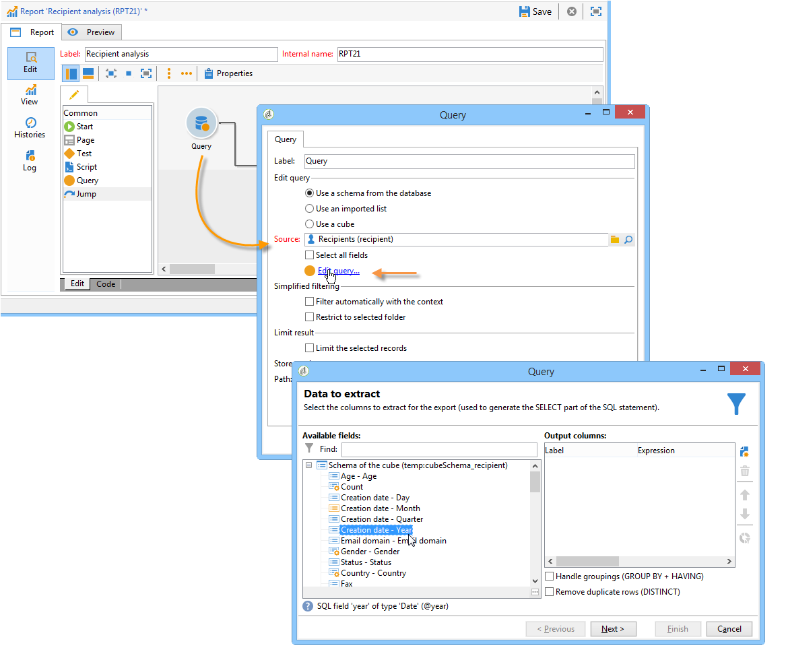

# Introdução aos cubos{#about-cubes}

## Terminologia {#terminology}

Os termos específicos do trabalho com cubos estão listados abaixo.

* **Cubo** - Um cubo é uma representação de informações multidimensionais: ele fornece estruturas projetadas para análise interativa de dados aos usuários finais.

* **Tabela/esquema de fato** - A tabela de fatos (ou esquema de fatos) contém os dados brutos ou primários nos quais as análises serão baseadas. Trata-se principalmente de tabelas de grandes volumes (possivelmente com tabelas vinculadas) com cálculos potencialmente longos. Por exemplo, uma tabela de fatos pode ser: a tabela de broadlog, a tabela de compras, etc.

* **Dimensão** - As dimensões permitem segmentar dados em grupos: uma vez criadas, as dimensões atuam como eixos de análise. Na maioria dos casos, para determinada dimensão, vários níveis serão definidos. Por exemplo, para uma dimensão temporal, os níveis serão meses, dias, horas, minutos e etc. Esse conjunto de níveis representa a hierarquia de dimensão e permite vários níveis de análise de dados.

* **Compartimentalização** - Em alguns campos, é possível definir a compartimentalização para agrupar valores e facilitar a leitura das informações. A compartimentalização é aplicada aos níveis. Recomendamos que você defina a compartimentalização quando houver a possibilidade de muitos valores diferentes.

* **Medida** - As medidas mais comuns são soma, média, máximo, mínimo, desvio padrão etc. As medidas podem ser calculadas: por exemplo, a taxa de aceitação de uma oferta é a razão do número de vezes que foi apresentada em comparação ao número de vezes que foi aceita.

## Espaço de trabalho do cubo {#cube-workspace}

Os cubos são armazenados no nó **[!UICONTROL Administration > Configuration > Cubes]**.

Os principais contextos de uso para cubos são:

* É possível realizar exportações de dados diretamente em um relatório, projetado na guia **[!UICONTROL Reports]** da plataforma do Adobe Campaign.

  Para fazer isso, crie um novo relatório e selecione o cubo que deseja usar.

  

  Os cubos aparecem como modelos baseados em quais relatórios são criados. Depois de escolher um modelo, clique em **[!UICONTROL Create]** para configurar e exibir o relatório correspondente.

  Você pode adaptar medidas, alterar o modo de exibição ou configurar a tabela e exibir o relatório usando o botão principal.

  

* Você também pode fazer referência a um cubo na caixa **[!UICONTROL Query]** de um relatório para usar seus indicadores, conforme mostrado abaixo:

  

* Você também pode inserir uma tabela dinâmica com base em um cubo em qualquer página de um relatório. Para fazer isso, faça referência ao cubo a ser usado na guia **[!UICONTROL Data]** da tabela dinâmica na página relacionada.

  

  Para saber mais, consulte [Explorar os dados em um relatório](../../reporting/using/using-cubes-to-explore-data.md#exploring-the-data-in-a-report).
