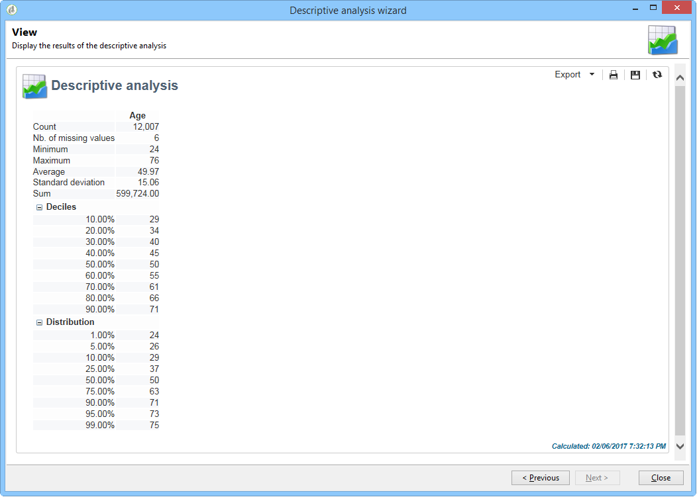

# Sobre análise descritiva{#about-descriptive-analysis}

Para gerar estatísticas sobre os dados no banco de dados, crie relatórios de análise descritiva usando o assistente dedicado e adapte seu conteúdo e apresentação de acordo com as necessidades.

Esses relatórios abordam populações e devem ser usados somente para analisar volumes de dados pequenos.

É possível gerar relatórios quantitativos ou qualitativos de análise. Análises qualitativas permitem representar dados da seguinte maneira:

* Tabela e histograma:

   

* Valores acumulados, sem a tabela:

   

* Detalhamento por linha de negócios

   

As análises quantitativas fornecem estatísticas gerais sobre os dados numéricos da seleção, conforme mostrado abaixo:

Esses relatórios são criados por meio do assistente de análise descritiva, que com base em várias etapas, permite escolher o tipo de relatório que deseja criar, bem como os dados e o layout. O relatório é exibido na última etapa. Se necessário, o relatório pode ser publicado e compartilhado com outros operadores, impressos, exportados no formato Excel, PDF ou OpenDocument.

Os assistentes de análise descritiva não são tão eficazes quanto os relatórios do Adobe Campaign, mas fornecem uma visão geral rápida do conteúdo do banco de dados ou de uma seleção de dados.

>[!CAUTION]
>
>Uma análise descritiva não permite explorar grandes volumes de dados.

