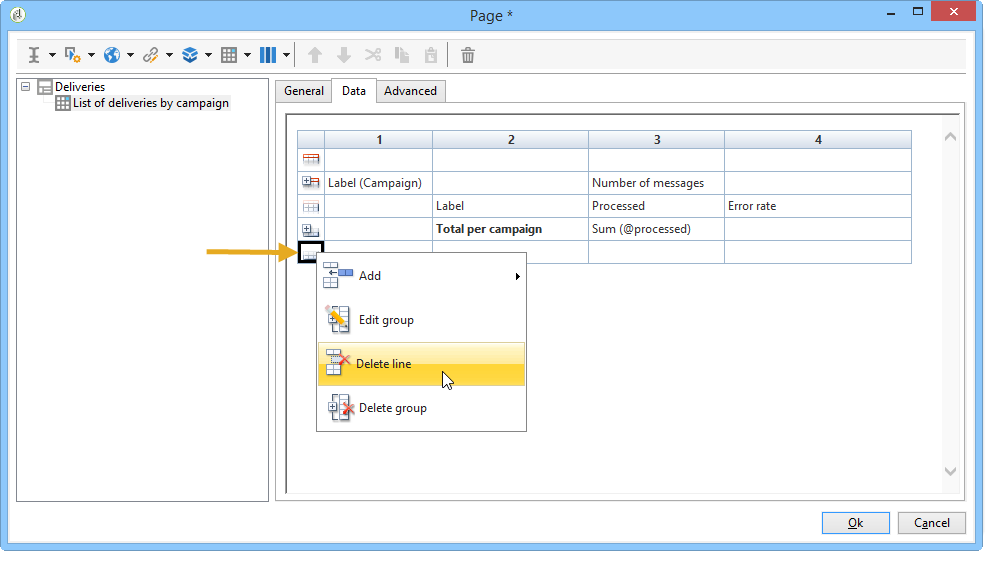
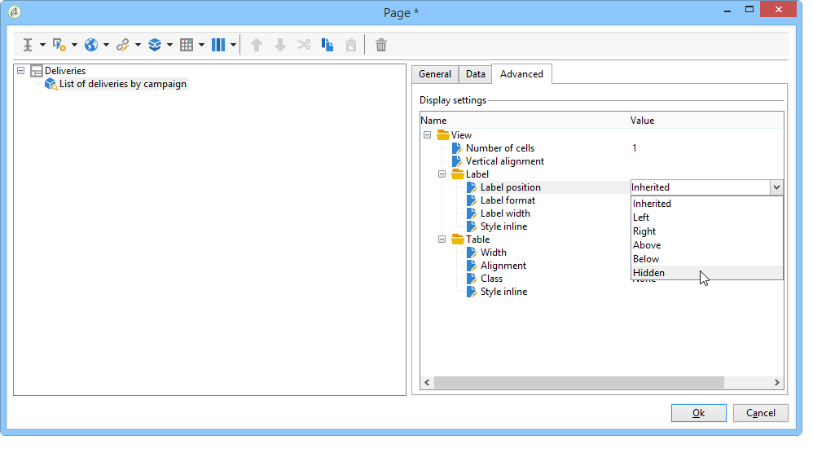

# Ações em relatórios{#actions-on-reports}


Quando estiver exibindo um relatório, a barra de ferramentas permite executar determinado número de ações. Veja os detalhes abaixo.


A barra de ferramentas permite exportar, imprimir, arquivar ou exibir o relatório em um navegador da Web por exemplo.


## Exportação de um relatório {#exporting-a-report}

Selecione o formato que deseja usar para exportar a partir da lista suspensa. (.xls, .pdf ou .ods).


Quando um relatório contém várias páginas, é preciso repetir a operação para cada página.

É possível configurar o relatório na exibição do formato PDF, Excel ou OpenOffice. Abra o navegador do Adobe Campaign e selecione o relatório em questão.

Acesse as opções de exportação por meio das atividades **[!UICONTROL Page]** do relatório, na guia **[!UICONTROL Advanced]**.

Altere as configurações de **[!UICONTROL Paper]** e **[!UICONTROL Margins]** para atender às suas necessidades. Também é possível autorizar a exportação de uma página somente em formato PDF. Para fazer isso, desmarque a opção **[!UICONTROL Activate OpenOffice/Microsoft Excel export]**.


### Exportação para o Microsoft Excel {#exporting-into-microsoft-excel}

Para relatórios do tipo **[!UICONTROL List with group]** destinados a serem exportados para o Excel, as seguintes recomendações e limitações se aplicam:

* Esses relatórios não devem conter linhas vazias.

   

* A legenda da lista deve estar oculta.

   

* Os relatórios não precisam usar formatação específica definida no nível da célula. É preferível usar **[!UICONTROL Form rendering]** para definir o formato das células na tabela. O **[!UICONTROL Form rendering]** pode ser acessado via **[!UICONTROL Administration > Configuration > Form rendering]**.
* Não é recomendável inserir conteúdo HTML.
* Se um relatório contiver vários elementos de tabela, gráfico, etc., eles serão exportados um abaixo do outro.
* É possível forçar a quebra de linhas nas células: essa configuração será mantida no Excel. Para obter mais informações, consulte [Definição de formato da célula](../../reporting/using/creating-a-table.md#defining-cell-format).

### Adiar a exportação {#postpone-the-export}

É possível adiar a exportação de um relatório, por exemplo, para aguardar chamadas assíncronas. Para fazer isso, digite o seguinte parâmetro no script de inicialização da página:

```
document.nl_waitBeforeRender = true;
```

Para ativar a exportação e começar a converter em um PDF, use a função **document.nl_renderToPdf()** sem nenhum parâmetro.

### Alocação de memória {#memory-allocation}

Ao exportar determinados relatórios grandes, erros de alocação de memória podem ocorrer.

Em determinadas instâncias, o valor padrão **maxMB** (**SKMS** para instâncias hospedadas) do JavaScript indicado no arquivo de configuração **serverConf.xml** é definido como 64 MB. Se encontrar erros de memória insuficiente ao exportar um relatório, talvez seja recomendado aumentar esse número para 512 MB:

```
<javaScript maxMB="512" stackSizeKB="8"/>
```

Para aplicar alterações feitas na configuração, o serviço **nlserver** precisa ser reiniciado.

Para saber mais sobre o arquivo **serverConf.xml**, consulte [esta seção](../../production/using/configuration-principle.md).

Para saber mais sobre o serviço **nlserver**, consulte [esta seção](../../production/using/administration.md).

## Impressão de um relatório {#printing-a-report}

É possível imprimir seu relatório: para fazer isso, clique no ícone da impressora: isso abre a caixa de diálogo.

Para obter um resultado melhor, edite as opções de impressão do Internet Explorer e selecione **[!UICONTROL Print background colors and images]**.


## Criação de arquivos de relatórios {#creating-report-archives}

O arquivamento de um relatório permite criar um modo de exibição do relatório em vários períodos, por exemplo, para mostrar as estatísticas de determinado período.

Para criar um arquivo, abra o relatório indicado e clique no ícone apropriado.


Para exibir ou ocultar arquivos existentes, clique no ícone show/hide.


As datas de arquivamento são exibidas sob o ícone show/hide. Clique no arquivo para exibi-lo.


É possível excluir um arquivo de relatórios. Para fazer isso, vá para o nó do Adobe Campaign onde seus relatórios estão armazenados. Clique na guia **[!UICONTROL Archives]**, selecione aquele que desejar excluir e clique em **[!UICONTROL Delete]**.


