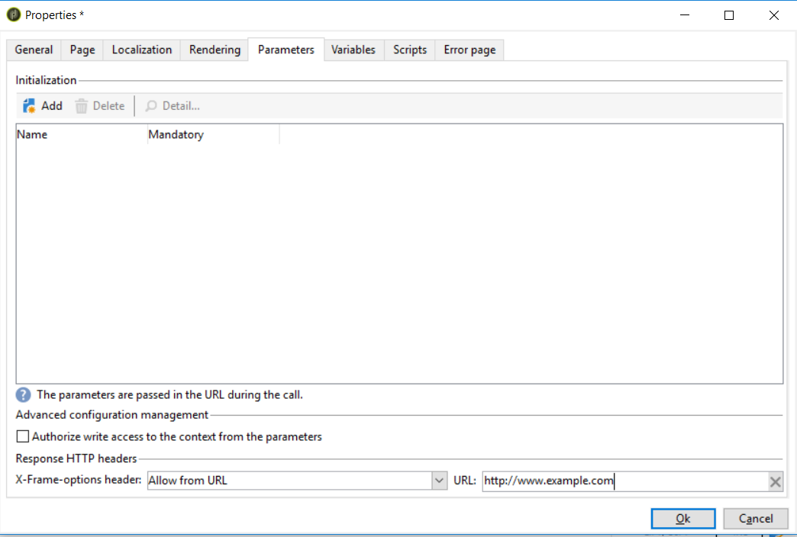

# Recursos avançados{#advanced-functionalities}


Como usuário técnico, além das [propriedades gerais](../../reporting/using/properties-of-the-report.md), você pode aproveitar recursos avançados para configurar os relatórios, como:

* Criar queries complexas para processar dados em uma atividade **Script**. [Saiba mais](#script-activity)

* Adicionar um script externo para ser executado no servidor ou no cliente. [Saiba mais](#external-script)

* Chamar um relatório com uma atividade **Jump**. [Saiba mais](#calling-up-another-report)

* Adicionar um parâmetro de URL a um relatório para torná-lo mais acessível. [Saiba mais](#calling-up-another-report)

* Adicionar variáveis que serão usadas no contexto do relatório. [Saiba mais](#adding-variables)

## Trabalhar com scripts {#adding-a-script}

### Fazer referência a scripts externos {#external-script}

Você pode referenciar códigos JavaScript que serão executados pelo cliente e/ou pelo servidor quando a página do relatório for chamada.

Para fazer isso:

1. Edite as [propriedades do relatório](../../reporting/using/properties-of-the-report.md) e clique em **[!UICONTROL Scripts]**.
1. Clique em **[!UICONTROL Add]** e selecione o script que será referenciado.
1. Em seguida, selecione o modo de execução.

   Se adicionar vários scripts, use as setas da barra de ferramentas para definir sua sequência de execução.

   

Para execução normal pelo cliente, os scripts referenciados devem ser escritos em JavaScript e precisam ser compatíveis com a maioria dos navegadores. Para obter mais informações, consulte [esta seção](../../web/using/web-forms-answers.md).

### Adicionar uma atividade de Script {#script-activity}

Ao [projetar seu relatório](../../reporting/using/creating-a-new-report.md#modelizing-the-chart), use a atividade **[!UICONTROL Script]** para processar dados e criar facilmente queries complexos que não habilitam o idioma SQL. Você pode inserir seu query diretamente na janela de script.

A guia **[!UICONTROL Texts]** permite definir cadeias de texto. Elas podem ser usadas com a seguinte sintaxe: **$(Identifier)**. Para obter mais informações sobre como usar textos, consulte [Adicionar um cabeçalho e um rodapé](../../reporting/using/element-layout.md#adding-a-header-and-a-footer).

>[!CAUTION]
>
>NÃO recomendamos o uso do código JavaScript para criar agregações.

Para criar um histórico do relatório, adicione a seguinte linha à sua query JavaScript para salvar os dados arquivados:

```
if( ctx.@_historyId.toString().length == 0 )
```

Caso contrário, os dados atuais serão exibidos.

## Adicionar um parâmetro de URL {#defining-additional-settings}

A guia **[!UICONTROL Parameters]** das [propriedades do relatório](../../reporting/using/properties-of-the-report.md) permite definir configurações adicionais para o relatório: essas configurações serão repassadas para o URL durante a chamada.

>[!CAUTION]
>
>Por motivos de segurança, esses parâmetros devem ser usados com muito cuidado.

Para criar uma nova configuração:

1. Clique no botão **[!UICONTROL Add]** e digite o nome da configuração.

   

1. Se necessário, especifique se a configuração será obrigatória ou não.

1. Selecione o tipo de configuração que deseja criar: **[!UICONTROL Filter]** ou **[!UICONTROL Variable]**.

   A opção **[!UICONTROL Filter entities]** permite usar um campo do banco de dados como parâmetro.

   

   Os dados são recuperados diretamente no nível da entidade: **ctx/receipt/@account**.

   A opção **[!UICONTROL Variable]** permite criar ou selecionar uma variável que será passada como parâmetro do URL e pode ser usada nos filtros.

O **[!UICONTROL Response HTTP headers]** permite que você evite o recurso de clickjacking ao incluir a página do seu relatório em uma página HTML usando o iframe. Para evitar o clickjacking, você pode escolher o comportamento **[!UICONTROL X-Frame-options header]**:

* **[!UICONTROL None]**: O relatório não terá **[!UICONTROL X-Frame-options header]**.
* **[!UICONTROL Same as origin]**: Definido por padrão para novos relatórios e relatórios republicados. O nome do host será igual ao URL do relatório.
* **[!UICONTROL Deny]**: O relatório não pode ser incluído em uma página HTML usando iframe.



## Adição de variáveis {#adding-variables}

A guia **[!UICONTROL Variables]** contém a lista de variáveis configuradas no relatório. Essas variáveis são expostas no contexto do relatório e podem ser utilizadas em cálculos.

Clique no botão **[!UICONTROL Add]** para criar uma nova variável.

Para exibir a definição de uma variável, selecione-a e clique no botão **[!UICONTROL Detail...]**.


## Caso de uso: usar variáveis e parâmetros em um relatório

No exemplo do vídeo abaixo, você aprenderá a adicionar um parâmetro &quot;_type&quot; para criar diferentes visualizações de um relatório com base no valor desse atributo.

<!--
 [Discover this feature in video](https://helpx.adobe.com/campaign/classic/how-to/add-url-parameter-in-acv6.html?playlist=/ccx/v1/collection/product/campaign/classic/segment/business-practitioners/explevel/intermediate/applaunch/how-to-4/collection.ccx.js&ref=helpx.adobe.com)-->


## Chamar outro relatório {#calling-up-another-report}

A atividade de **Jump** é como uma transição sem uma seta: permite ir de uma atividade para outra ou acessar outro relatório.
