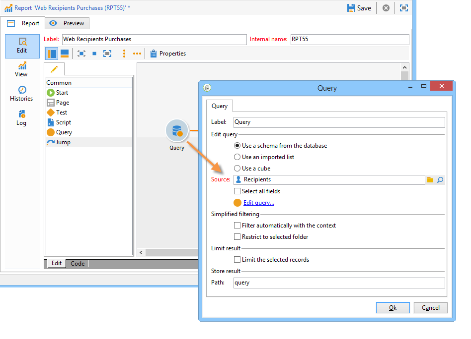
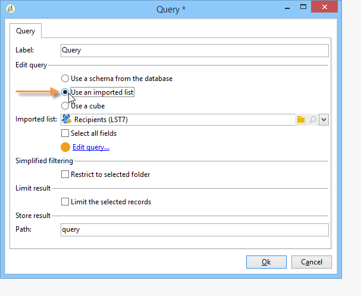
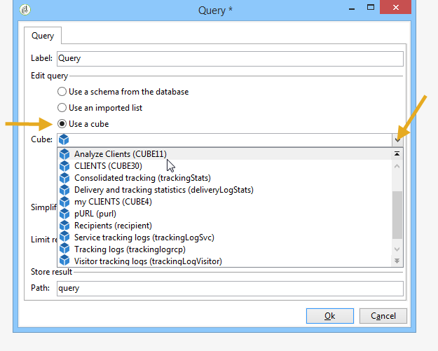
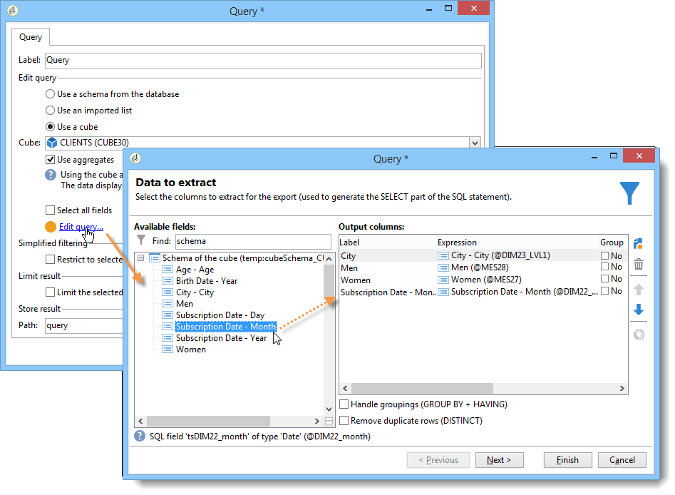
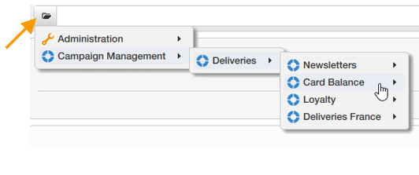

# Coletar dados para analisar{#collecting-data-to-analyze}

Os dados a serem usados para criar o relatório podem ser selecionados diretamente na página do relatório (para obter mais informações, consulte [Uso do contexto](../../reporting/using/using-the-context.md)) ou coletados por meio de uma ou mais queries.

Esta atividade oferece três métodos diferentes:

1. Criação de uma consulta utilizando os dados no banco de dados.
1. Processamento dos dados contidos em uma lista.
1. Uso dos dados contidos em um cubo existente.

A escolha do método depende do tipo de cálculo, do volume de dados e da durabilidade, etc. Todos esses parâmetros devem ser examinados cuidadosamente para evitar sobrecarga do banco de dados do Adobe Campaign e otimizar a geração e manipulação dos relatórios criados. Para obter mais informações, consulte [esta página](../../reporting/using/best-practices.md#optimizing-report-creation).

Em todos os casos, os dados são coletados por meio de uma atividade tipo **[!UICONTROL Query]**.

Esse modo de seleção de dados é relevante quando os dados do relatório precisam ser coletados ou criados usando dados no banco de dados. Em alguns casos, também é possível selecionar os dados diretamente dos elementos usados no relatório. Por exemplo, ao inserir um gráfico, é possível selecionar os dados fonte diretamente. Para obter mais informações, consulte [Uso do contexto](../../reporting/using/using-the-context.md).

## Usar os dados de um esquema {#using-the-data-from-a-schema}

Para usar dados vinculados a um esquema de banco de dados, selecione a opção apropriada no editor de consultas e configure a consulta a ser aplicada.

O exemplo a seguir permite coletar o número de destinatários para cada país, entre os perfis no banco de dados. Eles podem então ser exibidos em um relatório na forma de uma tabela.

## Usar uma lista importada {#using-an-imported-list}

Para criar um relatório, é possível usar dados de uma lista de dados importados.

Para fazer isso, selecione a opção **[!UICONTROL Use an imported list]** na caixa de consulta e selecione a lista relacionada.

Clique no link **[!UICONTROL Edit query...]** para definir os dados que serão coletados entre os elementos desta lista para criar o relatório.

## Usar um cubo {#using-a-cube}

É possível selecionar um cubo para definir a consulta.

Os cubos permitem estender as capacidades de exploração e análise do banco de dados, facilitando a configuração de relatórios e tabelas para usuários finais: basta selecionar um Cubo existente e totalmente configurado e usar seus cálculos, medidas e estatísticas. Para obter mais informações sobre criação de cubos, consulte [esta seção](../../reporting/using/ac-cubes.md).

Clique no link **[!UICONTROL Edit query...]** e selecione os indicadores que deseja exibir ou usar no relatório.

## Opções de filtro em consultas {#filtering-options-in-the-queries}

Para evitar a execução de consultas em todo o banco de dados, os dados precisam ser filtrados.

### Filtro simplificado {#simplified-filter}

É possível selecionar a opção **[!UICONTROL Filter automatically with the context]** para tornar o relatório acessível por meio de um nó específico da árvore, como uma lista, um destinatário ou uma entrega.

A opção **[!UICONTROL Filter with the folder]** permite especificar uma pasta e levar em conta somente seu conteúdo. Isso permite filtrar os dados do relatório para mostrar apenas os dados de uma das pastas na árvore, conforme mostrado abaixo:

### Limitar a quantidade de dados coletados {#limiting-the-amount-of-data-collected}

Configurar o número de registros a serem extraídos de uma consulta utilizando as opções de limitação de resultados:

* **[!UICONTROL Limit to first record]** para extrair um resultado,
* **[!UICONTROL Size]** para extrair um número definido de registros.
