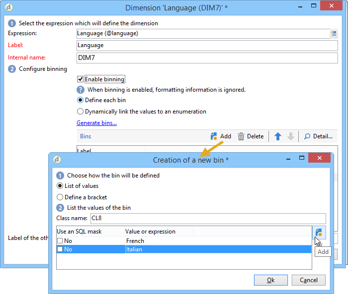
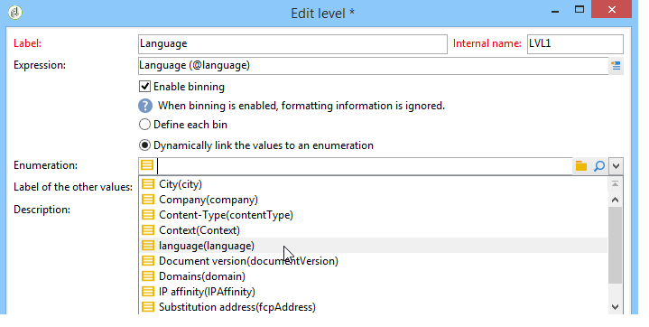
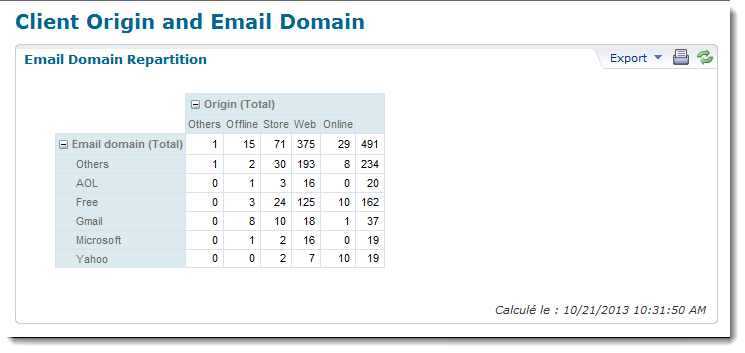
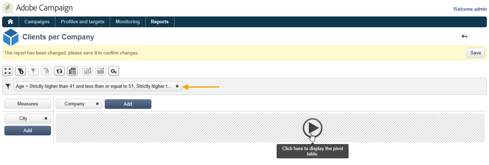

# Práticas recomendadas para cubos{#concepts-and-methodology}

## Compartimentalização de dados {#data-binning}

A compartimentalização permite simplificar a exibição de dados agrupando valores de acordo com os critérios. Dependendo das informações disponíveis, é possível definir faixa etária, agrupar domínios de email, restringir a uma enumeração de valor, restringir explicitamente os dados a serem exibidos e agrupar todos os outros dados em uma linha ou coluna dedicada, etc.

Em geral, três tipos de compartimentalização estão disponíveis:

1. Uso de intervalos de valor definidos manualmente. Por exemplo, a idade, o carrinho de compras médio, o número de deliveries abertos, etc.). Para obter mais informações, consulte [Definição de cada compartimento](#defining-each-bin).
1. Dinamicamente, dependendo dos valores de uma enumeração: apenas exibe os valores contidos na enumeração, todos os outros valores são agrupados em &#39;Outros&#39;. Para obter mais informações, consulte [Gestão dinâmica de compartimentos](#dynamically-managing-bins).
1. Uso de intervalos de valor, todos os outros sendo agrupados. Por exemplo, de 18 a 25 anos, 26 a 59 anos e os outros. Para obter mais informações, consulte [Criação de intervalos de valor](#creating-value-ranges).

Para ativar a compartimentalização, marque a caixa apropriada ao criar a dimensão.

Você pode criar compartimentos manualmente ou vinculá-los a uma enumeração existente.

O Adobe Campaign também fornece um assistente para compartimentalização automática: os valores podem ser divididos em N grupos ou agrupados de acordo com os valores mais frequentes no banco de dados.

### Definição de cada compartimento {#defining-each-bin}

Para criar cada compartimento individualmente, selecione a opção **[!UICONTROL Define each bin]** e use a tabela para criar os diversos compartimentos.

Clique no botão **[!UICONTROL Add]** para criar um novo compartimento e listar os valores que serão agrupados no compartimento.

No exemplo a seguir, os idiomas são agrupados em três categorias: inglês, alemão e holandês; francês, italiano e espanhol; e outros.

Você pode usar uma máscara SQL para combinar vários valores em um filtro. To do this, check **[!UICONTROL Yes]** in the **[!UICONTROL Use an SQL mask]** column and enter the SQL filter to be applied in the **[!UICONTROL Value or expression]** column.

No exemplo abaixo, todos os domínios de email que começam com **yahoo** (yahoo.fr, yahoo.com, yahoo.be e etc.) ou com **ymail** (ymail.com, ymail.eu e etc.) serão agrupados no rótulo **YAHOO!**, assim como endereços com o domínio **rocketmail.com** .

### Gestão dinâmica de compartimento {#dynamically-managing-bins}

Os valores podem ser gerenciados dinamicamente por enumerações. Isso significa que somente os valores contidos na enumeração serão exibidos. Quando os valores de enumeração mudam, o conteúdo do Cubo é adaptado automaticamente.

Para criar esse tipo de compartimentalização de valor, siga as etapas abaixo:

1. Crie uma nova dimensão e habilite a compartimentalização.
1. Select the **[!UICONTROL Dynamically link the values to an enumeration]** option and select the matching enumeration.

   

   Sempre que os valores de enumeração forem atualizados, os compartimentos correspondentes serão adaptados automaticamente.

### Criação de intervalos de valor {#creating-value-ranges}

Você pode agrupar os valores em intervalos com base em um intervalo desejado.

To define ranges manually, click the **[!UICONTROL Add]** button and select **[!UICONTROL Define a range]** :

Em seguida, especifique os limites inferiores e superiores e clique em **[!UICONTROL Ok]** para confirmar.

### Criação automática de compartimentos {#generating-bins-automatically}

Também é possível gerar compartimentos automaticamente. Para fazer isso, clique em **[!UICONTROL Generate bins...]**.

É possível:

* Recuperação dos valores usados com mais frequência

   No exemplo a seguir, os quatro valores mais usados serão exibidos, enquanto os outros serão contados e agrupados na categoria &quot;Outros&quot;.

* Criação de compartimentos no formato de slots

   No exemplo a seguir, o Adobe Campaign cria automaticamente quatro slots de valor do mesmo tamanho para exibir os valores no banco de dados.

Nesse caso, o filtro selecionado no schema de fatos é ignorado.

### Enumerações {#enumerations}

Para melhorar a relevância e a legibilidade de um relatório, o Adobe Campaign permite criar enumerações específicas para reagrupar diferentes valores no mesmo compartimento. Essas enumerações, reservadas para compartimentalização, são referenciadas nos cubos e exibidas nos relatórios.

O Adobe Campaign também oferece uma enumeração em domínios que permite exibir uma lista dos domínios de email de todos os contatos do banco de dados, reagrupados pelo ISP, como mostrado no exemplo a seguir:

Ele é criado usando o seguinte template:

Para criar um relatório usando essa lista discriminada, crie um Cubo usando a dimensão **[!UICONTROL Email domain]**. Choose the **[!UICONTROL Enable binning]** option then **[!UICONTROL Dynamically link the values to an enumeration]**. Em seguida, selecione a enumeração de **Domínios** como mostrado acima. Todos os valores que não têm alias especificado serão reagrupados no rótulo **Outros** .

Em seguida, crie um relatório com base neste Cubo para exibir os valores.

Você só precisa modificar a enumeração para atualizar o relatório relacionado. Por exemplo, crie o valor **Adobe** e adicione o alias **adobe.com** e o relatório é atualizado automaticamente com o valor da Adobe no nível de enumeração.

A lista discriminada **[!UICONTROL Domains]** é usada para gerar relatórios internos que exibem a lista de domínios. Para adaptar o conteúdo desses relatórios, você pode editar essa lista.

Você pode criar outras enumerações reservadas para compartimentalização e usá-las em outros Cubos: todos os valores de alias serão reagrupados nas posições especificadas na primeira guia de enumeração.

## Cálculo e uso de agregações {#calculating-and-using-aggregates}

Os maiores volumes de dados podem ser calculados em agregações.

Agregações são úteis ao manipular grandes volumes de dados. Eles são atualizados automaticamente com base nas configurações definidas na caixa de workflow dedicada, para integrar os dados a serem coletados mais recentemente nos indicadores

As agregações são definidas na guia relevante de cada cubo.

>[!NOTE]
>
>O workflow para atualizar cálculos de agregação pode ser configurado na própria agregação ou a agregação pode ser atualizada por meio de um workflow externo vinculado ao cubo relevante.

Para criar uma nova agregação, siga as etapas abaixo:

1. Clique na guia **[!UICONTROL Aggregates]** do cubo, em seguida, clique no botão **[!UICONTROL Add]**.

   

1. Insira um rótulo para a agregação e adicione as dimensões a serem calculadas.

   

1. Selecione uma dimensão e um nível. Repita esse processo para cada dimensão e cada nível.
1. Clique na guia **[!UICONTROL Workflow]** para criar fluxo de trabalho de agregação.

   

   * A atividade **[!UICONTROL Scheduler]** permite definir a frequência das atualizações de cálculo. O programador é detalhado [nesta seção](../../workflow/using/scheduler.md).
   * A atividade **[!UICONTROL Aggregate update]** permite selecionar o modo de atualização que deseja aplicar: completo ou parcial.

      Por padrão, uma atualização completa é realizada durante cada cálculo. Para habilitar uma atualização parcial, selecione a opção relevante e defina as condições de atualização.

      

## Definição de medidas {#defining-measures}

Os tipos de medidas são definidos na guia **[!UICONTROL Measures]** do cubo. É possível calcular somas, médias, desvios, etc.

É possível criar quantas medidas forem necessárias: então selecione a medida que deseja mostrar ou ocultar na tabela. Para obter mais informações, consulte [Exibição de medidas](#displaying-measures).

Para definir uma nova medida, siga as etapas abaixo:

1. Clique no botão **[!UICONTROL Add]** acima da lista de medidas e selecione o tipo de medida e a fórmula a ser calculada.

   

1. Se necessário e dependendo do operador, escolha a expressão que a operação aborda.

   The **[!UICONTROL Advanced selection]** button lets you create complex calculation formulas. Para obter mais informações, consulte [esta seção](../../platform/using/about-queries-in-campaign.md).

   

1. The **[!UICONTROL Filter the measure data...]** link lets you restrict the calculation field and only apply it to specific data in the database.

   

1. Insira o rótulo da medida e adicione uma descrição, em seguida, clique em **[!UICONTROL Finish]** para criar.

## Exibição de medidas {#displaying-measures}

É possível configurar a exibição de medidas na tabela dependendo das necessidades:

* a sequência de exibição de medidas (consulte [Sequência de exibição](#display-sequence)),
* as informações para mostrar/ocultar no relatório (consulte [Configuração de exibição](#configuring-the-display)),
* medidas para exibir: porcentagem, total, número de decimais, etc. (consulte [Alteração do tipo de medida exibida](#changing-the-type-of-measure-displayed)).

### Sequência de exibição {#display-sequence}

As medidas calculadas no cubo são configuradas por meio do botão **[!UICONTROL Measures]**.

Mova as linhas para alterar a sequência de exibição. No exemplo a seguir, o dado francês é movido para a parte inferior da lista: isso significa que ele será exibido na última coluna.

### Configuração da visualização {#configuring-the-display}

A configuração de medidas, linhas e colunas pode ser executada individualmente para cada medida ou no geral. Um ícone específico permite acessar a janela de seleção do modo de exibição.

* Click the **[!UICONTROL Edit the configuration of the pivot table]** icon to access the configuration window.

   É possível escolher se exibe ou não os rótulos das medidas, bem como configurar o layout (linhas ou colunas).

As opções de cor permitem realçar valores importantes para facilitar a leitura.

### Alteração do tipo de medida exibida {#changing-the-type-of-measure-displayed}

Em cada medida, é possível definir a unidade e a formatação a serem aplicadas.

## Compartilhamento de um relatório {#sharing-a-report}

Após configurar o relatório, é possível salvá-lo e compartilhá-lo com outros operadores.

To do this, click the **[!UICONTROL Show the report properties]** icon and enable the **[!UICONTROL Share this report]** option.

Especifique a categoria à qual o relatório pertence e sua relevância. Para obter mais informações, consulte [esta página](../../reporting/using/configuring-access-to-the-report.md#report-display-context) nas seções **Sequência de exibição** e **Definição de opção de filtro**.

Para confirmar essas alterações, é preciso salvar o relatório.

## Criação de filtros {#creating-filters}

É possível criar filtros para visualizar uma seção dos dados.

Para fazer isso:

1. Clique no ícone **[!UICONTROL Add a filter]**.

   

1. Selecione a dimensão que o filtro aborda.

   

1. Selecione o tipo de filtro e seu nível de precisão.

   

1. Depois de criado, o filtro é exibido acima do relatório.

   

   Clique no filtro para editá-lo.

   Clique na cruz para excluí-lo.

   É possível combinar quantos filtros forem necessários: eles serão mostrados nesta área.

   

Cada vez que um filtro é modificado (adicionar, remover, alterar), o relatório deve ser recalculado.

Os filtros também podem ser criados com base em uma seleção. Para fazer isso, selecione as células, linhas e colunas de origem e clique no ícone **[!UICONTROL Add a filter]**.

Para selecionar uma linha, coluna ou célula, clique com o botão esquerdo do mouse nela. Para desmarcar, clique novamente.

O filtro é aplicado automaticamente e adicionado à zona de filtro acima do relatório.

