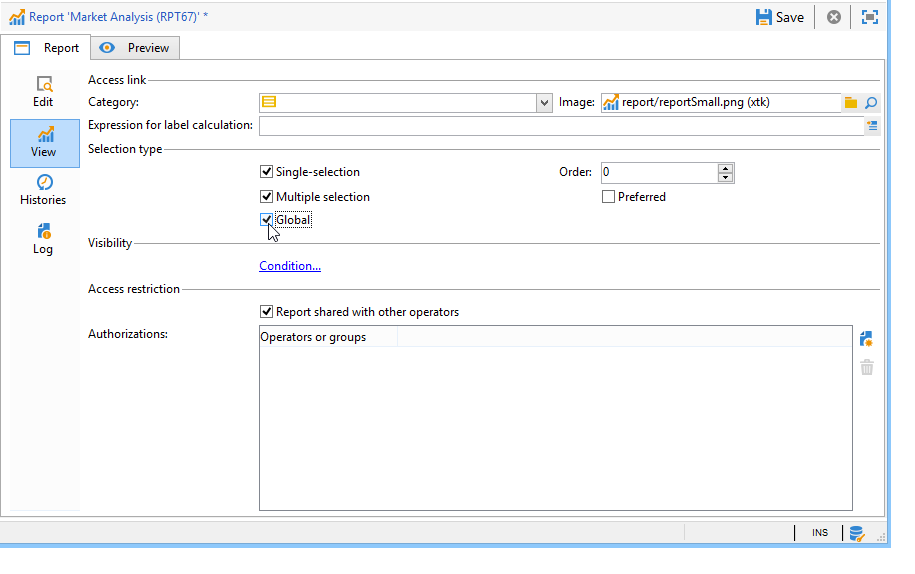

# Configurar acesso ao relatório{#configuring-access-to-the-report}

## Contexto de exibição do relatório {#report-display-context}

Defina o contexto de exibição do relatório na plataforma Adobe Campaign usando a guia **[!UICONTROL Display]**. O acesso a um relatório depende do tipo de seleção, das condições de exibição e das autorizações de acesso.

### Tipo de seleção {#selection-type}

O acesso ao relatório pode ser limitado a um contexto específico ou a um espaço de ofertas, por exemplo, um delivery, um recipient, uma seleção de recipients, etc. Esse acesso é configurado na seção **[!UICONTROL Selection type]** da guia **[!UICONTROL Display]** .

* **[!UICONTROL Single selection]**: o relatório só pode ser acessado quando uma entidade específica for selecionada.
* **[!UICONTROL Multiple selection]**: o relatório é acessado quando várias entidades são selecionadas.
* **[!UICONTROL Global]** : o relatório é acessado por meio da lista de relatórios disponíveis na guia **[!UICONTROL Reports]**.

### Sequência de exibição {#display-sequence}

O campo **[!UICONTROL Sequence]** permite inserir um valor numérico que especifica a sequência de exibição do relatório na lista.

Por padrão, os relatórios são exibidos por relevância: o valor inserido neste campo permite classificar relatórios do mais alto (valor mais alto) para o menor (valor menor) relevante.

Você pode selecionar a escala a ser usada com base nas suas necessidades: 1 a 10, 0 a 100, -10 a 10, etc.

### Condições de exibição {#display-conditions}

Também é possível determinar as condições de exibição do relatório por meio de uma query.

No exemplo a seguir, o relatório é exibido se o canal principal da campanha for email.

Isso significa que, se o canal principal da campanha for mala direta, o relatório não estará disponível nos relatórios da campanha.

### Autorização de acesso {#access-authorization}

O relatório pode ser compartilhado com outros operadores.

Para tornar o relatório acessível, selecione a opção **[!UICONTROL Report shared with other operators]**. Se essa opção não estiver selecionada, somente o operador que criou o relatório poderá acessá-lo.

O relatório também pode ser compartilhado com operadores ou grupos de operadores específicos adicionados pela janela de autorizações.

### Definição das opções de filtro {#defining-the-filtering-options}

A guia **[!UICONTROL Reports]** exibe todos os relatórios disponíveis na plataforma e para os quais o operador conectado tem direito de acesso.

Por padrão, eles são classificados por relevância, mas é possível aplicar outros tipos de filtros: alfabético, por idade, etc.

Também é possível filtrar a exibição com base na categoria do relatório:

Para definir a categoria de um relatório, selecione-o por meio da guia **[!UICONTROL Display]**, conforme mostrado abaixo:

É possível inserir uma nova categoria aqui e adicioná-la à lista de categorias disponíveis. A numeração correspondente é atualizada automaticamente.

## Criar um link para um relatório {#creating-a-link-to-a-report-}

É possível tornar um relatório acessível por meio de um nó específico da árvore, como uma lista, um recipient, um delivery, etc. Para fazer isso, basta criar um link para o relatório em questão e especificar a entidade onde deseja torná-lo disponível.

Como exemplo, vamos criar um link para um relatório para torná-lo acessível por meio de uma lista de recipients.

1. Clique em **[!UICONTROL New]** e selecione **[!UICONTROL Create a link to an existing report]** no assistente de criação de relatórios.

   

1. Selecione o relatório que deseja criar um link usando a lista suspensa. Neste exemplo, vamos selecionar o relatório **Análise por país**.

   

1. Insira um rótulo e selecione o schema. Neste exemplo, vamos selecionar a tabela de lista de recipients.

   

   Isso significa que o relatório estará acessível por meio de qualquer lista de recipients e que as estatísticas abordarão os recipients na lista selecionada.

1. Salvamento e exibição seu relatório
1. Insira a chave do link. Nesse caso, a chave externa do link &quot;Folders&quot;.

   

1. Publique seu relatório.
1. Vá para uma das listas de recipients e clique no link **[!UICONTROL Reports]**: o relatório que acabou de criar está acessível.

   

## Pré-visualização do relatório {#preview-of-the-report}

Antes de publicar seu relatório, verifique se ele é exibido corretamente na guia **[!UICONTROL Preview]**.

Para exibir a visualização do relatório, selecione a opção **[!UICONTROL Global]** ou a opção **[!UICONTROL Selection]**.

Essas duas opções são selecionadas com base nas configurações de exibição do relatório. Se a configuração de exibição for **[!UICONTROL Global]**, é preciso selecionar a opção de visualização **[!UICONTROL Global]**. Se as configurações de exibição forem **[!UICONTROL Single selection]** ou **[!UICONTROL Multiple selection]**, a opção de visualização **[!UICONTROL Selection]** deverá ser selecionada.

Para obter mais informações, consulte [Contexto de exibição do relatório](#report-display-context).

As configurações específicas permitem controlar erros. A configuração **_uuid** é encontrada na URL do relatório. É possível adicionar as configurações **configurações &amp;_preview** ou **&amp;_debug**.

Para saber mais sobre essas configurações, consulte a seção **Definição das propriedades dos formulários web** do capítulo de [Formulários web](../../web/using/about-web-forms.md).

## Publicar o relatório {#publishing-the-report}

A publicação do relatório é obrigatória para compartilhá-lo com outros operadores e exibi-lo na lista de relatórios disponíveis (também consulte [Contexto de exibição do relatório](#report-display-context)). Essa operação deve ser executada novamente cada vez que o relatório for alterado.

1. Abra o assistente de publicação clicando em **[!UICONTROL Publish]** na barra de ferramentas.

   

1. Clique em **[!UICONTROL Start]** para publicar.

   

1. Clique no ícone **[!UICONTROL Enlarge]** para abrir o relatório em um navegador da web.
