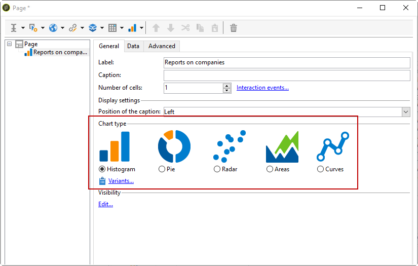
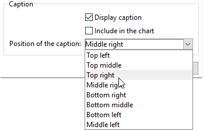

# Criação de um gráfico{#creating-a-chart}

Os dados no banco de dados também podem ser coletados e exibidos em um gráfico. O Adobe Campaign fornece um conjunto de representações gráficas. Sua configuração é detalhada abaixo.

Os gráficos são inseridos diretamente em uma página de relatório por meio do menu do botão direito do mouse ou da barra de ferramentas.

## Etapas de criação {#creation-steps}

Para criar um gráfico em um relatório, siga as etapas abaixo:

1. Edite a página onde deseja exibir o gráfico e selecione o tipo de gráfico na barra de ferramentas.

   

1. Insira um nome e legenda. Se necessário, é possível alterar a posição da legenda usando a lista suspensa.

   

1. Click the **[!UICONTROL Data]** tab to define the data source and the series to be calculated.

   The statistics to be displayed in the chart can be calculated based on a query or on the context data, i.e. the data provided by the inbound transition of the current page (for more on this, refer to [Using context data](../../reporting/using/using-the-context.md#using-context-data)).

   * Click the **[!UICONTROL Filter data...]** link to define filtering criteria for the data in the database.

      

   * To used contextual data, select this option and click the **[!UICONTROL Advanced settings...]** link. Selecione os dados que a estatística abordará.

      

      É possível acessar os dados contextuais para definir os valores a serem exibidos no gráfico:

      

## Tipos e variantes de gráfico {#chart-types-and-variants}

O Adobe Campaign oferece vários tipos de representações gráficas. Elas estão detalhadas abaixo.

O tipo de gráfico é selecionado quando inserido na página.

It can also be altered via the **[!UICONTROL Chart type]** section of the **[!UICONTROL General]** tab in the chart.

As variantes dependem do tipo de gráfico selecionado. They are selected via the **[!UICONTROL Variants...]** link.

### Análise: gráficos de pizza {#breakdown--pie-charts}

Esse tipo de representação gráfica permite exibir uma visão geral dos elementos medidos.

Os gráficos de pizza permitem analisar uma variável somente.

The **[!UICONTROL Variants]** link lets you personalize the overall rendering of the chart.

Os gráficos de pizza permitem inserir o valor do raio interno no campo apropriado.

Por exemplo:

0,00 traça um círculo completo.

0.40 traça um círculo com um raio de 40%.

1,00 traça somente o exterior do círculo.

### Evolução: curvas e áreas {#evolution--curves-and-areas}

Esse tipo de representação gráfica permite entender a evolução de uma ou mais medidas no tempo.

### Comparação: histogramas {#comparison--histograms}

Os histogramas permitem comprar os valores de uma ou mais variáveis.

For these types of charts, the following options are offered in the **[!UICONTROL Variants]** window:

Check the **[!UICONTROL Display caption]** option to show the caption with the chart and choose its position:

Quando apropriado, é possível empilhar valores juntos.

Se necessário, é possível inverter a sequência de exibição do valor. Para fazer isso, selecione a **[!UICONTROL Reverse stacking]** opção.

### Conversão: funil {#conversion--funnel}

Esse tipo de gráfico permite rastrear a taxa de conversa de elementos medidos.

### Progresso: medidor {#progress--gauge}

Esse tipo de gráfico permite exibir o progresso de um valor em comparação com um objetivo definido. No exemplo abaixo, o mostrador preto mostra o número de deliveries enviados com êxito (76) de um objetivo de 100 deliveries. O medidor divide-se em três intervalos que correspondem a status específicos.

Esses elementos são definidos ao configurar o gráfico.

* The **[!UICONTROL Value]** field is represented by a black dial in the chart. Ele representa o elemento cujo progresso deseja calcular. O valor a ser representado deve já ter sido salvo para ser usado.
* The **[!UICONTROL Goal]** field represents the maximum value to achieve.
* Using the **[!UICONTROL Other mark]** field you can add a second indicator to the chart.
* The **[!UICONTROL Display range]** fields let you specify the values between which the report is calculated.
* The **[!UICONTROL Value ranges]** field lets you attribute statuses (None, Bad, Acceptable, Good) to a set of values to better illustrate the progress.

In the **[!UICONTROL Display settings]** section, the **[!UICONTROL Change appearance...]** lets you configure the way the chart is displayed.

The **[!UICONTROL Display the value below the gauge]** option lets you display the value progress below the chart.

The **[!UICONTROL Aperture ratio]** field, which must be between 0 and 1, lets you edit the report&#39;s aperture in a more or less complete circle. No exemplo acima, o valor 0,50 corresponde a um semicírculo.

The **[!UICONTROL Width]** field lets you edit the chart size.

## Interação com o gráfico {#interaction-with-the-chart}

É possível definir uma ação quando o usuário clica no gráfico. Open the **[!UICONTROL Interaction events]** window and select the action you want to perform.

Possíveis tipos de interação e suas configurações são detalhadas [nesta seção](../../web/using/static-elements-in-a-web-form.md#inserting-html-content).

## Cálculo estatístico {#calculating-statistics}

Os gráficos permitem exibir estatísticas nos dados coletados.

Essas estatísticas são definidas pela **[!UICONTROL Series parameters]** seção da **[!UICONTROL Data]** guia.

To create a new statistic, click the **[!UICONTROL Add]** icon and configure the appropriate window. Os tipos de cálculo disponíveis são detalhados abaixo.

Para obter mais informações, consulte [esta seção](../../reporting/using/using-the-descriptive-analysis-wizard.md#statistics-calculation).
