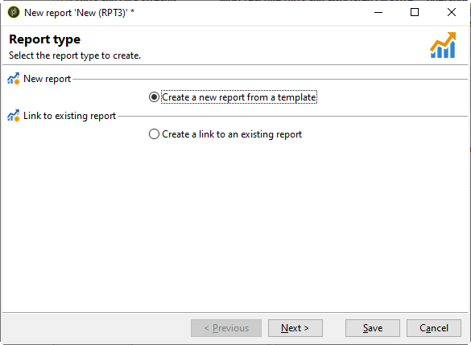
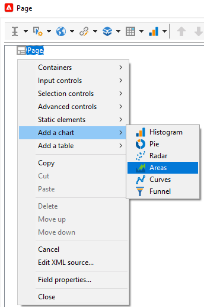

# Criar um novo relatório{#creating-a-new-report}

Para criar um relatório, siga as etapas abaixo:

1. Abra o navegador do Adobe Campaign e, no nó **[!UICONTROL Administration > Configuration]**, selecione a pasta **[!UICONTROL Reports]**.
1. Clique no botão **[!UICONTROL New]** acima da lista de relatórios.
1. Selecione **[!UICONTROL Create a new report from a template]** e clique em **[!UICONTROL Next]**.

   

1. Selecione o template do relatório na lista suspensa.

   * **[!UICONTROL Extended report]** permite criar um relatório configurado usando um gráfico.
   * O relatório **[!UICONTROL Qualitative distribution]** permite criar estatísticas baseadas em todos os tipos de dados (nome da empresa, domínio de email etc.).
   * O relatório **[!UICONTROL Quantitative distribution]** relatório permite criar estatísticas em dados que podem ser medidos ou contados (valor da fatura, idade do destinatário etc.).

   Para obter mais informações sobre esses templates de relatórios, consulte [esta seção](../../reporting/using/about-descriptive-analysis.md).

1. Insira o nome do relatório e sua descrição nos campos correspondentes. Especifique o **[!UICONTROL schema]** no qual o relatório será aplicado.

   

1. Salve este relatório.

## Modelar o gráfico {#modelizing-the-chart}

Depois de salvar o relatório, isso deve ser exibido. Agora é possível criar o gráfico do relatório.

O gráfico para criação do relatório é composto de uma sucessão de atividades.

As atividades são vinculadas usando transições, representadas por setas.

Para criar um relatório, dependendo da natureza e do contexto, é preciso identificar os elementos úteis e modelizar sua sequência lógica.

1. Use a atividade **[!UICONTROL Start]** para materializar o primeiro processo a ser executado na criação do relatório. Só é possível usar uma dessas atividades por relatório.

   Isso é obrigatório se o gráfico incluir um loop.

1. Adicione uma ou mais atividades **[!UICONTROL Query]** para coletar dados úteis para a criação do relatório. Os dados podem ser coletados diretamente por uma consulta em um esquema do banco de dados ou por uma lista importada ou de um Cubo existente.

   Para obter mais informações, consulte [Coletar dados para analisar](../../reporting/using/collecting-data-to-analyze.md).

   Esses dados serão exibidos (ou não) no relatório, dependendo da configuração da página.

1. Coloque uma ou mais atividades **[!UICONTROL Page]** para definir a representação gráfica dos dados coletados. É possível inserir tabelas, gráficos, campos de entrada e condição de uma ou mais páginas ou elementos da página. O conteúdo exibido é totalmente configurável.

   Para obter mais informações, consulte [Elementos estáticos](#static-elements).

1. Use uma atividade **[!UICONTROL Test]** para definir as condições para a exibição ou acesso aos dados.

   Para obter mais informações, consulte [Condições para exibição de página](../../reporting/using/defining-a-conditional-content.md#conditioning-page-display).

1. Se necessário, adicione scripts personalizados pela atividade **[!UICONTROL Script]**. Por exemplo, para calcular o nome de um relatório, filtrar a exibição do resultado em um contexto específico, etc.

   Para obter mais informações, consulte [Atividade “Script”](../../reporting/using/advanced-functionalities.md#script-activity).

1. Por fim, para facilitar a leitura de relatórios complexos, é possível inserir uma ou mais atividades do tipo **[!UICONTROL Jump]**. Isso permite passar de uma atividade para outra sem materializar a transição no relatório. A atividade **[!UICONTROL Jump]** também pode ser usada para exibir outro relatório.

   Para obter mais informações, consulte [Atividade “Jump”](../../reporting/using/advanced-functionalities.md#jump-activity).

Não é possível executar várias ramificações ao mesmo tempo. Isso significa que um relatório criado assim não funcionará:

No entanto, é possível colocar várias ramificações. Somente uma delas será executada:

## Criar uma página {#creating-a-page}

O conteúdo é configurado por meio das atividades colocadas no gráfico. Para obter mais informações, consulte [Modelar o gráfico](#modelizing-the-chart).

Para configurar uma atividade, clique duas vezes em seu ícone.

O conteúdo exibido é definido nas atividades do tipo **Page**.

Um relatório pode incluir uma ou mais páginas. As páginas são criadas por meio de um editor dedicado que permite inserir, em uma estrutura de árvore, campos de entrada, campos de seleção, elementos estáticos, gráficos ou tabelas. Os containers ajudam a definir o layout. Para obter mais informações, consulte [Layout de elemento](../../reporting/using/element-layout.md).

Para adicionar um componente à página, use os ícones na seção superior esquerda da barra de ferramentas.

Também é possível clicar com o botão direito do mouse no nó onde deseja adicionar o componente e selecioná-lo na lista.

>[!CAUTION]
>
>Se o relatório for destinado a ser exportado no formato do Excel, recomendamos não usar formatação HTML complexa. Para obter mais informações, consulte [Exportar um relatório](../../reporting/using/actions-on-reports.md#exporting-a-report).

Um **[!UICONTROL Page]** pode incluir os seguintes elementos:

* Barra, pizza, tipo de curva **[!UICONTROL charts]** etc.
* Tabela dinâmica, lista com grupo ou Análise **[!UICONTROL tables]**.
* Texto ou número tipo **[!UICONTROL Input controls]**.
* Lista suspensa, caixa de seleção, botão de opção, múltipla escolha, data ou matriz tipo **[!UICONTROL Selection controls]**.
* Editor de link, Constante, seleção de pasta tipo **[!UICONTROL Advanced controls]**.
* Valor, Link, HTML, Imagem etc. **[!UICONTROL Static elements]**.
* **[!UICONTROL Containers]** que permitem controlar o layout do componente.

O modo de configuração de uma página e seus componentes é detalhado [nesta seção](../../web/using/about-web-forms.md).

A barra de ferramentas permite adicionar ou remover controles e organizar sua sequência na(s) página(s) do relatório.

### Elementos estáticos {#static-elements}

Os elementos estáticos permitem exibir informações no relatório, como elementos gráficos ou scripts, com os quais o usuário não interage. Consulte [esta seção](../../web/using/static-elements-in-a-web-form.md#inserting-html-content) para obter mais informações.

### Filtrar informações em um relatório {#filtering-information-in-a-report}

Os controles de entrada e seleção permitem filtrar as informações exibidas no relatório. Para obter mais informações sobre como implementar esse tipo de filtragem, consulte as opções de [Filtragem nas consultas](../../reporting/using/collecting-data-to-analyze.md#filtering-options-in-the-queries).

Para saber mais sobre criação e configuração de campos de seleção e de entrada, consulte [esta seção](../../web/using/about-web-forms.md).

É possível integrar um ou mais controles de entrada nos relatórios. Esse tipo de controle permite filtrar informações exibidas de acordo com um valor inserido.

Também é possível integrar um ou mais controles de seleção em seus relatórios. Esse tipo de controle permite filtrar as informações contidas no relatório, com base nos valores selecionados, como:

* por meio de botões de opção ou caixas de seleção,

   

* por meio de uma lista suspensa,

   

* por meio de um calendário:

   

Por fim, é possível integrar um ou mais controles avançados aos relatórios. Esse tipo de controle permite inserir um link, uma constante ou selecionar uma pasta.

Aqui é possível filtrar os dados no relatório para exibir apenas as informações contidas em uma das pastas da árvore:

