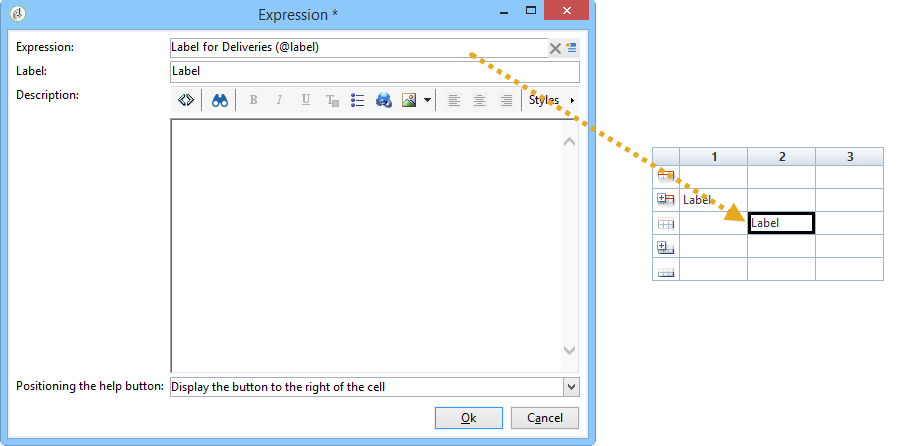
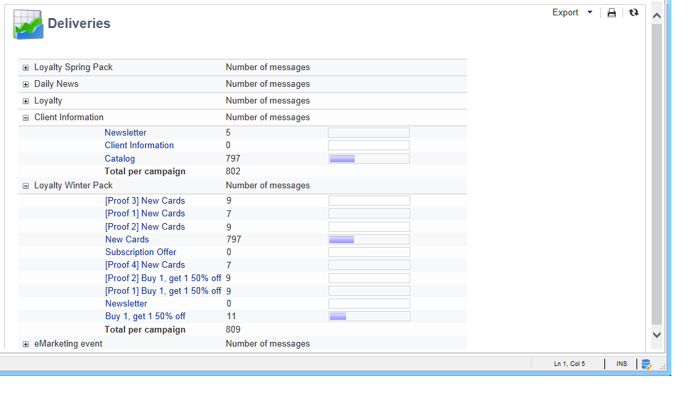
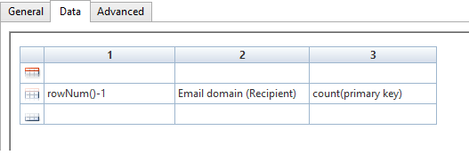

# Criação de uma tabela{#creating-a-table}

É possível adicionar uma tabela a um relatório para exibir dados. Pode ser uma tabela dinâmica criada com base em medições de cubo, uma lista com grupo ou uma tabela contendo uma análise de valores.


## Criação de uma lista com grupo {#creating-a-list-with-group}

Uma tabela do tipo **[!UICONTROL List with group]** permite agrupar dados na tabela e produzir estatísticas. Por exemplo, é possível criar totais e subtotais para os dados. Cada grupo tem sua própria linha de cabeçalho, detalhe e rodapé.

>[!CAUTION]
>
>A atividade **[!UICONTROL Page]** contendo a tabela deve ser precedida por uma atividade **[!UICONTROL Query]** ou **[!UICONTROL Script]** para coletar os dados a serem analisados no relatório. Para obter mais informações sobre essas atividades, consulte [Coleta de dados para analisar](../../reporting/using/collecting-data-to-analyze.md) e [atividade de script](../../reporting/using/advanced-functionalities.md#script-activity).

### Princípio operacional {#operating-principle}

Talvez seja necessário analisar várias categorias de dados de uma vez. Uma lista com grupo permite combinar dados e criar estatísticas em vários grupos de dados dentro da mesma tabela. Para fazer isso, é possível criar um grupo na tabela.

No exemplo a seguir, o grupo mostra todas as campanhas no banco de dados, os deliveries e o número de mensagens enviadas por delivery e por campanha.

It lets you list the campaigns (**[!UICONTROL Label (Campaign)]**, the list of deliveries (**[!UICONTROL Label]** ) linked to the campaign, and lets you count the number of messages sent per delivery (**[!UICONTROL Processed)]**, before adding them up for each campaign (**[!UICONTROL Sum(@processed)]** ).


### Etapas de implementação {#implementation-steps}

Um exemplo completo de implementação é fornecido aqui: [Caso de uso: crie um relatório com uma lista de grupos](#use-case--create-a-report-with-a-group-list).

Observe as seguintes etapas para criar uma tabela do tipo &quot;Lista com grupo&quot;:

1. Ir para o gráfico de relatório e inserir uma atividade **[!UICONTROL Query]**. Consulte [Coleta de dados para analisar](../../reporting/using/collecting-data-to-analyze.md).
1. Preencha a tabela de origem e selecione os campos da tabela que as estatísticas abordarão.
1. Coloque uma atividade **[!UICONTROL Page]** no gráfico. Para obter mais informações, consulte [Elementos estáticos](../../reporting/using/creating-a-new-report.md#static-elements).
1. Insert a **[!UICONTROL List with group]** type table into the page.
1. Especifique o caminho de dados ou a tabela selecionada como uma fonte de dados na query.

   Essa etapa é obrigatória se desejar recuperar os campos na tabela de origem posteriormente e inseri-los nas células da tabela.

1. Criação da tabela e seu conteúdo
1. Exiba o relatório finalizado na guia **[!UICONTROL Preview]**. É possível então publicar o relatório e exportá-lo em um formato diferente se necessário. Para obter mais informações, consulte [Exportação de um relatório](../../reporting/using/actions-on-reports.md#exporting-a-report).

### Adição de linhas e colunas {#adding-lines-and-columns}

Por padrão, uma tabela do tipo **[!UICONTROL List with group]** inclui uma linha de cabeçalho, detalhe e rodapé.

O próprio grupo inclui linhas de cabeçalho, detalhe e rodapé.

* **Linha de cabeçalho**: esta linha permite fornecer um título para as colunas da tabela.

   

* **Linha de detalhe**: esta linha contém valores de estatística.

   

* **Linha de rodapé**: esta linha permite exibir os valores totais.

   

Linhas e colunas podem ser adicionadas para satisfazer qualquer necessidade.

O grupo pode ser colocado em qualquer linha da tabela e inclui sua própria linha de cabeçalho, detalhe e rodapé.


**Linha e coluna**: para adicionar ou excluir uma linha ou coluna, vá para uma linha ou coluna existente e use o menu do botão direito do mouse.


A natureza da linha que adicionar depende do local do cursor. For example, to add a header line, place your cursors on a header, then click **[!UICONTROL Add > A line above/below]**.


A largura das colunas pode ser modificada por meio do item **[!UICONTROL Column format]**.

**Grupo**: para adicionar um grupo, vá para uma linha e selecione o item correspondente no menu suspenso.


### Definição do conteúdo da célula {#defining-cell-content}

Para editar uma célula da tabela e definir seu conteúdo e formato, vá para a célula e use o menu do botão direito do mouse.

Use a entrada do menu **[!UICONTROL Expression]** para selecionar os valores a serem exibidos.


* Para inserir os valores a serem analisados diretamente na tabela, selecione-os entre os campos disponíveis.

   A lista de campos disponíveis coincide com o conteúdo da query antes da tabela no gráfico de criação de relatório.

   

* Insira um rótulo para uma célula, o cabeçalho um, por exemplo.

   Para fazer isso, use o mesmo processo de inserção de um campo no banco de dados, mas não selecione uma expressão. Insira o rótulo no campo **[!UICONTROL Label]**. Ele será exibido como está.

* Cálculo de uma agregação (uma média, uma soma, etc.) e sua exibição na célula

   Para fazer isso, use a entrada de menu **[!UICONTROL Aggregates]** e selecione a campanha desejada.

   

### Definição do formato de célula {#defining-cell-format}


To define the cell format, the **[!UICONTROL Cell format...]** menu lets you access all formatting options available for the selected cell.

Essas opções permitem personalizar a renderização final do relatório e facilitar a leitura das informações.

Use o campo **[!UICONTROL Carriage return]** ao exportar dados para o Excel: selecione o valor **[!UICONTROL Yes]** para forçar o retorno. Esse valor será mantido ao exportar. Para obter mais informações, consulte [Exportação de um relatório](../../reporting/using/actions-on-reports.md#exporting-a-report).

The **[!UICONTROL Cell format]** window lets you access the following tab:

* A **[!UICONTROL Value]** guia
* A **[!UICONTROL Borders]** guia
* A **[!UICONTROL Click]** guia
* A **[!UICONTROL Extra]** guia

A guia **[!UICONTROL Value]** permite alterar a fonte e os vários atributos de valor ou definir um formato com base em sua natureza.


The format changes data display: for example, the **[!UICONTROL Number]**, **[!UICONTROL Monetary]** and **[!UICONTROL Percentage]** formats allow you to align the figures on the right and display decimal points.

Exemplo de como configurar um formato de moeda: é possível especificar a moeda em que os valores são expressos, escolher separar milhares e mostrar valores negativos em vermelho. A posição do símbolo de moeda depende do idioma do operador definido em seu perfil.


Exemplo de configuração para datas: é possível escolher se deseja ou não exibir o tempo.


A guia **Bordas** permite adicionar bordas às linhas e colunas na tabela. A adição de bordas às células pode levar a problemas de desempenho ao exportar relatórios grandes para o Excel.


If necessary, you can define borders in the table template (**[!UICONTROL Administration > Configuration > Form rendering]** ).

Nesse caso, haverá a seguinte sintaxe:

Na guia Web:

```
 .tabular td {
 border: solid 1px #000000;
 }
```

Na guia Excel:

```
 <style name="odd" fillColor="#fdfdfd">
  <border>
   <borderTop value="solid 0.05pt #000000" />
   <borderBottom value="solid 0.05pt #000000" />
   <borderLeft value="solid 0.05pt #000000" />
   <borderRight value="solid 0.05pt #000000" />
  </border>
 </style> 
 
 <style name="even" fillColor="#f7f8fa">
  <border>
   <borderTop value="solid 0.05pt #000000" />
   <borderBottom value="solid 0.05pt #000000" />
   <borderLeft value="solid 0.05pt #000000" />
   <borderRight value="solid 0.05pt #000000" />
  </border>
 </style> 
```

A guia **[!UICONTROL Click]** permite definir uma ação quando o usuário clicar no conteúdo de uma célula ou da tabela.

No exemplo abaixo, clicar no valor na célula permite exibir a segunda página do relatório: ela conterá informações sobre o delivery na célula.


A guia **Extra** permite vincular um visual a seus dados, como uma marca colorida ou uma barra de valores. A marca colorida é usada quando a tabela é mostrada como uma legenda em um gráfico. Para obter mais informações, consulte o exemplo de implementação: [Etapa 5 - Criar a segunda página](#step-5---create-the-second-page)


## Caso de uso: criar um relatório com uma lista de grupos {#use-case--create-a-report-with-a-group-list}

Neste exemplo, vamos criar um relatório de duas páginas: a primeira página conterá a lista e os deliveries totais por campanha, bem como o número de mensagens enviadas. Os nomes dos deliveries serão links clicáveis e permitirão ir para a segunda página do relatório para exibir a análise dos deliveries por domínio de email para o delivery selecionado com uma tabela e um gráfico. Na segunda página, a tabela servirá como uma legenda para o gráfico.


### Etapa 1 - Criar um relatório {#step-1---create-a-report}

Crie um novo relatório que atenda ao schema da campanha, **[!UICONTROL Campaigns (nms)]**.


Clique em **[!UICONTROL Save]** para criar o relatório.

Vá para o gráfico e adicione os primeiros componentes a serem usados para criar o conteúdo do relatório: uma primeira query e uma primeira página.


### Etapa 2 – Criar a primeira query {#step-2---create-the-first-query}

A primeira query permite coletar os deliveries vinculados a cada campanha. O objetivo é exibir um relatório sobre os vários deliveries do banco de dados do Adobe Campaign vinculados a cada campanha.

Clique duas vezes na primeira query para editá-la e siga as etapas abaixo para configurá-la:

1. Start by changing the schema on which the query&#39;s source is applied: select the **[!UICONTROL Deliveries (nms)]** schema.
1. Click the **[!UICONTROL Edit query]** link and display the advanced fields.

   

1. Selecione os seguintes campos:

   * o rótulo do delivery,
   * a chave primária do delivery,
   * o rótulo da campanha,
   * o indicador dos deliveries processados,
   * a chave externa do link Campaign,
   * o indicador de taxa de erro.

   

   Vincular um alias a cada campo: é recomendável para facilitar a seleção de dados da tabela que será adicionada à primeira página do relatório.

   Neste exemplo, usaremos os seguintes aliases:

   * Rótulo: **@label**
   * Chave primária: **@deliveryId**
   * Rótulo (Campaign): **@label1**
   * Processado: **@processed**
   * Chave externa do link &quot;Campaign&quot; (campo &quot;id&quot;): **@operationId**
   * Taxa de erro: **@errorRatio**


1. Click the **[!UICONTROL Next]** button twice to get to the **[!UICONTROL Data filtering]** step.

   Adicione uma condição de filtragem para coletar apenas os deliveries vinculados a uma campanha.

   A sintaxe desse filtro é a seguinte: &quot;Foreign key of the &#39;Campaigns&#39; link greater than 0&quot;.

   

1. Clique em **[!UICONTROL Finish]** para salvar essas condições e em **[!UICONTROL Ok]** para fechar o editor da consulta.

### Etapa 3: criação da primeira página {#step-3--create-the-first-page}

Nesta etapa, vamos configurar a primeira página do relatório. Para configurá-la, siga as etapas abaixo:

1. Abra a atividade **[!UICONTROL Page]** e insira seu título, por exemplo **Deliveries** neste caso.

   

1. Insira uma lista com um grupo na barra de ferramentas e insira o rótulo, por exemplo: lista de deliveries por campanha.

   

1. Click the **[!UICONTROL Table data XPath...]** link and select the delivery link, i.e. `[query/delivery]`.

   

1. Clique na guia **[!UICONTROL Data]** e altere o layout da tabela: adicione três colunas à direita.

   

1. Adicione um grupo.

   

   Este grupo permitirá agrupar campanhas e os deliveries vinculadas a elas.

1. Na janela do grupo, faça referência à **chave externa do link &quot;Campaign&quot;** e feche a janela.

   

1. Edite a primeira célula do cabeçalho do grupo e insira o campo **[!UICONTROL Label]** das campanhas como uma expressão.

   

1. Edite a segunda célula da linha de detalhes e selecione os deliveries **[!UICONTROL Label]**.

   

1. Edite o formato dessa célula e abra a guia **[!UICONTROL Click]**. Configure as opções adequadas para que, quando os usuários clicarem no nome de um delivery, ele seja aberto na mesma janela.

   

   To do this, select a **[!UICONTROL Next page]** type action and select **[!UICONTROL In the same window]** as an open option.

   

1. In the lower section of the window, click **[!UICONTROL Add]** and specify the **`/vars/selectedDelivery`** path and the **[!UICONTROL @deliveryId]** expression that matches the alias of the primary key of the delivery, as defined in the query created previously. Essa fórmula permite acessar o delivery selecionado.

   

1. Edite a segunda célula do rodapé do grupo e digite **[!UICONTROL Total per campaign]** como rótulo.

   

1. Edit the third cell of the header line of the group and enter **[!UICONTROL Number of messages sent]** as a label.

   

   Essas informações coincidem com o título da coluna.

1. Edite a terceira célula da linha de detalhes e selecione o indicador de mensagem processada como uma expressão.

   

1. Edite a terceira célula do rodapé do grupo, selecione o indicador de entrega processado e aplique a agregação **[!UICONTROL Sum]** a ele.

   

1. Edite a quarta célula da linha de detalhes e selecione **error delivery error rate** como uma expressão.

   

1. Selecione essa célula para exibir uma barra de valores que representa a taxa de erro de delivery.

   Para fazer isso, acesse o formato da célula e vá para a guia **[!UICONTROL More]**. Select the **[!UICONTROL Value bar]** entry in the drop-down list and select the **[!UICONTROL Hide the cell value]** option.

   

   Agora é possível exibir uma renderização do relatório. Clique na guia **[!UICONTROL Preview]** e selecione a opção **[!UICONTROL Global]**: isso mostra a lista de todos os deliveries no banco de dados do Adobe Campaign que estão vinculados a uma campanha.

   

   Recomendamos o uso da guia **[!UICONTROL Preview]** para garantir que os dados na tabela sejam selecionados e configurados corretamente. Assim que isso for feito, é possível formatar a tabela.

1. Aplique o estilo **[!UICONTROL Bold]** às células que mostram o total por campanha e o número total de mensagens processadas.

   

1. Clique na primeira célula da linha de cabeçalho do grupo, aquela que exibe o nome da campanha e selecione **[!UICONTROL Edit > Merge to right]**.

   

   Mesclar as duas primeiras células da linha de cabeçalho do grupo realinha o título da campanha e a lista de deliveries vinculadas a ela.

   

   >[!CAUTION]
   >
   >Recomendamos aguardar até que o relatório seja criado antes de mesclar células já que a mescla é irreversível.

### Etapa 4 – Criação da segunda query {#step-4---create-the-second-query}

Queremos adicionar uma segunda query e uma segunda página para exibir o detalhe de um delivery quando o usuário do relatório clicar nele. Antes de adicionar a query, edite a página criada e habilite a transição de saída para que ela possa ser vinculada à query.

1. Add a new query after the **[!UICONTROL Page]** activity and edit its schema: select the **[!UICONTROL Recipient delivery logs]** schema.

   

1. Edite a query e defina as colunas de saída. Para exibir o número de fornecimentos por domínio de email, é preciso:

   * calcular a soma das chaves primárias para contar o número de logs do delivery:

      

   * coletar domínios de email dos recipients e informações do grupo neste campo: para fazer isso, selecione a opção **[!UICONTROL Group]** na coluna de nome de domínio.

   

   Vincule os seguintes aliases aos campos:

   * contagem (chave primária): **@count**
   * Domínio de email (recipient): **@domain**

      


1. Click the **[!UICONTROL Next]** button twice: this takes you to the **[!UICONTROL Data filtering]** step.

   Adicione uma condição de filtro para coletar apenas as informações vinculadas ao delivery selecionado.

   A sintaxe é a seguinte: a chave estrangeira do link &quot;Delivery&quot; é igual ao valor da configuração `$([vars/selectedDelivery])`

   

1. Feche a janela de configuração de query e adicione uma página ao gráfico, logo após a segunda query.

### Etapa 5 – Criação da segunda página {#step-5---create-the-second-page}

1. Edite a página e insira o rótulo: **Email domains**.
1. Desmarque a opção **[!UICONTROL Enable output transitions]**: essa é a última página do relatório e não será seguida por outra atividade.

   

1. Adicione uma nova lista com um grupo usando o menu do botão direito do mouse e rotule de **Email domains per recipient**.
1. Click the **[!UICONTROL Table data XPath...]** and select the **[!UICONTROL Recipient delivery logs]** link.

   

1. Na guia **[!UICONTROL Data]**, adapte a tabela como a seguir:

   * Adicione duas colunas ao lado direito.
   * Na primeira célula da linha de detalhes, adicione a expressão **[!UICONTROL rowNum()-1]** para contar o número de linhas. Then alter the format of the cell: in the **[!UICONTROL Extra]** tab, select **[!UICONTROL Color tab]** and click **[!UICONTROL Ok]**.

      

      Essa configuração permitirá usar a tabela como legenda do gráfico.

   * In the second cell of the detail line, add the **[!UICONTROL Email domain(Recipient)]** expression.
   * In the third cell of the detail line, add the **[!UICONTROL count(primary key)]** expression.

   

1. Adicione um gráfico de pizza à página usando o menu do botão direito e atribua o rótulo **Email domains** a ele. Para obter mais informações, consulte [Tipos e variantes de gráfico](../../reporting/using/creating-a-chart.md#chart-types-and-variants).
1. Click the **[!UICONTROL Variants]** link and deselect the **[!UICONTROL Display label]** and the **[!UICONTROL Display caption]** options.
1. Verifique se nenhuma classificação de valor está configurada. Para obter mais informações, consulte [esta seção](../../reporting/using/processing-a-report.md#configuring-the-layout-of-a-descriptive-analysis-report).

   

1. In the **[!UICONTROL Data]** tab, change the data source: select **[!UICONTROL Context data]** from the drop-down list.

   

1. Em seguida, clique em **[!UICONTROL Advanced settings]** e selecione o link para os logs do delivery do recipient.

   

1. In the **[!UICONTROL Chart type]** section, select the **[!UICONTROL Email domain]** variable.
1. Em seguida, adicione o cálculo a ser executado: selecione a soma como um operador.

   

1. Clique no botão **[!UICONTROL Detail]** para selecionar o campo que a contagem utilizará, então feche a janela de configuração.

   

1. Salve o relatório.

   A página está configurada agora.

### Etapa 6 - Exibição do relatório {#step-6---viewing-the-report}

Para exibir o resultado dessa configuração, clique na guia **[!UICONTROL Preview]** e selecione a opção **[!UICONTROL Global]**.

A primeira página do relatório detalha a lista de todos os deliveries incluídos no banco de dados.


Se clicar no link de um desses deliveries, ele mostrará o gráfico com a análise dos domínios de email para esse delivery. Agora, essa é a segunda página do relatório e é possível retornar à página anterior clicando no botão apropriado.


## Criação de uma análise ou tabela dinâmica {#creating-a-breakdown-or-pivot-table}

Esse tipo de tabela permite exibir estatísticas calculadas dos dados do banco de dados.

A configuração desses tipos de relatórios é semelhante à utilizada para o assistente de análise descritiva. Para obter mais informações, consulte [esta página](../../reporting/using/using-the-descriptive-analysis-wizard.md#configuring-the-quantitative-distribution-template).

Para obter mais informações sobre criação de uma tabela dinâmica, consulte [esta seção](../../reporting/using/using-cubes-to-explore-data.md).
