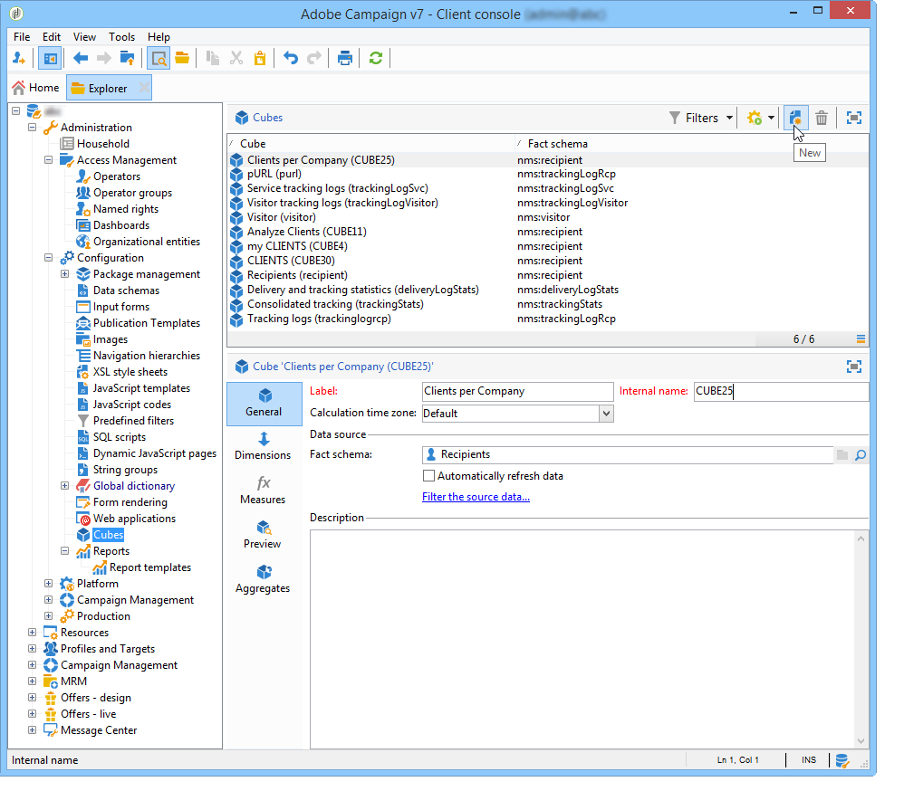
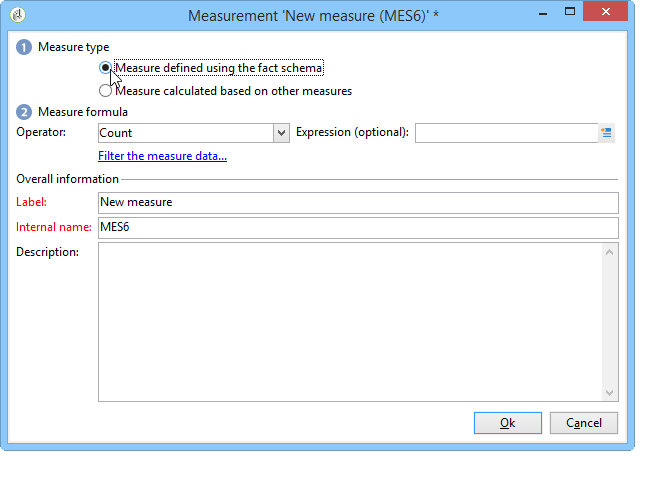

# Criação de indicadores{#creating-indicators}

Para tornar um cubo funcional, você precisa identificar as dimensões e medidas relevantes e criá-las no cubo.

Para criar um Cubo, siga as etapas abaixo:

1. Selecione a tabela de trabalho. Consulte [Seleção da tabela](#selecting-the-work-table)de trabalho.
1. Defina as dimensões. Consulte [Definição de dimensões](#defining-dimensions).
1. Defina medidas. Consulte [Construindo indicadores](#building-indicators).
1. Crie agregados (opcional). Consulte [Cálculo e uso de agregados](../../reporting/using/concepts-and-methodology.md#calculating-and-using-aggregates).

Este exemplo mostra como criar rapidamente um cubo simples em um relatório para exportar suas medidas.

As etapas de implementação são detalhadas abaixo. As opções e descrições completas estão disponíveis nas outras seções deste capítulo.

## Seleção da tabela de trabalho {#selecting-the-work-table}

To create a cube, click the **[!UICONTROL New]** button above the list of cubes.

Selecione o schema de fatos, ou seja, o schema que contém os elementos que deseja explorar. Neste exemplo, vamos selecionar a tabela **Recipient**.

Click **[!UICONTROL Save]** to create the Cube: it will appear on the list of Cubes and may then be configured using the appropriate tabs.

Click the **[!UICONTROL Filter the source data...]** link to apply the calculations of this Cube to a select of data in the database.

## Definição de dimensões {#defining-dimensions}

As dimensões coincidem com os eixos de análise definidos para cada Cubo com base em seu schema de fato relacionado. Essas são as dimensões exploradas na análise, como tempo (ano, mês, data...), uma classificação de produtos ou contratos (família, referência, etc.), um segmento de população (por cidade, faixa etária, status, etc.).

These analysis axes are defined in the **[!UICONTROL Dimension]** tab of the Cube.

Click the **[!UICONTROL Add]** button to create a new dimension, then in the **[!UICONTROL Expression field]**, click the **[!UICONTROL Edit expression]** icon to select the field that contains the concerned data.

* Comece selecionando a **Idade** do recipient. Para esse campo, você pode definir uma compartimentalização para agrupar idades e facilitar a leitura das informações. Recomendamos o uso de compartimentalização quando houver a probabilidade de vários valores separados.

   Para fazer isso, marque a **[!UICONTROL Enable binning]** opção. Os modos de delimitação são detalhados em [Vínculo](../../reporting/using/concepts-and-methodology.md#data-binning)de dados.

   

* Adicione uma dimensão do tipo **Data.** Aqui, queremos exibir as datas de criação do perfil de recipient.

   To do this, click **[!UICONTROL Add]** and select the **[!UICONTROL Creation date]** field in the recipient table.

   

   É possível selecionar o modo de exibição de data. Para fazer isso, selecione a hierarquia a ser usada e os níveis para gerar:

   

   Em nosso exemplo, queremos apenas exibir anos, meses e dias já que não é possível trabalhar com semanas e semestres/meses ao mesmo tempo: esses níveis não são compatíveis.

* Crie outra dimensão para analisar dados relativos à cidade do recipient

   To do this, add a new dimension and select the city in the **[!UICONTROL Location]** node of the recipient schema.

   

   Você pode habilitar a compartimentalização para facilitar a leitura das informações e vincular os valores a uma enumeração.

   

   Selecione a enumeração na lista suspensa.

   

   Somente os valores na enumeração serão exibidos. The others will be grouped under the label defined in the **[!UICONTROL Label of the other values]** field.

   Para obter mais informações, consulte Gerenciamento [dinâmico de compartimentos](../../reporting/using/concepts-and-methodology.md#dynamically-managing-bins).

## Criação de indicadores {#building-indicators}

Depois que as dimensões forem definidas, é necessário especificar um modo de cálculo para os valores a serem exibidos nas células. To do this, create the matching indicators in the **[!UICONTROL Measures]** tab: create as many measures as there are columns to display in the report which will use the cube.

Para fazer isso, siga as etapas abaixo:

1. Clique no botão **[!UICONTROL Add]**.
1. Selecione o tipo de medida e a fórmula a ser aplicada. Aqui queremos contar o número de mulheres entre os recipients.

   Our measure is based on the fact schema and uses the **[!UICONTROL Count]** operator.

   

   O **[!UICONTROL Filter the measure data...]** link permite selecionar somente mulheres. For more on defining measures and the available options, refer to [Defining measures](../../reporting/using/concepts-and-methodology.md#defining-measures).

   

1. Insira o rótulo da medida e o salve.

   

1. Salve o cubo.

## Criação de um relatório baseado em um cubo {#creating-a-report-based-on-a-cube}

Depois que o cubo é configurado, ele pode ser usado como um template para criar um novo relatório.

Para fazer isso:

1. Click the **[!UICONTROL Create]** button of the **[!UICONTROL Reports]** universe and select the cube you have just created.

   

1. Click the **[!UICONTROL Create]** button to confirm: this will take you to the report configuration and viewing page.

   Por padrão, as duas primeiras dimensões disponíveis são oferecidas em linhas e colunas, mas nenhum valor é exibido na tabela. Clique no ícone principal para gerar a tabela:

   

1. Você pode alternar os eixos da dimensão, excluí-los, adicionar novas medidas etc. As possíveis operações são detalhadas aqui: [Usar cubos para explorar dados](../../reporting/using/using-cubes-to-explore-data.md).

   Para fazer isso, use os ícones apropriados:

   

