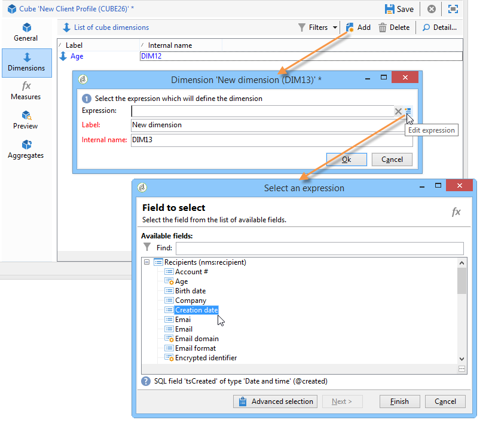
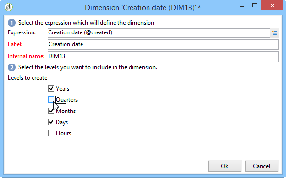

# Criação de indicadores{#creating-indicators}

Para tornar um cubo funcional, você precisa identificar as dimensões e medidas relevantes e criá-las no cubo.

Para criar um Cubo, siga as etapas abaixo:

1. Selecione a tabela de trabalho. Consulte [Seleção da tabela de trabalho](#selecting-the-work-table).
1. Defina as dimensões. Consulte [Definição de dimensões](#defining-dimensions).
1. Defina medidas. Consulte [Criação de indicadores](#building-indicators).
1. Crie agregados (opcional). Consulte [Cálculo e uso de agregados](../../reporting/using/concepts-and-methodology.md#calculating-and-using-aggregates).

Este exemplo mostra como criar rapidamente um cubo simples em um relatório para exportar suas medidas.

As etapas de implementação são detalhadas abaixo. As opções e descrições completas estão disponíveis nas outras seções deste capítulo.

## Seleção da tabela de trabalho {#selecting-the-work-table}

Para criar um cubo, clique no botão **[!UICONTROL New]** acima da lista de cubos.

Selecione o schema de fatos, ou seja, o schema que contém os elementos que deseja explorar. Neste exemplo, vamos selecionar a tabela **Recipient**.

Clique em **[!UICONTROL Save]** para criar o Cubo: ele aparecerá na lista de Cubos e poderá ser configurado usando as guias apropriadas.

Clique no link **[!UICONTROL Filter the source data...]** para aplicar os cálculos desse Cubo a uma seleção de dados no banco de dados.

## Definição de dimensões {#defining-dimensions}

As dimensões coincidem com os eixos de análise definidos para cada Cubo com base em seu schema de fato relacionado. Essas são as dimensões exploradas na análise, como tempo (ano, mês, data...), uma classificação de produtos ou contratos (família, referência, etc.), um segmento de população (por cidade, faixa etária, status, etc.).

Esses eixos de análise estão disponíveis na guia **[!UICONTROL Dimension]** do Cubo.

Clique no botão **[!UICONTROL Add]** para criar uma nova dimensão, em seguida, clique em **[!UICONTROL Expression field]** e depois no ícone **[!UICONTROL Edit expression]** para selecionar o campo que contém os dados relacionados.

* Comece selecionando a **Idade** do recipient. Para esse campo, você pode definir uma compartimentalização para agrupar idades e facilitar a leitura das informações. Recomendamos o uso de compartimentalização quando houver a probabilidade de vários valores separados.

   Para fazer isso, marque a opção **[!UICONTROL Enable binning]**. Os modos de delimitação são detalhados em [Vínculo de dados](../../reporting/using/concepts-and-methodology.md#data-binning).

   

* Adicione uma dimensão do tipo **Data.** Aqui, queremos exibir as datas de criação do perfil de recipient.

   Para fazer isso, clique em **[!UICONTROL Add]** e selecione o campo **[!UICONTROL Creation date]** na tabela de recipients.

   

   É possível selecionar o modo de exibição de data. Para fazer isso, selecione a hierarquia a ser usada e os níveis para gerar:

   

   Em nosso exemplo, queremos apenas exibir anos, meses e dias já que não é possível trabalhar com semanas e semestres/meses ao mesmo tempo: esses níveis não são compatíveis.

* Crie outra dimensão para analisar dados relativos à cidade do recipient

   Para fazer isso, adicione uma nova dimensão e selecione a cidade no nó **[!UICONTROL Location]** do schema do recipient.

   

   Você pode habilitar a compartimentalização para facilitar a leitura das informações e vincular os valores a uma enumeração.

   

   Selecione a enumeração na lista suspensa.

   

   Somente os valores na enumeração serão exibidos. Os outros serão agrupados pelo rótulo indicado no campo **[!UICONTROL Label of the other values]**.

   Para obter mais informações, consulte [Gestão dinâmica de compartimentos](../../reporting/using/concepts-and-methodology.md#dynamically-managing-bins).

## Criação de indicadores {#building-indicators}

Depois que as dimensões forem definidas, é necessário especificar um modo de cálculo para os valores a serem exibidos nas células. Para fazer isso, crie os indicadores correspondentes na guia **[!UICONTROL Measures]**: crie quantas medidas enquanto houver colunas para exibir no relatório que usará o cubo.

Para fazer isso, siga as etapas abaixo:

1. Clique no botão **[!UICONTROL Add]**.
1. Selecione o tipo de medida e a fórmula a ser aplicada. Aqui queremos contar o número de mulheres entre os recipients.

   Nossa medida é baseada no schema de fatos e usa o operador **[!UICONTROL Count]**.

   

   O link **[!UICONTROL Filter the measure data...]** permite selecionar apenas mulheres. Para obter mais informações sobre definição de medidas e as opções disponíveis, consulte [Definição de medidas](../../reporting/using/concepts-and-methodology.md#defining-measures).

   

1. Insira o rótulo da medida e o salve.

   

1. Salve o cubo.

## Criação de um relatório baseado em um cubo {#creating-a-report-based-on-a-cube}

Depois que o cubo é configurado, ele pode ser usado como um template para criar um novo relatório.

Para fazer isso:

1. Clique no botão **[!UICONTROL Create]** da guia **[!UICONTROL Reports]** e selecione o cubo que acabou de criar.

   

1. Clique no botão **[!UICONTROL Create]** para confirmar: isso direcionará a tela para a configuração do relatório e a exibição da página.

   Por padrão, as duas primeiras dimensões disponíveis são oferecidas em linhas e colunas, mas nenhum valor é exibido na tabela. Clique no ícone principal para gerar a tabela:

   

1. É possível alternar os eixos da dimensão, excluí-los, adicionar novas medidas etc. As possíveis operações são detalhadas aqui: [Uso de cubos para explorar dados](../../reporting/using/using-cubes-to-explore-data.md).

   Para fazer isso, use os ícones apropriados:

   
