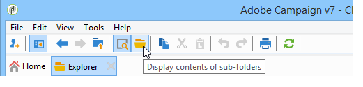

# Relatórios cumulativos {#cumulative-reports}

Você pode exibir relatórios acumulados sobre entregas. Para fazer isso, selecione as entregas a serem comparadas para obter a lista de relatórios dessas entregas.

Para selecionar entregas não adjacentes na lista, mantenha a tecla CTRL pressionada ao fazer a seleção.

Para selecionar entregas salvas em uma pasta diferente, clique em **[!UICONTROL Display sub-levels]** (acessível pela barra de ferramentas). Eles serão exibidos na mesma lista.

