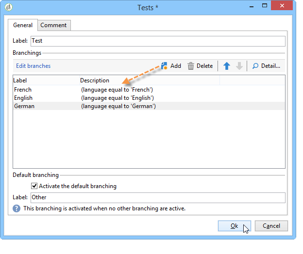
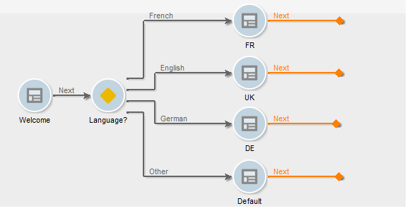

# Definir um conteúdo condicional{#defining-a-conditional-content}

É possível documentar a exibição de itens ou páginas de relatório específicos.

Para tornar itens específicos condicionais, adapte suas configurações de visibilidade. Para obter mais informações, consulte [Exibição do item de condição](#conditioning-item-display).

Para exibir uma ou mais páginas condicionais, use uma atividade do tipo **[!UICONTROL Test]**. Para obter mais informações, consulte [Exibição da página de condição](#conditioning-page-display).

## Exibição do item de condição {#conditioning-item-display}

Para exibir parte de um relatório condicional, é preciso definir suas condições de visibilidade: se elas não forem atendidas, os itens não serão exibidos.

As condições de visibilidade podem depender do status do operador, nos itens selecionados ou inseridos na página do relatório.

Exemplos mostrando a exibição condicional de itens em uma página são fornecidos [nesta seção](../../web/using/form-rendering.md#defining-fields-conditional-display).

No exemplo a seguir, a condição de exibição depende do idioma:

## Exibição de página de condição {#conditioning-page-display}

No gráfico de um relatório, a atividade **[!UICONTROL Test]** permite alterar a sequência de páginas dependendo de uma ou mais condições.

Essa atividade baseia-se no seguinte princípio operacional:

1. Coloque um **[!UICONTROL Test]** em um gráfico e faça a edição dele.
1. Clique no botão **[!UICONTROL Add]** para criar os vários casos possíveis.

   

   Para cada caso, uma transição de saída é adicionada à atividade **[!UICONTROL Test]**.

   

1. Selecione **[!UICONTROL Enable default transition]** para adicionar uma transição, caso uma das condições configuradas não seja atendida.

   Para obter mais informações, consulte [esta seção](../../web/using/defining-web-forms-page-sequencing.md#conditional-page-display).

Uma atividade **[!UICONTROL Test]** pode ser colocada no início do gráfico para condicionar a exibição, dependendo do contexto ou do perfil do operador, por exemplo.
