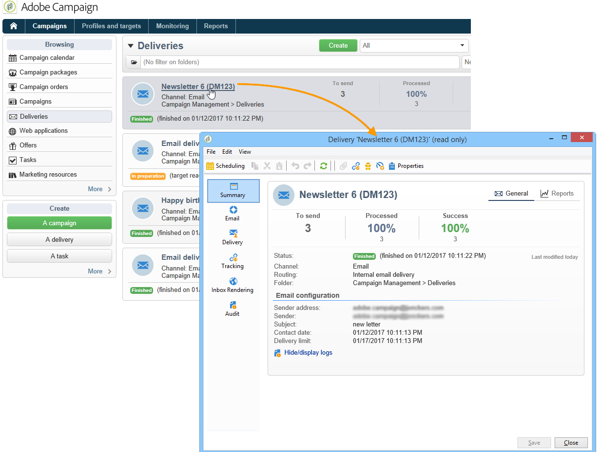
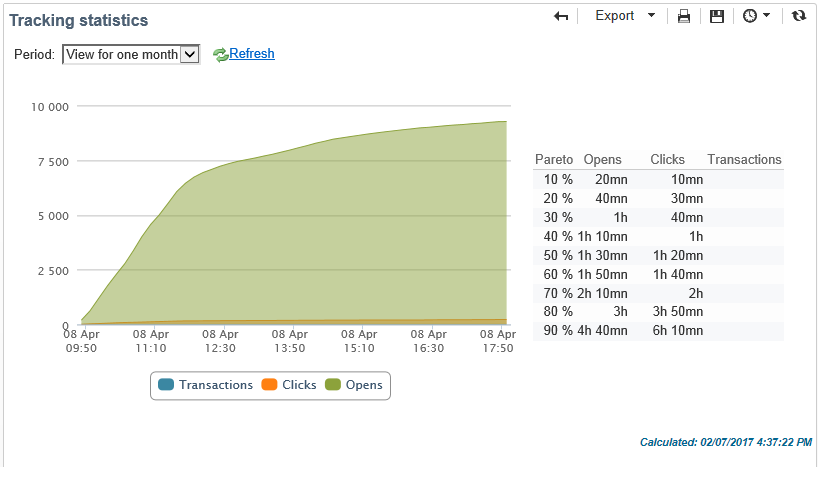

# Relatórios de delivery {#delivery-reports}

Você pode acompanhar a execução de deliveries por meio de vários relatórios acessíveis a partir da visão geral de delivery. Para exibir relatórios, siga as etapas abaixo:

1. Acesse a guia **[!UICONTROL Campaigns]** e clique no link **[!UICONTROL Delivery]** para exibir a lista de deliveries.
1. Clique no nome do delivery que deseja exibir para ver seus detalhes.

   

1. Selecione a guia **[!UICONTROL Summary]** e clique em **[!UICONTROL Reports]** para acessar os relatórios específicos do delivery.

   

   Por padrão, os seguintes relatórios estão disponíveis:

   * **[!UICONTROL Delivery throughput]** : consulte [Taxa de transferência de delivery](../../reporting/using/global-reports.md#delivery-throughput).
   * **[!UICONTROL Sharing to social networks]** : consulte [Compartilhamento em redes sociais](../../reporting/using/global-reports.md#sharing-to-social-networks).
   * **[!UICONTROL Statistics on sharing activities]** : consulte [Estatísticas de atividades de compartilhamento](../../reporting/using/global-reports.md#statistics-on-sharing-activities).
   * **[!UICONTROL Hot clicks]** : consulte [Hot clicks](#hot-clicks).
   * **[!UICONTROL Tracking statistics]** : consulte [Estatísticas de rastreamento](#tracking-statistics).
   * **[!UICONTROL URLs and click streams]** : consulte [URLs e fluxos de clique](#urls-and-click-streams).
   * **[!UICONTROL Tracking indicators]** : consulte [Indicadores de rastreamento](#tracking-indicators).
   * **[!UICONTROL Non-deliverables and bounces]** : consulte [Não entregues e devoluções](../../reporting/using/global-reports.md#non-deliverables-and-bounces).
   * **[!UICONTROL User activities]** : consulte [Atividades do usuário](../../reporting/using/global-reports.md#user-activities).
   * **[!UICONTROL Delivery summary]** : consulte [Resumo do delivery](#delivery-summary).
   * **[!UICONTROL Subscription tracking]** : consulte [Rastreamento de subscrição](../../reporting/using/global-reports.md#subscription-tracking).
   * **[!UICONTROL Delivery statistics]** : consulte [Estatísticas de delivery](../../reporting/using/global-reports.md#delivery-statistics).
   * **[!UICONTROL Breakdown of opens]** : consulte [Detalhamento das aberturas](../../reporting/using/global-reports.md#breakdown-of-opens).

## Indicadores de rastreamento {#tracking-indicators}

Este relatório combina os indicadores principais para rastrear o comportamento dos recipients ao receber o delivery. Ele oferece acesso a estatísticas de delivery e recebimento, taxas de abertura e cliques, fluxos de cliques gerados, rastreamento Web e atividades de compartilhamento em redes sociais.

>[!NOTE]
>
>Os valores calculados com base em mensagem são sempre estimativas, devido à margem de erro vinculada aos emails em formato de texto. Os indicadores **[!UICONTROL Distinct opens/Sum of opens for the population reached]** levam em consideração essa margem de erro. Para obter mais informações sobre rastreamento de aberturas, consulte [Rastreamento de aberturas](../../reporting/using/indicator-calculation.md#tracking-opens-).

**[!UICONTROL 1. Delivery statistics]**

* **[!UICONTROL Messages to deliver]** : Número total de mensagens a serem entregues após a análise de delivery.
* **[!UICONTROL Success]**: Número de mensagens processadas com êxito.

**[!UICONTROL 2. Reception statistics]**

>[!NOTE]
>
>As porcentagens relacionadas são calculadas com base no número de mensagens encaminhadas com êxito.

* **[!UICONTROL Distinct opens for the population reached]** : Estimativa do número de recipients alvos que abriram uma mensagem pelo menos uma vez. Cliques em links de unsubscription e mirror pages são considerados.
* **[!UICONTROL Sum of opens for the population reached]** : Estimativa do número total de aberturas por recipients alvos.
* **[!UICONTROL Clicks on opt-out link]** : Número de cliques no link unsubscription.
* **[!UICONTROL Clicks on the mirror page link]** : Número de cliques no link para a mirror page. Para ser considerado, o link deve ser definido como tal no assistente do delivery (URLs rastreadas). Consulte esta [página](../../delivery/using/about-delivery-monitoring.md).
* **[!UICONTROL Estimation of forwards]** : Estimativa do número de emails encaminhados pelos recipients alvos. Esse valor é calculado subtraindo o número de pessoas distintas e o número de recipients distintos que clicaram no email.

   >[!NOTE]
   >
   >Para obter mais informações sobre a diferença entre pessoas distintas e recipients alvos, consulte [Pessoas/recipients direcionados](../../reporting/using/indicator-calculation.md#targeted-persons---recipients).

**[!UICONTROL 3. Open and click-through rate]**

Esta tabela de valores mostra o detalhamento dos deliveries, aberturas, cliques e reatividade bruta por domínio da Internet. Os seguintes indicadores são usados:

* **[!UICONTROL Sent]**: Número total de mensagens enviadas neste domínio.
* **[!UICONTROL Complaints]**: Número de mensagens deste domínio relatadas como indesejáveis pelo recipient. A taxa é calculada com base no número total de mensagens enviadas neste domínio.
* **[!UICONTROL Opens]**: Número de recipients alvos distintos para este domínio que abriram uma mensagem pelo menos uma vez. A taxa é calculada com base no número total de mensagens enviadas neste domínio.
* **[!UICONTROL Clicks]**: Número de recipients alvos distintos que clicaram no mesmo delivery pelo menos uma vez. A taxa é calculada com base no número total de mensagens enviadas neste domínio
* **[!UICONTROL Raw reactivity]**: Porcentagem do número de recipients que clicaram em um delivery pelo menos uma vez em comparação ao número de recipients que abriram um delivery pelo menos uma vez.

>[!NOTE]
>
>Os nomes de domínio exibidos neste relatório são definidos na lista discriminada usada no nível de cubo. Para alterar, adicionar ou remover domínios padrão, edite a lista discriminada **[!UICONTROL Domains]** e modifique valores e aliases. Para obter mais informações, consulte [esta seção](../../platform/using/managing-enumerations.md). A categoria **[!UICONTROL Others]** inclui nomes de domínio que não pertencem a nenhum valor da lista discriminada.

**[!UICONTROL 4. Generated click streams]**

>[!NOTE]
>
>As porcentagens relacionadas são calculadas com base no número de mensagens encaminhadas com êxito.

* **[!UICONTROL Distinct clicks for the population reached]** : Número de pessoas distintas que clicaram em um delivery pelo menos uma vez.
* **[!UICONTROL Cumulated clicks]**: Número total de cliques por recipients alvos, excluindo links de unsubscription e mirror pages.
* **[!UICONTROL Recipient clicks]**: Número de recipients alvos distintos que clicaram no mesmo delivery pelo menos uma vez.
* **[!UICONTROL Estimated recipient reactivity]**: Taxa do número de recipients que clicaram pelo menos uma vez em um delivery em comparação ao número estimado de recipients que abriram um delivery pelo menos uma vez. Os cliques nos links de opt out e mirror pages não são considerados.

**[!UICONTROL 5. Web tracking]**

* **[!UICONTROL Visited pages]** : Número de páginas da Web visitadas após o recebimento de mensagens.
* **[!UICONTROL Transactions]**: Número de compras após o recebimento de mensagens.
* **[!UICONTROL Total amount]** : Quantidade total de compras após o recebimento de mensagens.
* **[!UICONTROL Average transaction amount]** : Compra média feita por recipients de delivery distintos.
* **[!UICONTROL Articles]**: Número de artigos comprados pelos recipients do delivery.
* **[!UICONTROL Average count of articles per transaction]** : Número médio de itens por compra feita por recipients distintos.
* **[!UICONTROL Average amount per message]** : Quantidade média de compras geradas por mensagem.

   >[!NOTE]
   >
   >Para que uma página, uma transação, um valor ou um artigo visitado seja considerado, uma tag de rastreamento Web deve ser inserida na página da Web correspondente. A configuração de rastreamento Web é apresentada [nesta seção](../../configuration/using/about-web-tracking.md).

**[!UICONTROL 6. Sharing activities to email and social networks]**

Essa seção mostra o número de mensagens compartilhadas em cada rede social. Para obter mais informações, consulte [Compartilhamento em redes sociais](../../reporting/using/global-reports.md#sharing-to-social-networks).

## Fluxos de clique e URLs {#urls-and-click-streams}

Este relatório mostra a lista de páginas visitadas após uma entrega.

Você pode configurar o conteúdo desse relatório selecionando: o gráfico de pontuação a ser exibido, o filtro de tempo (desde a inicialização da ação, durante as primeiras 6 horas após o lançamento, etc.) e o modo de exibição de dados (por rótulo, por URL, por categoria. Clique em **[!UICONTROL Refresh]** para confirmar a seleção.

As seguintes taxas são exibidas na seção superior do relatório:

* **[!UICONTROL Reactivity]**: Taxa do número de recipients alvos que clicaram em um delivery em relação ao número estimado de recipients alvos que abriram um delivery. Os cliques no link de opt out e na mirror page não são considerados.

   >[!NOTE]
   >
   >Para obter mais informações sobre rastreamento de aberturas, consulte [Rastreamento de aberturas](../../reporting/using/indicator-calculation.md#tracking-opens-).

* **[!UICONTROL Distinct clicks]**: Número de pessoas distintas que clicaram pelo menos uma vez (excluindo o link de unsubscription e mirror page) em um delivery. A taxa exibida é calculada com base no número de mensagens entregues com êxito.
* **[!UICONTROL Cumulated clicks]**: Número total de cliques por recipients alvos (excluindo o link de unsubscription e mirror page). A taxa exibida é calculada com base no número de mensagens encaminhadas com êxito.

**[!UICONTROL Platform average]**: Essa taxa média, exibida em cada taxa (reatividade, cliques distintos e cliques acumulados), é calculada para deliveries enviados nos seis meses anteriores. Somente os deliveries com a mesma tipologia e no mesmo canal são considerados. Provas são excluídas.

A tabela central fornece as seguintes informações:

* **[!UICONTROL Clicks]**: Número de cliques acumulados por link.
* **[!UICONTROL Clicks (in %)]** : Detalhamento do número de cliques por link, em relação ao número total de cliques acumulados.

**[!UICONTROL Breakdown of clicks in time]**

Este gráfico mostra o detalhamento de cliques acumulados por dia.

## Resumo da entrega {#delivery-summary}

Esse relatório fornece todas as informações principais sobre a entrega.

**[!UICONTROL Target population]**

Essa seção tem dois indicadores:

* **[!UICONTROL Initial population]** : Número total de recipients alvos do delivery.
* **[!UICONTROL Messages rejected by the rule]** : Número de endereços ignorados durante a análise ao aplicar regras de tipologia: endereço em falta, em quarentena, na lista de bloqueios, etc. Para obter mais informações sobre regras de tipologia, consulte esta [página](../../delivery/using/steps-validating-the-delivery.md#validation-process-with-typologies).

**[!UICONTROL Causes of exclusion]**

O gráfico do meio mostra o detalhamento por regra de mensagens rejeitadas durante a análise.

**[!UICONTROL Delivery statistics]**

Esta seção inclui os seguintes indicadores:

* **[!UICONTROL Messages to be delivered]** : Número total de mensagens a serem entregues após a análise de delivery.
* **[!UICONTROL Success]** : Número de mensagens processadas com êxito. A taxa associada é a relação do número de mensagens a serem entregues.
* **[!UICONTROL Errors]**: Número total de erros acumulados durante os deliveries e o processamento automático de reassociação. A taxa associada é a relação do número de mensagens a serem entregues.
* **[!UICONTROL New quarantines]**: Número de endereços colocados em quarentena após um delivery com falha (usuário desconhecido, domínio inválido). A taxa associada é a relação do número de mensagens a serem entregues.

## Hot clicks {#hot-clicks}

Este relatório mostra o conteúdo da mensagem (HTML e/ou texto) com a porcentagem de cliques nos links, em cada link. Links de unsubscription de blocos de personalização, links de mirror pages e links de ofertas são considerados no total de cliques acumulados, mas não são exibidos no relatório.

>[!NOTE]
>
>Se o delivery contiver ofertas (Interaction), uma caixa aparecerá na parte acima do relatório exibindo a porcentagem de cliques nas ofertas.

## Estatísticas de rastreamento {#tracking-statistics}

Este relatório disponibiliza estatísticas sobre aberturas, cliques e transações.

Ele permite rastrear o impacto de marketing do delivery. Você pode configurar como os valores são exibidos alterando a escala de tempo (visualização de 1 hora, 3 horas ou 24 horas, etc.). Clique em **[!UICONTROL Refresh]** para confirmar a seleção.

Esse relatório disponibiliza uma tabela de valores e um gráfico de Pareto que exibe o tempo necessário para o delivery alcançar a eficiência máxima. Os seguintes indicadores são usados:

* **[!UICONTROL Opens]**: Estimativa do tempo necessário para atingir uma porcentagem do número total de mensagens abertas. Os emails em formato de texto não são considerados. Para obter mais informações sobre rastreamento de aberturas, consulte [Rastreamento de aberturas](../../reporting/using/indicator-calculation.md#tracking-opens-).
* **[!UICONTROL Clicks]**: Estimativa do tempo necessário para atingir uma porcentagem do número total de cliques registrados. Cliques no link de opt out e na mirror page não são considerados.
* **[!UICONTROL Transactions]**: Tempo necessário para atingir uma porcentagem do número total de transações após o recebimento de mensagens. Para que uma transação seja considerada, uma tag do tipo de transação de rastreamento Web deve ser inserida na página da Web correspondente. A configuração de rastreamento Web é apresentada [nesta seção](../../configuration/using/about-web-tracking.md).
